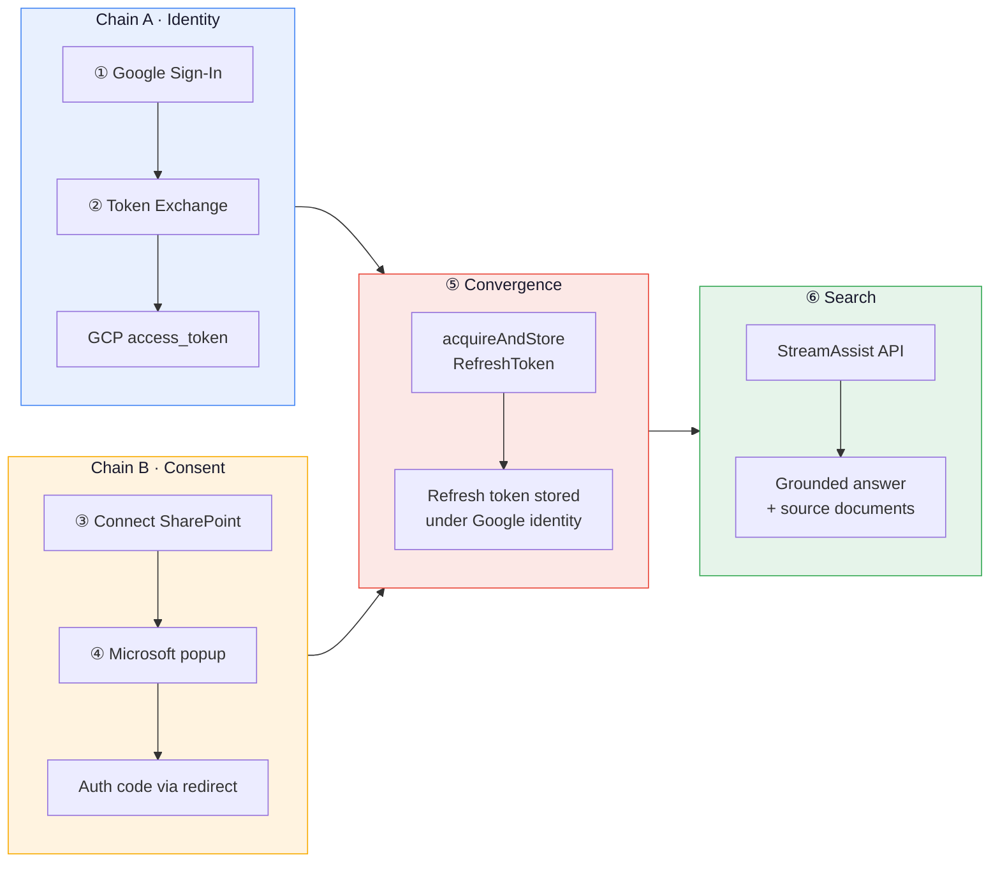
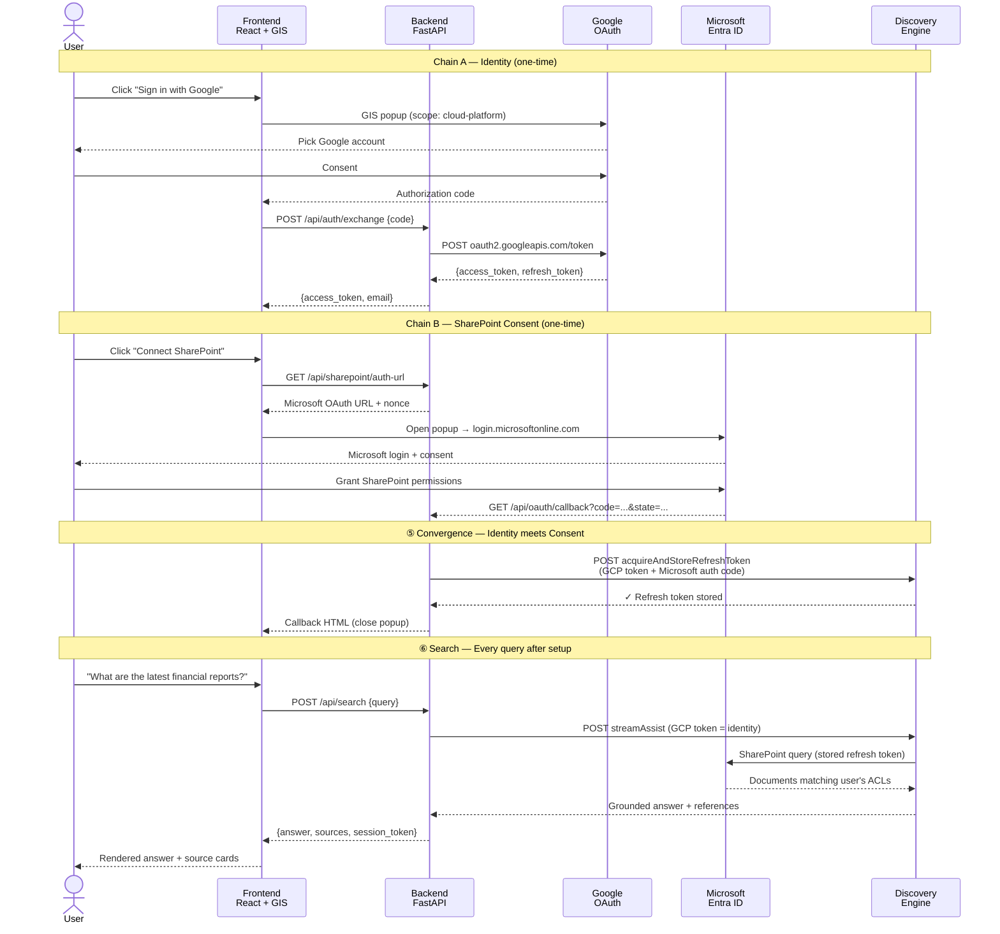

# SharePoint Portal — Google Cloud Identity

> *Federated SharePoint search via Gemini Enterprise StreamAssist — using native Google Cloud Identity. No WIF, no STS, no MSAL.*


---

## vs `streamassist-oauth-flow`

| | streamassist-oauth-flow | **This project** |
|---|---|---|
| Identity | Entra ID (MSAL.js) | **Google Cloud Identity (GIS)** |
| Token chain | Entra JWT → STS → GCP token | **Google auth code → GCP token** |
| WIF | Yes (Pool + Provider) | **No** |
| Entra apps | 2 (Portal + Connector) | **1 (Connector only)** |
| Auth library | `@azure/msal-browser` | **Google Identity Services** |

---

## The Flow

### High-Level Phases



### Sequence — What Actually Gets Sent Where



---

## Step-by-Step Code

Each numbered step maps to the diagrams above. The table links jump to the exact source lines.

---

### ① Google Sign-In → Authorization Code

The user clicks **Sign in with Google**. GIS opens a popup, user picks their Google account, and GIS returns an authorization code.

| | File | Lines |
|---|---|---|
| **Frontend** | [`App.tsx` — initCodeClient](frontend/src/App.tsx#L168-L215) | GIS popup config + callback |
| **Scopes** | [`App.tsx:171`](frontend/src/App.tsx#L171) | `openid email profile cloud-platform` |

> [!IMPORTANT]
> The `cloud-platform` scope is what makes this work — it turns the Google token into a valid GCP identity. Without it, Discovery Engine calls fail with 403.

```ts
// frontend/src/App.tsx:168
codeClientRef.current = google.accounts.oauth2.initCodeClient({
  client_id: GOOGLE_CLIENT_ID,
  scope: 'openid email profile https://www.googleapis.com/auth/cloud-platform',
  ux_mode: 'popup',
  callback: async (response) => {
    // response.code → send to backend for exchange
  },
});
```

---

### ② Token Exchange → GCP Access Token

Backend exchanges the Google auth code for an `access_token` at `oauth2.googleapis.com/token`.

| | File | Lines |
|---|---|---|
| **Backend** | [`main.py` — /api/auth/exchange](backend/main.py#L85-L142) | Code → token exchange |
| **Token call** | [`main.py:91-101`](backend/main.py#L91-L101) | `POST oauth2.googleapis.com/token` |
| **Frontend** | [`App.tsx:185-198`](frontend/src/App.tsx#L185-L198) | Sends code, stores token |

> [!IMPORTANT]
> `redirect_uri: "postmessage"` is required for the GIS popup flow. Any other value and the exchange fails. **This token IS the GCP identity — no WIF, no STS.**

```python
# backend/main.py:91
resp = requests.post("https://oauth2.googleapis.com/token", data={
    "code": body.code,
    "client_id": GOOGLE_CLIENT_ID,
    "client_secret": GOOGLE_CLIENT_SECRET,
    "redirect_uri": "postmessage",        # required for GIS popup
    "grant_type": "authorization_code",
})
# Returns: { access_token, refresh_token, email, expires_in }
```

---

### ③ Connect SharePoint — Get Auth URL

User clicks **Connect SharePoint**. Backend generates a Microsoft OAuth URL for the **Connector App** (the only Entra app needed).

| | File | Lines |
|---|---|---|
| **Backend** | [`main.py` — /api/sharepoint/auth-url](backend/main.py#L181-L205) | Generates Microsoft OAuth URL |
| **State** | [`main.py:197`](backend/main.py#L197) | Base64-encoded JSON with nonce + origin |
| **Frontend** | [`App.tsx` — handleConsent](frontend/src/App.tsx#L356-L391) | Opens popup, polls for close |

> [!TIP]
> The `redirect_uri` must be exactly `vertexaisearch.cloud.google.com/oauth-redirect` — this is what `acquireAndStoreRefreshToken` expects internally. Register this exact URI in your Entra app.

```python
# backend/main.py:192
params = {
    "client_id": CONNECTOR_CLIENT_ID,       # Entra Connector App
    "response_type": "code",
    "redirect_uri": REDIRECT_URI,           # vertexaisearch.cloud.google.com/oauth-redirect
    "scope": SP_SCOPES,                     # AllSites.Read + Sites.Search.All
    "state": base64.b64encode(json.dumps({
        "origin": origin, "nonce": nonce,
    }).encode()).decode(),
}
```

---

### ④ Microsoft Consent → OAuth Callback

User logs in to Microsoft and grants SharePoint permissions. Microsoft redirects to `vertexaisearch.cloud.google.com/oauth-redirect` with an auth code. The callback retrieves the stored GCP token by nonce and calls `acquireAndStoreRefreshToken`.

| | File | Lines |
|---|---|---|
| **Backend** | [`main.py` — /api/oauth/callback](backend/main.py#L208-L248) | Receives auth code from Microsoft |
| **Store token** | [`main.py:237-240`](backend/main.py#L237-L240) | `acquireAndStoreRefreshToken` call |
| **Fallback** | [`main.py:230-234`](backend/main.py#L230-L234) | ADC fallback if nonce expired |

> [!NOTE]
> `vertexaisearch.cloud.google.com` sets Cross-Origin-Opener-Policy, which blocks `postMessage`. The frontend uses popup-closed polling as a fallback — see [`App.tsx:356-391`](frontend/src/App.tsx#L356-L391).

```python
# backend/main.py:237
resp = requests.post(
    f"{CONNECTOR_URL}/dataConnector:acquireAndStoreRefreshToken",
    headers=_gcp_headers(gcp_token),         # GCP token = identity (from ②)
    json={"fullRedirectUri": str(request.url)},  # contains Microsoft auth code (from ④)
)
# Discovery Engine stores SharePoint refresh token under this Google identity
```

---

### ⑤ Convergence — Identity Meets Consent

**Chain A** (GCP token = who you are) meets **Chain B** (auth code = SharePoint access you granted). Discovery Engine extracts the Microsoft auth code from `fullRedirectUri`, exchanges it for a SharePoint refresh token, and stores it **mapped to the Google identity** from the GCP token in the `Authorization` header.

> [!IMPORTANT]
> After this one-time step, the user never sees Microsoft again. Every future search uses the stored refresh token automatically.

---

### ⑥ StreamAssist Federated Search

Every search sends the GCP token (identity). Discovery Engine uses the stored refresh token (from ⑤) to query SharePoint in real-time with the user's ACLs.

| | File | Lines |
|---|---|---|
| **Backend** | [`main.py` — /api/search](backend/main.py#L321-L332) | Search endpoint |
| **StreamAssist** | [`main.py` — _stream_assist](backend/main.py#L361-L426) | API call + response parsing |
| **Source fallback** | [`main.py` — _search_sources](backend/main.py#L335-L358) | Discovery Engine search for source docs |
| **Frontend** | [`App.tsx` — handleSearch](frontend/src/App.tsx#L393-L439) | Submit query, render answer |
| **Source cards** | [`App.tsx:575-592`](frontend/src/App.tsx#L575-L592) | Clickable SharePoint document cards |

> [!TIP]
> StreamAssist may not always return grounding references in `textGroundingMetadata`. When it doesn't, the backend falls back to the Discovery Engine `search` API which returns rich document metadata with URLs, titles, and authors.

<details>
<summary>StreamAssist payload structure</summary>

```python
# backend/main.py:363
payload = {
    "query": {"text": query},
    "dataStoreSpecs": [
        {"dataStore": f"{ds_base}_{et}"}
        for et in ["file", "page", "comment", "event", "attachment"]
    ],
}
if session_token:
    payload["session"] = session_token   # NOT "assistToken" — that field is rejected

resp = requests.post(STREAMASSIST_URL, headers=_gcp_headers(gcp_token), json=payload)
```

</details>

<details>
<summary>Source extraction — grounding refs → fallback search</summary>

```python
# Primary: extract from StreamAssist grounding metadata
for ref in gc.get("textGroundingMetadata", {}).get("references", []):
    s = json.loads(ref.get("content", "{}"))
    if s.get("url"):
        sources.append({"title": s.get("title"), "url": s["url"], ...})

# Fallback: Discovery Engine search API
if not sources:
    sources = _search_sources(gcp_token, query)
```

</details>

---

## Quick Reference

```
ge-sharepoint-cloudid/
├── backend/
│   ├── main.py              # All endpoints — auth, consent, search (430 lines)
│   ├── .env.example         # Required env vars template
│   └── pyproject.toml
├── frontend/
│   ├── src/
│   │   ├── App.tsx          # Chat UI + GIS auth + debug sidebar
│   │   ├── gis.d.ts         # TypeScript declarations for GIS
│   │   └── index.css
│   ├── index.html           # Loads GIS script
│   └── .env.example
├── screenshots/
│   ├── demo.gif
│   ├── 01-search-ready.png
│   └── 02-search-results.png
└── README.md
```

---

## Setup

### Run

```bash
# Backend
cd backend && cp .env.example .env  # fill in values
uv sync && uv run python main.py    # port 8003

# Frontend
cd frontend && cp .env.example .env  # set VITE_GOOGLE_CLIENT_ID
npm install && npm run dev           # port 5175
```

### Environment Variables

| Variable | Where | Description |
|----------|-------|-------------|
| `PROJECT_NUMBER` | backend | GCP project number |
| `ENGINE_ID` | backend | Discovery Engine app ID |
| `CONNECTOR_ID` | backend | SharePoint connector ID |
| `GOOGLE_CLIENT_ID` | both | Google OAuth client ID |
| `GOOGLE_CLIENT_SECRET` | backend | Google OAuth client secret |
| `CONNECTOR_CLIENT_ID` | backend | Entra Connector App client ID |
| `TENANT_ID` | backend | Entra tenant ID |

---

## Prerequisites

> [!NOTE]
> Three things need to be configured before running: a Google OAuth client, a Gemini Enterprise app with SharePoint connector, and one Entra app registration. Expand each section below for step-by-step instructions.

<details>
<summary><strong>1. Google Cloud — OAuth Client</strong></summary>

#### Enable APIs

```
Cloud Console → APIs & Services → Enable APIs
→ Enable "Discovery Engine API"
```

#### Create OAuth Consent Screen

```
Cloud Console → APIs & Services → OAuth consent screen
→ User type: Internal (or External for testing)
→ App name: "SharePoint Portal"
→ Scopes: openid, email, profile, cloud-platform
```

#### Create OAuth Client ID

```
Cloud Console → APIs & Services → Credentials → Create Credentials → OAuth client ID
→ Application type: Web application
→ Name: "SharePoint Portal"
→ Authorized JavaScript origins: http://localhost:5175
→ Authorized redirect URIs: (leave empty — we use "postmessage" for GIS popup)
```

Note down the **Client ID** and **Client Secret** — these become `GOOGLE_CLIENT_ID` and `GOOGLE_CLIENT_SECRET` in your `.env`.

#### Grant IAM Permissions

The Google account used to sign in needs Discovery Engine access:

```bash
gcloud projects add-iam-policy-binding PROJECT_ID \
  --member="user:USER@DOMAIN.COM" \
  --role="roles/discoveryengine.editor"
```

</details>

<details>
<summary><strong>2. Gemini Enterprise — Search App + SharePoint Connector</strong></summary>

#### Create a Search App

```
Cloud Console → Agent Builder → Apps → Create App
→ Type: Search
→ Enterprise features: ON (required for StreamAssist)
→ App name: "sharepoint-portal"
→ Region: global
```

Note down the **Engine ID** from the app URL — this becomes `ENGINE_ID`.

#### Add SharePoint Online Connector

```
Agent Builder → Data Stores → Create Data Store
→ Source: SharePoint Online
→ SharePoint URL: https://TENANT.sharepoint.com
→ Entity types: Select all (file, page, comment, event, attachment)
→ Authentication: OAuth (will configure redirect URI)
```

Note down the **Connector ID** — this becomes `CONNECTOR_ID`.

#### Connect the Data Store to Your App

```
Agent Builder → Apps → your app → Data Stores
→ Add the SharePoint data store you just created
```

> [!TIP]
> The connector creates 5 sub-data-stores automatically: `{CONNECTOR_ID}_file`, `_page`, `_comment`, `_event`, `_attachment`. The backend queries all 5 via `dataStoreSpecs`. You can verify they exist under **Data Stores** in Agent Builder.

#### How Federated Search Works

Unlike indexed connectors that crawl and store documents, the SharePoint **federated connector** queries SharePoint in real-time at search time:

```
User query → StreamAssist → Discovery Engine → SharePoint Online (live) → Results
```

- No data is copied into Google Cloud
- Per-user ACLs are enforced via the stored refresh token
- Results are always current (no sync delay)
- The `acquireAndStoreRefreshToken` API maps each user's SharePoint credentials to their Google identity

</details>

<details>
<summary><strong>3. Microsoft Entra ID — Connector App (only one needed)</strong></summary>

Unlike the WIF-based `streamassist-oauth-flow` which needs **two** Entra apps (Portal + Connector), this project only needs **one** — the Connector App. Google Identity Services handles the login side.

#### Create App Registration

```
Entra Admin Center → App registrations → New registration
→ Name: "SP-Connector-CloudID"
→ Supported account types: Single tenant
→ Redirect URI: Web → https://vertexaisearch.cloud.google.com/oauth-redirect
```

> [!IMPORTANT]
> The redirect URI **must** be exactly `https://vertexaisearch.cloud.google.com/oauth-redirect`. This is hardcoded in Discovery Engine's `acquireAndStoreRefreshToken` API. Also add `https://vertexaisearch.cloud.google.com/console/oauth/sharepoint_oauth.html` as a second redirect URI.

#### Add API Permissions

```
App registration → API permissions → Add a permission
→ APIs my organization uses → SharePoint
→ Delegated permissions:
  ✓ AllSites.Read
  ✓ Sites.Search.All
→ Add a permission → Microsoft Graph
→ Delegated permissions:
  ✓ offline_access
  ✓ openid
```

Then click **Grant admin consent for {tenant}**.

#### Create Client Secret

```
App registration → Certificates & secrets → New client secret
→ Description: "connector-secret"
→ Copy the Value (not the Secret ID)
```

This value becomes `CONNECTOR_CLIENT_ID` (the Application/Client ID from the overview page) and is used in the backend's OAuth URL generation.

Note down:
- **Application (client) ID** → `CONNECTOR_CLIENT_ID`
- **Directory (tenant) ID** → `TENANT_ID`

</details>

---

## Gotchas

| # | Issue | Detail |
|---|-------|--------|
| 1 | **COOP blocks postMessage** | `vertexaisearch.cloud.google.com` sets Cross-Origin-Opener-Policy. Frontend uses popup-closed polling as fallback. [-> code](frontend/src/App.tsx#L356-L391) |
| 2 | **redirect_uri is hardcoded** | `acquireAndStoreRefreshToken` always uses `vertexaisearch.cloud.google.com/oauth-redirect` internally. Your Entra app must register this exact URI. |
| 3 | **Natural language only** | Keyword queries return `NON_ASSIST_SEEKING_QUERY_IGNORED`. Always phrase as questions. |
| 4 | **cloud-platform scope** | The Google token needs `cloud-platform` scope to call Discovery Engine. [-> code](frontend/src/App.tsx#L171) |
| 5 | **`session` not `assistToken`** | StreamAssist returns `assistToken` but rejects it as input. Use `sessionInfo.session` for follow-ups. [-> code](backend/main.py#L392) |
