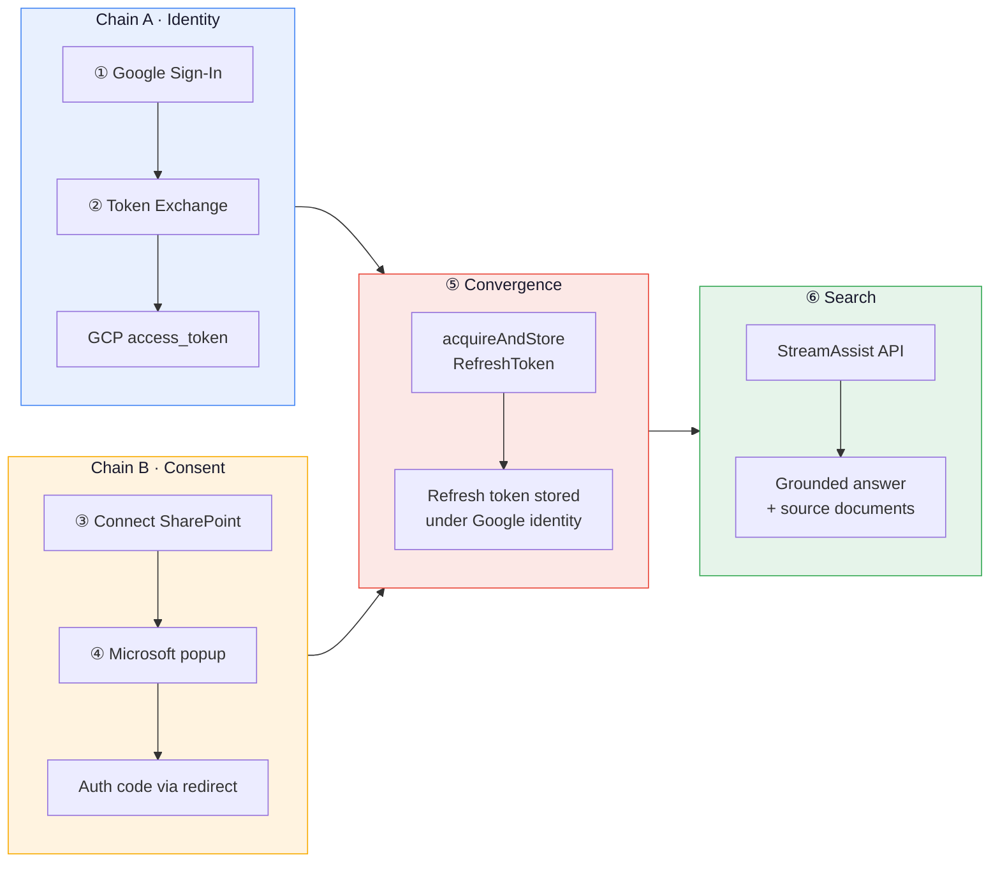

# SharePoint Portal — Google Cloud Identity

> *Federated SharePoint search via Gemini Enterprise StreamAssist — using native Google Cloud Identity. No WIF, no STS, no MSAL.*


---

## vs `streamassist-oauth-flow`

| | streamassist-oauth-flow | **This project** |
|---|---|---|
| Identity | Entra ID (MSAL.js) | **Google Cloud Identity (GIS)** |
| Token chain | Entra JWT → STS → GCP token | **Google auth code → GCP token** |
| WIF | Yes (Pool + Provider) | **No** |
| Entra apps | 2 (Portal + Connector) | **1 (Connector only)** |
| Auth library | `@azure/msal-browser` | **Google Identity Services** |

---

## The Flow



---

## Step-by-Step Code

Each numbered step maps to the diagram above. Click the `->` links to jump to the source.

---

### ① Google Sign-In → Authorization Code

The user clicks **Sign in with Google**. GIS opens a popup, user picks their Google account, and GIS returns an authorization code. The `cloud-platform` scope is critical — it makes the resulting token a valid GCP identity.

| | File | Lines |
|---|---|---|
| **Frontend** | [`App.tsx` — initCodeClient](frontend/src/App.tsx#L168-L215) | GIS popup config + callback |
| **Scopes** | [`App.tsx:171`](frontend/src/App.tsx#L171) | `openid email profile cloud-platform` |

```ts
// frontend/src/App.tsx:168
codeClientRef.current = google.accounts.oauth2.initCodeClient({
  client_id: GOOGLE_CLIENT_ID,
  scope: 'openid email profile https://www.googleapis.com/auth/cloud-platform',
  ux_mode: 'popup',
  callback: async (response) => {
    // response.code → send to backend for exchange
  },
});
```

---

### ② Token Exchange → GCP Access Token

Backend exchanges the Google auth code for an `access_token` with `cloud-platform` scope at `oauth2.googleapis.com/token`. The `redirect_uri: "postmessage"` is required for the popup flow. **This token IS the GCP identity — no WIF, no STS.**

| | File | Lines |
|---|---|---|
| **Backend** | [`main.py` — /api/auth/exchange](backend/main.py#L85-L142) | Code → token exchange |
| **Token call** | [`main.py:91-101`](backend/main.py#L91-L101) | `POST oauth2.googleapis.com/token` |
| **Frontend** | [`App.tsx:185-198`](frontend/src/App.tsx#L185-L198) | Sends code, stores token |

```python
# backend/main.py:91
resp = requests.post("https://oauth2.googleapis.com/token", data={
    "code": body.code,
    "client_id": GOOGLE_CLIENT_ID,
    "client_secret": GOOGLE_CLIENT_SECRET,
    "redirect_uri": "postmessage",        # required for GIS popup
    "grant_type": "authorization_code",
})
# Returns: { access_token, refresh_token, email, expires_in }
```

---

### ③ Connect SharePoint — Get Auth URL

User clicks **Connect SharePoint**. Backend generates a Microsoft OAuth URL for the **Connector App** (the only Entra app needed). The `redirect_uri` must be exactly `vertexaisearch.cloud.google.com/oauth-redirect`.

| | File | Lines |
|---|---|---|
| **Backend** | [`main.py` — /api/sharepoint/auth-url](backend/main.py#L181-L205) | Generates Microsoft OAuth URL |
| **State** | [`main.py:197`](backend/main.py#L197) | Base64-encoded JSON with nonce + origin |
| **Frontend** | [`App.tsx` — handleConsent](frontend/src/App.tsx#L356-L391) | Opens popup, polls for close |

```python
# backend/main.py:192
params = {
    "client_id": CONNECTOR_CLIENT_ID,       # Entra Connector App
    "response_type": "code",
    "redirect_uri": REDIRECT_URI,           # vertexaisearch.cloud.google.com/oauth-redirect
    "scope": SP_SCOPES,                     # AllSites.Read + Sites.Search.All
    "state": base64.b64encode(json.dumps({
        "origin": origin, "nonce": nonce,
    }).encode()).decode(),
}
```

---

### ④ Microsoft Consent → OAuth Callback

User logs in to Microsoft and grants SharePoint permissions. Microsoft redirects to `vertexaisearch.cloud.google.com/oauth-redirect` with an auth code. The callback retrieves the stored GCP token by nonce and calls `acquireAndStoreRefreshToken`.

| | File | Lines |
|---|---|---|
| **Backend** | [`main.py` — /api/oauth/callback](backend/main.py#L208-L248) | Receives auth code from Microsoft |
| **Store token** | [`main.py:237-240`](backend/main.py#L237-L240) | `acquireAndStoreRefreshToken` call |
| **Fallback** | [`main.py:230-234`](backend/main.py#L230-L234) | ADC fallback if nonce expired |

```python
# backend/main.py:237
resp = requests.post(
    f"{CONNECTOR_URL}/dataConnector:acquireAndStoreRefreshToken",
    headers=_gcp_headers(gcp_token),         # GCP token = identity (from ②)
    json={"fullRedirectUri": str(request.url)},  # contains Microsoft auth code (from ④)
)
# Discovery Engine stores SharePoint refresh token under this Google identity
```

---

### ⑤ Convergence — Identity Meets Consent

**Chain A** (GCP token = who you are) meets **Chain B** (auth code = SharePoint access you granted). Discovery Engine extracts the Microsoft auth code from `fullRedirectUri`, exchanges it for a SharePoint refresh token, and stores it **mapped to the Google identity** from the GCP token in the `Authorization` header.

After this one-time step, the user never sees Microsoft again.

---

### ⑥ StreamAssist Federated Search

Every search sends the GCP token (identity). Discovery Engine uses the stored refresh token (from ⑤) to query SharePoint in real-time with the user's ACLs.

| | File | Lines |
|---|---|---|
| **Backend** | [`main.py` — /api/search](backend/main.py#L321-L332) | Search endpoint |
| **StreamAssist** | [`main.py` — _stream_assist](backend/main.py#L361-L426) | API call + response parsing |
| **Source fallback** | [`main.py` — _search_sources](backend/main.py#L335-L358) | Discovery Engine search for source docs |
| **Frontend** | [`App.tsx` — handleSearch](frontend/src/App.tsx#L393-L439) | Submit query, render answer |
| **Source cards** | [`App.tsx:575-592`](frontend/src/App.tsx#L575-L592) | Clickable SharePoint document cards |

```python
# backend/main.py:363
payload = {
    "query": {"text": query},
    "dataStoreSpecs": [
        {"dataStore": f"{ds_base}_{et}"}
        for et in ["file", "page", "comment", "event", "attachment"]
    ],
}
if session_token:
    payload["session"] = session_token   # NOT "assistToken" — that field is rejected

resp = requests.post(STREAMASSIST_URL, headers=_gcp_headers(gcp_token), json=payload)
```

---

## Quick Reference

```
ge-sharepoint-cloudid/
├── backend/
│   ├── main.py              # All endpoints — auth, consent, search (420 lines)
│   ├── .env.example         # Required env vars template
│   └── pyproject.toml
├── frontend/
│   ├── src/
│   │   ├── App.tsx          # Chat UI + GIS auth + debug sidebar
│   │   ├── gis.d.ts         # TypeScript declarations for GIS
│   │   └── index.css
│   ├── index.html           # Loads GIS script
│   └── .env.example
├── screenshots/
│   ├── demo.gif
│   ├── 01-search-ready.png
│   └── 02-search-results.png
└── README.md
```

---

## Setup

### Prerequisites

- GCP project with Discovery Engine API enabled
- Gemini Enterprise Search app with SharePoint connector
- Entra ID app registration (Connector App) with `Sites.Search.All`, `AllSites.Read`, `offline_access`
- Redirect URI in Entra: `https://vertexaisearch.cloud.google.com/oauth-redirect`

### Run

```bash
# Backend
cd backend && cp .env.example .env  # fill in values
uv sync && uv run python main.py    # port 8003

# Frontend
cd frontend && cp .env.example .env  # set VITE_GOOGLE_CLIENT_ID
npm install && npm run dev           # port 5175
```

### Environment Variables

| Variable | Where | Description |
|----------|-------|-------------|
| `PROJECT_NUMBER` | backend | GCP project number |
| `ENGINE_ID` | backend | Discovery Engine app ID |
| `CONNECTOR_ID` | backend | SharePoint connector ID |
| `GOOGLE_CLIENT_ID` | both | Google OAuth client ID |
| `GOOGLE_CLIENT_SECRET` | backend | Google OAuth client secret |
| `CONNECTOR_CLIENT_ID` | backend | Entra Connector App client ID |
| `TENANT_ID` | backend | Entra tenant ID |

---

## Gotchas

| # | Issue | Detail |
|---|-------|--------|
| 1 | **COOP blocks postMessage** | `vertexaisearch.cloud.google.com` sets Cross-Origin-Opener-Policy. Frontend uses popup-closed polling as fallback. [→ code](frontend/src/App.tsx#L356-L391) |
| 2 | **redirect_uri is hardcoded** | `acquireAndStoreRefreshToken` always uses `vertexaisearch.cloud.google.com/oauth-redirect` internally. Your Entra app must register this exact URI. |
| 3 | **Natural language only** | Keyword queries return `NON_ASSIST_SEEKING_QUERY_IGNORED`. Always phrase as questions. |
| 4 | **cloud-platform scope** | The Google token needs `cloud-platform` scope to call Discovery Engine. [→ code](frontend/src/App.tsx#L171) |
| 5 | **`session` not `assistToken`** | StreamAssist returns `assistToken` but rejects it as input. Use `sessionInfo.session` for follow-ups. [→ code](backend/main.py#L392) |
