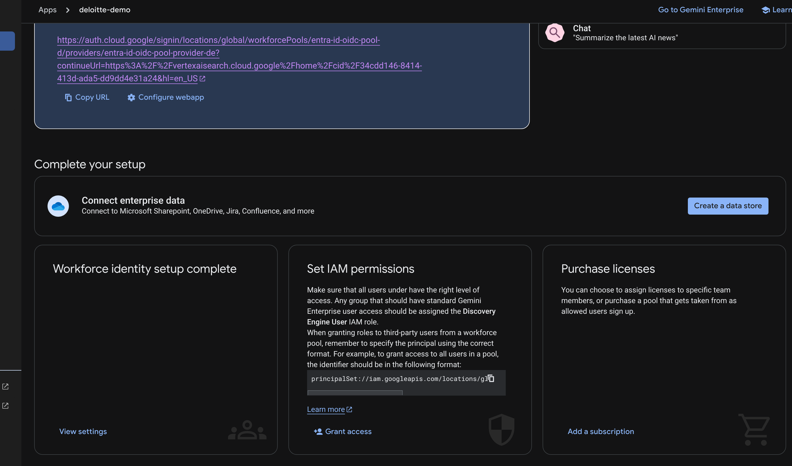

# Gemini Enterprise (Agentspace) - Complete Setup Guide

> **Navigation**: [README](README.md) | [Entra ID](docs/02-ENTRA-ID-SETUP.md) | [WIF](docs/03-WIF-SETUP.md) | **GE Setup**



## Verified Working Configuration

| Setting | Value |
|---------|-------|
| **PROJECT_ID** | `deloitte-plantas` |
| **PROJECT_NUMBER** | `440133963879` |
| **AUTH_ID** | `sharepointauth2` |
| **AS_APP** | `deloitte-demo` |
| **REASONING_ENGINE_RES** | `projects/440133963879/locations/us-central1/reasoningEngines/5291219938520858624` |
| **AGENT_ID** | `583348556074317003` |

### Microsoft Entra ID
| Setting | Value |
|---------|-------|
| **OAUTH_CLIENT_ID** | `ecbfa47e-a75c-403c-a13b-f27eff101e4e` |
| **TENANT_ID** | `de46a3fd-0d68-4b25-8343-6eb5d71afce9` |
| **Application ID URI** | `api://ecbfa47e-a75c-403c-a13b-f27eff101e4e` |
| **Custom Scope** | `api://ecbfa47e-a75c-403c-a13b-f27eff101e4e/user_impersonation` |

### WIF Providers (TWO REQUIRED)

| Provider | Client ID | Purpose |
|----------|-----------|---------|
| `entra-id-oidc-pool-provider-de` | `ecbfa47e-a75c-403c-a13b-f27eff101e4e` | GE Login |
| `entra-id-agent-provider` | `api://ecbfa47e-a75c-403c-a13b-f27eff101e4e` | Agent WIF |

Both use:
- **Pool**: `entra-id-oidc-pool-d`
- **Issuer**: `https://sts.windows.net/de46a3fd-0d68-4b25-8343-6eb5d71afce9/`

---

## Prerequisites

1. **Microsoft Entra ID App** configured with:
   - Custom API scope exposed (`api://{client-id}/user_impersonation`)
   - Web platform redirect URI: `https://vertexaisearch.cloud.google.com/oauth-redirect`
   - Client secret created

2. **Two WIF Providers** (see [03-WIF-SETUP.md](docs/03-WIF-SETUP.md)):
   - **Login provider**: client-id WITHOUT `api://` prefix (for GE login)
   - **Agent provider**: client-id WITH `api://` prefix (for agent WIF)
   - Both use issuer: `https://sts.windows.net/{tenant-id}/`

3. **Agent Engine** deployed with:
   - AUTH_ID matching authorization name
   - WIF_PROVIDER_ID set to agent provider

---

## Step 1: Register Authorization

```bash
export PROJECT_NUMBER="440133963879"
export AUTH_ID="sharepointauth2"
export OAUTH_CLIENT_ID="ecbfa47e-a75c-403c-a13b-f27eff101e4e"
export OAUTH_CLIENT_SECRET="your-client-secret"
export TENANT_ID="de46a3fd-0d68-4b25-8343-6eb5d71afce9"

export OAUTH_TOKEN_URI="https://login.microsoftonline.com/${TENANT_ID}/oauth2/v2.0/token"
export OAUTH_AUTH_URI="https://login.microsoftonline.com/${TENANT_ID}/oauth2/v2.0/authorize?response_type=code&client_id=${OAUTH_CLIENT_ID}&redirect_uri=https%3A%2F%2Fvertexaisearch.cloud.google.com%2Foauth-redirect&scope=openid%20profile%20email%20offline_access%20api%3A%2F%2F${OAUTH_CLIENT_ID}%2Fuser_impersonation&prompt=consent"

curl -X POST \
  -H "Authorization: Bearer $(gcloud auth print-access-token)" \
  -H "Content-Type: application/json" \
  -H "X-Goog-User-Project: ${PROJECT_NUMBER}" \
  "https://discoveryengine.googleapis.com/v1alpha/projects/${PROJECT_NUMBER}/locations/global/authorizations?authorizationId=${AUTH_ID}" \
  -d '{
    "name": "projects/'"${PROJECT_NUMBER}"'/locations/global/authorizations/'"${AUTH_ID}"'",
    "serverSideOauth2": {
      "clientId": "'"${OAUTH_CLIENT_ID}"'",
      "clientSecret": "'"${OAUTH_CLIENT_SECRET}"'",
      "authorizationUri": "'"${OAUTH_AUTH_URI}"'",
      "tokenUri": "'"${OAUTH_TOKEN_URI}"'"
    }
  }'
```

---

## Step 2: Register Agent

```bash
export PROJECT_ID="deloitte-plantas"
export PROJECT_NUMBER="440133963879"
export AS_APP="deloitte-demo"
export AUTH_ID="sharepointauth2"
export REASONING_ENGINE_RES="projects/440133963879/locations/us-central1/reasoningEngines/5291219938520858624"

curl -X POST \
  -H "Authorization: Bearer $(gcloud auth print-access-token)" \
  -H "Content-Type: application/json" \
  -H "x-goog-user-project: ${PROJECT_ID}" \
  "https://discoveryengine.googleapis.com/v1alpha/projects/${PROJECT_NUMBER}/locations/global/collections/default_collection/engines/${AS_APP}/assistants/default_assistant/agents" \
  -d '{
    "displayName": "SharePoint Assistant",
    "description": "AI Assistant with access to SharePoint documents",
    "icon": {
      "uri": "https://upload.wikimedia.org/wikipedia/commons/e/e1/Microsoft_Office_SharePoint_%282019%E2%80%93present%29.svg"
    },
    "adk_agent_definition": {
      "tool_settings": {
        "tool_description": "Use this agent to search SharePoint documents. Always call search_sharepoint for any question."
      },
      "provisioned_reasoning_engine": {
        "reasoning_engine": "'"${REASONING_ENGINE_RES}"'"
      }
    },
    "authorization_config": {
      "tool_authorizations": [
        "projects/'"${PROJECT_NUMBER}"'/locations/global/authorizations/'"${AUTH_ID}"'"
      ]
    }
  }'
```

---

## Step 3: Share Agent

```bash
export AGENT_ID="583348556074317003"  # From step 2 response

curl -X PATCH \
  -H "Authorization: Bearer $(gcloud auth print-access-token)" \
  -H "Content-Type: application/json" \
  -H "X-Goog-User-Project: ${PROJECT_ID}" \
  "https://discoveryengine.googleapis.com/v1alpha/projects/${PROJECT_NUMBER}/locations/global/collections/default_collection/engines/${AS_APP}/assistants/default_assistant/agents/${AGENT_ID}?updateMask=sharingConfig" \
  -d '{
    "sharingConfig": {
      "scope": "ALL_USERS"
    }
  }'
```

---

## Step 4: Test

1. Open Gemini Enterprise UI
2. Select "SharePoint Assistant" agent
3. Click "Authorize" when prompted
4. Authenticate with Microsoft account
5. Ask: "What is the salary of a CFO?"
6. Verify grounded response with SharePoint sources

---

## Token Flow

```
User → Gemini Enterprise
         ↓ OAuth consent
Microsoft Entra ID
         ↓ Access token (aud: api://{client-id})
Agentspace stores in session.state["{AUTH_ID}"]
         ↓
ADK Agent extracts token
         ↓ WIF exchange
STS API (sts.googleapis.com)
         ↓ GCP access token
Discovery Engine streamAssist API
         ↓
Grounded response with SharePoint sources
```

---

## Troubleshooting

### Check Logs
```bash
gcloud logging read 'resource.type="aiplatform.googleapis.com/ReasoningEngine" resource.labels.reasoning_engine_id="5291219938520858624" textPayload:("TOKEN" OR "WIF" OR "error")' \
  --project=deloitte-plantas \
  --limit=20 \
  --format='value(textPayload)'
```

### Common Issues

| Issue | Cause | Solution |
|-------|-------|----------|
| "Refresh token not found" | Missing `offline_access` scope | Recreate auth with scope |
| WIF issuer mismatch | Provider has v2.0 URL | Update to `sts.windows.net` |
| WIF audience mismatch | Provider missing `api://` | Update client-id with prefix |
| Token not found in state | AUTH_ID mismatch | Match agent code to auth name |
| Agent not visible | Not shared | Run share command |
