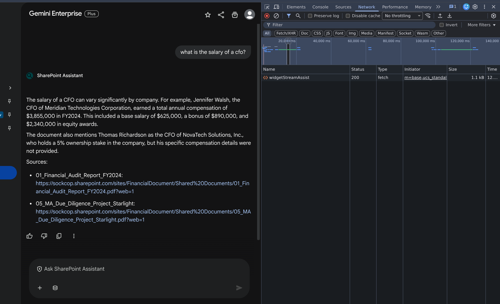
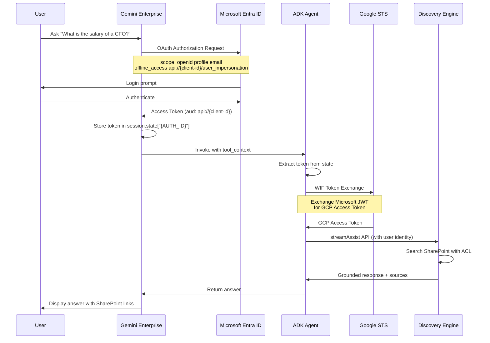
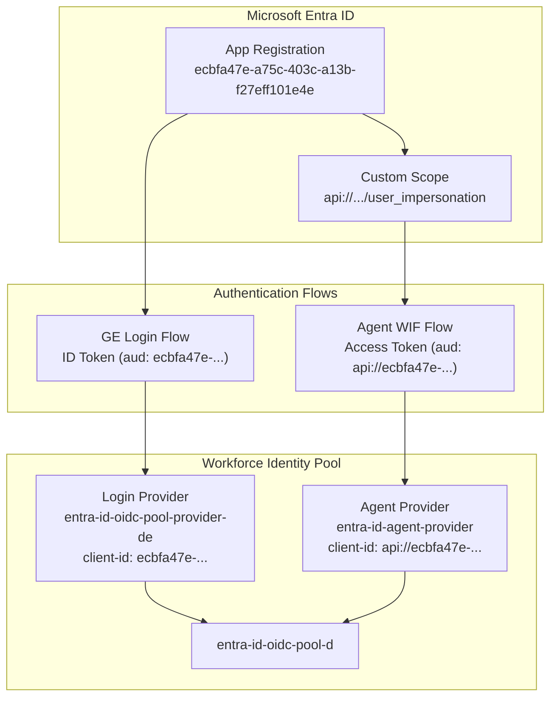

# GE ADK SharePoint WIF

ADK Agent for **Gemini Enterprise** that searches SharePoint documents via Discovery Engine with **Workforce Identity Federation (WIF)** authentication.



---

## Architecture Overview

```
┌─────────────────────────────────────────────────────────────────────────────┐
│                           GEMINI ENTERPRISE                                  │
│  ┌─────────────┐    ┌──────────────────┐    ┌─────────────────────────────┐ │
│  │    User     │───>│  OAuth Consent   │───>│  Microsoft Entra ID         │ │
│  │   Browser   │<───│  (Authorization) │<───│  (Returns Access Token)    │ │
│  └─────────────┘    └──────────────────┘    └─────────────────────────────┘ │
│         │                                                                    │
│         v                                                                    │
│  ┌─────────────────────────────────────────────────────────────────────────┐│
│  │                      AGENTSPACE                                          ││
│  │  Stores token in: session.state["{AUTH_ID}"]                            ││
│  └─────────────────────────────────────────────────────────────────────────┘│
└─────────────────────────────────────────────────────────────────────────────┘
                                    │
                                    v
┌─────────────────────────────────────────────────────────────────────────────┐
│                           AGENT ENGINE                                       │
│  ┌─────────────────────────────────────────────────────────────────────────┐│
│  │                      ADK AGENT                                           ││
│  │                                                                          ││
│  │  1. Extract token from tool_context.state["{AUTH_ID}"]                  ││
│  │                          │                                               ││
│  │                          v                                               ││
│  │  2. WIF Exchange: Microsoft JWT ──────> GCP Access Token                ││
│  │                    (STS API)                                             ││
│  │                          │                                               ││
│  │                          v                                               ││
│  │  3. Call Discovery Engine streamAssist API                              ││
│  │                          │                                               ││
│  │                          v                                               ││
│  │  4. Return grounded response with SharePoint sources                    ││
│  └─────────────────────────────────────────────────────────────────────────┘│
└─────────────────────────────────────────────────────────────────────────────┘
                                    │
                                    v
┌─────────────────────────────────────────────────────────────────────────────┐
│                        DISCOVERY ENGINE                                      │
│  ┌─────────────────────────────────────────────────────────────────────────┐│
│  │  SharePoint Federated Connector                                          ││
│  │  - ACL-aware search (respects user permissions)                         ││
│  │  - Returns grounded answers with source documents                       ││
│  └─────────────────────────────────────────────────────────────────────────┘│
└─────────────────────────────────────────────────────────────────────────────┘
```

---

## Token Flow (Mermaid)



---

## WIF Provider Architecture



**Why Two Providers?**
- GE Login sends ID tokens with audience `ecbfa47e-...` (no prefix)
- Agent WIF uses access tokens with audience `api://ecbfa47e-...` (with prefix)
- Single provider can only match one audience format

---

## Quick Start

```bash
# 1. Install dependencies
uv sync

# 2. Configure environment
cp .env.example .env
# Edit .env with your values

# 3. Deploy to Agent Engine
uv run python deploy.py

# 4. Register in Gemini Enterprise
# See GEMINI_ENTERPRISE_SETUP.md
```

---

## Documentation

| Document | Description |
|----------|-------------|
| **[README.md](README.md)** | This file - overview and architecture |
| **[GEMINI_ENTERPRISE_SETUP.md](GEMINI_ENTERPRISE_SETUP.md)** | Complete setup commands and config values |
| **[docs/01-OVERVIEW.md](docs/01-OVERVIEW.md)** | Detailed component overview |
| **[docs/02-ENTRA-ID-SETUP.md](docs/02-ENTRA-ID-SETUP.md)** | Microsoft Entra ID app configuration |
| **[docs/03-WIF-SETUP.md](docs/03-WIF-SETUP.md)** | Workforce Identity Federation (two providers) |
| **[docs/04-LOCAL-TESTING.md](docs/04-LOCAL-TESTING.md)** | Local development and testing |
| **[docs/05-AGENT-ENGINE.md](docs/05-AGENT-ENGINE.md)** | Deploy to Vertex AI Agent Engine |
| **[docs/06-GEMINI-ENTERPRISE.md](docs/06-GEMINI-ENTERPRISE.md)** | Register agent in Gemini Enterprise |

---

## Key Configuration

### Microsoft Entra ID

| Setting | Value |
|---------|-------|
| Custom API Scope | `api://{client-id}/user_impersonation` |
| Web Redirect URI | `https://vertexaisearch.cloud.google.com/oauth-redirect` |
| Required Scopes | `openid profile email offline_access` + custom scope |

### WIF Providers

| Provider | Client ID | Purpose |
|----------|-----------|---------|
| `entra-id-oidc-pool-provider-de` | `ecbfa47e-...` | GE Login |
| `entra-id-agent-provider` | `api://ecbfa47e-...` | Agent WIF |

Both use issuer: `https://sts.windows.net/{tenant-id}/` (v1.0)

### Gemini Enterprise

| Setting | Value |
|---------|-------|
| Authorization API | `authorization_config.tool_authorizations` |
| Sharing | `sharingConfig.scope: ALL_USERS` |

---

## Project Structure

```
ge_adk_sharepoint_wif/
├── agent/
│   ├── __init__.py
│   ├── agent.py              # ADK agent with search_sharepoint tool
│   └── discovery_engine.py   # Discovery Engine client + WIF exchange
├── assets/                   # Screenshots and images
├── docs/                     # Step-by-step setup guides
├── test_ui/                  # Local testing UI
├── deploy.py                 # Deploy to Agent Engine
├── .env.example              # Environment template
├── .gitignore
├── GEMINI_ENTERPRISE_SETUP.md
└── README.md
```

---

## Troubleshooting

| Issue | Solution |
|-------|----------|
| `issuer does not match` | WIF issuer must be `sts.windows.net` (v1.0) |
| `audience does not match` (login) | Use login provider without `api://` |
| `audience does not match` (agent) | Use agent provider with `api://` |
| `Refresh token not found` | Add `offline_access` scope |
| Token not in state | Match AUTH_ID in agent code and authorization |
| Agent not visible | Share agent with `ALL_USERS` |
