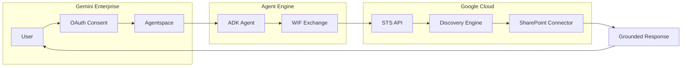
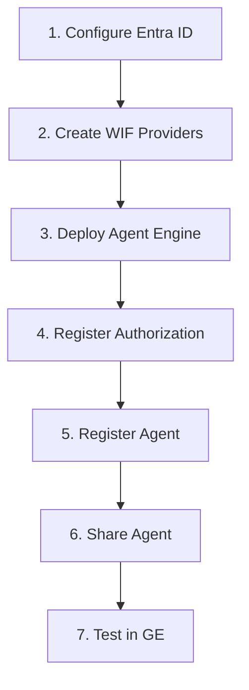

# Overview

> **Navigation**: [README](../README.md) | **Overview** | [Entra ID](02-ENTRA-ID-SETUP.md) | [WIF](03-WIF-SETUP.md) | [Local Testing](04-LOCAL-TESTING.md) | [Agent Engine](05-AGENT-ENGINE.md) | [GE Setup](06-GEMINI-ENTERPRISE.md)

---

## What This Project Does

An ADK Agent that enables **SharePoint document search** in Gemini Enterprise, using:
- **Workforce Identity Federation (WIF)** to exchange Microsoft tokens for GCP tokens
- **Discovery Engine** for AI-grounded search with SharePoint sources
- **ACL-aware search** respecting user permissions

---

## Components

| Component | Purpose |
|-----------|---------|
| **Microsoft Entra ID** | OAuth authentication, custom API scope |
| **WIF Providers** | Token exchange (2 providers: login + agent) |
| **Agent Engine** | Hosts the ADK agent |
| **Discovery Engine** | SharePoint federated connector + AI grounding |

---

## Setup Flow

| Step | Document |
|------|----------|
| 1. Configure Entra ID | [02-ENTRA-ID-SETUP.md](02-ENTRA-ID-SETUP.md) |
| 2. Create WIF Providers | [03-WIF-SETUP.md](03-WIF-SETUP.md) |
| 3. Deploy Agent Engine | [05-AGENT-ENGINE.md](05-AGENT-ENGINE.md) |
| 4-6. GE Registration | [06-GEMINI-ENTERPRISE.md](06-GEMINI-ENTERPRISE.md) |

---

## Key Learnings

1. **Two WIF Providers Required**: Login uses ID tokens, Agent uses access tokens with different audiences
2. **Custom API Scope**: Required to get tokens with app-specific audience for WIF
3. **v1.0 Issuer**: WIF must use `sts.windows.net` (v1.0), not `login.microsoftonline.com` (v2.0)
4. **offline_access**: Required for refresh tokens in Gemini Enterprise

---

**Next**: [Configure Microsoft Entra ID →](02-ENTRA-ID-SETUP.md)
