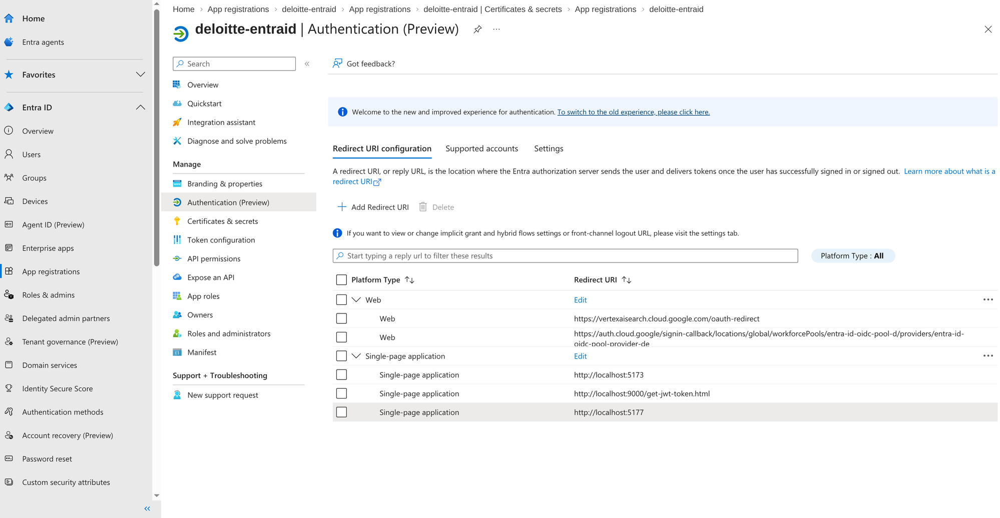
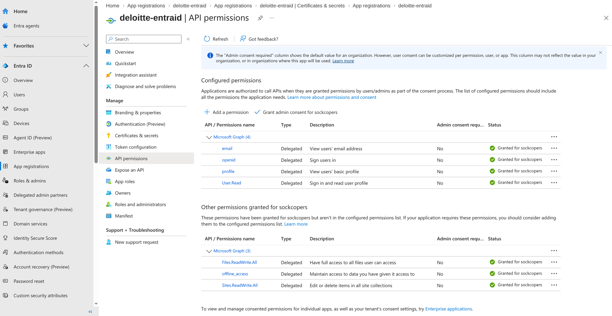

# Microsoft Entra ID Setup

> **Navigation**: [README](../README.md) | [Overview](01-OVERVIEW.md) | **Entra ID** | [WIF](03-WIF-SETUP.md) | [Local Testing](04-LOCAL-TESTING.md) | [Agent Engine](05-AGENT-ENGINE.md) | [GE Setup](06-GEMINI-ENTERPRISE.md)

## Working Configuration Reference

| Setting | Value |
|---------|-------|
| Application (client) ID | `REDACTED_CLIENT_ID` |
| Directory (tenant) ID | `REDACTED_TENANT_ID` |
| Application ID URI | `api://REDACTED_CLIENT_ID` |
| Custom Scope | `api://REDACTED_CLIENT_ID/user_impersonation` |

---

## Step 1: Create App Registration

1. **Azure Portal** → **Microsoft Entra ID** → **App registrations** → **New registration**
2. Name: `deloitte-entraid` (or your name)
3. Supported account types: **Single tenant**
4. Click **Register**
5. Copy **Application (client) ID** and **Directory (tenant) ID**

---

## Step 2: Expose a Custom API (CRITICAL)

**Why**: WIF requires the access token audience to match your app's client ID. Without a custom scope, Microsoft returns tokens with Graph API audience which WIF rejects.

1. Go to **Expose an API**
2. Click **Add** next to "Application ID URI"
3. Accept default: `api://REDACTED_CLIENT_ID`
4. Click **Save**
5. Click **Add a scope**:
   | Field | Value |
   |-------|-------|
   | Scope name | `user_impersonation` |
   | Who can consent | Admins and users |
   | Admin consent display name | `Access SharePoint via Agent` |
   | State | Enabled |
6. Click **Add scope**

**Result**: Your scope is `api://REDACTED_CLIENT_ID/user_impersonation`

---

## Step 3: Configure Authentication Platforms



*Both Web and SPA platforms configured with their redirect URIs*

### Web Platform (for Gemini Enterprise)

1. **Authentication** → **Add a platform** → **Web**
2. Redirect URI: `https://vertexaisearch.cloud.google.com/oauth-redirect`
3. Click **Configure**

### SPA Platform (for Local Testing)

1. **Authentication** → **Add a platform** → **Single-page application**
2. Redirect URIs:
   - `http://localhost:5173`
   - `http://localhost:5177`
3. Check: ✓ Access tokens, ✓ ID tokens
4. Click **Configure**

**Final redirect URIs**:
```
Web:
  https://vertexaisearch.cloud.google.com/oauth-redirect

Single-page application:
  http://localhost:5173
  http://localhost:5177
```

---

## Step 4: Create Client Secret

1. **Certificates & secrets** → **Client secrets** → **New client secret**
2. Description: `Gemini Enterprise`
3. Expiration: 24 months
4. Click **Add**
5. **COPY THE VALUE IMMEDIATELY** (shown only once)

---

## Step 5: Configure API Permissions



*Required Microsoft Graph permissions with admin consent granted*

1. **API permissions** → **Add a permission**
2. **My APIs** → Select your app → ✓ `user_impersonation` → **Add permissions**
3. **Add a permission** → **Microsoft Graph** → **Delegated permissions**:
   - ✓ `openid`
   - ✓ `profile`  
   - ✓ `email`
   - ✓ `offline_access`
4. **Add permissions**
5. Click **Grant admin consent for [tenant]**

---

## Verification Checklist

| Item | Status |
|------|--------|
| Application ID URI set to `api://client-id` | ✓ |
| Custom scope `user_impersonation` created | ✓ |
| Web redirect URI for Gemini Enterprise | ✓ |
| Client secret created and saved | ✓ |
| API permissions granted with admin consent | ✓ |

---

## Environment Variables

```env
TENANT_ID=REDACTED_TENANT_ID
OAUTH_CLIENT_ID=REDACTED_CLIENT_ID
OAUTH_CLIENT_SECRET=your-secret-value
```
