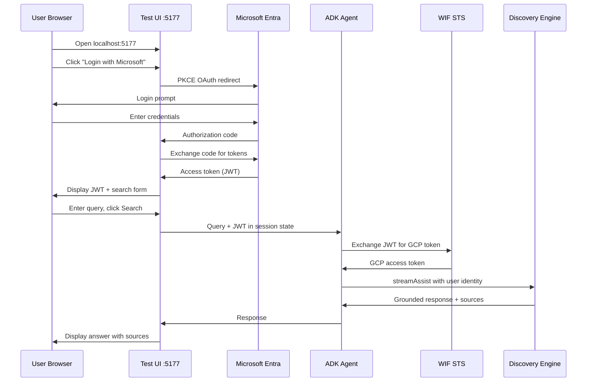

# Local Testing Guide

> **Navigation**: [README](../README.md) | [Overview](01-OVERVIEW.md) | [Entra ID](02-ENTRA-ID-SETUP.md) | [WIF](03-WIF-SETUP.md) | **Local Testing** | [Agent Engine](05-AGENT-ENGINE.md) | [GE Setup](06-GEMINI-ENTERPRISE.md)

This guide covers testing the ADK agent locally before deploying to Agent Engine.

## Local Test Flow

```
┌─────────────────────────────────────────────────────────────────────────────┐
│                           LOCAL TESTING FLOW                                │
├─────────────────────────────────────────────────────────────────────────────┤
│                                                                             │
│   ┌──────────┐    ┌───────────────┐    ┌──────────────┐    ┌────────────┐  │
│   │  Test UI │───►│ Microsoft     │───►│ PKCE OAuth   │───►│  JWT       │  │
│   │ :5177    │    │ Login Page    │    │ Token Flow   │    │  Captured  │  │
│   └──────────┘    └───────────────┘    └──────────────┘    └─────┬──────┘  │
│                                                                   │         │
│   ┌──────────────────────────────────────────────────────────────▼──────┐  │
│   │                        ADK Runner (Local)                           │  │
│   │  ┌─────────────────┐    ┌─────────────────┐    ┌─────────────────┐  │  │
│   │  │ InMemorySession │───►│ search_sharepoint│───►│ Discovery      │  │  │
│   │  │ state={AUTH_ID} │    │ tool             │    │ Engine API     │  │  │
│   │  └─────────────────┘    └─────────────────┘    └─────────────────┘  │  │
│   └─────────────────────────────────────────────────────────────────────┘  │
│                                                                             │
└─────────────────────────────────────────────────────────────────────────────┘
```

## Prerequisites

1. **Microsoft Entra ID**: App registration with SPA redirect URI (see 02-ENTRA-ID-SETUP.md)
2. **WIF**: Workforce Identity Pool configured (see 03-WIF-SETUP.md)
3. **Discovery Engine**: Engine with SharePoint federated connector
4. **Python 3.11+**: With uv package manager

## Setup

### 1. Install Dependencies

```bash
cd ge_adk_sharepoint_wif
uv sync
```

### 2. Configure Environment

```bash
cp .env.example .env
# Edit .env with your values
```

Required `.env` variables for local testing:

```env
# Microsoft Entra ID
ENTRA_CLIENT_ID=ecbfa47e-xxxx-xxxx-xxxx-xxxxxxxxxxxx
ENTRA_TENANT_ID=de46a3fd-xxxx-xxxx-xxxx-xxxxxxxxxxxx

# WIF Configuration
WIF_POOL_ID=entra-id-oidc-pool
WIF_PROVIDER_ID=entra-id-provider

# Discovery Engine
PROJECT_NUMBER=REDACTED_PROJECT_NUMBER
ENGINE_ID=your-engine-id
DATA_STORE_ID=your-datastore-id

# Authorization ID (must match Gemini Enterprise config)
AUTH_ID=sharepointauth

# ADK Configuration
GOOGLE_GENAI_USE_VERTEXAI=True
GOOGLE_CLOUD_PROJECT=your-project-id
GOOGLE_CLOUD_LOCATION=us-central1
```

## Testing Options

### Option 1: Browser-Based Test UI



The test UI provides a full OAuth flow in the browser:

```bash
cd test_ui
uv run python server.py
```

1. Open http://localhost:5177
2. Click "Login with Microsoft"
3. Complete OAuth consent
4. JWT is captured and displayed
5. Enter query and click "Search"

**Features:**
- PKCE OAuth flow (SPA mode)
- Timer showing request latency
- Full end-to-end testing

### Option 2: Direct Agent Test

For testing with a pre-obtained JWT:

```bash
cd test_ui
uv run python test_agent.py
```

Edit `test_agent.py` to set your JWT:
```python
JWT = "eyJ..."  # Your Microsoft JWT
```

### Option 3: Debug WIF Exchange

Test just the WIF token exchange:

```bash
cd test_ui
uv run python debug_wif.py
```

## Important: Session State Keys

```
┌─────────────────────────────────────────────────────────────────────────────┐
│                     SESSION STATE KEY DIFFERENCES                           │
├─────────────────────────────────────────────────────────────────────────────┤
│                                                                             │
│   GEMINI ENTERPRISE                      LOCAL TESTING                      │
│   ─────────────────                      ─────────────                      │
│                                                                             │
│   Agentspace injects token               You inject token manually          │
│   at runtime with temp: prefix           WITHOUT temp: prefix               │
│                                                                             │
│   ┌─────────────────────────┐            ┌─────────────────────────┐        │
│   │ tool_context.state      │            │ session.state           │        │
│   │ ┌─────────────────────┐ │            │ ┌─────────────────────┐ │        │
│   │ │ temp:sharepointauth │ │            │ │ sharepointauth      │ │        │
│   │ │ = "eyJ..."          │ │            │ │ = "eyJ..."          │ │        │
│   │ └─────────────────────┘ │            │ └─────────────────────┘ │        │
│   └─────────────────────────┘            └─────────────────────────┘        │
│                                                                             │
│   Runtime-only (not persisted)           Stored in session state            │
│                                                                             │
└─────────────────────────────────────────────────────────────────────────────┘
```

ADK session state behaves differently for `temp:` prefixed keys:

| Environment | State Key | Behavior |
|-------------|-----------|----------|
| **Gemini Enterprise** | `temp:sharepointauth` | Runtime-injected by Agentspace |
| **Local Testing** | `sharepointauth` | Stored in session state |

The `temp:` prefix is for runtime-only values that don't persist. In local testing, we use keys WITHOUT the `temp:` prefix:

```python
# Local testing - use key without temp: prefix
await session_service.create_session(
    app_name="test",
    user_id="test",
    session_id="test",
    state={"sharepointauth": jwt},  # NOT "temp:sharepointauth"
)
```

The agent checks both keys for compatibility:
```python
# Agent checks both keys
microsoft_jwt = tool_context.state.get("temp:sharepointauth")  # Gemini Enterprise
if not microsoft_jwt:
    microsoft_jwt = tool_context.state.get("sharepointauth")   # Local testing
```

## Benchmarking Latency

```
┌─────────────────────────────────────────────────────────────────────────────┐
│                          LATENCY BREAKDOWN                                  │
├─────────────────────────────────────────────────────────────────────────────┤
│                                                                             │
│   Discovery Engine Alone (~15s)                                             │
│   ════════════════════════════════════════════════════                      │
│   │ WIF Exchange │ streamAssist API │ Response Parsing │                    │
│   └──────────────┴──────────────────┴──────────────────┘                    │
│                                                                             │
│   Full ADK Agent (~18s)                                                     │
│   ════════════════════════════════════════════════════════════════════      │
│   │ Gemini LLM │ Tool Selection │ WIF │ streamAssist │ Response │ LLM │    │
│   └────────────┴────────────────┴─────┴──────────────┴──────────┴─────┘    │
│                                                                             │
│   ADK Overhead: ~3s (Gemini model processing)                               │
│                                                                             │
└─────────────────────────────────────────────────────────────────────────────┘
```

Run the latency benchmark:

```bash
cd test_ui
uv run python bench.py
```

Sample output:
```
==================================================
LATENCY BENCHMARK
==================================================

1. Discovery Engine streamAssist (alone)...
   Latency: 15000ms (15.00s)

2. Full ADK Agent (Gemini + tool + DE)...
   Latency: 18000ms (18.00s)

==================================================
SUMMARY
==================================================
Discovery Engine alone:     15000ms
Full ADK Agent:             18000ms
ADK overhead:                3000ms
```

## Model Selection

The agent uses `gemini-2.5-flash-lite` by default for lower latency:

```python
# agent/agent.py
root_agent = Agent(
    name="SharePointAssistant",
    model="gemini-2.5-flash-lite",  # Faster than gemini-2.5-flash
    ...
)
```

| Model | ADK Overhead | Notes |
|-------|-------------|-------|
| `gemini-2.5-flash` | ~9s | Full thinking model |
| `gemini-2.5-flash-lite` | ~3s | Faster, no extended thinking |

## Troubleshooting

### OAuth Errors

| Error | Solution |
|-------|----------|
| `AADSTS50011: redirect_uri mismatch` | Add `http://localhost:5177` as SPA in Entra ID |
| `AADSTS9002325: PKCE required` | Ensure test UI uses PKCE (code_challenge) |
| Token exchange fails | Use browser JS for token exchange (SPA mode) |

### WIF Errors

| Error | Solution |
|-------|----------|
| `INVALID_AUDIENCE` | Verify WIF_POOL_ID and WIF_PROVIDER_ID in .env |
| `INVALID_SUBJECT_TOKEN` | JWT expired, get fresh token |
| `PERMISSION_DENIED` | Grant IAM roles to workforce pool |

### Discovery Engine Errors

| Error | Solution |
|-------|----------|
| 403 Forbidden | Grant discoveryengine.viewer role |
| Empty response | Check ENGINE_ID and dataStoreSpecs |
| No grounding | Verify SharePoint connector is synced |

## Verifying the Full Flow

```
┌─────────────────────────────────────────────────────────────────────────────┐
│                        SUCCESSFUL TEST CHECKLIST                            │
├─────────────────────────────────────────────────────────────────────────────┤
│                                                                             │
│   Step 1: Token Obtained                                                    │
│   ┌─────────────────────────────────────────────────────────────────────┐   │
│   │  ✓ JWT displayed in UI (1500+ characters)                          │   │
│   │  ✓ Token starts with "eyJ..."                                      │   │
│   └─────────────────────────────────────────────────────────────────────┘   │
│                              │                                              │
│                              ▼                                              │
│   Step 2: WIF Exchange                                                      │
│   ┌─────────────────────────────────────────────────────────────────────┐   │
│   │  ✓ [WIF] STS response status: 200                                  │   │
│   │  ✓ [WIF] SUCCESS - token length: ~283                              │   │
│   └─────────────────────────────────────────────────────────────────────┘   │
│                              │                                              │
│                              ▼                                              │
│   Step 3: Discovery Engine                                                  │
│   ┌─────────────────────────────────────────────────────────────────────┐   │
│   │  ✓ [DE] Dynamic datastores found: N                                │   │
│   │  ✓ [DE] Response received                                          │   │
│   └─────────────────────────────────────────────────────────────────────┘   │
│                              │                                              │
│                              ▼                                              │
│   Step 4: Grounded Answer                                                   │
│   ┌─────────────────────────────────────────────────────────────────────┐   │
│   │  ✓ Response with factual content                                   │   │
│   │  ✓ Source links to SharePoint documents                            │   │
│   └─────────────────────────────────────────────────────────────────────┘   │
│                                                                             │
└─────────────────────────────────────────────────────────────────────────────┘
```

A successful local test should show:

1. **Token obtained**: JWT displayed in UI (1500+ chars)
2. **WIF exchange**: `[WIF] SUCCESS - token length: 283`
3. **Discovery Engine**: `[DE] Response received`
4. **Grounded answer**: Response with source links

Example successful output:
```
[search_sharepoint] Found token via 'sharepointauth'
[DE-search] Exchanging Microsoft JWT (length: 1514)
[WIF] STS response status: 200
[WIF] SUCCESS - token length: 283
[DE] Dynamic datastores found: 5
[DE] Response received...

Response: The CFO salary is $625,000 base...
Sources: [01_Financial_Audit_Report_FY2024](https://...)
```
