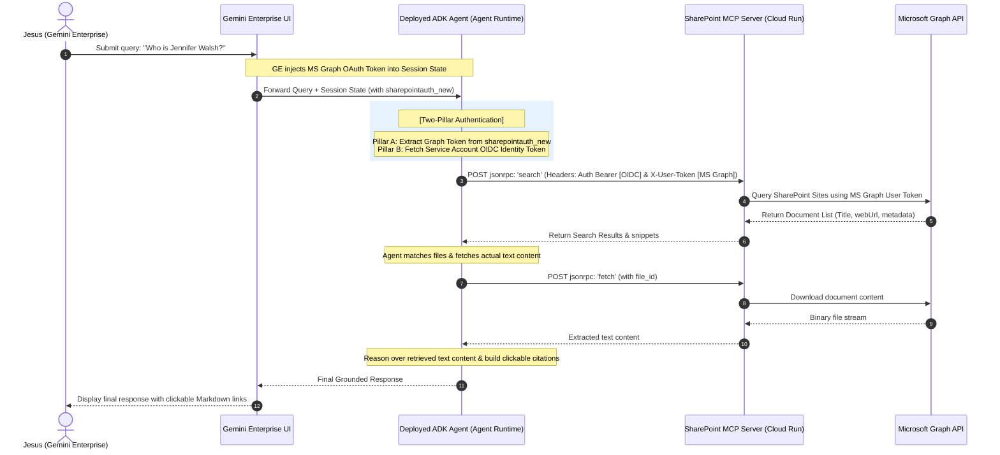
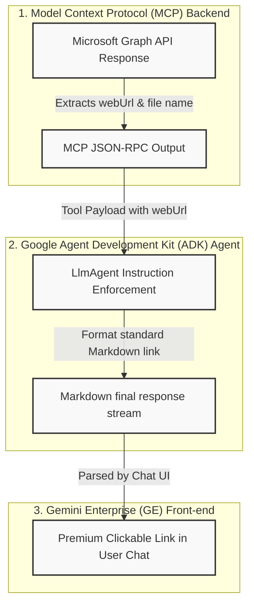
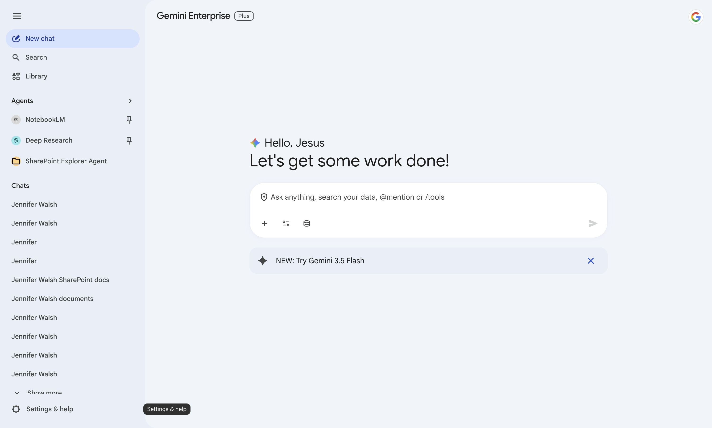
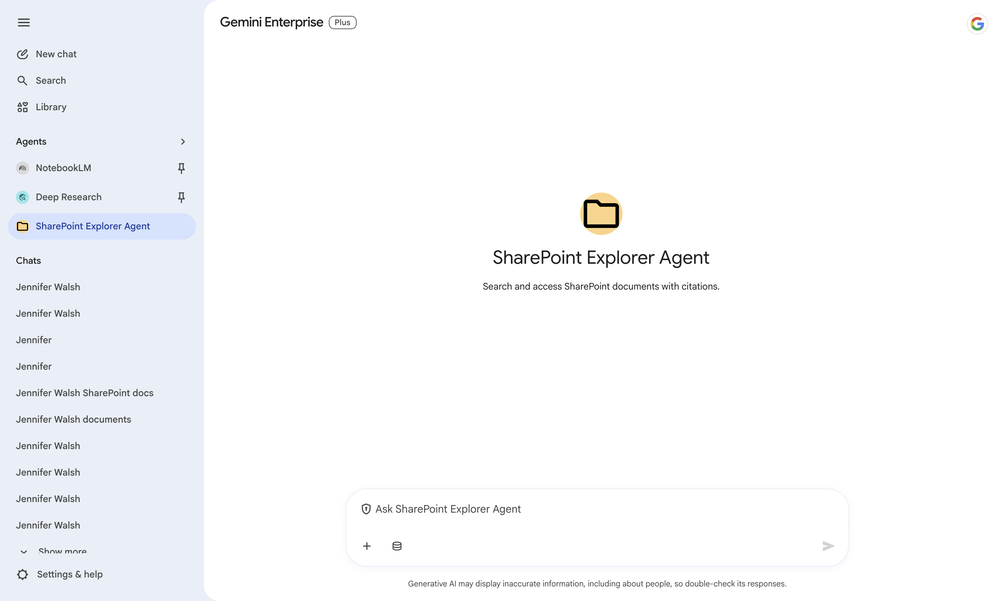
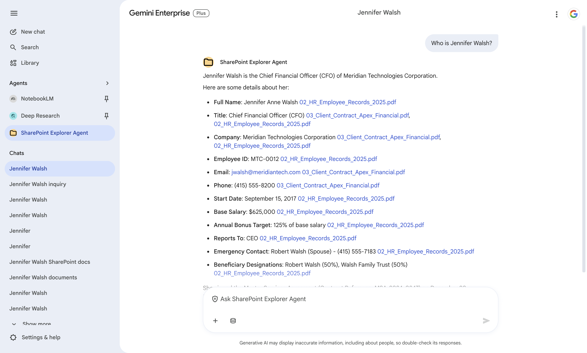

# SharePoint Explorer Agent (Google ADK & Vertex AI Agent Runtime)

The **SharePoint Explorer Agent** is a secure, enterprise-grade virtual assistant grounded in Gemini Enterprise (GE). Built with the **Google Agent Development Kit (ADK)** and running on **Vertex AI Agent Runtime**, the agent leverages a secure Model Context Protocol (MCP) server to dynamically search, retrieve, and inspect corporate documents in Microsoft SharePoint, returning direct clickable citations to users with zero pretrained hallucinations.

---

## 1. Architectural Overview

The agent utilizes a robust, secure **Two-Pillar Authentication** architecture to interact with the backend SharePoint MCP server hosted on Google Cloud Run.



### Two-Pillar Authentication Protocol
1. **Pillar A (End-User Delegation - OAuth 2.0)**: End-user delegates their identity to Gemini Enterprise via Microsoft Graph OAuth. The token is dynamically injected into the agent's `CallbackContext` session state key `sharepointauth_new`. The ADK agent extracts this token and places it in the `X-User-Token` header.
2. **Pillar B (Service-to-Service - OIDC)**: Secures the Cloud Run ingress of the SharePoint MCP server. The ADK agent fetches a Google ID Token (OIDC) from the service account's environment, putting it in the standard `Authorization: Bearer <ID_TOKEN>` header.

---

## 2. Citation Grounding Pipeline (MCP ➔ Google ADK ➔ Gemini Enterprise)

To deliver premium clickable links directly leading into corporate SharePoint document libraries, a robust and explicit citation data flow spans the entire agentic stack:



### Flow Breakdown:

#### 1. Metadata Extraction (MCP Server)
When the MCP server runs its `search` tool via the Microsoft Graph API, it retrieves files matching the user's query. The MCP server extracts the two crucial metadata fields:
* **`title`**: The exact filename (e.g., `02_HR_Employee_Records_2025.pdf`).
* **`webUrl`**: The direct, shareable Microsoft SharePoint hyperlink (e.g., `https://m365x25435604.sharepoint.com/...`).

These fields are structured and returned in the JSON-RPC response back to the ADK Agent:
```json
[
  {
    "id": "site_id:item_id",
    "title": "02_HR_Employee_Records_2025.pdf",
    "webUrl": "https://m365x25435604.sharepoint.com/personal/.../_layouts/15/Doc.aspx?...",
    "snippet": "Jennifer Walsh is the Chief Financial Officer (CFO) of Meridian Technologies Corporation..."
  }
]
```

#### 2. Instruction-Driven Formatting (Google ADK Python Agent)
In the ADK agent implementation ([agent.py](file:///Users/jesusarguelles/IdeaProjects/vertex-ai-samples/semiautonomous-agents/ge_aruntime_adk_mcp_sharepoint/adk-agent/agent.py)), the `LlmAgent` is configured with strict instructions enforcing citation rules:
> **`3. RIGOROUS CLICKABLE CITATIONS:`** *For every claim, fact, or detail you present, you MUST provide a direct, clickable Markdown citation pointing to the source file. Format the citation EXACTLY as `[Document Title](webUrl)` where `Document Title` is the exact filename and `webUrl` is the actual destination web URL returned in the tool's result.*

By following these instructions, the LLM processes the retrieved file contents and produces native Markdown:
```markdown
Jennifer Walsh works as the **Chief Financial Officer (CFO)** for **Meridian Technologies Corporation**, as cited in [02_HR_Employee_Records_2025.pdf](https://m365x25435604.sharepoint.com/...).
```

#### 3. Native Rendering (Gemini Enterprise Frontend)
The Vertex AI Agent Runtime streams this Markdown response back to Gemini Enterprise. The GE chat frontend natively parses standard Markdown link patterns. 
* Links are styled and displayed as high-fidelity hyperlinks rather than raw text.
* Clicking the link opens a new browser tab directly inside the corporate SharePoint environment, instantly authenticating the user with their active Microsoft 365 credentials.

---

## 3. Directory Structure

The repository is structured simply and effectively:

```
ge_aruntime_adk_mcp_sharepoint/
├── README.md                 # Project root documentation
├── screenshots/              # Walkthrough screenshots
│   ├── 01_gemini_home.png
│   ├── 02_agent_loaded.png
│   └── 03_agent_response.png
└── adk-agent/                # Google ADK Python Project
    ├── agent.py              # Main Agent logic (factored, simple, ADK-native)
    ├── deploy.py             # Reasoning Engine deployer script
    ├── register.py           # Discovery Engine agent registration script
    ├── requirements.txt      # Python dependencies
    ├── pyproject.toml        # Build and packaging configuration
    └── README.md             # Developer setup instructions
```

---

## 4. Developer Guide & Setup

For quick setup, execution, and local development instructions, see the developer-focused guide:

👉 **[adk-agent/README.md](file:///Users/jesusarguelles/IdeaProjects/vertex-ai-samples/semiautonomous-agents/ge_aruntime_adk_mcp_sharepoint/adk-agent/README.md)**

---

## 5. End-to-End Walkthrough & Verification

### Step 1: Access Gemini Enterprise
Log in to Gemini Enterprise. The user is greeted by the homepage, where the sidebar displays custom provisioned agents.



### Step 2: Select the SharePoint Explorer Agent
Click **SharePoint Explorer Agent** in the sidebar. This loads a clean session dedicated to the ADK Agent, referencing the deployed Vertex AI Reasoning Engine.



### Step 3: Grounded Query Execution
Type `"Who is Jennifer Walsh?"` and submit. 
* The ADK agent captures the user's Graph token from `sharepointauth_new`.
* It calls the `search` tool, locates `02_HR_Employee_Records_2025.pdf` and `03_Client_Contract_Apex_Financial.pdf`.
* It calls `fetch` or `read_file` to retrieve the actual text, grounding the final response in real documents without hallucinations.
* Citations are rendered as direct, clickable SharePoint `webUrl` links.


