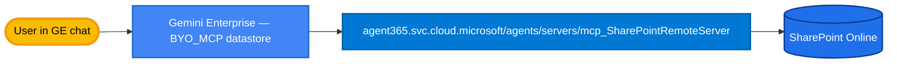

## Option 2 — Hosted Work IQ SharePoint MCP (Microsoft Agent 365, Preview)

You don't run any Cloud Run service. Microsoft hosts a SharePoint MCP server as part of the Work IQ toolset; Gemini Enterprise points its BYO_MCP datastore at the hosted URL and Microsoft enforces SharePoint ACLs from the user's identity.



---

### Server endpoint

Confirmed in M365 admin → Agents → Tools (sockcop tenant, 2026-05-27):

| Field | Value |
|---|---|
| Display name | Work IQ SharePoint MCP Server (Preview) |
| Server ID | `mcp_SharePointRemoteServer` |
| URL | `https://agent365.svc.cloud.microsoft/agents/servers/mcp_SharePointRemoteServer` |
| Type | MCP Server |
| Version | 1.0.2 |
| Publisher | Microsoft Corporation |
| Program | **Preview** (Work IQ tools — `https://aka.ms/AboutWorkIQ`) |
| Docs reference | [Work IQ SharePoint reference](https://learn.microsoft.com/en-us/microsoft-agent-365/mcp-server-reference/sharepoint) |

> ⚠️ **URL pattern fix vs MS Learn docs**: the docs say `/agents/tenants/{tenantId}/servers/...`. The real URL the admin panel exposes has **no** tenant path. The tenant is resolved from the caller's Entra bearer token. We use what the admin panel reports.

> ⚠️ **Block flag**: in the admin detail page the server shows a "🚫 Block" badge by default. You must explicitly **Allow** it in the same panel before any agent (GE included) can call it.

> **Sister servers in the same tenant** — not used here, listed for context:
> - `Microsoft SharePoint and OneDrive MCP Server (Frontier)` — `mcp_ODSPRemoteServer`, auto-discovery, earlier program tier
> - `Microsoft SharePoint Lists MCP Server (Frontier)` — Lists-only Frontier variant
> Work IQ SharePoint (Preview) covers files + lists + columns in one server with a documented tool surface, so we pick it for the comparison.

---

### Tenant prerequisites

- **Microsoft Agent 365** license / Work IQ enabled on the tenant.
- Tenant admin consent for the GE app calling the hosted MCP (the user's bearer token must include scopes Agent 365 accepts).
- SharePoint Online with the data you actually want to query.

> The Microsoft docs are explicit: "Preview features aren't meant for production use and might have restricted functionality."

---

### Tool surface (35+ tools)

See [`notes.md`](notes.md) for the categorized list. High-level:

| Category | Examples |
|---|---|
| Site discovery | `findSite`, `getSiteByPath`, `listSubsites` |
| Library / folder | `listDocumentLibrariesInSite`, `getDefaultDocumentLibraryInSite`, `getFolderChildren`, `findFileOrFolder` |
| File read | `readSmallTextFile`, `readSmallBinaryFile` (≤5 MB each) |
| File write | `createSmallTextFile`, `createSmallBinaryFile`, `createFolder`, `renameFileOrFolder`, `deleteFileOrFolder` |
| Move / copy | `moveFileOrFolder`, `copyFileOrFolder`, `uploadFileFromUrl`, `checkOperationStatus` (async) |
| Sharing | `shareFileOrFolder`, `sendInviteForList` |
| Sensitivity / labels | `setSensitivityLabelOnFile` |
| Lists | `listLists`, `createList`, `deleteList`, `listListItems`, `getListItem`, `createListItem`, `updateListItem`, `deleteListItem` |
| Columns | `listColumns`, `createColumn`, `updateColumn`, `deleteColumn` |

---

### Known limits (from MSFT docs)

- **File operations capped at 5 MB** (read and write). Larger files are unsupported via this server.
- Folder listing returns **top 20** children only.
- Search operations return **top 20** results by default.
- Copy / move are **asynchronous** — caller must poll `checkOperationStatus`.
- `uploadFileFromUrl` requires the source URL to be SharePoint or OneDrive.
- List deletion and column deletion are destructive and cannot be undone.
- Tool names and parameters are **subject to change** during preview — do not hard-code dependencies.

---

### Wire it into Gemini Enterprise

```bash
# Default tenant is sockcop (de46a3fd-0d68-4b25-8343-6eb5d71afce9).
# Override TENANT_ID=... for any other tenant.
./register_in_ge.sh
```

The `register_in_ge.sh` here registers the hosted URL as a BYO_MCP service in Agent Registry — same shape as option 1, just pointing at Microsoft's URL instead of a Cloud Run service you own.

---

### What you give up vs. Option 1

- **No control over the tool surface.** You get the 35+ tools as Microsoft ships them, including the write/delete tools — you cannot gate them server-side.
- **No 5 MB workaround.** PDFs and decks bigger than 5 MB are simply unreadable via this MCP. The custom MCP can stream-and-truncate.
- **No server-side markdown.** `readSmallTextFile` returns raw text and `readSmallBinaryFile` returns base64 — the chat LLM must interpret. Custom MCP returns MarkItDown markdown.
- **Preview SLA.** Microsoft can change tool names, params, or remove the feature.

### What you get vs. Option 1

- **Zero Cloud Run, zero Graph code, zero auth plumbing on the GCP side.**
- **Full SharePoint surface** including lists, columns, sensitivity labels, async move/copy — the custom MCP does not implement these.
- **Microsoft-owned ACL enforcement** end-to-end.
