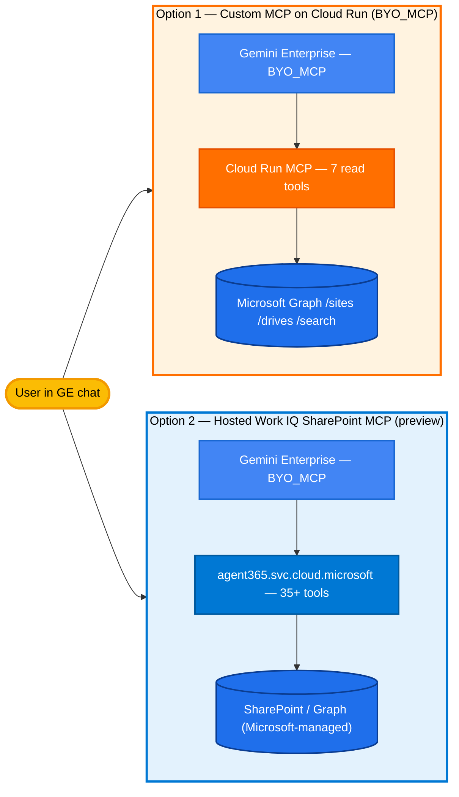

## SharePoint + Gemini Enterprise

Two working ways to connect SharePoint Online to Gemini Enterprise. Pick the option that matches your priorities (control vs zero-infra), then follow that option's walkthrough.

> **Reading guide**: this README compares both options at the architectural level. For the deep dives:
> - **Option 1 — Custom MCP** (Cloud Run, you own the code): [`1-custom-mcp/README.md`](1-custom-mcp/README.md)
> - **Option 2 — Hosted Work IQ SharePoint MCP** (Microsoft Agent 365, preview): [`2-hosted-mcp-iq/README.md`](2-hosted-mcp-iq/README.md)
> - **Eval methodology + corpus**: [`eval/README.md`](eval/README.md)
> - **Pricing math**: [`docs/PRICING.md`](docs/PRICING.md)
> - **ACL model side-by-side**: [`docs/ACL_MODEL.md`](docs/ACL_MODEL.md)



---

## Pick an option

| | **Option 1**<br/>Custom MCP on Cloud Run | **Option 2**<br/>Hosted Work IQ SharePoint MCP |
|---|:---:|:---:|
| **Setup** | Cloud Run deploy + Entra OAuth app + Agent Registry register | Point GE BYO_MCP at the tenant URL |
| **Tool surface** | 7 canonical read tools (`search`, `fetch`, `list_sites`, `list_libraries`, `list_files`, `read_file`, `search_content`) + write ops out-of-scope for scoring | 35+ tools (sites, libraries, files, lists, columns, sharing, sensitivity labels, async copy/move) |
| **Auth model** | Entra OAuth **authorization code** flow, per-user Bearer forwarded by GE to `/mcp` | Microsoft-managed auth via Agent 365 tenant binding |
| **ACL fidelity** | Per-user delegated Graph token → SharePoint enforces ACLs at source | Microsoft-managed; honors SharePoint ACLs by construction |
| **Write / mutation safety** | Write tools live on the server but are excluded from the eval; easy to gate behind feature flag | Built-in (create/delete/move/rename/share/sensitivity-label); cannot be gated server-side |
| **File-size ceiling** | None (Graph download chunks) | **≤5 MB** per read/write (hard limit) |
| **Doc → markdown** | PyMuPDF + MarkItDown + Gemini vision (server-side) | Raw text or base64 binary, no markdown conversion |
| **Cost / 1K queries** | TBD — see [`docs/PRICING.md`](docs/PRICING.md) | TBD — Microsoft-bundled with Agent 365 license |
| **Status** | GA pattern (Custom MCP is GA in GE) | **Preview** (per Microsoft Learn) |
| **Best for** | Custom doc parsing, deterministic tool surface, governance hooks, no 5 MB ceiling | Fastest path; full SharePoint surface (lists/columns/sharing) without writing Graph code |
| **Walkthrough** | [`1-custom-mcp/README.md`](1-custom-mcp/README.md) | [`2-hosted-mcp-iq/README.md`](2-hosted-mcp-iq/README.md) |

### Decision guide

- **Pick Option 1** when you want a controlled, read-shaped surface (just `search` + `fetch` + a handful of browse tools), server-side document-to-markdown conversion (PDFs, docx, images with vision), and the ability to gate or remove mutating tools. Cost and latency are yours to tune.
- **Pick Option 2** when you want the broadest SharePoint surface (lists, columns, sharing, sensitivity labels, async copy/move) and you accept the **≤5 MB** per-file ceiling and the current **preview** status. Zero Cloud Run, zero Graph code, Microsoft owns the runtime.

> Both options share the same GE BYO_MCP connector mechanism — you can register both side-by-side in the same Gemini Enterprise app and compare in the same chat surface.

---

## What it does

Once either option is deployed, users ask SharePoint questions in Gemini Enterprise chat:

- *"Find the FY26 quarterly review deck"* → resolves the file and returns its preview link
- *"Summarize the Vendor Contracts library"* → walks the library, reads N docs, synthesizes
- *"What's in the latest HR policy doc?"* → reads + extracts the markdown
- *"List documents in the Marketing site modified this week"* → metadata filter

---

## Evaluation

A **~120-question benchmark** across **12 categories** (see [`eval/questions/questions.json`](eval/questions/questions.json) for the seed shape). Both options run against the same deterministic SharePoint test site built by [`eval/seed_corpus.py`](eval/seed_corpus.py); answers are scored by a judge ported from the Atlassian comparison.

### Question categories (12)

| Bucket | Categories |
|---|---|
| Read-side correctness (6) | lookup, search-by-name, search-by-content, list-libraries, list-items, metadata |
| File reading (3) | file-read, multi-file-synthesis, cross-library |
| Safety / robustness (3) | permission-aware, refusal, prompt-injection |

Full taxonomy will land in `eval/QUESTION_TYPES.md` once questions are generated.

### Where results will live

- **Interactive comparison site:** [`eval/comparison-site/`](eval/comparison-site/) — TODO, generated from runner output
- **Raw judged scores:** `eval/runs/<ts>/judged_*.json` (per pipeline run)
- **Methodology:** [`eval/README.md`](eval/README.md)

> **Numbers will be TBD** until the corpus is seeded, questions are generated, and both runners produce a full pass. The architectural facts in the pick-an-option table above are stable today.

---

## Repository layout

```
ge_custom_mcp_sharepoint/
├── README.md                       ← you are here
│
├── 1-custom-mcp/                   Cloud Run MCP server (you own the code)
│   ├── README.md                     walkthrough + arch + "what changed from ms365-mcp-server"
│   ├── server.py                     FastMCP + StreamableHTTP /mcp endpoint
│   ├── tools/sharepoint.py           7 read tools mapped to Graph
│   ├── tools/search.py               canonical search(query) + fetch(id) for GE BYO-MCP
│   ├── auth.py                       per-request Bearer middleware (Entra OAuth code flow)
│   ├── graph_client.py               Graph API helper
│   ├── doc_reader.py                 PDF/docx → markdown via MarkItDown + PyMuPDF + Gemini vision
│   ├── Dockerfile / requirements.txt
│   ├── deploy.sh                     gcloud run deploy
│   └── register_in_ge.sh             Agent Registry services.create
│
├── 2-hosted-mcp-iq/                Microsoft Agent 365 Work IQ SharePoint MCP (preview)
│   ├── README.md                     tenant prereqs, server URL, preview caveats, 5MB limit
│   ├── register_in_ge.sh             point GE BYO_MCP at the hosted URL
│   └── notes.md                      tool surface, auth model, limitations
│
├── eval/                           comparative benchmark
│   ├── README.md                     how to run, where results land
│   ├── seed_corpus.py                builds the deterministic SharePoint test site (TODO)
│   ├── questions/questions.json      ~120 questions across 12 categories (seed shape)
│   ├── judge.py                      TODO: port judge_v6 from atlassian-jira-integration
│   ├── runners/run_custom_mcp.py     TODO
│   ├── runners/run_hosted_iq.py      TODO
│   └── comparison-site/              TODO: side-by-side HTML report
│
└── docs/
    ├── PRICING.md                    cost/1K queries math per option
    └── ACL_MODEL.md                  per-user ACL resolution (Entra OAuth code vs hosted)
```

---

## Prerequisites (either option)

- Google Cloud project with **Gemini Enterprise** enabled (target: `vtxdemos`, region: `us-central1`)
- Microsoft tenant with SharePoint Online and admin consent for an Entra app (option 1) or Agent 365 license (option 2)
- `gcloud` CLI authed with **Owner** on the GCP project
- Python 3.11+
- IAM roles for option 1: `roles/run.admin`, `roles/iam.serviceAccountUser`, `roles/aiplatform.user`

---

## Related projects

- [`atlassian-jira-integration/`](../atlassian-jira-integration/) — same comparison pattern, 6 options, Jira
- [`ms365-mcp-server/`](../ms365-mcp-server/) — source skeleton this scaffold reused (single-user device-code variant)
- [`streamassist-oauth-flow-sharepoint/`](../streamassist-oauth-flow-sharepoint/) — Entra OAuth code flow reference for SharePoint
- [`gemini-enterprise-sharepoint-agent/`](../gemini-enterprise-sharepoint-agent/) — ADK-agent variant of the same connection

---

**Authors:** Google Cloud AI Demos Team — **Last updated:** 2026-05-27 — **Target:** Gemini Enterprise + SharePoint Online
