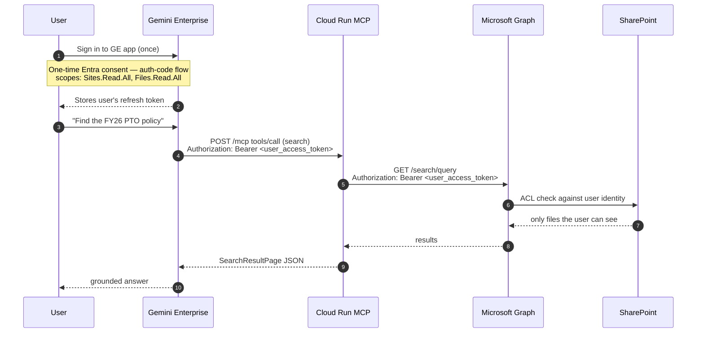
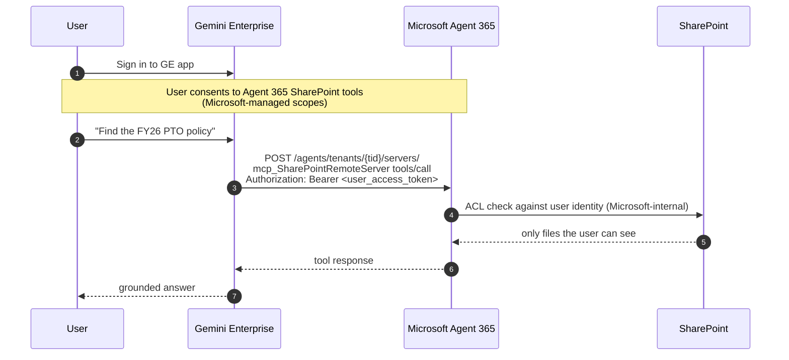

## ACL model — per-user permission resolution

Both options end up enforcing SharePoint Online's standard delegated-permissions ACLs. They get there by different paths.

### Option 1 — Custom MCP on Cloud Run (Entra OAuth authorization-code flow)

Key properties:
- **Per-call user identity.** The bearer the user got from Entra is forwarded verbatim through GE → MCP → Graph. No service-principal middleman.
- **No server-side ACL cache.** Every call hits SharePoint's live ACL.
- **No write surface by default.** `MCP_ENABLE_WRITES=0` keeps the server read-only at the MCP layer; even if the user has write perms in SharePoint, the connector won't expose them.
- **Refresh-token lifecycle is yours.** Decide where to store refresh tokens (Secret Manager keyed by user id is the default recommendation).

### Option 2 — Hosted Work IQ SharePoint MCP

Key properties:
- **Microsoft owns the auth and ACL plumbing end-to-end.** You don't see refresh tokens, you don't run an Entra app for SharePoint scopes (the Agent 365 license covers them).
- **Same ACL fidelity** at the SharePoint layer — Agent 365 honors SP's standard delegated permissions.
- **You inherit the full tool surface.** Including write / delete / share / sensitivity-label tools. You cannot gate them server-side; only at the GE app's tool-allowlist level (if GE exposes one for BYO_MCP — verify).

### Edge cases the eval should test

| Case | Option 1 behavior | Option 2 behavior |
|---|---|---|
| User with NO access to a file | Graph 403 → MCP returns "no results" or error | Hosted MCP filters at SP layer → no results |
| User loses access mid-session | Next call 403s (no cache) | Same |
| Service account quota throttling | Per-user 429 from Graph; backoff in `graph_client.py` (TODO) | Microsoft handles throttling; less visibility |
| Tenant-wide sharing link (anonymous) | User token still bounded by ACL | Same |
| Sensitivity-labeled file (locked download) | `read_file` returns Graph error verbatim | Hosted MCP may transparently downgrade to metadata-only |

The eval's `permission-aware` category exercises this with a `Restricted-Legal` library that one test user has access to and another doesn't. Compare verdicts across both options.
