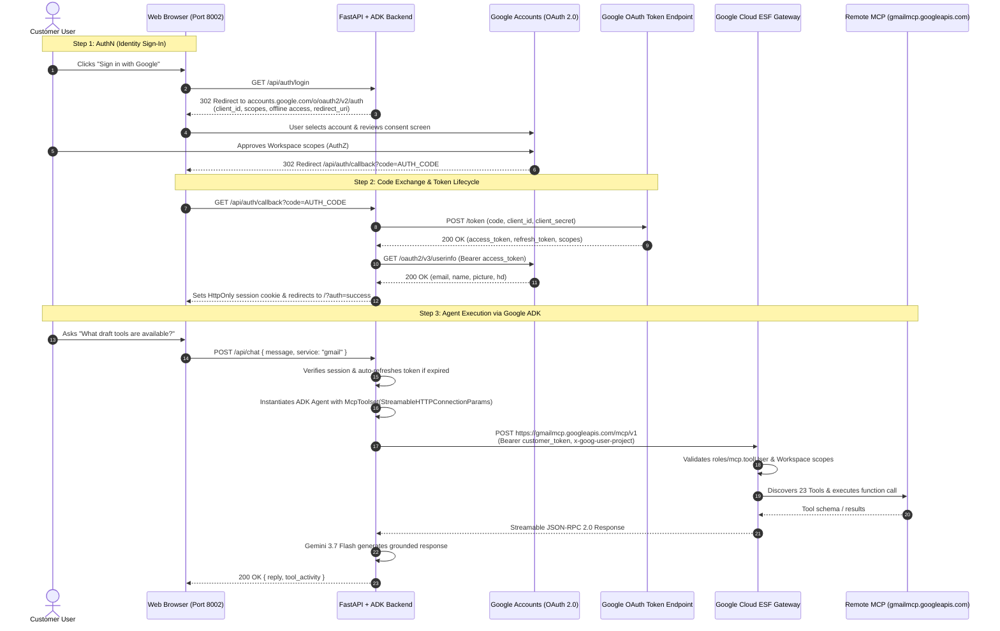

# Google Workspace Remote MCP with Google ADK: Multi-Tenant Customer AuthN & AuthZ Guide

This repository contains an enterprise-ready showcase demonstrating how **Google ADK (Agent Development Kit)** integrates with **Google Workspace Remote Model Context Protocol (MCP)** servers (Gmail, Drive, Calendar, Docs, Sheets) with complete, end-to-end **Customer Authentication (AuthN)** and **Authorization (AuthZ)**.

---

## 1. Original Google Documentation vs. Real-World Requirements

### The Official Documentation Contract
Google Workspace documents its remote MCP servers under [Google Workspace Guides: Configure MCP Servers](https://developers.google.com/workspace/guides/configure-mcp-servers#others):
* **Developer Preview**: Part of the Google Workspace Developer Preview Program.
* **Server Name**: `googleworkspace`
* **Transport**: `HTTP`
* **Authentication**: OAuth 2.0 (`Authorization: Bearer <TOKEN>`)
* **Remote Endpoints**:
  * Gmail: `https://gmailmcp.googleapis.com/mcp/v1`
  * Google Drive: `https://drivemcp.googleapis.com/mcp/v1`
  * Google Docs: `https://docsmcp.googleapis.com/mcp/v1`
  * Google Sheets: `https://sheetsmcp.googleapis.com/mcp/v1`
  * Google Slides: `https://slidesmcp.googleapis.com/mcp/v1`
  * Google Calendar: `https://calendarmcp.googleapis.com/mcp/v1`
  * Google Chat: `https://chatmcp.googleapis.com/mcp/v1`
  * People API: `https://people.googleapis.com/mcp/v1`

---

## 2. Discovered Missing Configurations & Undocumented Realities

While the public documentation provides the raw endpoints, deploying a production agent requires solving critical undocumented security and infrastructure gates:

### A. Transport Protocol: Streamable HTTP (Not Server-Sent Events)
* **The Reality**: The documentation specifies `Transport: HTTP`. Under the MCP protocol, this is strictly **Streamable HTTP POST** with JSON-RPC 2.0 payloads (`initialize`, `tools/list`, `tools/call`).
* **The Gotcha**: Attempting an HTTP `GET` (such as standard SSE handshakes) returns `405 Method Not Allowed`.
* **ADK Implementation**: You must configure `StreamableHTTPConnectionParams(url=..., headers=...)` rather than `SseConnectionParams`.

### B. Mandatory Google Cloud IAM Gate (`roles/mcp.toolUser`)
* **The Reality**: Google's Enterprise Service Frontend (ESF) intercepts requests to `*mcp.googleapis.com` before routing to Workspace APIs.
* **The Requirement**: The calling principal (user or service account) must be granted the IAM role `roles/mcp.toolUser` (which contains `mcp.tools.call`) in the target GCP project:
  ```bash
  gcloud projects add-iam-policy-binding YOUR_PROJECT_ID \
    --member="user:user@customer-domain.com" \
    --role="roles/mcp.toolUser" --condition=None
  ```

### C. Quota & Project Attribution Header (`x-goog-user-project`)
* Requests must supply the header `x-goog-user-project: <PROJECT_ID>`. The corresponding MCP APIs (`gmailmcp.googleapis.com`, `drivemcp.googleapis.com`, etc.) must be enabled in that project.

### D. Python MCP Library Version Pinning (`mcp<2.0.0`)
* `mcp 2.x` introduced breaking changes removing `mcp.shared.session`.
* In `google-adk`, `McpToolset` silently catches the `ImportError`. All environments must pin `mcp>=1.2.0,<2.0.0` (e.g., `mcp==1.29.1`).

### E. Dual-Layer Token Architecture (AuthN vs. AuthZ)
* **GCP Infrastructure Authorization**: Requires valid Google Cloud project attribution (`x-goog-user-project`) and IAM check (`roles/mcp.toolUser`).
* **Workspace Data Authorization**: Requires granular OAuth user scopes (e.g., `gmail.modify`, `drive.readonly`). Standard Google Cloud Platform Application Default Credentials (ADC) tokens carry only `cloud-platform` scope and are **rejected** with `403 Forbidden` by the Workspace MCP gateway.

### F. Pre-Flight Auth Guard & Backend `before_tool_callback` Defense
To prevent unhandled exceptions (`TaskGroup` failures or raw `403 Forbidden` errors from Google's ESF gateway) when a user tries to run Workspace commands without signing in:
1. **Frontend Pre-Flight Guard (`beforeChatCallback`)**:
   - Checks the user's active session authentication type (`currentAuthType`).
   - If the user is unauthenticated or running under server-side ADC without user OAuth, the chat UI intercepts the submission **before** sending a network request.
   - Renders an actionable in-chat card with an immediate **"Sign in with Google (Recommended)"** button and a secondary **"Proceed with ADC anyway"** option for developers testing edge cases.
2. **Backend ADK Tool Interceptor (`before_tool_callback`)**:
   - In ADK's `Agent`, we register `before_tool_callback=workspace_before_tool_callback`.
   - If an unauthenticated or ADC-only request bypasses the frontend, ADK intercepts the tool execution before the remote MCP client issues an HTTP call.
   - Returns a structured `AUTH_REQUIRED` status so Gemini 3.7 Flash politely explains to the user that Google Workspace authentication is required.

### G. RFC 6749 Redirect URI Exact-Match Rule
* Google's OAuth 2.0 authorization server strictly enforces RFC 6749 §4.1.3: the `redirect_uri` sent in the token exchange `POST https://oauth2.googleapis.com/token` must **identically match** the `redirect_uri` sent in the initial `GET accounts.google.com/o/oauth2/v2/auth`.
* In Google Cloud Console, developers often register either root `http://localhost:8002` or the callback path `http://localhost:8002/api/auth/callback`.
* The server dynamically tracks the effective redirect URI in the pending session state and supports both paths seamlessly, with an automatic SPA root redirect interceptor.

---

## 3. End-to-End Customer AuthN & AuthZ Architecture



---

## 4. Customer Onboarding & Setup Guide

### Where to Go Quick Reference Map
Use this table as your master checklist for configuring Google Cloud and Workspace:

| Step | Setup Stage | Exact Location in Google Cloud Console | Direct URL | What to Do |
| :--- | :--- | :--- | :--- | :--- |
| **1** | **Enable MCP APIs** | **APIs & Services > Library** | [console.cloud.google.com/apis/library](https://console.cloud.google.com/apis/library) | Enable `gmailmcp`, `drivemcp`, `docsmcp`, `calendarmcp`, `sheetsmcp`, `slidesmcp`, `chatmcp`, and `aiplatform`. |
| **2** | **OAuth Consent Screen** | **APIs & Services > OAuth consent screen** | [console.cloud.google.com/apis/credentials/consent](https://console.cloud.google.com/apis/credentials/consent) | Choose **Internal** (Workspace org) or **External** (Testing). Add Workspace scopes and add your testing emails to **Test users**. |
| **3** | **Create Web Client ID** | **APIs & Services > Credentials** | [console.cloud.google.com/apis/credentials](https://console.cloud.google.com/apis/credentials) | Click **+ Create Credentials > OAuth client ID > Web application**. Configure JavaScript origins and Authorized redirect URIs. |
| **4** | **Grant IAM Permissions** | **IAM & Admin > IAM** | [console.cloud.google.com/iam-admin/iam](https://console.cloud.google.com/iam-admin/iam) | Grant `roles/mcp.toolUser` to every user email testing the application. |
| **5** | **Workspace API Access** *(Optional)* | **Google Admin Console > Security** | [admin.google.com/ac/owl](https://admin.google.com/ac/owl) | Under **API controls**, mark the OAuth Client ID as **Trusted** for your organization. |
| **6** | **Run & Configure App** | **Local Web Browser** | `http://localhost:8002` | Open UI, click **Credentials** to enter Client ID/Secret or add them to `.env`. Click **Sign in with Google**. |

---

### Step-by-Step Instructions

#### Step 1: Google Cloud Project & API Enablement
1. Open [Google Cloud Console](https://console.cloud.google.com/) and select your project.
2. Enable the required Workspace Remote MCP APIs via terminal or the [API Library](https://console.cloud.google.com/apis/library):
   ```bash
   gcloud services enable \
     gmailmcp.googleapis.com \
     drivemcp.googleapis.com \
     docsmcp.googleapis.com \
     calendarmcp.googleapis.com \
     sheetsmcp.googleapis.com \
     slidesmcp.googleapis.com \
     chatmcp.googleapis.com \
     aiplatform.googleapis.com \
     --project=YOUR_PROJECT_ID
   ```

#### Step 2: Configure OAuth Consent Screen & Add Test Users
1. Go to **APIs & Services > [OAuth consent screen](https://console.cloud.google.com/apis/credentials/consent)**.
2. Select User Type:
   * **Internal**: Recommended if deploying within a Google Workspace organization (all org users can sign in immediately).
   * **External**: If using standard `@gmail.com` accounts or testing before verification.
3. Fill in mandatory fields:
   * **App name**: `Workspace Agent Showcase`
   * **User support email**: Your email address
   * **Developer contact email**: Your email address
4. Click **Save and Continue** to advance to **Scopes**. Click **Add or Remove Scopes** and select:
   * `openid`
   * `.../auth/userinfo.email`
   * `.../auth/userinfo.profile`
   * `.../auth/gmail.modify`
   * `.../auth/drive.readonly`
   * `.../auth/calendar`
   * `.../auth/documents.readonly`
   * `.../auth/spreadsheets.readonly`
5. Click **Save and Continue** to reach **Test users** *(CRITICAL if External/Testing)*:
   * Click **+ Add users**.
   * Enter the exact email address of every account that will be signing into the demo (e.g. `your.email@gmail.com`).
   * *If you skip this step, Google blocks login with `Error 403: access_denied`.*

#### Step 3: Create OAuth 2.0 Web Client ID
1. Go to **APIs & Services > [Credentials](https://console.cloud.google.com/apis/credentials)**.
2. Click **+ Create Credentials** at the top and select **OAuth client ID**.
3. Set Application type: **Web application**.
4. Set Name: `Workspace MCP Web Client`.
5. Under **Authorized JavaScript origins**, click **+ Add URI** and enter:
   * `http://localhost:8002`
   * `http://localhost:8003` *(if also testing LangChain)*
6. Under **Authorized redirect URIs**, click **+ Add URI** and add BOTH:
   * `http://localhost:8002/api/auth/callback` *(Standard API callback)*
   * `http://localhost:8002` *(Root URL fallback)*
   * `http://localhost:8003/api/auth/callback` *(LangChain callback)*
   * `http://localhost:8003` *(LangChain root fallback)*
   > **Note on Resilient Routing:** The application includes a built-in Single-Page Application (SPA) redirect router. If Google redirects to the root page (`http://localhost:8002/?code=...`), the frontend immediately intercepts the code and completes the token exchange. Authorizing both URIs ensures seamless authentication in all browser setups.
7. Click **Create**.
8. A modal appears displaying your **Client ID** (`*.apps.googleusercontent.com`) and **Client secret** (`GOCSPX-*`). You can either copy them directly or click **Download JSON** (`client_secret_*.json`).

#### Step 4: Grant IAM Role to End Users
The Google Cloud Enterprise Service Frontend (ESF) gateway enforces an IAM check on every Workspace MCP request. Every user account must hold the `roles/mcp.toolUser` role:
```bash
gcloud projects add-iam-policy-binding YOUR_PROJECT_ID \
  --member="user:your.email@gmail.com" \
  --role="roles/mcp.toolUser" --condition=None
```
*(You can also add this in [IAM & Admin > IAM](https://console.cloud.google.com/iam-admin/iam) by clicking **Grant Access**, entering the user email, and selecting the role **MCP Tool User**).*

#### Step 5: Configure Credentials in the Application
Choose whichever method you prefer:

* **Option A: In-App Credentials Modal (Easiest)**:
  1. Open [http://localhost:8002](http://localhost:8002).
  2. Click **Credentials** in the top navigation bar.
  3. Paste your **Client ID** and **Client Secret** (or click **Choose File** to upload the downloaded `client_secret_*.json`).
  4. Click **Save Configuration**.

* **Option B: Local `.env` File**:
  Create a `.env` file in the project folder (strictly gitignored by the Zero-Leak Protocol):
  ```bash
  cp .env.example .env
  ```
  Edit `.env`:
  ```env
  GOOGLE_CLOUD_PROJECT=your-gcp-project-id
  GOOGLE_CLOUD_LOCATION=global
  GOOGLE_OAUTH_CLIENT_ID=your-client-id.apps.googleusercontent.com
  GOOGLE_OAUTH_CLIENT_SECRET=GOCSPX-your-secret
  GOOGLE_OAUTH_REDIRECT_URI=http://localhost:8002/api/auth/callback
  ```

---

## 5. Running & Testing the Application

### 1. Install Dependencies
```bash
python3 -m venv .venv
source .venv/bin/activate
pip install -r requirements.txt
```

### 2. Start the Server
```bash
./run.sh
```
Or run directly:
```bash
python3 -m uvicorn backend.main:app --host 0.0.0.0 --port 8002
```

### 3. Authenticate & Command Workspace Tools
1. Open **[http://localhost:8002](http://localhost:8002)** in your browser.
2. Click **Sign in with Google**.
3. Select your Google account and review the consent screen showing the requested Workspace permissions.
4. After approval, you are returned to the application logged in with your profile avatar, name, and email.
5. In the left panel, switch between **Gmail**, **Google Drive**, **Google Calendar**, and **Google Docs** to see live discovered MCP tools.
6. Type a command in the chat box, e.g.:
   * *"What draft tools can I use in Gmail?"*
   * *"Find recent unread messages or drafts in my Gmail inbox."*
   * *"List the files available in my Google Drive."*

---

## 6. Troubleshooting Guide

| Issue / Error | Where It Appears | Root Cause | Exact Resolution |
| :--- | :--- | :--- | :--- |
| **`Error 400: redirect_uri_mismatch`** | Google OAuth Consent Screen | The redirect URI sent in the login request is not listed in your GCP OAuth Client. | Go to [GCP Credentials](https://console.cloud.google.com/apis/credentials), edit your Web Client ID, and add `http://localhost:8002/api/auth/callback` AND `http://localhost:8002` under **Authorized redirect URIs**. |
| **`Error 401: invalid_client`** | Google OAuth Consent Screen | Client ID is missing, misspelled, or still has a placeholder value. | Check that your Client ID in `.env` or the Credentials modal ends with `.apps.googleusercontent.com` and matches your GCP Console exactly. |
| **`Error 403: access_denied`** ("App has not completed the Google verification process") | Google OAuth Consent Screen | OAuth consent screen is in "Testing" mode and the signing-in user is not in the Test Users list. | Go to [OAuth consent screen > Test users](https://console.cloud.google.com/apis/credentials/consent), click **+ Add users**, and enter your account email. |
| **`403 Forbidden: Caller does not have permission`** | Agent Chat / Tool Execution | The user's Google account lacks the GCP IAM role `roles/mcp.toolUser`. | Run: `gcloud projects add-iam-policy-binding PROJECT_ID --member="user:YOUR_EMAIL" --role="roles/mcp.toolUser" --condition=None`. |
| **`405 Method Not Allowed`** | MCP Gateway Handshake | Attempting to connect with HTTP GET or Server-Sent Events (SSE). | Remote Google Workspace MCP servers require Streamable HTTP POST with JSON-RPC 2.0. Use `StreamableHTTPConnectionParams` in ADK. |
