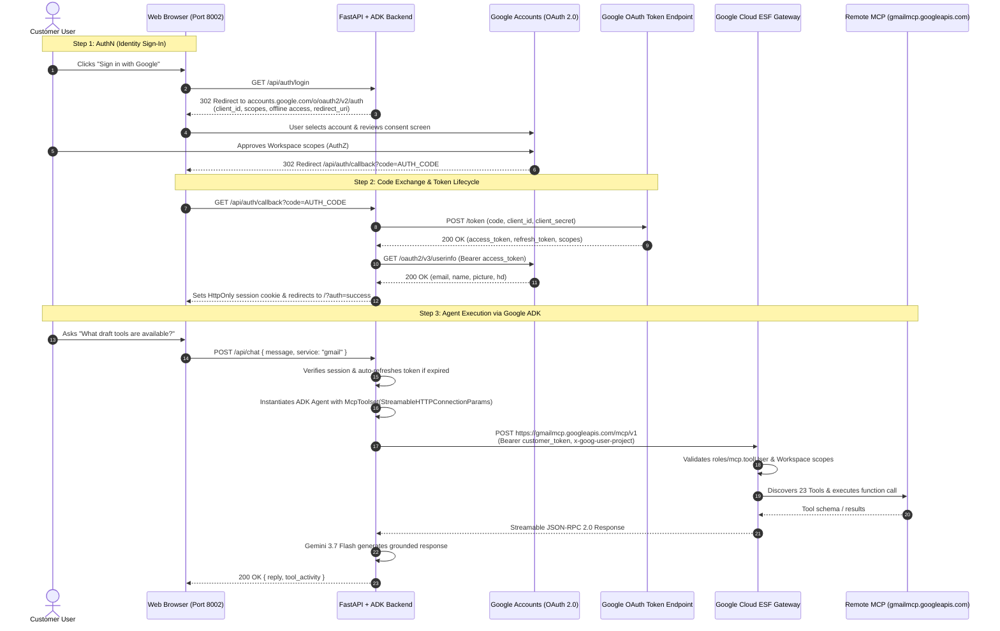

# Google Workspace Remote MCP with Google ADK: Multi-Tenant Customer AuthN & AuthZ Guide

This repository contains an enterprise-ready showcase demonstrating how **Google ADK (Agent Development Kit)** integrates with **Google Workspace Remote Model Context Protocol (MCP)** servers (Gmail, Drive, Calendar, Docs, Sheets) with complete, end-to-end **Customer Authentication (AuthN)** and **Authorization (AuthZ)**.

---

## 1. Original Google Documentation vs. Real-World Requirements

### The Official Documentation Contract
Google Workspace documents its remote MCP servers under [Google Workspace Guides: Configure MCP Servers](https://developers.google.com/workspace/guides/configure-mcp-servers#others):
* **Developer Preview**: Part of the Google Workspace Developer Preview Program.
* **Server Name**: `googleworkspace`
* **Transport**: `HTTP`
* **Authentication**: OAuth 2.0 (`Authorization: Bearer <TOKEN>`)
* **Remote Endpoints**:
  * Gmail: `https://gmailmcp.googleapis.com/mcp/v1`
  * Google Drive: `https://drivemcp.googleapis.com/mcp/v1`
  * Google Docs: `https://docsmcp.googleapis.com/mcp/v1`
  * Google Sheets: `https://sheetsmcp.googleapis.com/mcp/v1`
  * Google Slides: `https://slidesmcp.googleapis.com/mcp/v1`
  * Google Calendar: `https://calendarmcp.googleapis.com/mcp/v1`
  * Google Chat: `https://chatmcp.googleapis.com/mcp/v1`
  * People API: `https://people.googleapis.com/mcp/v1`

---

## 2. Discovered Missing Configurations & Undocumented Realities

While the public documentation provides the raw endpoints, deploying a production agent requires solving critical undocumented security and infrastructure gates:

### A. Transport Protocol: Streamable HTTP (Not Server-Sent Events)
* **The Reality**: The documentation specifies `Transport: HTTP`. Under the MCP protocol, this is strictly **Streamable HTTP POST** with JSON-RPC 2.0 payloads (`initialize`, `tools/list`, `tools/call`).
* **The Gotcha**: Attempting an HTTP `GET` (such as standard SSE handshakes) returns `405 Method Not Allowed`.
* **ADK Implementation**: You must configure `StreamableHTTPConnectionParams(url=..., headers=...)` rather than `SseConnectionParams`.

### B. Mandatory Google Cloud IAM Gate (`roles/mcp.toolUser`)
* **The Reality**: Google's Enterprise Service Frontend (ESF) intercepts requests to `*mcp.googleapis.com` before routing to Workspace APIs.
* **The Requirement**: The calling principal (user or service account) must be granted the IAM role `roles/mcp.toolUser` (which contains `mcp.tools.call`) in the target GCP project:
  ```bash
  gcloud projects add-iam-policy-binding YOUR_PROJECT_ID \
    --member="user:user@customer-domain.com" \
    --role="roles/mcp.toolUser" --condition=None
  ```

### C. Quota & Project Attribution Header (`x-goog-user-project`)
* Requests must supply the header `x-goog-user-project: <PROJECT_ID>`. The corresponding MCP APIs (`gmailmcp.googleapis.com`, `drivemcp.googleapis.com`, etc.) must be enabled in that project.

### D. Python MCP Library Version Pinning (`mcp<2.0.0`)
* `mcp 2.x` introduced breaking changes removing `mcp.shared.session`.
* In `google-adk`, `McpToolset` silently catches the `ImportError`. All environments must pin `mcp>=1.2.0,<2.0.0` (e.g., `mcp==1.29.1`).

### E. Dual-Layer Token Architecture (AuthN vs. AuthZ)
* **GCP Infrastructure Authorization**: Requires valid Google Cloud project attribution and IAM check.
* **Workspace Data Authorization**: Requires granular OAuth scopes (e.g., `gmail.modify`, `drive.readonly`). Standard Google Cloud Platform scopes (`cloud-platform`) alone are **rejected** with `403 Forbidden` by the Workspace MCP gateway.

---

## 3. End-to-End Customer AuthN & AuthZ Architecture



---

## 4. Customer Onboarding & Setup Guide

### Step 1: Google Cloud Project Configuration
1. Open [Google Cloud Console](https://console.cloud.google.com/).
2. Select or create your customer GCP Project (e.g. `customer-prod-ai`).
3. Enable the required Workspace Remote MCP APIs:
   ```bash
   gcloud services enable \
     gmailmcp.googleapis.com \
     drivemcp.googleapis.com \
     docsmcp.googleapis.com \
     calendarmcp.googleapis.com \
     sheetsmcp.googleapis.com \
     slidesmcp.googleapis.com \
     chatmcp.googleapis.com \
     aiplatform.googleapis.com \
     --project=YOUR_PROJECT_ID
   ```

### Step 2: Configure OAuth Consent Screen
1. Navigate to **APIs & Services > OAuth consent screen**.
2. Select **Internal** (for your Google Workspace organization) or **External** (if testing with specific accounts).
3. Fill in App Name (e.g. `Enterprise Workspace Agent`) and support email.
4. Add the required Workspace Scopes:
   * `https://www.googleapis.com/auth/gmail.modify`
   * `https://www.googleapis.com/auth/drive.readonly`
   * `https://www.googleapis.com/auth/calendar`
   * `https://www.googleapis.com/auth/documents.readonly`
   * `https://www.googleapis.com/auth/spreadsheets.readonly`
   * `openid`, `userinfo.email`, `userinfo.profile`

### Step 3: Create OAuth 2.0 Web Client ID
1. Navigate to **APIs & Services > Credentials**.
2. Click **Create Credentials > OAuth client ID**.
3. Select Application type: **Web application**.
4. Configure:
   * **Name**: `ADK Workspace Client`
   * **Authorized JavaScript origins**: `http://localhost:8002`
   * **Authorized redirect URIs**: `http://localhost:8002/api/auth/callback`
5. Download `client_secret_*.json` or copy the `Client ID` and `Client Secret`.

### Step 4: Assign IAM Role to End Users
Every user who interacts with the MCP endpoints must have the `roles/mcp.toolUser` role:
```bash
gcloud projects add-iam-policy-binding YOUR_PROJECT_ID \
  --member="user:alice@customer.com" \
  --role="roles/mcp.toolUser" --condition=None
```

### Step 5: Google Workspace Admin Console (If applicable)
* In the Google Admin console (`admin.google.com`), go to **Security > Access and data control > API controls**.
* Ensure your newly created Client ID is trusted or permitted to access Workspace data for users in your organization.

---

## 5. Running the Application

### 1. Install Dependencies
```bash
python3 -m venv .venv
source .venv/bin/activate
pip install -r requirements.txt
```

### 2. Configure Environment (Optional)
You can configure environment variables in `.env` or set them directly inside the UI:
```bash
cp .env.example .env
```
*`.env` example:*
```env
GOOGLE_CLOUD_PROJECT=your-gcp-project-id
GOOGLE_CLOUD_LOCATION=global
GOOGLE_OAUTH_CLIENT_ID=xxxx.apps.googleusercontent.com
GOOGLE_OAUTH_CLIENT_SECRET=GOCSPX-xxxx
```

### 3. Launch the Server
```bash
./run.sh
```
Open **[http://localhost:8002](http://localhost:8002)**.

### 4. Authenticate & Chat
1. Click **Credentials** in the top bar to verify or paste your Client ID/Secret (or upload `client_secret.json`).
2. Click **Sign in with Google** to complete the official Google Consent flow.
3. Your user avatar and email will appear in the navbar.
4. Ask any question or command to interact with Gmail, Drive, Calendar, or Docs!
