# Google Workspace Remote MCP with Google ADK (Agent Development Kit)

This project provides a full-stack, minimalist chat showcase demonstrating how to connect **Google ADK** to **Google Workspace Remote Model Context Protocol (MCP)** servers (Gmail, Google Drive, Docs, Sheets, Calendar).

---

## 1. Original Google Documentation vs. Reality

### Official Workspace Documentation Contract
Google Workspace documents its remote MCP servers under [Google Workspace Guides: Configure MCP Servers](https://developers.google.com/workspace/guides/configure-mcp-servers#others):
* **Server name**: `googleworkspace`
* **Transport**: `HTTP`
* **Authentication**: OAuth 2.0 (`Authorization: Bearer <TOKEN>`)
* **Remote Endpoints**:
  * Gmail: `https://gmailmcp.googleapis.com/mcp/v1`
  * Google Drive: `https://drivemcp.googleapis.com/mcp/v1`
  * Google Docs: `https://docsmcp.googleapis.com/mcp/v1`
  * Google Sheets: `https://sheetsmcp.googleapis.com/mcp/v1`
  * Google Slides: `https://slidesmcp.googleapis.com/mcp/v1`
  * Google Calendar: `https://calendarmcp.googleapis.com/mcp/v1`
  * Google Chat: `https://chatmcp.googleapis.com/mcp/v1`
  * People API: `https://people.googleapis.com/mcp/v1`

---

## 2. Undocumented Gaps & Discovered Configurations

While the public documentation describes the remote endpoints, it omits several critical requirements when connecting from an enterprise agent framework like Google ADK:

### A. Transport Protocol: Streamable HTTP (Not SSE)
* **The Reality**: The documentation states `Transport: HTTP`. In the MCP specification, this is specifically **Streamable HTTP POST (JSON-RPC 2.0 over HTTPS)**, **not** Server-Sent Events (`/sse`).
* **ADK Configuration**: You must use `StreamableHTTPConnectionParams`, not `SseConnectionParams`. Sending an HTTP `GET` returns `405 Method Not Allowed`.

### B. Mandatory Google Cloud IAM Role (`roles/mcp.toolUser`)
* **The Reality**: The Google Cloud ESF (Enterprise Service Frontend) gateway enforces IAM permissions before tool requests reach the Workspace APIs.
* **The Fix**: The caller identity (user or service account) must have the `MCP Tool User` role:
  ```bash
  gcloud projects add-iam-policy-binding PROJECT_ID \
    --member="user:USER_EMAIL" \
    --role="roles/mcp.toolUser" --condition=None
  ```
  *(Grants the `mcp.tools.call` permission).*

### C. Quota & Project Header (`x-goog-user-project`)
* Every request must pass the `x-goog-user-project: <GCP_PROJECT_ID>` header alongside the bearer token, and the corresponding `*mcp.googleapis.com` API must be enabled in the project.

### D. Python MCP Package Compatibility (`mcp<2.0.0`)
* `mcp 2.x` introduced breaking changes that remove `mcp.shared.session`.
* In `google-adk`, `mcp_tool/__init__.py` catches `ImportError` silently, leaving `google.adk.tools.mcp_tool` empty.
* **The Fix**: Pin dependencies to `mcp>=1.2.0,<2.0.0` (e.g. `mcp==1.29.1`).

### E. Dual-Layer Security & Token Lifecycle
* **Layer 1 (GCP Infrastructure)**: Requires valid GCP credentials and project attribution.
* **Layer 2 (Workspace Data)**: Requires an OAuth 2.0 token containing specific Workspace scopes (e.g. `https://www.googleapis.com/auth/gmail.modify`). Standard `cloud-platform` tokens alone are blocked by the gateway.
* **Token Expiry**: OAuth tokens expire after 60 minutes. Production ADK agents must implement dynamic refresh via ADK's `header_provider` or Service Account Domain-Wide Delegation.

---

## 3. Architecture Overview

```mermaid
flowchart LR
    Browser["Minimalist Web UI\n(Port 8002)"] -- REST / Chat --> FastAPI["FastAPI Backend\n(main.py)"]
    FastAPI -- ADK InMemoryRunner --> ADK["Google ADK Agent\n(Gemini 3.7 Flash)"]
    ADK -- McpToolset\n(Streamable HTTP) --> ESF["Google Gateway (ESF)\nx-goog-user-project"]
    ESF -- IAM Check --> IAM["roles/mcp.toolUser"]
    IAM -- Scope Check --> Workspace["gmailmcp.googleapis.com/mcp/v1\n(23 Discovered Tools)"]
```



---

## 4. Quick Start

### 1. Install Dependencies
```bash
python3 -m venv .venv
source .venv/bin/activate
pip install -r requirements.txt
```

### 2. Configure Environment
```bash
cp .env.example .env
gcloud auth application-default login
```

### 3. Run the Showcase
```bash
./run.sh
```
Open [http://localhost:8002](http://localhost:8002) in your browser.
