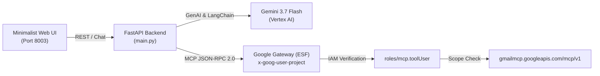

# Google Workspace Remote MCP with LangChain

This project provides a full-stack, minimalist chat showcase demonstrating how to connect **LangChain** agents to **Google Workspace Remote Model Context Protocol (MCP)** servers (Gmail, Google Drive, Docs, Sheets, Calendar).

---

## 1. Original Google Documentation vs. Reality

### Official Workspace Documentation Contract
Google Workspace documents its remote MCP servers under [Google Workspace Guides: Configure MCP Servers](https://developers.google.com/workspace/guides/configure-mcp-servers#others):
* **Server name**: `googleworkspace`
* **Transport**: `HTTP`
* **Authentication**: OAuth 2.0 (`Authorization: Bearer <TOKEN>`)
* **Remote Endpoints**:
  * Gmail: `https://gmailmcp.googleapis.com/mcp/v1`
  * Google Drive: `https://drivemcp.googleapis.com/mcp/v1`
  * Google Docs: `https://docsmcp.googleapis.com/mcp/v1`
  * Google Sheets: `https://sheetsmcp.googleapis.com/mcp/v1`
  * Google Slides: `https://slidesmcp.googleapis.com/mcp/v1`
  * Google Calendar: `https://calendarmcp.googleapis.com/mcp/v1`
  * Google Chat: `https://chatmcp.googleapis.com/mcp/v1`
  * People API: `https://people.googleapis.com/mcp/v1`

---

## 2. Undocumented Gaps & Discovered Configurations

When integrating remote Workspace MCP servers with LangChain:

### A. Transport Protocol: Streamable HTTP POST (JSON-RPC 2.0)
* The official docs state `Transport: HTTP`.
* Requests must be sent as HTTP `POST` carrying JSON-RPC 2.0 payloads (`initialize`, `tools/list`, `tools/call`). Sending an HTTP `GET` returns `405 Method Not Allowed`.

### B. Mandatory Google Cloud IAM Role (`roles/mcp.toolUser`)
* Google's Enterprise Service Frontend (ESF) enforces IAM controls on all `*mcp.googleapis.com` endpoints.
* The principal executing the agent must be assigned `roles/mcp.toolUser` (which includes `mcp.tools.call`):
  ```bash
  gcloud projects add-iam-policy-binding PROJECT_ID \
    --member="user:USER_EMAIL" \
    --role="roles/mcp.toolUser" --condition=None
  ```

### C. Quota Header (`x-goog-user-project`)
* Every request must pass `x-goog-user-project: <PROJECT_ID>` along with the Bearer token for quota and API verification.

### D. Dual-Layer Authorization
* An access token with only `https://www.googleapis.com/auth/cloud-platform` is rejected by Workspace endpoints.
* You must obtain an OAuth 2.0 token that includes specific Workspace scopes (e.g. `https://www.googleapis.com/auth/gmail.modify` or `drive.readonly`).

---

## 3. Comparison: Google ADK vs. LangChain for MCP

| Dimension | Google ADK (Agent Development Kit) | LangChain |
| :--- | :--- | :--- |
| **Native MCP Support** | Built-in `McpToolset` class directly in `google-adk` | Requires `langchain-mcp-adapters` or custom wrapper |
| **Transport Types** | Native `StreamableHTTPConnectionParams` & `StdioConnectionParams` | Relies on external MCP client sessions or async context managers |
| **Session Management** | Built-in `InMemoryRunner` / `SessionContext` with state persistence | Custom agent loop, memory dictionaries, or LangGraph state |
| **Token Refresh Lifecycle**| Dynamic `header_provider` callback per tool execution | Custom tool wrappers or manual token header injection |
| **Google Cloud Alignment**| 1st-party Google Cloud SDK, native Vertex AI & Agent Engine support | Multi-cloud abstraction framework |

---

## 4. Architecture Overview



---

## 5. Quick Start

### 1. Install Dependencies
```bash
python3 -m venv .venv
source .venv/bin/activate
pip install -r requirements.txt
```

### 2. Configure Environment
```bash
cp .env.example .env
gcloud auth application-default login
```

### 3. Run the Showcase
```bash
./run.sh
```
Open [http://localhost:8003](http://localhost:8003) in your browser.
