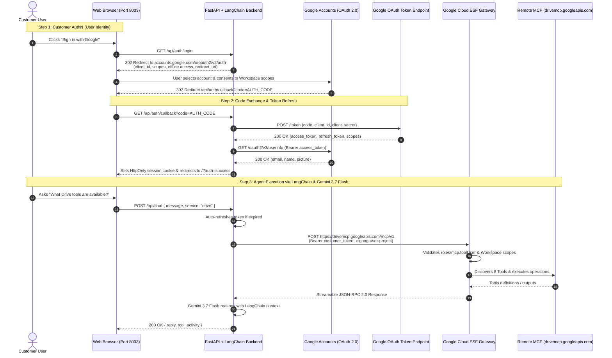

# Google Workspace Remote MCP with LangChain: Multi-Tenant Customer AuthN & AuthZ Guide

This repository contains an enterprise-ready showcase demonstrating how **LangChain** integrates with **Google Workspace Remote Model Context Protocol (MCP)** servers (Gmail, Drive, Calendar, Docs, Sheets) with complete, end-to-end **Customer Authentication (AuthN)** and **Authorization (AuthZ)**.

---

## 1. Original Google Documentation vs. Real-World Requirements

### The Official Documentation Contract
Google Workspace documents its remote MCP servers under [Google Workspace Guides: Configure MCP Servers](https://developers.google.com/workspace/guides/configure-mcp-servers#others):
* **Developer Preview**: Part of the Google Workspace Developer Preview Program.
* **Server Name**: `googleworkspace`
* **Transport**: `HTTP`
* **Authentication**: OAuth 2.0 (`Authorization: Bearer <TOKEN>`)
* **Remote Endpoints**:
  * Gmail: `https://gmailmcp.googleapis.com/mcp/v1`
  * Google Drive: `https://drivemcp.googleapis.com/mcp/v1`
  * Google Docs: `https://docsmcp.googleapis.com/mcp/v1`
  * Google Sheets: `https://sheetsmcp.googleapis.com/mcp/v1`
  * Google Slides: `https://slidesmcp.googleapis.com/mcp/v1`
  * Google Calendar: `https://calendarmcp.googleapis.com/mcp/v1`
  * Google Chat: `https://chatmcp.googleapis.com/mcp/v1`
  * People API: `https://people.googleapis.com/mcp/v1`

---

## 2. Discovered Missing Configurations & Undocumented Realities

1. **Transport Protocol**: The documentation states `Transport: HTTP`. Under the MCP protocol, this is strictly **Streamable HTTP POST** using JSON-RPC 2.0. HTTP `GET` requests fail with `405 Method Not Allowed`.
2. **Mandatory GCP IAM Role (`roles/mcp.toolUser`)**: The Google Cloud ESF gateway requires callers to hold the `roles/mcp.toolUser` role (`mcp.tools.call` permission) in the target GCP project:
   ```bash
   gcloud projects add-iam-policy-binding YOUR_PROJECT_ID \
     --member="user:user@customer-domain.com" \
     --role="roles/mcp.toolUser" --condition=None
   ```
3. **Quota Header (`x-goog-user-project`)**: Every request must carry `x-goog-user-project: <PROJECT_ID>` alongside the Bearer token.
4. **Dual-Layer Token Architecture**: The token must be an OAuth 2.0 token bearing Workspace user scopes (e.g., `gmail.modify`, `drive.readonly`). Standard `cloud-platform` tokens without user scopes return `403 Forbidden`.

---

## 3. Comparison: Google ADK vs. LangChain for MCP

| Architectural Dimension | Google ADK (Agent Development Kit) | LangChain |
| :--- | :--- | :--- |
| **Native MCP Support** | 1st-party `McpToolset` class built into `google-adk` | Custom HTTP JSON-RPC 2.0 integration or community adapter |
| **Transport Implementation** | Built-in `StreamableHTTPConnectionParams` | Requires custom async HTTP client session management |
| **Session Lifecycle** | Native `InMemoryRunner` with structured session state | Custom session state mapping or LangGraph checkpointing |
| **Token Refresh Lifecycle** | `header_provider` callback per tool execution | Middleware session token refresh |
| **Ecosystem Fit** | Purpose-built for Google Cloud, Vertex AI, & Gemini | General multi-model abstraction framework |

---

## 4. End-to-End Customer AuthN & AuthZ Architecture



---

## 5. Customer Onboarding & Setup Guide

### Step 1: Google Cloud Project Configuration
Enable the required Workspace Remote MCP APIs:
```bash
gcloud services enable \
  gmailmcp.googleapis.com \
  drivemcp.googleapis.com \
  docsmcp.googleapis.com \
  calendarmcp.googleapis.com \
  sheetsmcp.googleapis.com \
  slidesmcp.googleapis.com \
  chatmcp.googleapis.com \
  aiplatform.googleapis.com \
  --project=YOUR_PROJECT_ID
```

### Step 2: Configure OAuth Consent Screen
1. Navigate to **APIs & Services > OAuth consent screen**.
2. Select **Internal** or **External**.
3. Add required scopes: `openid`, `userinfo.email`, `userinfo.profile`, `gmail.modify`, `drive.readonly`, `calendar`, `documents.readonly`, `spreadsheets.readonly`.
4. **Add Test Users (Mandatory if External / Testing status)**:
   * Under **Test users**, click **Add users**.
   * Add every account / email address that will test the app (e.g. `user@yourdomain.com`).

### Step 3: Create OAuth 2.0 Web Client ID in GCP Console
1. Navigate to **APIs & Services > Credentials > Create Credentials > OAuth client ID**.
2. Select Application type: **Web application**.
3. Set **Authorized JavaScript origins**:
   * `http://localhost:8003`
   * `http://localhost:8002` (if also running ADK)
4. Set **Authorized redirect URIs**:
   * `http://localhost:8003/api/auth/callback` *(Standard API callback)*
   * `http://localhost:8003` *(Root URL fallback)*
   * `http://localhost:8002/api/auth/callback` *(For ADK showcase)*
   * `http://localhost:8002` *(For ADK showcase root fallback)*
   > **Note:** The frontend single-page router automatically detects `?code=` query parameters on root redirects and forwards them to the backend callback. Having both URIs authorized in GCP guarantees seamless authentication.
5. Click **Create** and copy the generated `Client ID` and `Client Secret` (or download `client_secret_*.json`).

### Step 4: Grant IAM Role to Users
```bash
gcloud projects add-iam-policy-binding YOUR_PROJECT_ID \
  --member="user:alice@customer.com" \
  --role="roles/mcp.toolUser" --condition=None
```

---

## 6. Running the Application

### 1. Install Dependencies
```bash
python3 -m venv .venv
source .venv/bin/activate
pip install -r requirements.txt
```

### 2. Configure Environment (Optional)
```bash
cp .env.example .env
```
*`.env` example:*
```env
GOOGLE_CLOUD_PROJECT=your-gcp-project-id
GOOGLE_CLOUD_LOCATION=global
GOOGLE_OAUTH_CLIENT_ID=xxxx.apps.googleusercontent.com
GOOGLE_OAUTH_CLIENT_SECRET=GOCSPX-xxxx
```

### 3. Launch the Server
```bash
./run.sh
```
Open **[http://localhost:8003](http://localhost:8003)**.

### 4. Authenticate & Chat
1. Click **Credentials** to enter your Customer GCP Project ID and OAuth Web Client ID (or upload `client_secret.json`).
2. Click **Sign in with Google** to complete the consent flow.
3. Chat with the agent and command Workspace tools!
