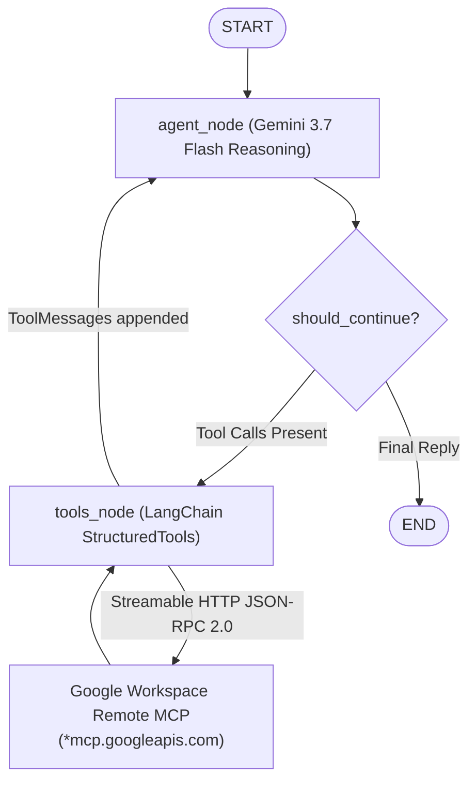
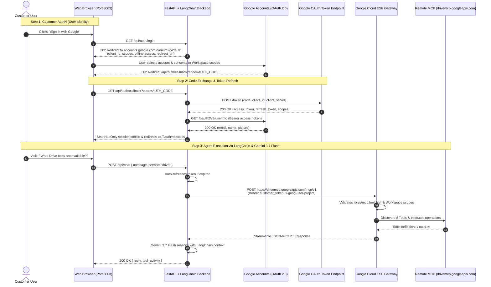
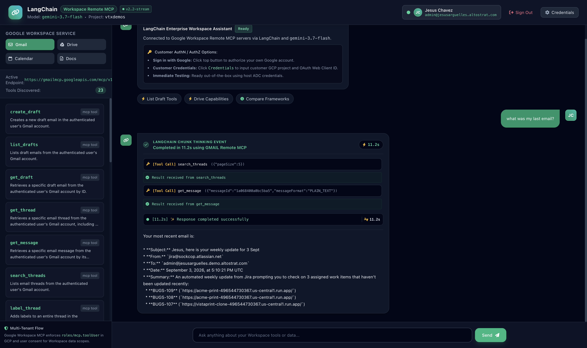

# Google Workspace Remote MCP with LangChain: Multi-Tenant Customer AuthN & AuthZ Guide

This repository contains an enterprise-ready showcase demonstrating how **LangChain** integrates with **Google Workspace Remote Model Context Protocol (MCP)** servers (Gmail, Drive, Calendar, Docs, Sheets) with complete, end-to-end **Customer Authentication (AuthN)** and **Authorization (AuthZ)**.

---

## 1. Original Google Documentation vs. Real-World Requirements

### The Official Documentation Contract
Google Workspace documents its remote MCP servers under [Google Workspace Guides: Configure MCP Servers](https://developers.google.com/workspace/guides/configure-mcp-servers#others):
* **Developer Preview**: Part of the Google Workspace Developer Preview Program.
* **Server Name**: `googleworkspace`
* **Transport**: `HTTP`
* **Authentication**: OAuth 2.0 (`Authorization: Bearer <TOKEN>`)
* **Remote Endpoints**:
  * Gmail: `https://gmailmcp.googleapis.com/mcp/v1`
  * Google Drive: `https://drivemcp.googleapis.com/mcp/v1`
  * Google Docs: `https://docsmcp.googleapis.com/mcp/v1`
  * Google Sheets: `https://sheetsmcp.googleapis.com/mcp/v1`
  * Google Slides: `https://slidesmcp.googleapis.com/mcp/v1`
  * Google Calendar: `https://calendarmcp.googleapis.com/mcp/v1`
  * Google Chat: `https://chatmcp.googleapis.com/mcp/v1`
  * People API: `https://people.googleapis.com/mcp/v1`

---

## 2. Discovered Missing Configurations & Undocumented Realities

1. **Transport Protocol**: The documentation states `Transport: HTTP`. Under the MCP protocol, this is strictly **Streamable HTTP POST** using JSON-RPC 2.0. HTTP `GET` requests fail with `405 Method Not Allowed`.
2. **Mandatory GCP IAM Role (`roles/mcp.toolUser`)**: The Google Cloud ESF gateway requires callers to hold the `roles/mcp.toolUser` role (`mcp.tools.call` permission) in the target GCP project:
   ```bash
   gcloud projects add-iam-policy-binding YOUR_PROJECT_ID \
     --member="user:user@customer-domain.com" \
     --role="roles/mcp.toolUser" --condition=None
   ```
3. **Quota Header (`x-goog-user-project`)**: Every request must carry `x-goog-user-project: <PROJECT_ID>` alongside the Bearer token.
4. **Dual-Layer Token Architecture**: The token must be an OAuth 2.0 token bearing Workspace user scopes (e.g., `gmail.modify`, `drive.readonly`). Standard Google Cloud Platform Application Default Credentials (ADC) tokens carry only `cloud-platform` scope and are **rejected** with `403 Forbidden` by the Workspace MCP gateway.
5. **Pre-Flight Auth Guard**:
   - The frontend chat UI inspects the user's active session authentication type (`currentAuthType`) via `beforeChatCallback(text, service, forceAdc)`.
   - If the user is unauthenticated or running under server-side ADC without user OAuth, submission is intercepted **before** dispatching a network call.
   - Prompts the user with an actionable in-chat card with an immediate **"Sign in with Google (Recommended)"** button or an explicit **"Proceed with ADC anyway"** override.
6. **RFC 6749 Redirect URI Exact-Match Rule**:
   - Google's OAuth 2.0 authorization server strictly enforces that the `redirect_uri` sent in the token exchange `POST /token` identically matches the `redirect_uri` sent during initial consent.
   - The server dynamically tracks the registered URI (whether `http://localhost:8003` root or `http://localhost:8003/api/auth/callback`) in the session state and includes an SPA root interceptor.

---

## 3. LangGraph & LangChain Architecture: Dynamic MCP Integration

This showcase implements a production-grade **LangGraph ReAct agent workflow** combined with **LangChain `StructuredTool`** adapters:



### Core LangGraph & LangChain Components:
1. **Dynamic `StructuredTool` Factory (`create_workspace_langchain_tool`)**:
   - Each tool discovered from Google's Remote MCP endpoint (`initialize` + `tools/list`) is dynamically converted into a typed LangChain `StructuredTool` instance.
   - Preserves arguments schema, descriptions, and binds async execution (`ainvoke`) to the JSON-RPC Streamable HTTP gateway.
2. **LangGraph State Definition (`WorkspaceAgentState`)**:
   - Manages messages history via `Annotated[Sequence[BaseMessage], operator.add]` with `HumanMessage`, `AIMessage`, and `ToolMessage`.
   - Captures real-time chunk thinking telemetry in `thought_chunks`.
3. **Compiled ReAct `StateGraph` Workflow**:
   - **`agent` node**: Translates LangChain message history to Gemini 3.7 Flash format and generates thoughts + tool call intents.
   - **`should_continue` conditional edge**: Detects whether Gemini requested tool execution or produced the final response.
   - **`tools` node**: Dispatches tool calls across registered LangChain `StructuredTool` instances in parallel, formatting outputs as `ToolMessage` payloads.
4. **Streaming Execution (`astream`)**:
   - Directly streams LangGraph node transitions to the web frontend using Server-Sent Events (SSE).

### Comparison: Google ADK vs. LangChain + LangGraph for MCP

| Architectural Dimension | Google ADK (Agent Development Kit) | LangChain + LangGraph |
| :--- | :--- | :--- |
| **MCP Integration** | 1st-party `McpToolset` class built into `google-adk` | Dynamic `StructuredTool` factory wrapping Remote MCP JSON-RPC |
| **Agent Workflow** | Declarative `Agent(model=..., tools=[...])` | Compiled `StateGraph(WorkspaceAgentState)` with ReAct loop |
| **Transport** | Built-in `StreamableHTTPConnectionParams` | Async HTTP client communicating with `*mcp.googleapis.com` |
| **Session Lifecycle** | Native `InMemoryRunner` with structured session state | LangGraph state streaming with session cookie persistence |
| **Token Refresh Lifecycle** | `header_provider` callback per tool execution | Middleware session token refresh with auto-save |
| **Ecosystem Fit** | Purpose-built for Google Cloud, Vertex AI, & Gemini | General multi-agent graph framework with modular nodes |

---

## 4. End-to-End Customer AuthN & AuthZ Architecture



---

## 5. Customer Onboarding & Setup Guide

### Where to Go Quick Reference Map
Use this table as your master checklist for configuring Google Cloud and Workspace:

| Step | Setup Stage | Exact Location in Google Cloud Console | Direct URL | What to Do |
| :--- | :--- | :--- | :--- | :--- |
| **1** | **Enable MCP APIs** | **APIs & Services > Library** | [console.cloud.google.com/apis/library](https://console.cloud.google.com/apis/library) | Enable `gmailmcp`, `drivemcp`, `docsmcp`, `calendarmcp`, `sheetsmcp`, `slidesmcp`, `chatmcp`, and `aiplatform`. |
| **2** | **OAuth Consent Screen** | **APIs & Services > OAuth consent screen** | [console.cloud.google.com/apis/credentials/consent](https://console.cloud.google.com/apis/credentials/consent) | Choose **Internal** (Workspace org) or **External** (Testing). Add Workspace scopes and add testing emails to **Test users**. |
| **3** | **Create Web Client ID** | **APIs & Services > Credentials** | [console.cloud.google.com/apis/credentials](https://console.cloud.google.com/apis/credentials) | Click **+ Create Credentials > OAuth client ID > Web application**. Configure JavaScript origins and Authorized redirect URIs. |
| **4** | **Grant IAM Permissions** | **IAM & Admin > IAM** | [console.cloud.google.com/iam-admin/iam](https://console.cloud.google.com/iam-admin/iam) | Grant `roles/mcp.toolUser` to every user email testing the application. |
| **5** | **Workspace API Access** *(Optional)* | **Google Admin Console > Security** | [admin.google.com/ac/owl](https://admin.google.com/ac/owl) | Under **API controls**, mark the OAuth Client ID as **Trusted** for your organization. |
| **6** | **Run & Configure App** | **Local Web Browser** | `http://localhost:8003` | Open UI, click **Credentials** to enter Client ID/Secret or add them to `.env`. Click **Sign in with Google**. |

---

### Step-by-Step Instructions

#### Step 1: Google Cloud Project & API Enablement
1. Open [Google Cloud Console](https://console.cloud.google.com/) and select your project.
2. Enable the required Workspace Remote MCP APIs via terminal or the [API Library](https://console.cloud.google.com/apis/library):
   ```bash
   gcloud services enable \
     gmailmcp.googleapis.com \
     drivemcp.googleapis.com \
     docsmcp.googleapis.com \
     calendarmcp.googleapis.com \
     sheetsmcp.googleapis.com \
     slidesmcp.googleapis.com \
     chatmcp.googleapis.com \
     aiplatform.googleapis.com \
     --project=YOUR_PROJECT_ID
   ```

#### Step 2: Configure OAuth Consent Screen & Add Test Users
1. Go to **APIs & Services > [OAuth consent screen](https://console.cloud.google.com/apis/credentials/consent)**.
2. Select User Type:
   * **Internal**: Recommended if deploying within a Google Workspace organization (all org users can sign in immediately).
   * **External**: If using standard `@gmail.com` accounts or testing before verification.
3. Fill in mandatory fields:
   * **App name**: `Workspace LangChain Showcase`
   * **User support email**: Your email address
   * **Developer contact email**: Your email address
4. Click **Save and Continue** to advance to **Scopes**. Click **Add or Remove Scopes** and select:
   * `openid`
   * `.../auth/userinfo.email`
   * `.../auth/userinfo.profile`
   * `.../auth/gmail.modify`
   * `.../auth/drive.readonly`
   * `.../auth/calendar`
   * `.../auth/documents.readonly`
   * `.../auth/spreadsheets.readonly`
5. Click **Save and Continue** to reach **Test users** *(CRITICAL if External/Testing)*:
   * Click **+ Add users**.
   * Enter the exact email address of every account that will be signing into the demo (e.g. `your.email@gmail.com`).
   * *If you skip this step, Google blocks login with `Error 403: access_denied`.*

#### Step 3: Create OAuth 2.0 Web Client ID
1. Go to **APIs & Services > [Credentials](https://console.cloud.google.com/apis/credentials)**.
2. Click **+ Create Credentials** at the top and select **OAuth client ID**.
3. Set Application type: **Web application**.
4. Set Name: `Workspace LangChain Web Client`.
5. Under **Authorized JavaScript origins**, click **+ Add URI** and enter:
   * `http://localhost:8003`
   * `http://localhost:8002` *(if also testing ADK)*
6. Under **Authorized redirect URIs**, click **+ Add URI** and add BOTH:
   * `http://localhost:8003/api/auth/callback` *(Standard API callback)*
   * `http://localhost:8003` *(Root URL fallback)*
   * `http://localhost:8002/api/auth/callback` *(For ADK showcase)*
   * `http://localhost:8002` *(For ADK showcase root fallback)*
   > **Note on Resilient Routing:** The application includes a built-in Single-Page Application (SPA) redirect router. If Google redirects to the root page (`http://localhost:8003/?code=...`), the frontend immediately intercepts the code and completes the token exchange. Authorizing both URIs ensures seamless authentication in all browser setups.
7. Click **Create**.
8. A modal appears displaying your **Client ID** (`*.apps.googleusercontent.com`) and **Client secret** (`GOCSPX-*`). You can either copy them directly or click **Download JSON** (`client_secret_*.json`).

#### Step 4: Grant IAM Role to End Users
The Google Cloud Enterprise Service Frontend (ESF) gateway enforces an IAM check on every Workspace MCP request. Every user account must hold the `roles/mcp.toolUser` role:
```bash
gcloud projects add-iam-policy-binding YOUR_PROJECT_ID \
  --member="user:your.email@gmail.com" \
  --role="roles/mcp.toolUser" --condition=None
```
*(You can also add this in [IAM & Admin > IAM](https://console.cloud.google.com/iam-admin/iam) by clicking **Grant Access**, entering the user email, and selecting the role **MCP Tool User**).*

#### Step 5: Configure Credentials in the Application
Choose whichever method you prefer:

* **Option A: In-App Credentials Modal (Easiest)**:
  1. Open [http://localhost:8003](http://localhost:8003).
  2. Click **Credentials** in the top navigation bar.
  3. Paste your **Client ID** and **Client Secret** (or click **Choose File** to upload the downloaded `client_secret_*.json`).
  4. Click **Save Configuration**.

* **Option B: Local `.env` File**:
  Create a `.env` file in the project folder (strictly gitignored by the Zero-Leak Protocol):
  ```bash
  cp .env.example .env
  ```
  Edit `.env`:
  ```env
  GOOGLE_CLOUD_PROJECT=your-gcp-project-id
  GOOGLE_CLOUD_LOCATION=global
  GOOGLE_OAUTH_CLIENT_ID=your-client-id.apps.googleusercontent.com
  GOOGLE_OAUTH_CLIENT_SECRET=GOCSPX-your-secret
  GOOGLE_OAUTH_REDIRECT_URI=http://localhost:8003/api/auth/callback
  ```

---

## 6. Live Verification & End-to-End Execution Proof

The following screenshot demonstrates the fully operational showcase in a live browser session with an authenticated Google Workspace customer account:



### What is Verified in this Execution Trace:
1. **Authenticated Customer Session**:
   - The user `Jesus Chavez` (`admin@jesusarguelles.altostrat.com`) is authenticated via Google OAuth 2.0 with granted Workspace scopes.
   - Profile avatar, email, and GCP project attribution (`vtxdemos`) are actively bound to the MCP session.
2. **Dynamic Tool Discovery**:
   - The agent connected to `https://gmailmcp.googleapis.com/mcp/v1` via Streamable HTTP POST and discovered 23 native Gmail tools (`search_threads`, `get_message`, `create_draft`, etc.).
3. **Autonomous Multi-Step Tool Invocation**:
   - **User Query**: `"what was my last email?"`
   - **Autonomous Planning**: `gemini-3.7-flash` inspected the available tool registry and selected `search_threads({"pageSize": 5})`.
   - **Data Fetch**: Upon inspecting the thread list, the agent invoked `get_message({"messageId": "1a068400a0bc5ba5", "messageFormat": "PLAIN_TEXT"})` to extract full message headers and body.
   - **Information Synthesis**: The agent synthesized and presented real-world email data (an automated weekly digest from Jira with assigned bug tickets and links).
4. **Interactive UX & Chunk Thinking**:
   - Displays real-time chunk thinking telemetry (`Completed in 11.2s using GMAIL Remote MCP`), live tool call parameters, and parsed output receipts.

---

## 7. Running & Testing the Application

### 1. Install Dependencies
```bash
python3 -m venv .venv
source .venv/bin/activate
pip install -r requirements.txt
```

### 2. Start the Server
```bash
./run.sh
```
Or run directly:
```bash
python3 -m uvicorn backend.main:app --host 0.0.0.0 --port 8003
```

### 3. Authenticate & Command Workspace Tools
1. Open **[http://localhost:8003](http://localhost:8003)** in your browser.
2. Click **Sign in with Google**.
3. Select your Google account and review the consent screen showing the requested Workspace permissions.
4. After approval, you are returned to the application logged in with your profile avatar, name, and email.
5. In the left panel, switch between **Gmail**, **Google Drive**, **Google Calendar**, and **Google Docs** to see live discovered MCP tools.
6. Type a command in the chat box, e.g.:
   * *"What tools are available in Google Drive?"*
   * *"Search for documents or spreadsheets created this month."*
   * *"Show me the tools that can send emails or inspect message threads."*

---

## 8. Troubleshooting Guide

| Issue / Error | Where It Appears | Root Cause | Exact Resolution |
| :--- | :--- | :--- | :--- |
| **`Error 400: redirect_uri_mismatch`** | Google OAuth Consent Screen | The redirect URI sent in the login request is not listed in your GCP OAuth Client. | Go to [GCP Credentials](https://console.cloud.google.com/apis/credentials), edit your Web Client ID, and add `http://localhost:8003/api/auth/callback` AND `http://localhost:8003` under **Authorized redirect URIs**. |
| **`Error 401: invalid_client`** | Google OAuth Consent Screen | Client ID is missing, misspelled, or still has a placeholder value. | Check that your Client ID in `.env` or the Credentials modal ends with `.apps.googleusercontent.com` and matches your GCP Console exactly. |
| **`Error 403: access_denied`** ("App has not completed the Google verification process") | Google OAuth Consent Screen | OAuth consent screen is in "Testing" mode and the signing-in user is not in the Test Users list. | Go to [OAuth consent screen > Test users](https://console.cloud.google.com/apis/credentials/consent), click **+ Add users**, and enter your account email. |
| **`403 Forbidden: Caller does not have permission`** | Agent Chat / Tool Execution | The user's Google account lacks the GCP IAM role `roles/mcp.toolUser`. | Run: `gcloud projects add-iam-policy-binding PROJECT_ID --member="user:YOUR_EMAIL" --role="roles/mcp.toolUser" --condition=None`. |
| **`405 Method Not Allowed`** | MCP Gateway Handshake | Attempting to connect with HTTP GET or Server-Sent Events (SSE). | Remote Google Workspace MCP servers require Streamable HTTP POST with JSON-RPC 2.0. |
