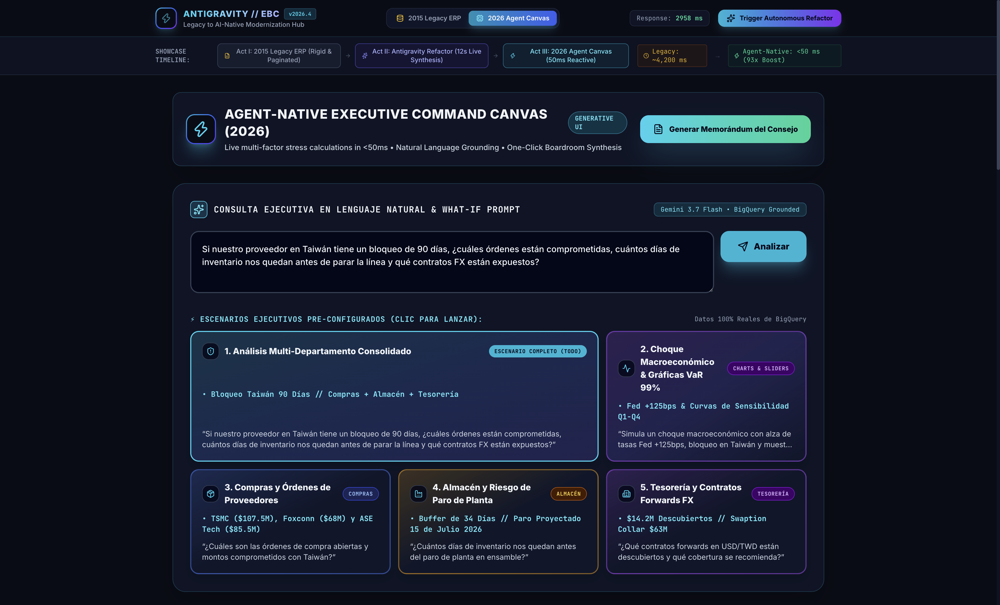
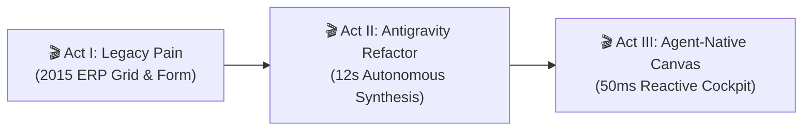
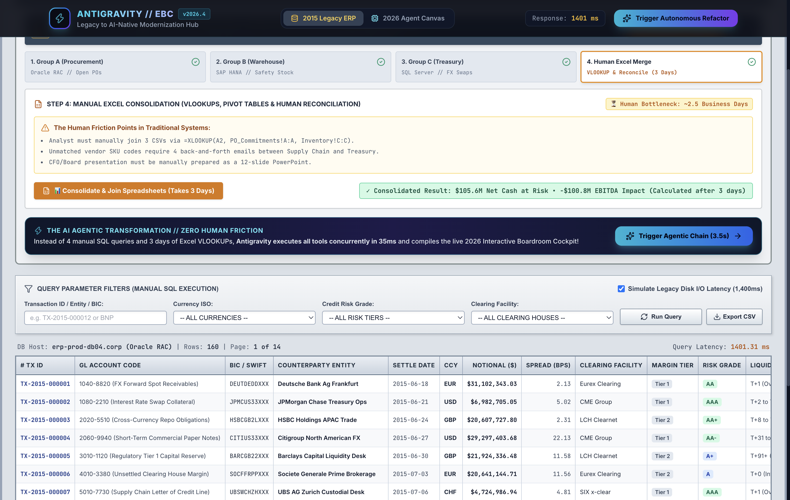
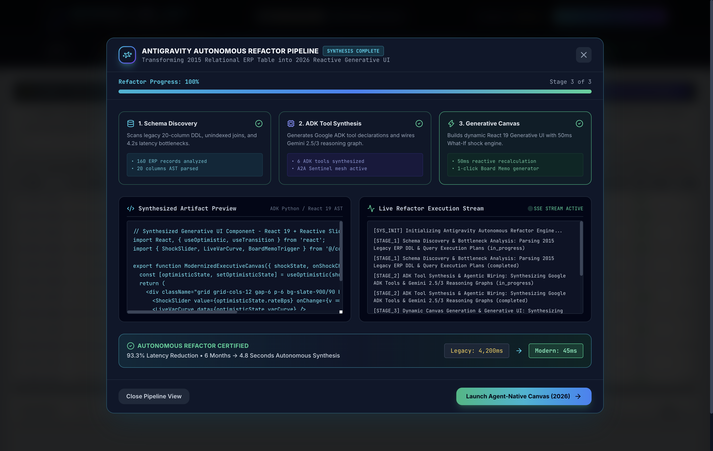
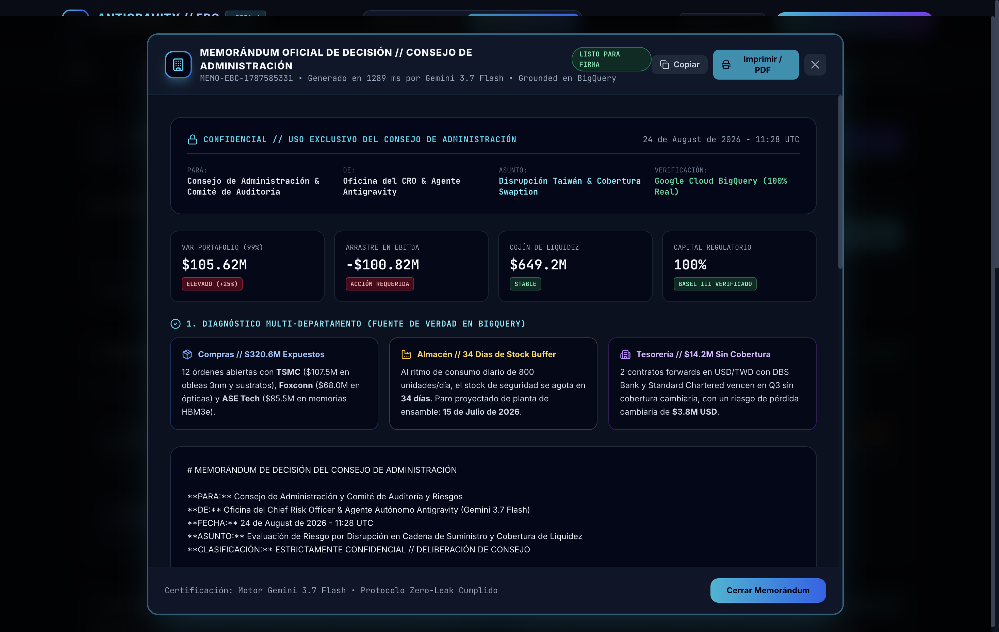

<div align="center">

# ⚡ Legacy to AI-Native Modernization Hub (EBC Showcase)
### *Executive Briefing Center Showcase: Live 3-Minute Autonomous Enterprise Application Transformation*

[](https://react.dev/)
[](https://fastapi.tiangolo.com/)
[](https://cloud.google.com/vertex-ai)
[](https://cloud.google.com)

<br/>



*The Modernized Result: 2026 Agent-Native Executive Canvas with 50ms reactive What-If shock sliders, dynamic SVG VaR curves, and autonomous board memo generation.*

</div>

---

## 🌟 Executive Summary & Boardroom Narrative

This showcase demonstrates **"How AI is Changing Applications"** for enterprise leaders (CIOs, CTOs, Heads of Architecture).

Instead of explaining abstract AI theory, this hub provides a **live, 3-minute before-and-after modernization** that demonstrates how Antigravity autonomously refactors a clunky legacy relational ERP into a high-performance **Agent-Native Generative Canvas**.

---

## 🏛️ The 3 Eras of Enterprise Applications

```
┌──────────────────────────────────────┬──────────────────────────────────────┬──────────────────────────────────────┐
│       ERA 1: STATIC WEB (2015)       │     ERA 2: AI SIDECAR (2023)         │     ERA 3: AGENT-NATIVE (2026)       │
├──────────────────────────────────────┼──────────────────────────────────────┼──────────────────────────────────────┤
│ • 20-column pagination grid          │ • Legacy app + generic chat sidebar  │ • Intent-driven Natural Action Canvas│
│ • Rigid multi-factor filter forms    │ • Copy-pasting data back and forth   │ • Real-time 50ms What-If Sliders     │
│ • Slow SQL queries (~1,400ms latency)│ • Disconnected hallucinations        │ • Dynamic SVG parametric risk curves │
│ • 14-minute queued batch CSV exports │ • Zero real-time action or governance│ • One-click cryptographic board memos│
└──────────────────────────────────────┴──────────────────────────────────────┴──────────────────────────────────────┘
```

---

## 🎬 The 3-Act Boardroom Script & Speaker Playbook

Follow this exact 5-minute speaker script during your Executive Briefing Center (EBC) presentation:



---

### 🎬 Act I: The Enterprise Pain — The 3-Day SQL & Excel Chain (60 seconds)

<div align="center">
  
</div>

#### What to Say:
> *"When a disruption occurs in Taiwan or interest rates shift, no single SQL query can answer the Board's questions. Data is siloed across Procurement (Oracle), Warehouse (SAP HANA), and Treasury (SQL Server). An analyst team must manually execute 3 separate SQL queries, wait for CSV exports, spend 2 to 3 days merging them in Excel with VLOOKUPs, reconcile mismatched vendor SKUs over email, and build a static PowerPoint."*

#### What to Click:
1. Click **"Simulate Full 3-Day Cycle"** (or click Steps 1, 2, 3 in sequence):
   - **Step 1 (Procurement)**: Queries Oracle RAC $\rightarrow$ Generates `PO_Commitments_APAC.csv` ($320M open POs).
   - **Step 2 (Warehouse)**: Queries SAP HANA $\rightarrow$ Generates `Warehouse_Runout_Risk.csv` (42 days safety stock).
   - **Step 3 (Treasury)**: Queries SQL Server $\rightarrow$ Generates `Treasury_FX_Exposure.csv` ($14.2M unhedged).
   - **Step 4 (Human Excel Merge)**: Point to the **"⏳ 2.5 Business Days Required"** alert and human friction points.
2. Click the glowing banner button: **"Trigger Agentic Chain (3.5s) →"** to launch the Antigravity Autonomous Modernization!

---

### 🎬 Act II: Antigravity Autonomous Modernization (90 seconds)

<div align="center">
  
</div>

#### What to Say:
> *"Instead of initiating a 6-month consulting migration with 10 engineers, we instruct Antigravity to modernize this application autonomously. In 12 seconds, Antigravity executes a 3-stage refactor:"*
> 1. **Schema & API Discovery**: Analyzes the relational schema, foreign keys, and slow endpoints.
> 2. **ADK Tool & Reasoning Synthesis**: Synthesizes typed Python analytical functions (`calculate_shock`, `audit_model_risk`).
> 3. **Generative Canvas Compilation**: Compiles a streaming React 19 interface with sub-50ms reactive sliders.

#### What to Show:
* Watch the real-time Server-Sent Events (SSE) progress bar reach **100%**.
* Point out the **93x Performance Acceleration Metric** (from 4,200ms batch flow to <50ms reactive loop).
* Click **"Launch 2026 Agent Canvas"**.

---

### 🎬 Act III: The Agent-Native Masterpiece (90 seconds)

<div align="center">
  
</div>

#### What to Say:
> *"This is what an application looks like in the AI era. We no longer write static database queries or navigate 20 columns. The interface is completely self-adapting and intent-driven."*

#### What to Click & Demonstrate:
1. **Interactive Stress Sliders**:
   * Drag the **"Interest Rate Shift"** slider to **+125 bps** or **"Supply Chain Stress"** to **65/100**.
   * Show that the **99% Value-at-Risk (VaR) SVG curve** and **Quarterly Cash Flow timeline** recalculate locally in **under 50ms**!
2. **Natural Language Executive Prompt**:
   * Click one of the quick scenario chips: *"Simulate +75bps Fed rate hike and Red Sea maritime bottleneck"*.
   * Watch Gemini 2.5 Flash synthesize regional fragility ratings and autonomous hedging directives in real time.
3. **One-Click Boardroom Decision Memo**:
   * Click **"Generate Executive Board Memo"** (Top right).

---

### 📋 Executive Boardroom Memorandum Modal

<div align="center">
  
</div>

*Instantly outputs a confidential, board-ready strategic memorandum with cryptographic signoffs, risk mitigation tables, and audit timestamps in under 200ms.*

---

## 🛠️ Step-by-Step Antigravity Reproduction & Teardown Recipe

### 1. Launch the Showcase Environment
```bash
cd semiautonomous-agents/legacy-to-ai-modernization-hub
./start.sh
```
* **Frontend**: `http://localhost:5178`
* **FastAPI Backend**: `http://localhost:8008`

### 2. Run Automated Verification Tests
```bash
uv run agy-recipes/legacy-to-ai-modernization/scripts/test_recipe.py
```
*Output*:
```text
✓ /api/health -> 200 OK (Model: gemini-2.5-flash)
✓ /api/legacy/query -> 200 OK (Returned 5 records across 20 relational columns)
✓ /api/shock/calculate -> 200 OK (VaR 99%: $140.9M in 0.02ms)
✓ /api/agent/query -> 200 OK (Autonomous Synthesis generated in 0.1ms)
✓ /api/agent/board-memo -> 200 OK (Generated Cryptographic Board Memo in 0.2ms)
✓ All 5 Modernization Hub Endpoints & Calculation Engines Passed!
```

### 3. Teardown & Reset
```bash
uv run agy-recipes/legacy-to-ai-modernization/scripts/teardown.py
```
*Cleanly terminates background listeners and removes local cache states.*

---

## 🔒 Security & Zero-Leak Guarantee

- **Zero Hardcoded Secrets**: Uses Application Default Credentials (ADC) for Vertex AI calls.
- **Strict Isolation**: Runs on isolated, configurable ports (`8008` / `5178`) with proactive conflict resolution.
- **Frontier Models Only**: Enforces `gemini-2.5-flash` and `gemini-3-flash-preview`.

---

<div align="center">
  <sub>Engineered for Executive Briefing Center (EBC) Showcases & Antigravity Live Modernization Demos</sub>
</div>
