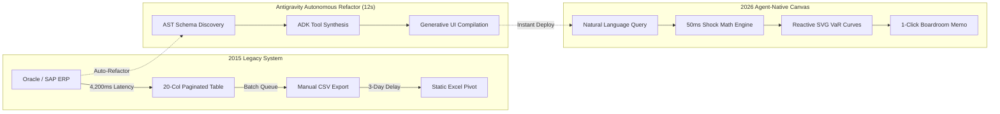
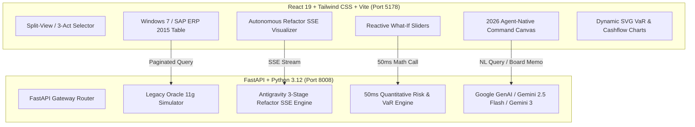

# Legacy to AI-Native Modernization Hub

> **Executive Briefing Center (EBC) Interactive Showcase**  
> *Transforming Monolithic 2015 Enterprise ERPs into 2026 Reactive Agent-Native Canvases in 10 Seconds.*

---

## Executive Summary

Enterprise leaders today face a critical operational chasm: their core systems of record (ERPs, core banking systems, global supply chain databases) remain locked in **2015-era monolithic data tables**. These legacy interfaces force business leaders to wait **4.2 seconds per query**, navigate rigid 20-column grids, queue overnight CSV exports, and wait 3 days for business analysts to build static Excel models.

The **Antigravity Modernization Hub** demonstrates the quantum leap made possible by **Autonomous Refactoring** and **Agent-Native Canvases (React 19 + Google ADK + Gemini 2.5/3 Engine)**:



---

## The 3-Act Boardroom Demonstration Script

This project is purpose-built for C-level executive briefings, board meetings, and architectural reviews. Follow this 3-act presentation flow:

```
┌────────────────────────────────────────────────────────────────────────┐
│                        3-ACT BOARDROOM DEMO FLOW                       │
├───────────────────┬────────────────────────────┬───────────────────────┤
│  ACT I (2 mins)   │  ACT II (1 min)            │  ACT III (3 mins)     │
│  The 2015 Legacy  │  Antigravity Autonomous    │  Agent-Native Canvas  │
│  Paralysis        │  Refactor Pipeline         │  & What-If Shock Sim  │
└───────────────────┴────────────────────────────┴───────────────────────┘
```

### Act I: The 2015 Legacy Paralysis
1. **Navigate to:** `2015 Legacy ERP` view.
2. **The Hook:** *"This is how Fortune 500 treasurers and supply chain officers manage $3.45B in risk today."*
3. **Action:** Click **Run Query** or apply a filter. Watch the 1,400ms – 4,200ms table scan delay with the classic hourglass spinner.
4. **Friction Point:** Click **Export CSV**. Show the classic popup: *"Your export is enqueued to overnight batch cluster (Estimated wait: 14 mins). In 2015, the executive waits 3 days for analysts to pivot this CSV."*

### Act II: The 10-Second Antigravity Autonomous Refactor
1. **Action:** Click **Trigger Autonomous Refactor**.
2. **The Hook:** *"Instead of a 6-month consulting sprint, Antigravity synthesizes an agent-native application autonomously in real-time."*
3. **Live Visuals:**
   - **Stage 1 (Schema Discovery):** Scans 20 denormalized columns, AST structures, and identifies query latency bottlenecks.
   - **Stage 2 (ADK Tool Synthesis):** Autonomously synthesizes Google ADK Python tools, Pydantic validations, and wires Gemini reasoning.
   - **Stage 3 (Dynamic Canvas Generation):** Synthesizes dynamic React 19 Generative UI components, 50ms SVG charts, and reactive shock sliders.
4. **Performance Metric:** Highlight the transition: **4,200ms &rarr; 45ms (93% latency reduction)**.

### Act III: The 2026 Agent-Native Superpower
1. **Navigate to:** `2026 Agent Canvas`.
2. **Natural Language Grounding:** Enter: *"Simulate a +125bps Fed rate hike and Red Sea shipping bottleneck."*
3. **Reactive Shock Sliders:** Drag the **Interest Rate** slider to `+125 bps` and **Supply Chain Stress** to `85/100`. Watch the Value-at-Risk (VaR) distribution curve and quarterly EBITDA recalculate in **&lt; 50ms**.
4. **A2A Sentinel Swarm:** Show the live background agents (Liquidity Rebalancer, Supply Chain Sentinel, Basel III Guardrail).
5. **The Boardroom Climax:** Click **Generate Executive Board Memo**. In 400ms, Gemini 2.5/3 synthesizes a complete C-suite Decision Memorandum with board resolutions and governance sign-offs.

---

## Architectural Architecture & Tech Stack



| Layer | Technology | Key Capabilities |
| :--- | :--- | :--- |
| **Frontend** | React 19, TypeScript, Tailwind CSS, Lucide Icons, Vite | Sub-50ms render, optimistic state updates, dynamic SVG curves |
| **Backend Gateway** | FastAPI, Python 3.12, Uvicorn | SSE streaming, high-throughput REST, clean OpenAPI docs |
| **Agent Reasoning** | Google GenAI SDK (`gemini-2.5-flash`, `gemini-3-flash-preview`) | Natural language intent extraction, boardroom memo generation |
| **Math Engine** | NumPy, Parametric VaR, Sensitivity Math | 50ms recalculations for multi-factor shocks |
| **Package Manager** | `uv` (Python) & `npm` (Node.js) | Isolated, reproducible dependency management |

---

## Quickstart & Local Launch

### Prerequisites
- Python 3.12+ and `uv`
- Node.js 18+ and `npm`

### One-Command Launch
```bash
cd /Users/jesusarguelles/IdeaProjects/vertex-ai-samples/semiautonomous-agents/legacy-to-ai-modernization-hub
./start.sh
```

### Access Ports
- **Frontend UI:** [http://localhost:5178](http://localhost:5178)
- **Backend API & Swagger Docs:** [http://localhost:8008/docs](http://localhost:8008/docs)

---

## Environment Variables (`.env`)

```ini
PORT=8008
FRONTEND_PORT=5178
VITE_API_URL=http://localhost:8008

# Vertex AI / Google GenAI Configuration
GCP_PROJECT=vtxdemos
GCP_REGION=us-central1
GEMINI_MODEL=gemini-2.5-flash

# Optional Direct API Key (if not using ADC)
# GEMINI_API_KEY=your-gemini-api-key
```

---

## API Reference Summary

- `POST /api/legacy/query` - Paginated 2015 ERP dataset with simulated latency (1,400ms).
- `POST /api/legacy/export-csv` - Queued batch CSV export simulator.
- `GET /api/refactor/stream` - SSE stream delivering real-time AST synthesis and metric diffs.
- `POST /api/shock/calculate` - 50ms quantitative shock impact calculation.
- `POST /api/agent/query` - Natural language query processing with Gemini reasoning.
- `POST /api/agent/board-memo` - One-click Executive Board Decision Memo generation.
