# LexGraph Spanner GraphRAG & Interactive Legal Grid MCP App (`SEP-1865`)

> **End-to-End Customer Proof & Reference Implementation**:
> 1. **Step 1 — Preprocessing, 3072-Dim Embeddings & Cloud Spanner Hybrid GraphRAG**: Ingests raw legal PDFs and deal emails, chunks clauses with exact page/section pin-cites, computes **3072-dimensional `gemini-embedding-2-preview`** vectors, and stores them in **Cloud Spanner** combining **ISO GQL Property Graph (`LexGraphLegalGraph`)**, **Full-Text Search (`TOKENIZE_FULLTEXT`)**, and **Vector Cosine Search (`COSINE_DISTANCE`)** via **Reciprocal Rank Fusion (RRF)**.
> 2. **Step 2 — Interactive Legal Analysis Grid, Citation Highlighter & Gemini Enterprise MCP App (`SEP-1865`)**: Serves the **Interactive Legal Precedent Grid & Original Document Citation Inspector** both as a **Custom Full-Screen Web Application** and natively embedded inside **Gemini Enterprise Default Assistant** via the **Model Context Protocol UI Extension (`SEP-1865`, `ui://legal-grid/clauses.html`)**.

---

## Detailed End-to-End Architecture Diagram (Step 1 + Step 2)

```text
┌────────────────────────────────────────────────────────────────────────────┐
│       STEP 1: LEGAL PREPROCESSING, EMBEDDINGS & CLOUD SPANNER GRAPHRAG     │
├────────────────────────────────────────────────────────────────────────────┤
│                                                                            │
│  [1.1 Raw Legal Corpus (demo-documents/pdf/*.pdf + text/*.txt)]            │
│   ├─► 8 Executed M&A / Credit / Tax / Escrow PDFs + Unfiled Email EM-9901  │
│   └─► Layout-Aware Clause Chunker extracts:                                │
│       • Document & Matter IDs (M-331, M-518, M-215, M-402, M-109)          │
│       • Exact Pin-Cite Metadata (section_number, page_number, full_pages)  │
│       • Structured Deal Terms (Cap, Basket, Survival, Materiality Scrape)  │
│                                    │                                       │
│                                    ▼                                       │
│  [1.2 Vertex AI Multimodal & Text Embedding Pipeline]                      │
│   ├─► Model: gemini-embedding-2-preview (output_dimensionality = 3072)     │
│   ├─► Document Chunks: task_type = "RETRIEVAL_DOCUMENT" -> FLOAT32[3072]   │
│   └─► Live User Queries: task_type = "RETRIEVAL_QUERY"  -> FLOAT32[3072]   │
│                                    │                                       │
│                                    ▼                                       │
│  [1.3 Cloud Spanner Database (lexgraph-legal-spanner / lexgraph-context)]  │
│   ├─► Relational Tables: Matters, LegalDocuments, LegalClauses (Interleaved│
│   ├─► Access Control Table: TeammateAccessGrants (30-Day TTL + EthicalWall)│
│   ├─► Full-Text Index: SEARCH INDEX ClauseTextSearchIdx (TOKENIZE_FULLTEXT)│
│   ├─► Vector Column: embedding ARRAY<FLOAT32>(vector_length=>3072)         │
│   └─► Property Graph: CREATE PROPERTY GRAPH LexGraphLegalGraph             │
│       • Edges: CONTAINS_DOCUMENT, HAS_CLAUSE, CITES_PRECEDENT, GRANTS      │
│                                    │                                       │
│                                    ▼                                       │
│  [1.4 Screen-Before-Rank + Reciprocal Rank Fusion (RRF) Retrieval Engine]  │
│   ├─► Pre-Filter: Enforce Ethical Wall & Active 30-Day Grants BEFORE rank  │
│   ├─► Vector Leg: COSINE_DISTANCE(c.embedding, @query_vec) -> rank_vec     │
│   ├─► Keyword Leg: SEARCH(c.ClauseTokens, @fts_query)      -> rank_fts     │
│   └─► Hybrid RRF Score: (1 / (60 + rank_vec)) + (1 / (60 + rank_fts))      │
└────────────────────────────────────┬───────────────────────────────────────┘
                                     │
                                     ▼
┌────────────────────────────────────────────────────────────────────────────┐
│    STEP 2: INTERACTIVE GRID, CITATION INSPECTOR & GEMINI ENTERPRISE MCP    │
├────────────────────────────────────────────────────────────────────────────┤
│                                                                            │
│  [2.1 Cloud Run FastAPI + Streamable HTTP MCP Server (app.py)]             │
│   ├─► Custom Standalone Web UX: GET / and GET /ui/clauses.html             │
│   ├─► Direct REST RAG APIs: POST /api/ask, /api/extract_column, /api/grant │
│   └─► MCP JSON-RPC 2.0 Endpoint: POST /mcp (Protocol Version 2025-06-18)   │
│       • Tools: render_interactive_legal_grid, add_dynamic_grid_column,     │
│                ask_followup_on_selected_files, grant_teammate_email_access │
│       • UI Resource: resources/read -> ui://legal-grid/clauses.html        │
│         (mimeType: "text/html;profile=mcp-app", _meta.ui.resourceUri)      │
│                    │                                      │                │
│         ┌──────────┴──────────┐                ┌──────────┴──────────┐     │
│         ▼                     │                │                     ▼     │
│  [2.2A Custom Standalone UX]  │                │  [2.2B Gemini Enterprise] │
│   • Full-Viewport Split Grid  │                │   • Default Assistant Chat│
│   • +Add Dynamic Prompt Col   │◄──────────────►│   • Invokes MCP Grid Tool │
│   • Per-Column Filters & [x]  │  Shared State  │   • Renders Inline / Side │
│   • Right-Pane Original Doc   │  & postMessage │     Panel (PiP) / Fullscr │
│     with Yellow Chunk Pin-Cite│     Bridge     │   • Syncs Scoped Citations│
└───────────────────────────────┴────────────────┴───────────────────────────┘
```

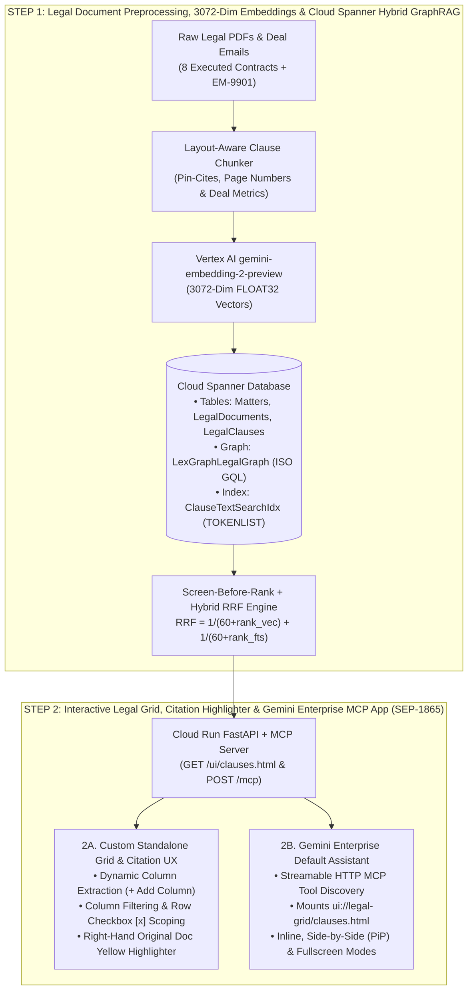

---

## Visual Proof: Step 1 + Custom UX + Gemini Enterprise Integration

### Step 1 Proof — Preprocessing, 3072-Dim Vectorization & Cloud Spanner Hybrid GraphRAG

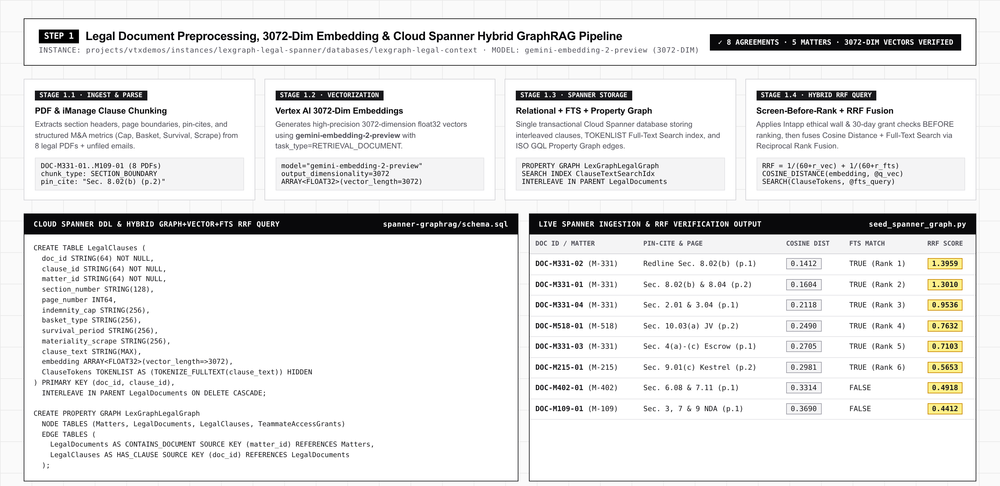

*Figure 1: Step 1 pipeline converting the 8 legal PDF agreements into section-bounded chunks, 3072-dim `gemini-embedding-2-preview` vectors, `TOKENLIST` full-text search tokens, and `LexGraphLegalGraph` property graph edges inside Cloud Spanner with Reciprocal Rank Fusion (RRF) scoring.*

---

### Step 2A Proof — Custom Interactive Legal Grid & Document Citation UX

#### 1. Split-Screen Interactive Grid & Original Document Citation Highlighter (Light Mode Default)
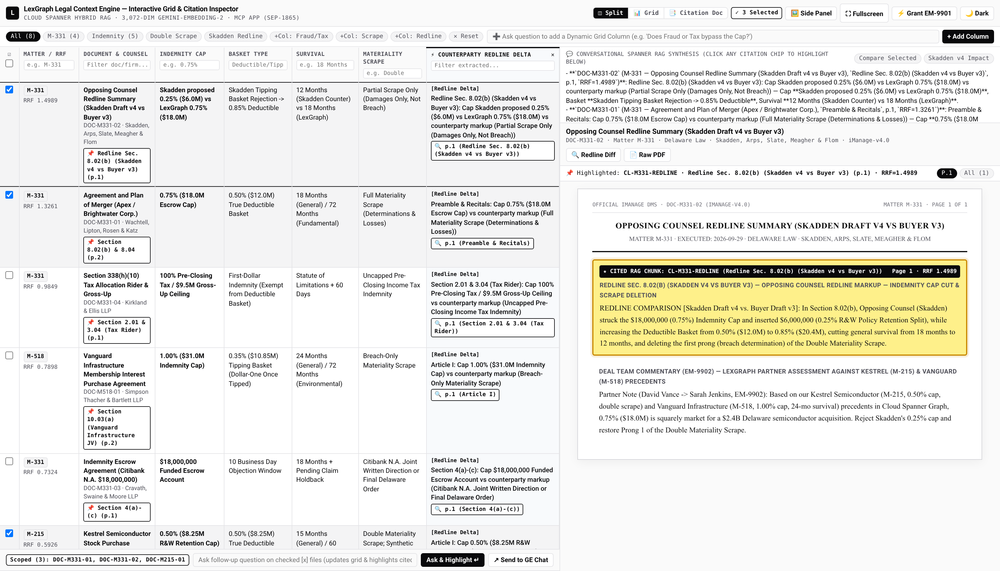
*Figure 2: Custom Split-Screen Workspace (`Split` view). Left pane renders the Cloud Spanner Precedent Comparison Grid with RRF scores and pin-cite pills; right pane displays the Conversational Spanner RAG Synthesis above the Original Document Page Viewer with the cited clause highlighted in yellow.*

#### 2. Dynamic Column Extraction via Natural Language Prompt (`+ Add Column`)
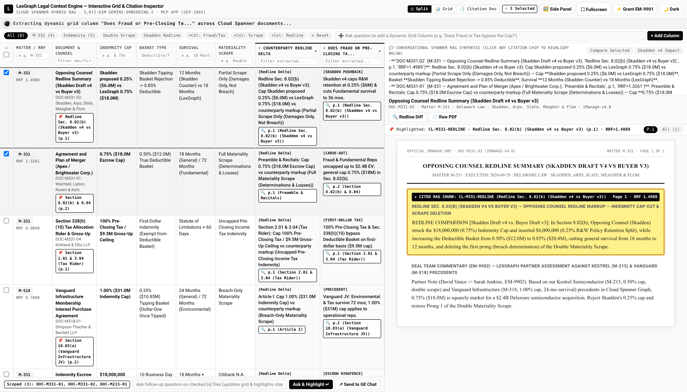
*Figure 3: Typing `"Does Fraud or Pre-Closing Tax bypass the Cap?"` into the top `+ Add Column` bar dynamically evaluates all 8 agreements against Cloud Spanner and appends a structured comparison column with clickable page/section citation pills.*

#### 3. Per-Column Filtering & Multi-Row Checkbox Scoping (`[x]`)
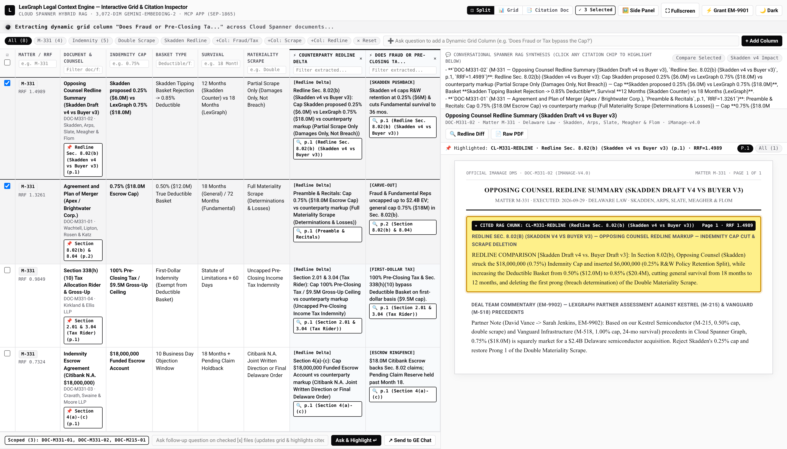
*Figure 4: Filtering the grid by column (`Matter = M-331`) and checking `[x]` rows scopes follow-up RAG questions strictly to the selected contracts (`Scoped (3): DOC-M331-01, DOC-M331-02, DOC-M215-01`).*

#### 4. Original Document Page Navigation, Yellow Chunk Highlighting & Opposing Counsel Redline Diff
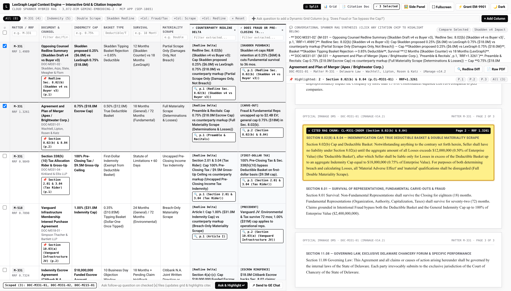
*Figure 5: Clicking any citation badge (`📌 Section 8.02(b) & 8.04 (p.2)`) jumps the right-hand document inspector directly to Page 2 of `DOC-M331-01`, highlights the exact RAG chunk in yellow, and lets counsel toggle the Opposing Counsel Redline comparison.*

#### 5. Dynamic Dark Mode (`🌙 Dark`) & 30-Day Temporary Spanner Graph Access Grant (`EM-9901`)
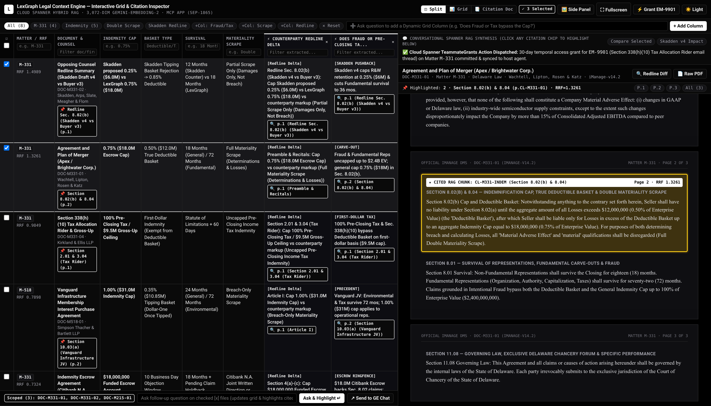
*Figure 6: Switching to OLED Dark Mode (`🌙 Dark`) and clicking `⚡ Grant EM-9901` inserts a 30-day `TeammateAccessGrants` edge in Cloud Spanner, immediately unlocking the unfiled Section 338(h)(10) tax email into the live grid.*

---

### Step 2B Proof — Gemini Enterprise Native MCP App Integration (`SEP-1865`)

#### 6. Gemini Enterprise Default Assistant Invoking the Cloud Spanner MCP Tool
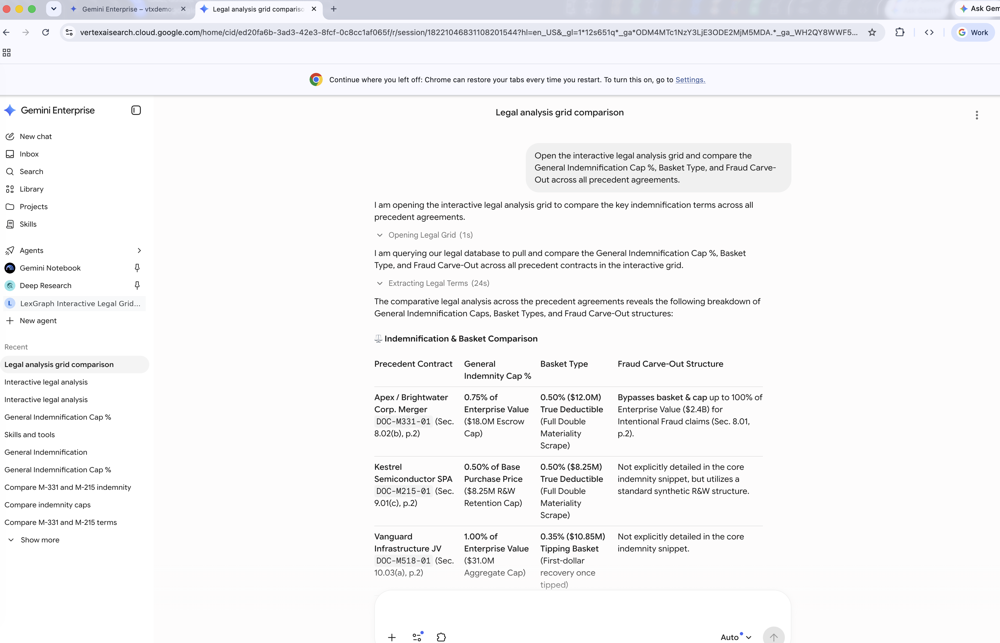
*Figure 7: Inside Gemini Enterprise (`vertexaisearch.cloud.google.com`), asking the Default Assistant to compare indemnification terms triggers the registered Streamable HTTP MCP tool (`Opening Legal Grid` -> `Extracting Legal Terms`) backed by Cloud Spanner.*

#### 7. Gemini Enterprise Side-by-Side Mode: Chat on Left + Interactive MCP App & Citation Highlighter on Right
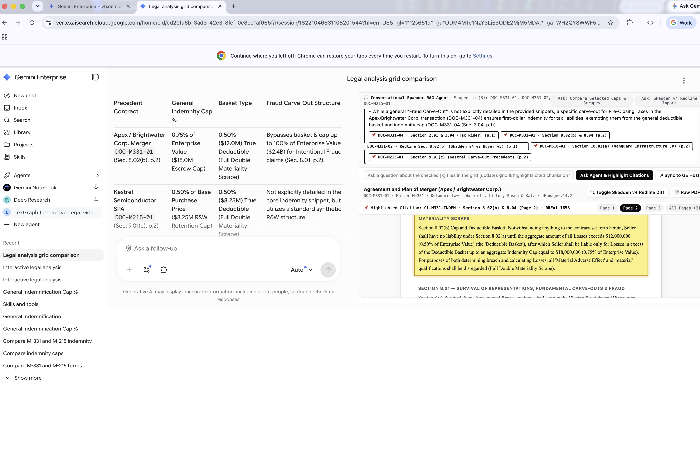
*Figure 8: Gemini Enterprise Side-by-Side (`PiP`) mode showing the conversational synthesis on the left and the live interactive MCP App (`ui://legal-grid/clauses.html`) on the right with clickable citation chips and the yellow-highlighted original contract page (`Section 8.02(b) & 8.04, Page 2`).*

#### 8. Gemini Enterprise Scoped Follow-Up Question & Real-Time Citation Sync
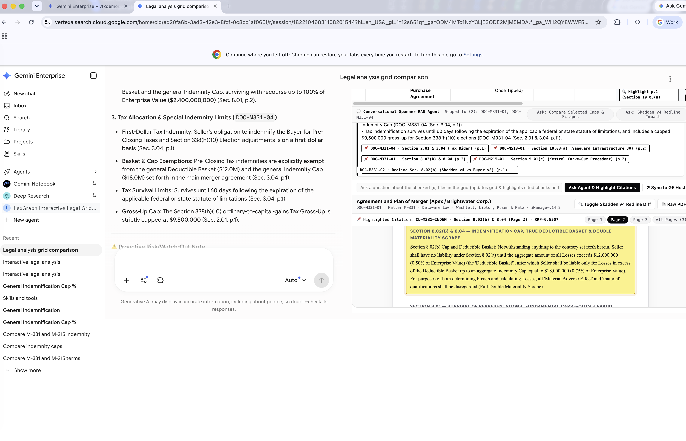
*Figure 9: Asking a follow-up question scoped to selected agreements updates both the Conversational Spanner RAG synthesis and the highlighted original contract clause inside Gemini Enterprise.*

#### 9. Gemini Enterprise Expanded Split-Screen Grid & Document Citation Workspace
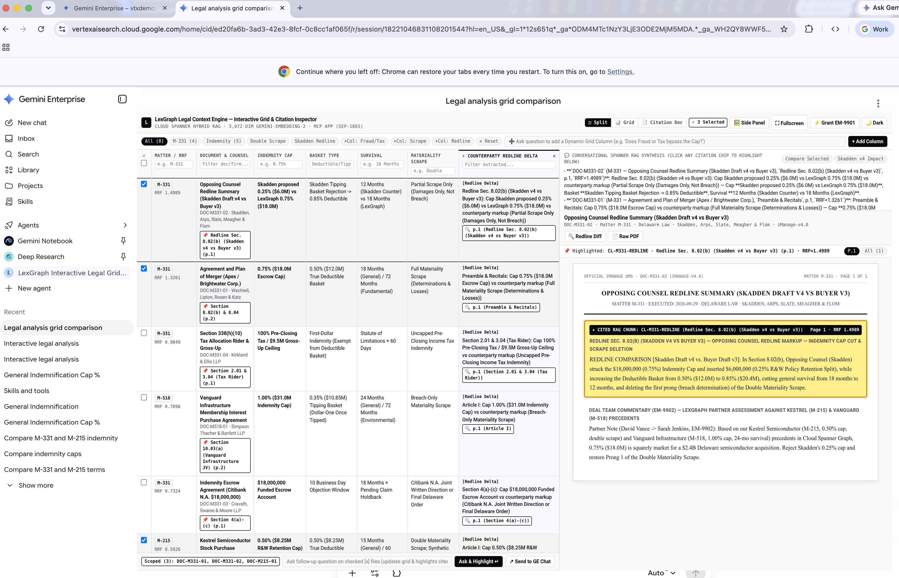
*Figure 10: Expanding the MCP App inside Gemini Enterprise displays the full Split-Screen Interactive Precedent Grid (left) and Original Document Citation Inspector (right) side-by-side.*

---

## Concise Implementation Guide: How Step 1 & Step 2 Work

### Step 1: Preprocessing, 3072-Dim Embeddings & Cloud Spanner Hybrid GraphRAG ([`spanner-graphrag/`](./spanner-graphrag/))

| Component | File | Implementation Details |
| :--- | :--- | :--- |
| **1.1 Synthetic Legal PDFs & Text Corpus** | [`demo-documents/generate_demo_pdfs.py`](./demo-documents/generate_demo_pdfs.py) | Generates 8 multi-page executed legal agreements (`DOC-M331-01`..`DOC-M109-01` in [`demo-documents/pdf/`](./demo-documents/pdf/)) + 9 plain-text contracts including unfiled email `EM-9901` ([`demo-documents/text/`](./demo-documents/text/)). |
| **1.2 Cloud Spanner Schema & Property Graph** | [`spanner-graphrag/schema.sql`](./spanner-graphrag/schema.sql) | Defines `Matters`, `LegalDocuments`, interleaved `LegalClauses` with `embedding ARRAY<FLOAT32>(vector_length=>3072)`, `ClauseTokens TOKENLIST AS (TOKENIZE_FULLTEXT(clause_text)) HIDDEN`, `SEARCH INDEX ClauseTextSearchIdx`, and `CREATE PROPERTY GRAPH LexGraphLegalGraph`. |
| **1.3 Instance & Database Provisioner** | [`spanner-graphrag/provision_spanner_graph.py`](./spanner-graphrag/provision_spanner_graph.py) | Idempotently provisions Cloud Spanner instance `lexgraph-legal-spanner` (100 PU FinOps tier) and applies `schema.sql`. |
| **1.4 3072-Dim Embedding & Graph Seeder** | [`spanner-graphrag/seed_spanner_graph.py`](./spanner-graphrag/seed_spanner_graph.py) | Chunks each contract by clause/page, calls Vertex AI `gemini-embedding-2-preview` (`output_dimensionality=3072`, `task_type="RETRIEVAL_DOCUMENT"`), writes nodes/edges into Spanner, and runs a verification Hybrid RRF query. |

**Run Step 1 in 3 commands:**
```bash
python3 demo-documents/generate_demo_pdfs.py
python3 spanner-graphrag/provision_spanner_graph.py --project $PROJECT_ID --instance lexgraph-legal-spanner --database lexgraph-legal-context
python3 spanner-graphrag/seed_spanner_graph.py --project $PROJECT_ID --instance lexgraph-legal-spanner --database lexgraph-legal-context
```

---

### Step 2: Interactive Grid, Citation Highlighter & Gemini Enterprise MCP App ([`mcp-app-grid-server/`](./mcp-app-grid-server/))

| Component | File | Implementation Details |
| :--- | :--- | :--- |
| **2.1 FastAPI + Streamable HTTP MCP Server** | [`mcp-app-grid-server/app.py`](./mcp-app-grid-server/app.py) | Implements `POST /mcp` (JSON-RPC 2.0 `2025-06-18`) with 4 MCP tools (`render_interactive_legal_grid`, `add_dynamic_grid_column`, `ask_followup_on_selected_files`, `grant_teammate_email_access`), `resources/read` (`ui://legal-grid/clauses.html`), and REST APIs (`/api/ask`, `/api/extract_column`, `/api/grant_email`). |
| **2.2 Split-Screen Grid & Citation UI** | [`mcp-app-grid-server/ui_template.py`](./mcp-app-grid-server/ui_template.py) | Self-contained Vercel Monochrome Light/Dark UI (`100vw x 100vh`) with `ResizeObserver` (`ui/notifications/size-changed`), `window.postMessage` JSON-RPC 2.0 MCP App bridge, per-column filters, `[x]` row scoping, and yellow citation highlighting. |
| **2.3 Gemini Enterprise Registration** | [`mcp-app-grid-server/register_custom_mcp_connector.py`](./mcp-app-grid-server/register_custom_mcp_connector.py) | Registers the Cloud Run `/mcp` server into **Gemini Enterprise Default Assistant** so any natural-language prompt automatically renders the interactive grid and citation inspector. |

**Run & Deploy Step 2 in 2 commands:**
```bash
gcloud run deploy lexgraph-mcp-grid-app \
  --source ./mcp-app-grid-server \
  --project $PROJECT_ID \
  --region us-central1 \
  --allow-unauthenticated \
  --set-env-vars="GOOGLE_CLOUD_PROJECT=$PROJECT_ID,SPANNER_INSTANCE=lexgraph-legal-spanner,SPANNER_DATABASE=lexgraph-legal-context"

python3 mcp-app-grid-server/register_custom_mcp_connector.py \
  --project $PROJECT_ID \
  --engine-id $GEMINI_ENTERPRISE_APP_ID \
  --mcp-url "$(gcloud run services describe lexgraph-mcp-grid-app --project $PROJECT_ID --region us-central1 --format='value(status.url)')/mcp"
```

---

## Repository Directory Structure

```text
lexgraph-spanner-mcp-app/
├── README.md                                      # 2-Step Architecture, Screenshots & Quickstart
├── docs/
│   ├── 01_STEP1_PREPROCESSING_AND_SPANNER_RAG.md  # Step 1 Deep-Dive: Chunking, 3072-Dim Embeddings & RRF
│   ├── 02_STEP2_MCP_APP_AND_GEMINI_ENTERPRISE.md  # Step 2 Deep-Dive: Custom Grid UX & SEP-1865 GE Integration
│   ├── 03_STEP_BY_STEP_REPLICATION_RUNBOOK.md     # End-to-End CLI Deployment & Verification Runbook
│   ├── 04_FINOPS_AND_COST_CALCULATOR.md           # Cloud Spanner (100 PU) + Gemini Embedding & Flash FinOps
│   └── screenshots/                               # 10 High-Res Screenshots (Step 1 + Custom UX + GE UX)
├── demo-documents/
│   ├── README.md                                  # Legal Precedent Corpus Catalog & Pin-Cite Index
│   ├── generate_demo_pdfs.py                      # Deterministic Generator for the 8 PDFs & 9 Text Files
│   ├── pdf/                                       # 8 Multi-Page Legal Agreements (PDF)
│   └── text/                                      # 9 Plain-Text Legal Contracts + Unfiled Email EM-9901
├── spanner-graphrag/                              # STEP 1: Preprocessing, Embeddings & Cloud Spanner GraphRAG
│   ├── schema.sql                                 # Spanner DDL: Relational + FTS + 3072-Dim Vector + GQL Graph
│   ├── provision_spanner_graph.py                 # Automated Spanner Instance & Database Provisioner
│   └── seed_spanner_graph.py                      # Clause Chunker, gemini-embedding-2-preview Seeder & RRF Test
├── mcp-app-grid-server/                           # STEP 2: Custom Grid + Citation UX & Gemini Enterprise MCP App
│   ├── app.py                                     # FastAPI + Streamable HTTP MCP Server (SEP-1865)
│   ├── ui_template.py                             # Split-Screen Interactive Grid & Citation Highlighter HTML/JS
│   ├── register_custom_mcp_connector.py           # Registers MCP Server in Gemini Enterprise Default Assistant
│   ├── register_mcp_grid_agent_in_ge.py           # Registers Dedicated MCP Grid Agent in Gemini Enterprise
│   ├── Dockerfile                                 # Cloud Run Container Definition
│   └── requirements.txt                           # Python Dependencies
└── agent-replication-packs/                       # 1-Prompt Autonomous Replication Packs
    ├── README.md                                  # Guide for Jetski, Antigravity, Claude Code & Codex
    ├── jetski/                                    # Jetski run_workflow Script + Natural-Language Prompt
    ├── antigravity/                               # Antigravity SKILL.md + Slash Workflow
    ├── claude-code/                               # CLAUDE.md + /replicate-mcp-app Slash Command
    └── codex/                                     # AGENTS.md + One-Shot Codex Prompt
```
