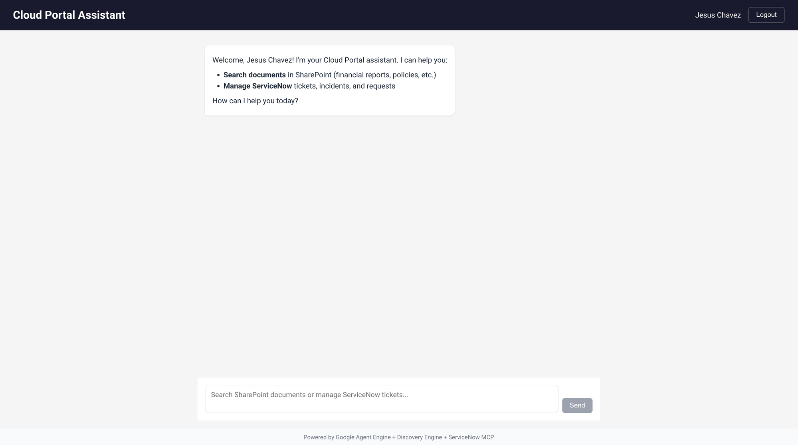
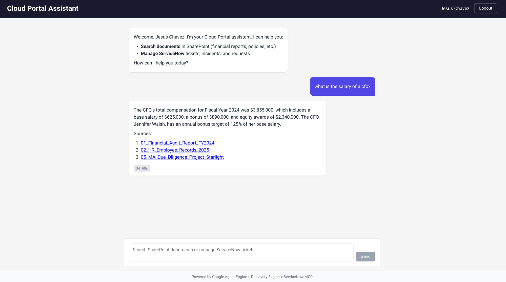
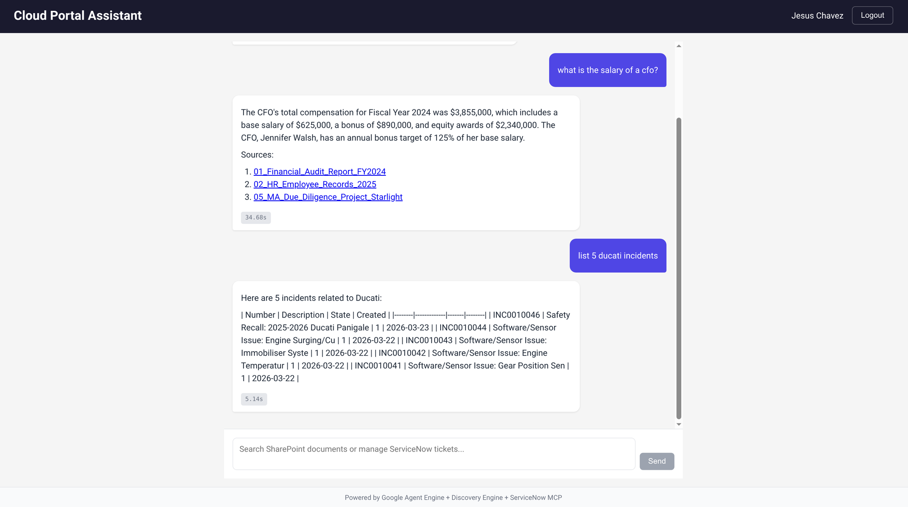
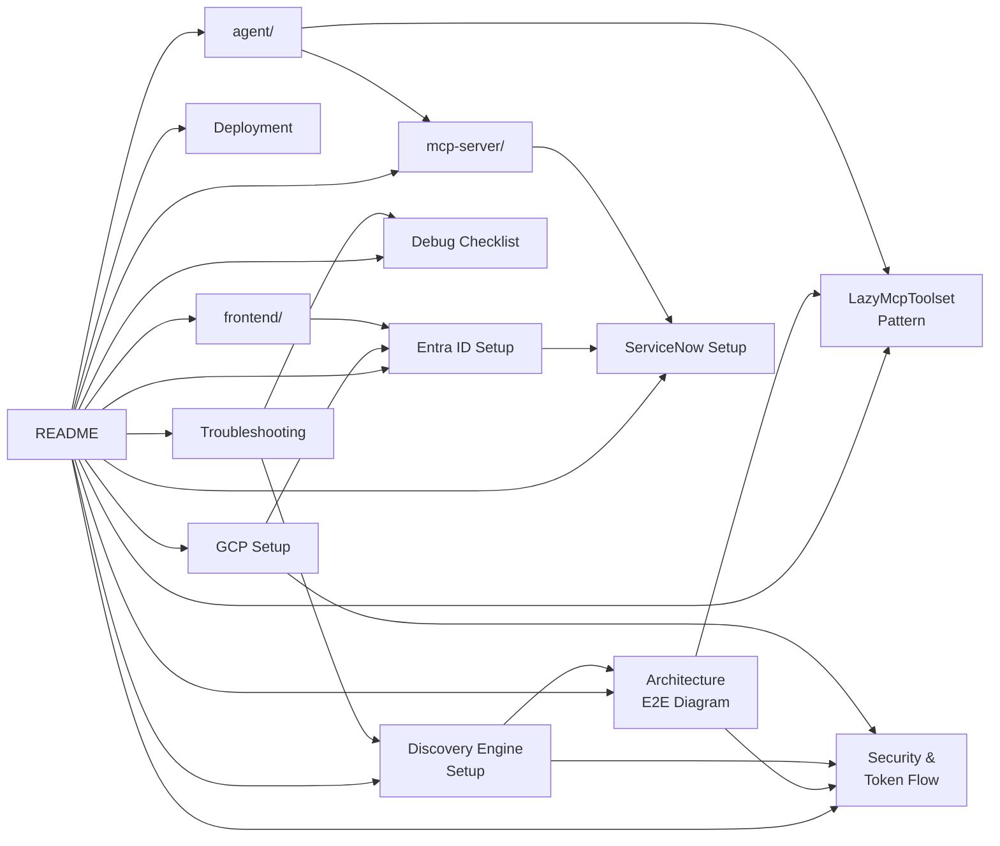

# Light GE + MCP Cloud Portal

> **Enterprise AI Assistant combining Google Discovery Engine (Gemini Enterprise) with ServiceNow MCP**

A production-ready implementation demonstrating federated identity, grounded SharePoint search, and enterprise tool integration using Google Cloud Agent Engine.

## What This Project Does

```
┌─────────────────────────────────────────────────────────────────────────────────┐
│                         USER ASKS: "What is the CFO's salary?"                   │
└─────────────────────────────────────────────────────────────────────────────────┘
                                         │
                                         ▼
┌─────────────────────────────────────────────────────────────────────────────────┐
│  DISCOVERY ENGINE searches SharePoint with user's identity (WIF)                 │
│  ──────────────────────────────────────────────────────────────────────────────  │
│  Found: 01_Financial_Audit_Report_FY2024.pdf                                     │
│  Source: CONTOSO.sharepoint.com/sites/FinancialDocument                         │
└─────────────────────────────────────────────────────────────────────────────────┘
                                         │
                                         ▼
┌─────────────────────────────────────────────────────────────────────────────────┐
│  GROUNDED RESPONSE:                                                              │
│  "According to the Financial Audit Report for Fiscal Year 2024, the total        │
│   compensation for the CFO, Jennifer Walsh, is $3,855,000."                      │
│                                                                                  │
│   📎 Sources:                                                                    │
│   • 01_Financial_Audit_Report_FY2024.pdf                                        │
│   • 03_Client_Contract_Apex_Financial.pdf                                       │
└─────────────────────────────────────────────────────────────────────────────────┘
```

## Demo

### Welcome Screen

*Cloud Portal Assistant with Microsoft Entra ID authentication*

### SharePoint Search (Discovery Engine)

*Query: "What is the salary of a CFO?" - Returns grounded response with source citations from SharePoint documents*

### ServiceNow Integration (MCP)

*Query: "List 5 Ducati incidents" - Returns real-time data from ServiceNow via MCP*

---

## Key Features

| Feature | Description | Status |
|---------|-------------|--------|
| **Discovery Engine + SharePoint** | Search SharePoint documents with grounded citations | ✅ |
| **Workforce Identity Federation** | Microsoft Entra ID → Google Cloud seamless auth | ✅ |
| **ServiceNow MCP Integration** | IT ticket management via Model Context Protocol | ✅ |
| **LazyMcpToolset Pattern** | Solves Agent Engine pickle serialization issues | ✅ |
| **Per-Request JWT Injection** | User identity flows through entire system | ✅ |
| **Dynamic Datastore Discovery** | Auto-discovers SharePoint datastores | ✅ |

### Critical: dataStoreSpecs for Grounded Responses

> **Without `dataStoreSpecs`, streamAssist returns generic LLM responses instead of grounded SharePoint data.**

The `dataStoreSpecs` field tells Discovery Engine which datastores to search. It must be wrapped in `toolsSpec.vertexAiSearchSpec`:

```python
# REQUIRED for grounded responses from SharePoint
payload = {
    "query": {"text": "What is the CFO salary?"},
    "toolsSpec": {
        "vertexAiSearchSpec": {
            "dataStoreSpecs": [
                {"dataStore": "projects/.../dataStores/sharepoint-files"}
            ]
        }
    }
}
```

See [Discovery Engine Setup](docs/discovery-engine-setup.md#critical-datastorespecs-for-grounded-responses) for details. ([Official API Reference](https://cloud.google.com/generative-ai-app-builder/docs/reference/rest/v1alpha/projects.locations.collections.engines.assistants/streamAssist))

## Architecture

```
┌─────────────────────────────────────────────────────────────────────────────────┐
│                              FRONTEND (React + MSAL)                             │
│                          localhost:5173 / Cloud Run                              │
│  ┌─────────────┐    ┌─────────────┐    ┌──────────────────────────────────────┐ │
│  │   MSAL      │───▶│  Entra ID   │───▶│  Workforce Identity Federation       │ │
│  │   Login     │    │   JWT       │    │  (STS Token Exchange)                │ │
│  └─────────────┘    └─────────────┘    └──────────────────────────────────────┘ │
└───────────────────────────────┬─────────────────────────────────────────────────┘
                                │ GCP Token + USER_TOKEN in session state
                                ▼
┌─────────────────────────────────────────────────────────────────────────────────┐
│                         AGENT ENGINE (Vertex AI ADK 2.0)                         │
│                    Managed Google Cloud Infrastructure                           │
│                                                                                  │
│  ┌─────────────────────────────────────────────────────────────────────────────┐│
│  │                         LlmAgent (Gemini 2.5 Flash)                         ││
│  │  ┌─────────────────────────────┐  ┌─────────────────────────────────────┐  ││
│  │  │    search_sharepoint()      │  │       LazyMcpToolset                │  ││
│  │  │    ────────────────────     │  │       ──────────────                │  ││
│  │  │    • WIF Token Exchange     │  │       • Lazy initialization         │  ││
│  │  │    • Dynamic Datastores     │  │       • header_provider callback    │  ││
│  │  │    • Grounded Responses     │  │       • Pickle-safe serialization   │  ││
│  │  └─────────────────────────────┘  └─────────────────────────────────────┘  ││
│  └─────────────────────────────────────────────────────────────────────────────┘│
└──────────────┬─────────────────────────────────────┬────────────────────────────┘
               │                                     │
               ▼                                     ▼
┌──────────────────────────────────┐  ┌──────────────────────────────────────────┐
│    DISCOVERY ENGINE (Gemini)     │  │         MCP SERVER (Cloud Run)           │
│    ─────────────────────────     │  │         ─────────────────────            │
│  ┌────────────────────────────┐  │  │  ┌────────────────────────────────────┐  │
│  │  SharePoint Datastores:    │  │  │  │  FastMCP SSE Server                │  │
│  │  • deloitte-sharepoint_file│  │  │  │  ────────────────────              │  │
│  │  • deloitte-sharepoint_page│  │  │  │  Tools:                            │  │
│  │  • deloitte-sharepoint_*   │  │  │  │  • query_table                     │  │
│  └────────────────────────────┘  │  │  │  • create_incident                 │  │
│              │                   │  │  │  • get_user_info                   │  │
│              ▼                   │  │  └────────────────────────────────────┘  │
│  ┌────────────────────────────┐  │  └──────────────────────────────────────────┘
│  │  streamAssist API          │  │                     │
│  │  • textGroundingMetadata   │  │                     ▼
│  │  • Source citations        │  │  ┌──────────────────────────────────────────┐
│  └────────────────────────────┘  │  │            SERVICENOW (ITSM)              │
└──────────────────────────────────┘  │  https://instance.service-now.com         │
               │                      │  • OIDC Provider validates JWT            │
               ▼                      │  • Returns user-scoped data               │
┌──────────────────────────────────┐  └──────────────────────────────────────────┘
│       SHAREPOINT ONLINE          │
│  CONTOSO.sharepoint.com          │
│  • Financial Reports             │
│  • Policies & Contracts          │
│  • HR Documents                  │
└──────────────────────────────────┘
```

## Quick Start

### Prerequisites

| Requirement | Description |
|-------------|-------------|
| Google Cloud Project | With Agent Engine, Discovery Engine enabled |
| Microsoft Entra ID | Tenant with app registration |
| ServiceNow Instance | With API access |
| SharePoint Site | Connected to Discovery Engine |

### 1. Clone and Setup

```bash
cd semiautonomous-agents/light_ge_mcp_cloud_portal

# Setup agent environment
cd agent
cp .env.example .env
uv sync
```

### 2. Configure Environment

```bash
# agent/.env
GOOGLE_CLOUD_PROJECT=deloitte-plantas
GOOGLE_CLOUD_LOCATION=us-central1
STAGING_BUCKET=gs://deloitte-plantas-staging

# ServiceNow MCP
SERVICENOW_MCP_URL=https://servicenow-mcp-xxx.us-central1.run.app/sse

# Discovery Engine
PROJECT_NUMBER=REDACTED_PROJECT_NUMBER
DISCOVERY_ENGINE_ID=deloitte-demo

# WIF Configuration (Entra ID → Google Cloud)
WIF_POOL_ID=entra-id-oidc-pool-d
WIF_PROVIDER_ID=entra-id-oidc-pool-provider-de
```

### 3. Deploy

```bash
# 1. Deploy MCP Server first
cd mcp-server
gcloud run deploy servicenow-mcp --source . --region us-central1

# 2. Deploy Agent Engine
cd ../agent
uv run python deploy.py

# 3. Start Frontend
cd ../frontend
npm install && npm run dev
```

### 4. Test

Open http://localhost:5173, sign in with Microsoft, and ask:
- "What is the CFO salary?" → Discovery Engine (SharePoint)
- "List my open incidents" → ServiceNow MCP

---

## Documentation



### Start Here

| Document | Description |
|----------|-------------|
| [Architecture (E2E Diagram)](docs/architecture.md) | **Complete system flow** - tokens, service accounts, all components |
| [Discovery Engine Setup](docs/discovery-engine-setup.md) | **Two requirements** for grounded SharePoint responses |

### Core Patterns

| Document | Description |
|----------|-------------|
| [LazyMcpToolset Pattern](docs/lazy-mcp-pattern.md) | Solving Agent Engine pickle serialization |
| [Security & Token Flow](docs/security-flow.md) | WIF, STS, JWT propagation diagrams |

### Setup & Deployment

| Document | Description |
|----------|-------------|
| [GCP Infrastructure](docs/gcp-setup.md) | WIF pools, IAM, Cloud Run |
| [Entra ID Configuration](docs/entra-id-setup.md) | Microsoft app registration |
| [ServiceNow Configuration](docs/servicenow-setup.md) | OIDC provider setup |
| [Deployment Guide](docs/deployment.md) | Full deployment steps |
| [Phase 1: Local Testing](docs/PHASE1_LOCAL_TESTING.md) | Test locally before deploying |
| [Phase 2: Cloud Deployment](docs/PHASE2_CLOUD_DEPLOYMENT.md) | Deploy to GCP |

### Troubleshooting

| Document | Description |
|----------|-------------|
| [Troubleshooting Guide](docs/troubleshooting.md) | Common issues and solutions |
| [Debug Checklist](docs/debug-checklist.md) | Step-by-step debugging |

### Component READMEs

| Component | Description |
|-----------|-------------|
| [agent/](agent/README.md) | ADK agent with LazyMcpToolset + search_sharepoint |
| [mcp-server/](mcp-server/README.md) | FastMCP server for ServiceNow |
| [frontend/](frontend/README.md) | React + MSAL + WIF |

---

## Project Structure

```
light_ge_mcp_cloud_portal/
├── agent/                          # ADK Agent (deployed to Agent Engine)
│   ├── agent.py                    # Main agent with LazyMcpToolset
│   ├── tools/
│   │   └── discovery_engine.py     # SharePoint search with WIF
│   ├── deploy.py                   # Agent Engine deployment script
│   └── requirements.txt
│
├── frontend/                       # React + MSAL frontend
│   ├── src/
│   │   ├── App.tsx                 # Main chat interface
│   │   ├── authConfig.ts           # MSAL + WIF configuration
│   │   └── agentService.ts         # Agent Engine API client
│   └── package.json
│
├── mcp-server/                     # ServiceNow MCP Server
│   ├── mcp_server.py               # FastMCP implementation
│   ├── Dockerfile
│   └── requirements.txt
│
└── docs/                           # Documentation
    ├── architecture.md
    ├── lazy-mcp-pattern.md
    ├── security-flow.md
    └── ...
```

---

## Key Code Patterns

### 1. LazyMcpToolset (Solving Pickle Serialization)

> **Source:** [`agent/agent.py#L141-L175`](agent/agent.py#L141-L175)

```python
class LazyMcpToolset(BaseToolset):
    """
    Lazy wrapper for McpToolset that creates the toolset at runtime.
    This avoids pickle serialization issues during Agent Engine deployment.
    """
    def __init__(self, url: str, header_provider):
        super().__init__()
        self._url = url
        self._header_provider = header_provider
        self._toolset = None

    def __getstate__(self):
        # Only pickle URL and header_provider, NOT the toolset
        return {"_url": self._url, "_header_provider": self._header_provider, "_toolset": None}
```

### 2. WIF Token Exchange

> **Source:** [`agent/tools/discovery_engine.py#L73-L95`](agent/tools/discovery_engine.py#L73-L95)

```python
def exchange_wif_token(self, user_id_token: str) -> str:
    """Exchange Entra ID JWT for Google Cloud access token via STS."""
    sts_url = "https://sts.googleapis.com/v1/token"
    audience = f"//iam.googleapis.com/locations/global/workforcePools/{pool}/providers/{provider}"

    payload = {
        "audience": audience,
        "grantType": "urn:ietf:params:oauth:grant-type:token-exchange",
        "subjectToken": user_id_token,
        "subjectTokenType": "urn:ietf:params:oauth:token-type:jwt"
    }

    response = requests.post(sts_url, json=payload)
    return response.json()["access_token"]
```

### 3. Dynamic Datastore Discovery

> **Source:** [`agent/tools/discovery_engine.py#L119-L145`](agent/tools/discovery_engine.py#L119-L145)

```python
def _get_dynamic_datastores(self) -> List[Dict[str, str]]:
    """Fetch SharePoint datastores using service account."""
    url = f"https://discoveryengine.googleapis.com/v1alpha/.../widgetConfigs/default_search_widget_config"

    # Use service account for admin operations
    admin_token = self._get_service_credentials()

    resp = requests.get(url, headers={"Authorization": f"Bearer {admin_token}"})
    # Returns: deloitte-sharepoint_file, deloitte-sharepoint_page, etc.
```

---

## Token Flow

```
┌──────────────────────────────────────────────────────────────────────────────┐
│ 1. USER LOGIN                                                                 │
│    User clicks "Sign in with Microsoft"                                       │
│    └─▶ MSAL popup → Entra ID → Returns JWT (id_token)                        │
└──────────────────────────────────────────────────────────────────────────────┘
                                    │
                                    ▼
┌──────────────────────────────────────────────────────────────────────────────┐
│ 2. WIF EXCHANGE (Frontend)                                                    │
│    POST https://sts.googleapis.com/v1/token                                   │
│    └─▶ Entra JWT exchanged for GCP access_token                              │
└──────────────────────────────────────────────────────────────────────────────┘
                                    │
                                    ▼
┌──────────────────────────────────────────────────────────────────────────────┐
│ 3. SESSION CREATION                                                           │
│    POST /reasoningEngines/{id}:query                                          │
│    Body: { state: { USER_TOKEN: "eyJ..." } }                                  │
│    └─▶ Session created with user's JWT in state                              │
└──────────────────────────────────────────────────────────────────────────────┘
                                    │
                                    ▼
┌──────────────────────────────────────────────────────────────────────────────┐
│ 4. QUERY PROCESSING                                                           │
│    User: "What is the CFO salary?"                                            │
│    └─▶ Agent extracts USER_TOKEN from session state                          │
│    └─▶ Exchanges JWT via WIF/STS for Discovery Engine                        │
│    └─▶ Calls streamAssist with user's identity                               │
│    └─▶ SharePoint returns grounded response                                   │
└──────────────────────────────────────────────────────────────────────────────┘
```

---

## Comparison: Before vs After

| Aspect | light_mcp_cloud_portal | light_ge_mcp_cloud_portal |
|--------|------------------------|---------------------------|
| **Search** | None | Discovery Engine + SharePoint |
| **Grounding** | None | Full source citations |
| **Identity** | Service Account | User JWT via WIF |
| **MCP Pattern** | Direct McpToolset | LazyMcpToolset (pickle-safe) |
| **Datastores** | N/A | Dynamic discovery |

---

## Contributing

1. Fork the repository
2. Create a feature branch
3. Make your changes
4. Submit a pull request

## License

Apache 2.0 - See [LICENSE](LICENSE)
