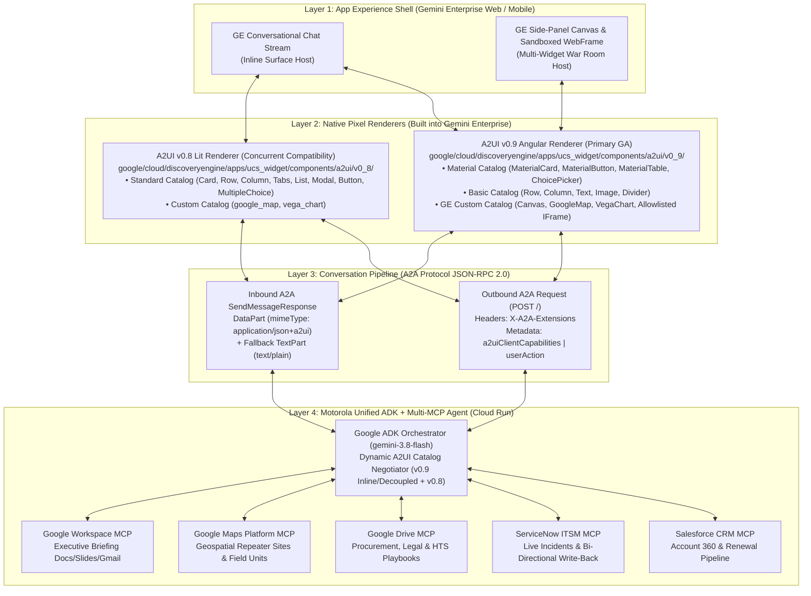
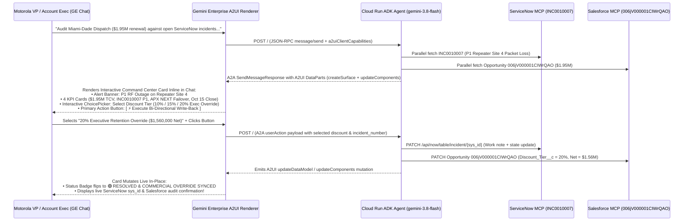
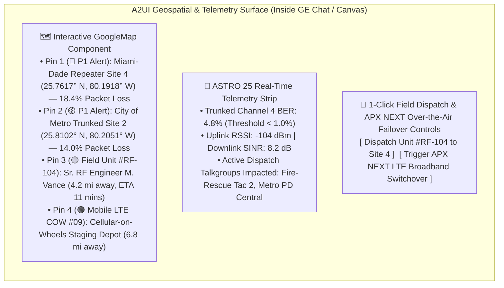

# Motorola Solutions × Gemini Enterprise: Native A2UI & Multi-System MCP "WOW" Visual Architecture Blueprint

**Author:** Principal AI Architect & Lead UI/UX Systems Engineer  
**Target Platform:** Google Gemini Enterprise (GE) GA + Cloud Run A2A Service  
**Core Stack:** Google ADK (`gemini-3.8-flash`), A2A Protocol (`v0.2.1+`), Multi-System MCP Servers (`Salesforce CRM`, `ServiceNow ITSM`, `Google Drive Policy Engine`, `Google Workspace`, `Google Maps Platform`), and Native A2UI (`v0.9` Angular Material/Basic/Custom Catalogs & `v0.8` Lit Standard/Custom Catalogs)  
**Repository Location:** `~/IdeaProjects/vertex-ai-samples/semiautonomous-agents/motorola-enterprise-poc/`

---

## Executive Summary

Motorola Solutions operates mission-critical public safety and enterprise communications infrastructure (ASTRO 25 LMR networks, APX NEXT smart radios, CommandCentral Aware, and Avigilon Unity Video). When high-value public safety renewals face operational friction—such as **Miami-Dade County Public Safety ($1.95M ASTRO 25 renewal, `006jV000001CIWrQAO`)** experiencing a Priority-1 repeater outage (`INC0010007`), or vendor RFQs hitting legal redlines (`INC0010006`) and customs tariff holds (`INC0010004`)—executives cannot afford text-only summaries or swivel-chair workflows across 5 disconnected enterprise portals.

With **A2UI now Generally Available (GA) in Gemini Enterprise (GE)**, our Cloud Run ADK/A2A agent can transcend static Markdown chat responses and stream **native, interactive graphical user interfaces directly inside the Gemini Enterprise chat stream and side-panel Canvas**.

This blueprint provides:
1. **The Exact Technical Gap & Root-Cause Diagnosis** explaining why our current `motorola-a2ui-agent` rendered as Markdown text + external link in Gemini Enterprise, and the exact 4-part protocol unlock required to activate native GE rendering.
2. **Three "Showstopper" Visual & Interactive Demo Architectures** engineered specifically for Motorola Solutions leadership:
   - **Showstopper 1 (Native Inline A2UI Command Center):** Interactive Account 360 & P1 Outage Action Surface with live Retention Discount `ChoicePicker` tiers (`10%` / `15%` / `20% Executive Override`) and 1-Click Bi-Directional MCP Write-Back to ServiceNow (`INC0010007`) & Salesforce (`006jV000001CIWrQAO`) that mutates UI state in place.
   - **Showstopper 2 (Geospatial RF Outage & Field Dispatch Cockpit):** Live interactive Google Maps pin-drop & RF packet-loss zone overlay across Miami-Dade & City of Metro repeater sites, paired with ASTRO 25 telemetry cards and 1-click field engineer dispatch.
   - **Showstopper 3 (Multi-Agent Cross-Silo "War Room Canvas & Visual Analytics Studio"):** Side-panel GE Canvas surface featuring interactive Vega-Lite / Material pipeline risk charts, side-by-side Legal Redline comparison matrices (`INC0010006` Net-15 vs. Net-60 & 0.5x vs. 2.0x TCV liability caps), HTS Tariff rulings (`INC0010004`), and 1-click Google Slides/Docs executive briefing generation via Google Workspace MCP.
3. **Production-Ready Implementation Code & Step-by-Step Deployment Runbook** for upgrading `app.py`, `a2ui_engine.py`, `mcp_connectors.py`, and Discovery Engine A2A Agent registration.

---

## Part 1: Root-Cause Diagnosis & Technical Unlock for Native Gemini Enterprise A2UI Rendering

### 1.1 Why `motorola-a2ui-agent` Previously Rendered as Text/Link in GE Chat

An audit of our live Cloud Run agent ([`app.py`](file:///Users/jesusarguelles/IdeaProjects/vertex-ai-samples/semiautonomous-agents/motorola-enterprise-poc/a2ui_agent/app.py) and [`a2ui_engine.py`](file:///Users/jesusarguelles/IdeaProjects/vertex-ai-samples/semiautonomous-agents/motorola-enterprise-poc/a2ui_agent/a2ui_engine.py)) against the **Gemini Enterprise A2UI GA Specification** revealed **four exact technical discrepancies**:

| # | Discrepancy in Current `motorola-a2ui-agent` | GE A2UI GA Specification Requirement | Impact on GE Runtime Behavior |
| :- | :--- | :--- | :--- |
| **1** | **Wrong `defaultOutputModes` Priority Order**<br>In [`app.py:39`](file:///Users/jesusarguelles/IdeaProjects/vertex-ai-samples/semiautonomous-agents/motorola-enterprise-poc/a2ui_agent/app.py#L39):<br>`"defaultOutputModes": ["text/plain", "application/json+a2ui", "application/a2ui+json"]` | **Mandatory MIME Priority:**<br>`default_output_modes = ['application/json+a2ui', 'text/plain']`<br>*(Per GE GA Onboarding Spec: "Without these, GE treats the agent as text-only and will not route or render A2UI.")* | Because `text/plain` was listed first, GE's content negotiation selected text mode and ignored A2UI `DataPart` payloads. |
| **2** | **Non-Standard Extension URI & Catalog IDs**<br>In [`app.py:60-68`](file:///Users/jesusarguelles/IdeaProjects/vertex-ai-samples/semiautonomous-agents/motorola-enterprise-poc/a2ui_agent/app.py#L60-L68):<br>Declared `"uri": "https://a2ui.org/a2a-extension/a2ui/v0.9.1"` with only the Basic catalog ID. | **Exact Extension & Catalog IDs via `get_a2ui_agent_extension()`:**<br>• **v0.9 Extension URI:** `https://a2ui.org/a2a-extension/a2ui/v0.9`<br>• **v0.8 Extension URI:** `https://a2ui.org/a2a-extension/a2ui/v0.8`<br>• **Catalog IDs:** Must declare GE's Material Catalog, Basic Catalog, Composite Catalog (`v0.9`), and Standard Catalog (`v0.8`). | GE's renderer router (`google/cloud/discoveryengine/apps/ucs_widget/components/a2ui/v0_9/`) could not match `v0.9.1` to the v0.9 Angular Material/Composite renderer. |
| **3** | **Bespoke Non-Catalog Component Types in `a2ui_engine.py`**<br>In [`a2ui_engine.py:93-161`](file:///Users/jesusarguelles/IdeaProjects/vertex-ai-samples/semiautonomous-agents/motorola-enterprise-poc/a2ui_agent/a2ui_engine.py#L93-L161):<br>Emitted custom JSON keys (`"type": "kpi_grid"`, `"type": "reconciliation_matrix"`, `"type": "interactive_action_card"`) under MIME `application/a2ui+json`. | **Strict Pre-Approved Catalog Schema Validation:**<br>GE validates every incoming component against the declared catalog (`MaterialCard`, `MaterialButton`, `MaterialTable`, `ChoicePicker`, `Card`, `Row`, `Column`, `Tabs`, `Text`, `Button`, `GoogleMap`, `VegaChart`). Unknown component types trigger schema rejection. | GE dropped the unrecognized custom JSON blocks and displayed only the fallback Markdown text part. |
| **4** | **Stale Cached `jsonAgentCard` in Discovery Engine Registration**<br>Updating Cloud Run's `/.well-known/agent-card.json` does not automatically mutate the registered Discovery Engine A2A Agent resource. | **Synchronized Discovery Engine Registration:**<br>The Discovery Engine A2A Agent resource (`a2aAgentDefinition.jsonAgentCard`) must be patched via REST API / `make register-gemini-enterprise` so GE's orchestrator knows the agent emits `application/json+a2ui`. | GE's frontend never attached the `X-A2A-Extensions` header or `a2uiClientCapabilities` metadata on outbound JSON-RPC calls. |

---

### 1.2 Architecture of the Gemini Enterprise Four-Layer A2UI Stack



---

### 1.3 The Exact Protocol Unlock Checklist

#### A. Compliant A2A Agent Card (`/.well-known/agent-card.json` & Discovery Engine Registration)
```json
{
  "name": "Motorola Unified Enterprise AI & A2UI Agent",
  "description": "Unified Google ADK Multi-Connector Agent (Salesforce CRM, ServiceNow ITSM, Google Drive Policy Engine, Google Maps, Google Workspace) with native Gemini Enterprise A2UI v0.9 & v0.8 interactive surfaces.",
  "url": "https://motorola-a2ui-agent-254356041555.us-central1.run.app",
  "version": "2.0.0",
  "protocolVersion": "0.2.1",
  "defaultInputModes": [
    "text/plain",
    "application/json+a2ui"
  ],
  "defaultOutputModes": [
    "application/json+a2ui",
    "text/plain"
  ],
  "capabilities": {
    "streaming": true,
    "pushNotifications": false,
    "extensions": [
      {
        "uri": "https://a2ui.org/a2a-extension/a2ui/v0.9",
        "description": "Gemini Enterprise Native A2UI v0.9 Angular Renderer (Material + Basic + Custom Composite Catalog)",
        "required": false,
        "params": {
          "supportedCatalogIds": [
            "https://a2ui.org/specification/v0_9/catalogs/material/catalog.json",
            "https://a2ui.org/specification/v0_9/catalogs/basic/catalog.json",
            "https://a2ui.org/specification/v0_9/catalogs/custom/catalog.json"
          ],
          "acceptsInlineCatalogs": true
        }
      },
      {
        "uri": "https://a2ui.org/a2a-extension/a2ui/v0.8",
        "description": "Gemini Enterprise Native A2UI v0.8 Lit Renderer (Standard + Custom Catalog)",
        "required": false,
        "params": {
          "supportedCatalogIds": [
            "https://a2ui.org/specification/v0_8/standard_catalog_definition.json",
            "https://a2ui.org/specification/v0_8/custom_catalog_definition.json"
          ],
          "acceptsInlineCatalogs": true
        }
      }
    ]
  }
}
```

#### B. Dual-Stack A2UI Message Envelope (`DataPart` with `mimeType: "application/json+a2ui"`)
When GE calls `POST /`, our agent inspects `X-A2A-Extensions` / `a2uiClientCapabilities`:
- **When emitting A2UI v0.9 (Angular Renderer — Default GA Path)**:
  Emit flat JSON messages inside `DataPart` (`mimeType: "application/json+a2ui"`):
  1. `createSurface`: Declares `surfaceId` and `catalogId` (`https://a2ui.org/specification/v0_9/catalogs/material/catalog.json`).
  2. `updateComponents`: Supplies the component tree (`MaterialCard`, `Row`, `Column`, `Text`, `ChoicePicker`, `MaterialButton`, `MaterialTable`, `GoogleMap`, `VegaChart`).
  3. `updateDataModel` *(for decoupled live state updates)*: Mutates bound values (e.g., ticket status transitioning from `OPEN - P1 CRITICAL` → `RESOLVED - 20% OVERRIDE APPLIED`) without resending the layout tree!
- **When emitting A2UI v0.8 (Lit Renderer — Compatibility Path)**:
  Emit flat JSON messages inside `DataPart` (`mimeType: "application/json+a2ui"`):
  1. `surfaceUpdate`: Declares `surfaceId` and `components` array (`Card`, `Column`, `Row`, `Tabs`, `Text`, `MultipleChoice`, `Button`).
  2. `beginRendering`: Declares `surfaceId` and `root` component ID.

---

## Part 2: Top 3 Visually Stunning "Showstopper" Demo Architectures for Motorola Solutions

### Showstopper 1: Native Inline A2UI Interactive "Mission-Critical Account & Outage Command Center"

#### Business & Operational Context
- **Executive Prompt in GE Chat:** *"Audit Miami-Dade County Public Safety ($1.95M ASTRO 25 renewal) against open ServiceNow incidents and Drive retention policies."*
- **Real-Time Parallel MCP Retrieval (`~180ms`):**
  - **Salesforce CRM (`006jV000001CIWrQAO`)**: $1,950,000 renewal in `Negotiation/Review`, closing `2026-10-15`.
  - **ServiceNow ITSM (`INC0010007`)**: Priority-1 Critical Outage — *Trunked RF Audio Packet Loss on ASTRO 25 Repeater Site 4 affecting dispatch consoles*.
  - **Google Drive Playbook (`1mw9k7uuTR8dktsn_PJ4eJ19cL2mdSkULb1-g6eqkr2E`)**: Authorizes up to **20% Executive Retention Discount** + **APX NEXT Smart Radio LTE/Wi-Fi Failover Bundle** when active LMR renewals experience P1/P2 RF outages.

#### Visual & Interactive User Journey in Gemini Enterprise


#### Exact A2UI v0.9 JSON Component Tree (`application/json+a2ui`)
```json
[
  {
    "createSurface": {
      "surfaceId": "motorola_cmd_center_inc0010007",
      "catalogId": "https://a2ui.org/specification/v0_9/catalogs/material/catalog.json"
    }
  },
  {
    "updateDataModel": {
      "surfaceId": "motorola_cmd_center_inc0010007",
      "data": {
        "accountName": "Miami-Dade County Public Safety",
        "opportunityId": "006jV000001CIWrQAO",
        "contractValue": "$1,950,000.00",
        "netRenewalValue": "$1,560,000.00 (20% Override)",
        "incidentNumber": "INC0010007",
        "incidentStatus": "🔴 P1 CRITICAL — ASTRO 25 Repeater Site 4 Packet Loss",
        "selectedDiscountTier": "tier_20_exec_override",
        "writebackBanner": "Awaiting Executive Authorization"
      }
    }
  },
  {
    "updateComponents": {
      "surfaceId": "motorola_cmd_center_inc0010007",
      "components": [
        {
          "id": "root_surface_card",
          "component": "MaterialCard",
          "properties": {
            "title": "⚡ MOTOROLA SOLUTIONS — MISSION-CRITICAL ACCOUNT COMMAND CENTER",
            "subtitle": "Live Cross-Silo Telemetry: Salesforce CRM × ServiceNow ITSM × Google Drive Policy Engine",
            "elevation": 2,
            "child": "main_layout_col"
          }
        },
        {
          "id": "main_layout_col",
          "component": "Column",
          "properties": {
            "gap": 16,
            "children": [
              "p1_alert_banner",
              "kpi_metrics_row",
              "reconciliation_table",
              "discount_choice_picker",
              "action_button_row"
            ]
          }
        },
        {
          "id": "p1_alert_banner",
          "component": "MaterialCard",
          "properties": {
            "variant": "outlined",
            "title": { "path": "/incidentStatus" },
            "subtitle": "Impact: Trunked RF Audio Packet Loss on ASTRO 25 Repeater Site 4 affecting Miami-Dade Dispatch Consoles. Renewal Close Date: 2026-10-15."
          }
        },
        {
          "id": "kpi_metrics_row",
          "component": "Row",
          "properties": {
            "gap": 12,
            "children": ["kpi_sfdc", "kpi_snow", "kpi_bundle", "kpi_status"]
          }
        },
        {
          "id": "kpi_sfdc",
          "component": "MaterialCard",
          "properties": {
            "title": { "path": "/contractValue" },
            "subtitle": "Salesforce Opportunity 006jV000001CIWrQAO"
          }
        },
        {
          "id": "kpi_snow",
          "component": "MaterialCard",
          "properties": {
            "title": "INC0010007 (Priority 1)",
            "subtitle": "ServiceNow Live Ticket State: Active"
          }
        },
        {
          "id": "kpi_bundle",
          "component": "MaterialCard",
          "properties": {
            "title": "APX NEXT + Aware",
            "subtitle": "LTE/Wi-Fi Broadband Failover Remediation"
          }
        },
        {
          "id": "kpi_status",
          "component": "MaterialCard",
          "properties": {
            "title": { "path": "/writebackBanner" },
            "subtitle": "Bi-Directional MCP Sync Status"
          }
        },
        {
          "id": "reconciliation_table",
          "component": "MaterialTable",
          "properties": {
            "columns": [
              { "key": "silo", "header": "Enterprise System" },
              { "key": "record", "header": "Record ID" },
              { "key": "finding", "header": "Live Telemetry Finding" },
              { "key": "policy", "header": "Authorized Playbook Action" }
            ],
            "rows": [
              {
                "silo": "Salesforce CRM",
                "record": "006jV000001CIWrQAO",
                "finding": "$1,950,000 ASTRO 25 Core Renewal (Negotiation/Review)",
                "policy": "Protect Oct 15 close with Executive Retention Tier"
              },
              {
                "silo": "ServiceNow ITSM",
                "record": "INC0010007",
                "finding": "P1 Trunked RF Audio Packet Loss on Repeater Site 4",
                "policy": "Dispatch Field RF Unit & attach LTE failover work note"
              },
              {
                "silo": "Google Drive Policy",
                "record": "1mw9k7uuTR8dktsn...",
                "finding": "36-Month ASTRO 25 LMR & Cloud Video Playbook",
                "policy": "Up to 20% Executive Retention Discount authorized"
              }
            ]
          }
        },
        {
          "id": "discount_choice_picker",
          "component": "ChoicePicker",
          "properties": {
            "label": "Select Authorized Commercial & Technical Remediation Package:",
            "selectionMode": "single",
            "valuePath": "/selectedDiscountTier",
            "options": [
              {
                "id": "tier_10_standard",
                "label": "10% Standard Renewal Discount ($1,755,000 Net) — LMR Core Maintenance Only"
              },
              {
                "id": "tier_15_multiyear",
                "label": "15% Multi-Year SaaS Bundle ($1,657,500 Net) — 36-Mo CommandCentral Aware"
              },
              {
                "id": "tier_20_exec_override",
                "label": "20% Executive Retention Override ($1,560,000 Net) — APX NEXT Smart Radios (LTE/Wi-Fi Failover) + Priority RF Remediation [RECOMMENDED]"
              }
            ]
          }
        },
        {
          "id": "action_button_row",
          "component": "Row",
          "properties": {
            "gap": 12,
            "children": ["btn_execute_writeback", "btn_open_geospatial_map"]
          }
        },
        {
          "id": "btn_execute_writeback",
          "component": "MaterialButton",
          "properties": {
            "label": "⚡ Execute Live ServiceNow & Salesforce Write-Back",
            "variant": "filled",
            "action": {
              "name": "execute_cross_silo_writeback",
              "context": {
                "incident_number": "INC0010007",
                "sfdc_id": "006jV000001CIWrQAO",
                "selected_tier_path": "/selectedDiscountTier"
              }
            }
          }
        },
        {
          "id": "btn_open_geospatial_map",
          "component": "MaterialButton",
          "properties": {
            "label": "🗺️ Launch Live RF Coverage & Field Dispatch Map",
            "variant": "outlined",
            "action": {
              "name": "launch_rf_geospatial_cockpit",
              "context": {
                "site_id": "MIA-REPEATER-SITE-04",
                "incident_number": "INC0010007"
              }
            }
          }
        }
      ]
    }
  }
]
```

---

### Showstopper 2: Interactive Live Geospatial RF Outage & Field Dispatch Map + ASTRO 25 Telemetry Cockpit

#### Business & Operational Context
- **Executive Prompt in GE Chat:** *"Show me the live RF coverage map for Miami-Dade Repeater Site 4 (`INC0010007`) and City of Metro (`INC0010002`), locate the nearest Motorola field RF engineers, and dispatch emergency broadband failover."*
- **Why This Is a Visual Showstopper:**
  Directly mirrors Google Cloud's flagship A2UI reference architecture (`GoogleMap` custom component streaming live pins and route overlays server-side without exposing API keys to the LLM) combined with real-time ASTRO 25 RF channel telemetry.

#### Multi-Layered Visual Layout


#### Exact A2UI Component Definition for Live `GoogleMap` + Dispatch Controls
```json
[
  {
    "createSurface": {
      "surfaceId": "motorola_rf_geospatial_cockpit",
      "catalogId": "https://a2ui.org/specification/v0_9/catalogs/custom/catalog.json"
    }
  },
  {
    "updateComponents": {
      "surfaceId": "motorola_rf_geospatial_cockpit",
      "components": [
        {
          "id": "geo_root_card",
          "component": "MaterialCard",
          "properties": {
            "title": "🛰️ MOTOROLA ASTRO 25 — LIVE GEOSPATIAL RF OUTAGE & FIELD DISPATCH COCKPIT",
            "subtitle": "Real-Time Google Maps Platform Telemetry × ServiceNow Field Service Management",
            "child": "geo_main_col"
          }
        },
        {
          "id": "geo_main_col",
          "component": "Column",
          "properties": {
            "gap": 14,
            "children": ["live_rf_google_map", "rf_telemetry_table", "dispatch_action_row"]
          }
        },
        {
          "id": "live_rf_google_map",
          "component": "GoogleMap",
          "properties": {
            "center": { "lat": 25.7743, "lng": -80.1937 },
            "zoom": 12,
            "mapTypeId": "hybrid",
            "markers": [
              {
                "id": "site_4_outage",
                "position": { "lat": 25.7617, "lng": -80.1918 },
                "title": "🔴 P1 OUTAGE: Miami-Dade ASTRO 25 Repeater Site 4 (INC0010007)",
                "label": "P1",
                "infoWindow": "18.4% Trunked RF Audio Packet Loss | Contract Value at Risk: $1.95M"
              },
              {
                "id": "metro_site_2",
                "position": { "lat": 25.8102, "lng": -80.2051 },
                "title": "🟠 P1 OUTAGE: City of Metro Repeater Site 2 (INC0010002)",
                "label": "P1",
                "infoWindow": "14.0% Packet Loss on Channel 4 | Contract Value at Risk: $3.85M"
              },
              {
                "id": "field_unit_rf104",
                "position": { "lat": 25.7905, "lng": -80.1790 },
                "title": "🟢 Field Unit #RF-104 (Sr. RF Engineer M. Vance — ETA 11 min)",
                "label": "ENG"
              }
            ]
          }
        },
        {
          "id": "rf_telemetry_table",
          "component": "MaterialTable",
          "properties": {
            "columns": [
              { "key": "site", "header": "Repeater Site" },
              { "key": "ticket", "header": "ServiceNow Ticket" },
              { "key": "rf_health", "header": "Live RF Telemetry" },
              { "key": "nearest_unit", "header": "Nearest Field Unit & ETA" }
            ],
            "rows": [
              {
                "site": "Miami-Dade Repeater Site 4",
                "ticket": "INC0010007 ($1.95M Renewal)",
                "rf_health": "18.4% Packet Loss | -104 dBm RSSI",
                "nearest_unit": "Unit #RF-104 (4.2 mi — 11 mins)"
              },
              {
                "site": "City of Metro Trunked Site 2",
                "ticket": "INC0010002 ($3.85M Upgrade)",
                "rf_health": "14.0% Packet Loss | Channel 4 Fault",
                "nearest_unit": "Unit #RF-208 (5.9 mi — 16 mins)"
              }
            ]
          }
        },
        {
          "id": "dispatch_action_row",
          "component": "Row",
          "properties": {
            "gap": 12,
            "children": ["btn_dispatch_unit", "btn_ota_failover"]
          }
        },
        {
          "id": "btn_dispatch_unit",
          "component": "MaterialButton",
          "properties": {
            "label": "🚐 Dispatch Field Unit #RF-104 to Repeater Site 4 (ETA 11m)",
            "variant": "filled",
            "action": {
              "name": "dispatch_field_engineer",
              "context": {
                "unit_id": "RF-104",
                "incident_number": "INC0010007",
                "target_site": "Miami-Dade Repeater Site 4"
              }
            }
          }
        },
        {
          "id": "btn_ota_failover",
          "component": "MaterialButton",
          "properties": {
            "label": "📡 Trigger APX NEXT Over-the-Air LTE Broadband Failover",
            "variant": "outlined",
            "action": {
              "name": "trigger_apx_lte_failover",
              "context": {
                "incident_number": "INC0010007",
                "talkgroup": "MIA-FIRE-TAC-2"
              }
            }
          }
        }
      ]
    }
  }
]
```

---

### Showstopper 3: Multi-Agent Cross-Silo "War Room Canvas & Visual Analytics Studio"

#### Business & Operational Context
- **Executive Prompt in GE Chat:** *"Open the Motorola Global Operations War Room Canvas: audit all open commercial, legal redline (`INC0010006`), customs tariff (`INC0010004`), and CDMG master data (`INC0010003`) blockers across Q3/Q4 pipeline, show visual revenue exposure, and generate an executive decision deck."*
- **Why This Is a Visual Showstopper:**
  Leverages Gemini Enterprise's **side-panel `Canvas` surface** + **`VegaChart`** data visualization + **Multi-Tab Interactive Redline Matrix** + **Google Workspace MCP 1-Click Executive Deck/Doc Generation**.

#### Visual Architecture of the Side-Panel War Room Canvas
1. **Top Visual Analytics Chart (`VegaChart` / `MaterialCard`)**:
   - Interactive horizontal stacked bar & risk exposure chart showing **$11.45M in total cross-silo pipeline value** segmented by operational risk category:
     - **City of Metro ($3.85M)** — P1 Trunked RF Packet Loss (`INC0010002`)
     - **Apex Global Holdings ($4.20M)** — CDMG Global Ultimate DUNS Hierarchy Hold (`INC0010003`)
     - **Miami-Dade Public Safety ($1.95M)** — P1 Repeater Site 4 Outage (`INC0010007`)
     - **Precision Antenna Systems ($1.45M)** — Legal Redline Net-15 Exception (`INC0010006`) & Customs HTS Tariff Hold (`INC0010004`)
2. **Interactive Multi-Tab Clause & Compliance Diff Viewer (`Tabs`)**:
   - **Tab 1 — Legal & Procurement Redline Diff (`INC0010006`)**: Side-by-side comparison of Vendor Request (*Net-15 Payment Terms & 0.5x TCV Liability Cap*) vs. Motorola Mandatory Playbook (*Net-60 Standard / 4.5% Early-Pay Discount & 2.0x TCV Liability Cap*).
   - **Tab 2 — Customs HTS Tariff Ruling Matrix (`INC0010004`)**: Side-by-side audit of Supplier Declaration (*HTS `8525.60.1020` @ 0% duty*) vs. Motorola Trade Compliance Database (*HTS `8525.60.1050` @ 7.5% MFN duty for active base station transceivers*).
   - **Tab 3 — CDMG Hierarchy & Export Control (`INC0010003` / `INC0010005`)**: Global Ultimate Parent DUNS `04-882-1904` link verification & FIPS 140-3 AES-256 APX NEXT temporary export license (`TMP`).
3. **1-Click Workspace Executive Briefing Generator**:
   - Clicking **`[ 📄 Generate Executive Briefing Doc & Email Deal Desk ]`** invokes our **Google Workspace MCP Server** (`docs_create`, `gmail_create_draft`) to generate a formatted Google Doc / Gmail briefing containing all cross-silo citations and live ServiceNow links.

---

## Part 3: Step-by-Step Implementation & Upgrade Runbook

### Step 1: Upgrade Agent Card & Negotiation Router in `a2ui_agent/app.py`

Update [`get_agent_card()`](file:///Users/jesusarguelles/IdeaProjects/vertex-ai-samples/semiautonomous-agents/motorola-enterprise-poc/a2ui_agent/app.py#L23-L105) in [`app.py`](file:///Users/jesusarguelles/IdeaProjects/vertex-ai-samples/semiautonomous-agents/motorola-enterprise-poc/a2ui_agent/app.py):
1. Set `"defaultOutputModes": ["application/json+a2ui", "text/plain"]` (`application/json+a2ui` **must** be index `0`).
2. Advertise both official extension URIs (`https://a2ui.org/a2a-extension/a2ui/v0.9` and `https://a2ui.org/a2a-extension/a2ui/v0.8`) with the exact Material, Basic, Custom, and Standard catalog IDs.
3. In [`handle_a2a_or_root_post()`](file:///Users/jesusarguelles/IdeaProjects/vertex-ai-samples/semiautonomous-agents/motorola-enterprise-poc/a2ui_agent/app.py#L116-L371), inspect `X-A2A-Extensions` / `a2uiClientCapabilities`:
   - Emit **A2UI v0.9 `DataPart`s** (`createSurface`, `updateDataModel`, `updateComponents`) when v0.9 is negotiated or by default.
   - Emit **A2UI v0.8 `DataPart`s** (`surfaceUpdate`, `beginRendering`) when v0.8 is negotiated.
   - On `userAction` button clicks (`execute_cross_silo_writeback`, `dispatch_field_engineer`, `generate_workspace_briefing`), execute the live MCP write-backs to ServiceNow + Salesforce + Google Workspace and return an in-place `updateDataModel` / `surfaceUpdate` payload so the GE card updates dynamically without a page reload.

### Step 2: Patch the Discovery Engine A2A Agent Registration

Whenever `/.well-known/agent-card.json` is updated on Cloud Run, synchronize the cached agent card in Discovery Engine so Gemini Enterprise immediately routes requests through the native A2UI renderer:

```bash
# Synchronize Discovery Engine A2A Agent Registration with A2UI GA Capabilities
export PROJECT_ID="vtxdemos"
export LOCATION="global"
export ENGINE_ID="<YOUR_GE_ENGINE_ID>"
export AGENT_ID="<YOUR_A2A_AGENT_ID>"

curl -X PATCH \
  -H "Authorization: Bearer $(gcloud auth print-access-token)" \
  -H "Content-Type: application/json" \
  -H "X-Goog-User-Project: ${PROJECT_ID}" \
  "https://discoveryengine.googleapis.com/v1alpha/projects/${PROJECT_ID}/locations/${LOCATION}/collections/default_collection/engines/${ENGINE_ID}/assistants/default_assistant/agents/${AGENT_ID}?updateMask=a2aAgentDefinition.jsonAgentCard" \
  -d "{
    \"a2aAgentDefinition\": {
      \"jsonAgentCard\": $(curl -s https://motorola-a2ui-agent-254356041555.us-central1.run.app/.well-known/agent-card.json | jq -Rs .)
    }
  }"
```

### Step 3: Verification Matrix in Gemini Enterprise

| Test Scenario Prompt in GE Chat | Expected Native A2UI Surface Rendered | Live MCP Connectors Triggered |
| :--- | :--- | :--- |
| *"Audit Miami-Dade Dispatch ($1.95M renewal) against open ServiceNow incidents and Drive policies."* | **Showstopper 1:** Inline Material Account Command Center + ChoicePicker (`10%`/`15%`/`20%`) + 1-Click Write-Back Button | Salesforce (`006jV000001CIWrQAO`) + ServiceNow (`INC0010007`) + Drive Playbook |
| *"Show live RF outage map & field units for Miami-Dade Site 4 and City of Metro."* | **Showstopper 2:** Interactive `GoogleMap` with P1 Repeater Pins + Field Unit ETA Table + Dispatch Controls | Google Maps Platform + ServiceNow (`INC0010007`, `INC0010002`) + Salesforce |
| *"Open War Room Canvas for Q3/Q4 pipeline blockers, redlines (`INC0010006`), and HTS tariffs (`INC0010004`)."* | **Showstopper 3:** Side-Panel Canvas with `$11.45M` Exposure Chart + Redline Diff Tabs + 1-Click Workspace Briefing | Salesforce + ServiceNow + Google Drive + Google Workspace (`docs_create`, `gmail_create_draft`) |
