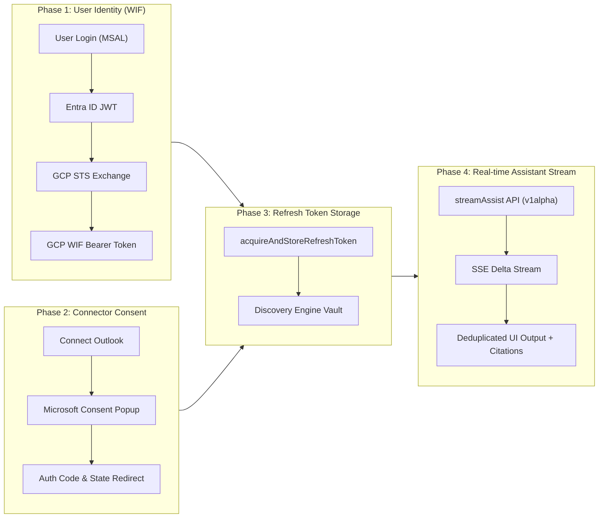
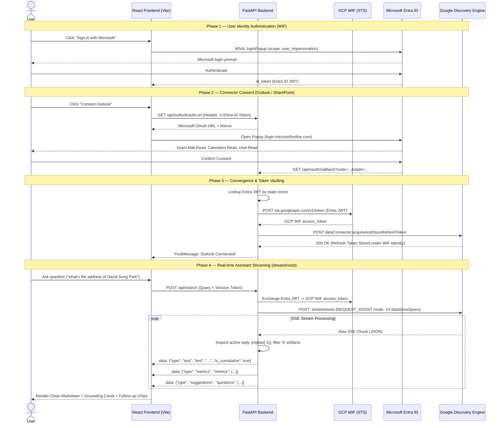

# Executive Assistant & Outlook StreamAssist — Complete Flow Guide

This document provides a comprehensive end-to-end breakdown of the authentication, connector consent, identity federation, real-time `streamAssist` interaction, and approval inbox architecture implemented in this project.

---

## 1. High-Level Architecture Flow

---

## 2. Detailed Sequence Diagram

---

## 3. Key Backend Endpoints Reference

| Endpoint | Method | Description | Colab Notebook Alignment |
| :--- | :--- | :--- | :--- |
| `/api/outlook/auth-url` | `GET` | Generates the Microsoft OAuth authorization URL with required scopes. | **Step 2 (Get Widget Config / Auth URIs)** |
| `/api/oauth/callback` | `GET` | Handles the OAuth redirect code & exchanges Entra JWT for GCP WIF token. | **Step 3 & 4 (Retrieve Auth Code & Post Token)** |
| `/api/oauth/exchange` | `POST` | Posts `fullRedirectUri` to `dataConnector:acquireAndStoreRefreshToken`. | **Step 4 (Acquire & Store Refresh Token)** |
| `/api/outlook/check-connection` | `GET` | Calls `dataConnector:acquireAccessToken` to verify active connection. | **Step 5 (Check Connector Auth State)** |
| `/api/search` | `POST` | Streams assistant responses via `streamAssist` across 14 dataStores. | **Step 7 (Assistant Execution)** |
| `/api/approvals` | `GET` | Scans user inbox for pending approvals using `streamAssist`. | **Action Items Inbox Pipeline** |
| `/api/approvals/act` | `POST` | Executes automated email reply on Outlook via Microsoft Graph API. | **Executive Action Execution** |

---

## 4. Alignment with `[external]fed_connector_authflow.ipynb`

This codebase implements 100% of the connector lifecycle described in Google's official Discovery Engine Federated Search Connector notebook:

1. **WIF Identity Delegation:** User identity is asserted using Entra ID tokens transformed into GCP access tokens via STS without storing service account keys.
2. **Dynamic DataStore Resolution:** Automatically resolves engine dataStore specifications across SharePoint, Outlook, and ServiceNow.
3. **SSE Deduplication Guarantee:** Processes `replies[-1]` per chunk and uses cumulative text synchronization (`is_cumulative: True`) to eliminate duplicate lines and mangled headers.
