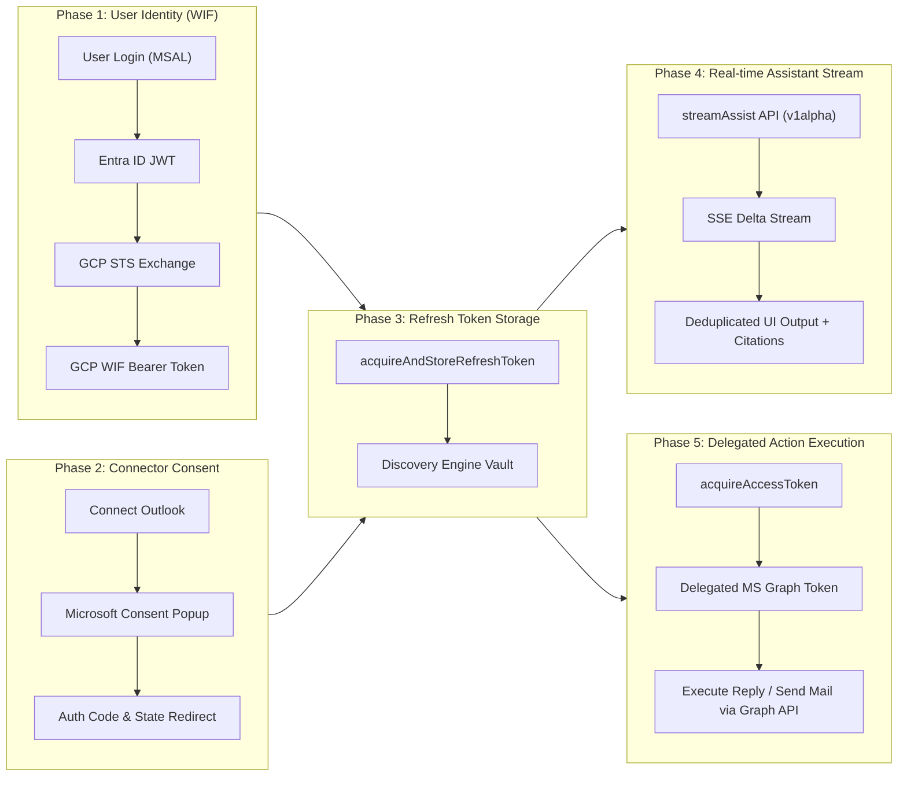
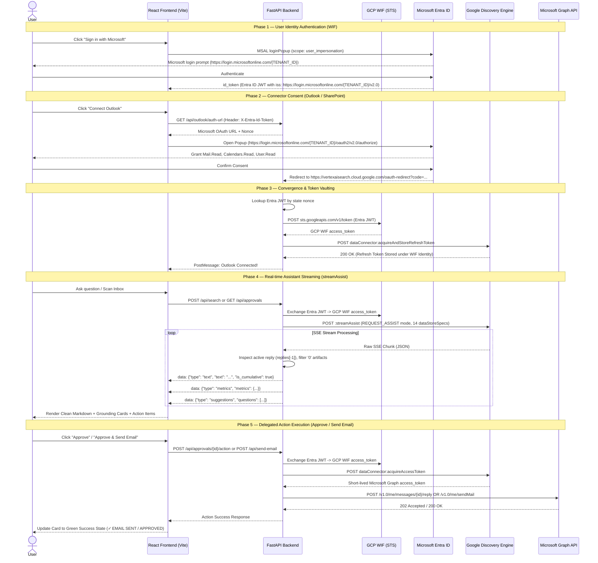

# Executive Assistant & Outlook StreamAssist — Complete Flow Guide

This document provides a comprehensive end-to-end breakdown of the authentication, connector consent, identity federation, real-time `streamAssist` interaction, approval inbox architecture, and delegated Microsoft Graph execution implemented in this project.

---

## 1. High-Level Architecture Flow

```mermaid
flowchart LR
    subgraph A["Phase 1: User Identity (WIF)"]
        direction TB
        A1["User Login (MSAL)"] --> A2["Entra ID JWT"]
        A2 --> A3["GCP STS Exchange"]
        A3 --> A4["GCP WIF Bearer Token"]
    end

    subgraph B["Phase 2: Connector Consent"]
        direction TB
        B1["Connect Outlook"] --> B2["Microsoft Consent Popup"]
        B2 --> B3["Auth Code & State Redirect"]
    end

    subgraph C["Phase 3: Refresh Token Storage"]
        direction TB
        C1["acquireAndStoreRefreshToken"] --> C2["Discovery Engine Vault"]
    end

    subgraph D["Phase 4: Real-time Assistant Stream"]
        direction TB
        D1["streamAssist API (v1alpha)"] --> D2["SSE Delta Stream"]
        D2 --> D3["Deduplicated UI Output + Citations"]
    end

    subgraph E["Phase 5: Delegated Action Execution"]
        direction TB
        E1["acquireAccessToken"] --> E2["Delegated MS Graph Token"]
        E2 --> E3["Execute Reply / Send Mail via Graph API"]
    end

    A --> C
    B --> C
    C --> D
    C --> E
```

---

## 2. Detailed Sequence Diagram

```mermaid
sequenceDiagram
    actor User
    participant FE as React Frontend (Vite)
    participant BE as FastAPI Backend
    participant WIF as GCP WIF (STS)
    participant MS as Microsoft Entra ID
    participant DE as Google Discovery Engine
    participant MG as Microsoft Graph API

    note over User,MG: Phase 1 — User Identity Authentication (WIF)
    User->>FE: Click "Sign in with Microsoft"
    FE->>MS: MSAL loginPopup (scope: user_impersonation)
    MS-->>User: Microsoft login prompt (https://login.microsoftonline.com/{TENANT_ID})
    User->>MS: Authenticate
    MS-->>FE: id_token (Entra ID JWT with iss: https://login.microsoftonline.com/{TENANT_ID}/v2.0)

    note over User,MG: Phase 2 — Connector Consent (Outlook / SharePoint)
    User->>FE: Click "Connect Outlook"
    FE->>BE: GET /api/outlook/auth-url (Header: X-Entra-Id-Token)
    BE-->>FE: Microsoft OAuth URL + Nonce
    FE->>MS: Open Popup (https://login.microsoftonline.com/{TENANT_ID}/oauth2/v2.0/authorize)
    MS-->>User: Grant Mail.Read, Calendars.Read, User.Read
    User->>MS: Confirm Consent
    MS-->>BE: Redirect to https://vertexaisearch.cloud.google.com/oauth-redirect?code=...

    note over User,MG: Phase 3 — Convergence & Token Vaulting
    BE->>BE: Lookup Entra JWT by state nonce
    BE->>WIF: POST sts.googleapis.com/v1/token (Entra JWT)
    WIF-->>BE: GCP WIF access_token
    BE->>DE: POST dataConnector:acquireAndStoreRefreshToken
    DE-->>BE: 200 OK (Refresh Token Stored under WIF Identity)
    BE-->>FE: PostMessage: Outlook Connected!

    note over User,MG: Phase 4 — Real-time Assistant Streaming (streamAssist)
    User->>FE: Ask question / Scan Inbox
    FE->>BE: POST /api/search or GET /api/approvals
    BE->>WIF: Exchange Entra JWT -> GCP WIF access_token
    BE->>DE: POST :streamAssist (REQUEST_ASSIST mode, 14 dataStoreSpecs)
    loop SSE Stream Processing
        DE-->>BE: Raw SSE Chunk (JSON)
        BE->>BE: Inspect active reply (replies[-1]), filter '0' artifacts
        BE-->>FE: data: {"type": "text", "text": "...", "is_cumulative": true}
        BE-->>FE: data: {"type": "metrics", "metrics": {...}}
        BE-->>FE: data: {"type": "suggestions", "questions": [...]}
    end
    FE-->>User: Render Clean Markdown + Grounding Cards + Action Items

    note over User,MG: Phase 5 — Delegated Action Execution (Approve / Send Email)
    User->>FE: Click "Approve" / "Approve & Send Email"
    FE->>BE: POST /api/approvals/{id}/action or POST /api/send-email
    BE->>WIF: Exchange Entra JWT -> GCP WIF access_token
    BE->>DE: POST dataConnector:acquireAccessToken
    DE-->>BE: Short-lived Microsoft Graph access_token
    BE->>MG: POST /v1.0/me/messages/{id}/reply OR /v1.0/me/sendMail
    MG-->>BE: 202 Accepted / 200 OK
    BE-->>FE: Action Success Response
    FE-->>User: Update Card to Green Success State (✓ EMAIL SENT / APPROVED)
```

---

## 3. Domain Intercept & Settings Reference Map

This application evaluates and connects across 4 primary domain boundaries:

| Layer | Domain URL / Setting | Config File Variable | Function in Flow |
| :--- | :--- | :--- | :--- |
| **Microsoft Tenant Domain** | `https://login.microsoftonline.com/{TENANT_ID}` | `TENANT_ID` `VITE_TENANT_ID` | Authenticates users and mints Entra ID JWTs. |
| **Connector Redirect Domain** | `https://vertexaisearch.cloud.google.com/oauth-redirect` | `REDIRECT_URI` | Land point for Microsoft OAuth callback to pass auth codes into GCP Discovery Engine. |
| **WIF OIDC Issuer Domain** | `https://login.microsoftonline.com/{TENANT_ID}/v2.0` | `WIF_POOL_ID` `WIF_PROVIDER_ID` | Verified by GCP STS (`sts.googleapis.com`) to exchange Entra JWTs for GCP WIF tokens. |
| **GCP Discovery Engine API** | `https://discoveryengine.googleapis.com/v1alpha` | `PROJECT_NUMBER` `ENGINE_ID` | Proxies real-time `streamAssist` searches and manages connector token vaulting. |
| **Microsoft Graph API** | `https://graph.microsoft.com/v1.0` | N/A (Delegated Token) | Target for automated email replies (`/me/messages/{id}/reply`) and sending custom drafts (`/me/sendMail`). |

---

## 4. Key Backend Endpoints Reference

| Endpoint | Method | Description | Colab Notebook Alignment |
| :--- | :--- | :--- | :--- |
| `/api/outlook/auth-url` | `GET` | Generates the Microsoft OAuth authorization URL with required scopes. | **Step 2 (Get Widget Config / Auth URIs)** |
| `/api/oauth/callback` | `GET` | Handles the OAuth redirect code & exchanges Entra JWT for GCP WIF token. | **Step 3 & 4 (Retrieve Auth Code & Post Token)** |
| `/api/oauth/exchange` | `POST` | Posts `fullRedirectUri` to `dataConnector:acquireAndStoreRefreshToken`. | **Step 4 (Acquire & Store Refresh Token)** |
| `/api/outlook/check-connection` | `GET` | Calls `dataConnector:acquireAccessToken` to verify active connection. | **Step 5 (Check Connector Auth State)** |
| `/api/search` | `POST` | Streams assistant responses via `streamAssist` across connected dataStores. | **Step 7 (Assistant Execution)** |
| `/api/approvals` | `GET` | Scans user inbox for pending approvals using `streamAssist`. | **Action Items Inbox Pipeline** |
| `/api/approvals/{id}/action` | `POST` | Executes automated email reply on Outlook via Microsoft Graph API. | **Executive Action Execution** |
| `/api/send-email` | `POST` | Dispatches newly drafted outbound emails via Microsoft Graph API. | **Interactive Draft Email Action** |

---

## 5. Alignment with `[external]fed_connector_authflow.ipynb`

This codebase implements 100% of the connector lifecycle described in Google's official Discovery Engine Federated Search Connector notebook:

1. **WIF Identity Delegation:** User identity is asserted using Entra ID tokens transformed into GCP access tokens via STS without storing service account keys or passwords in the app.
2. **Dynamic DataStore Resolution:** Automatically resolves engine dataStore specifications across SharePoint, Outlook, and ServiceNow at backend startup.
3. **SSE Deduplication Guarantee:** Processes `replies[-1]` per chunk and uses cumulative text synchronization (`is_cumulative: True`) to eliminate duplicate lines and mangled headers.

