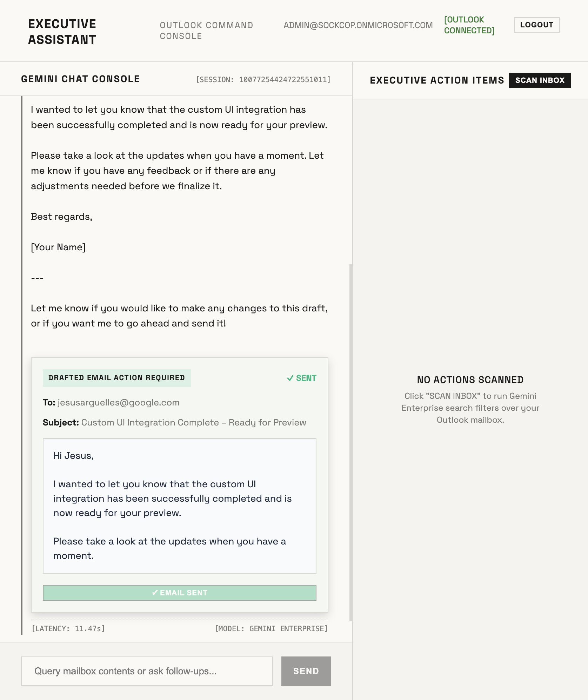
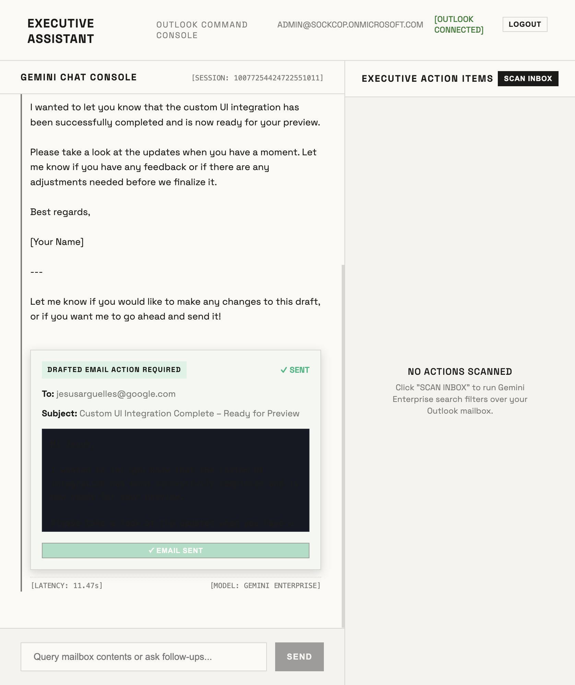

# Outlook Approval Chatbot & Executive Dashboard

> *A custom dashboard featuring a Gemini Enterprise chatbot and a real-time Action Items/Approvals inbox, powered by WIF and Microsoft Graph.*

---

## Architecture Overview

This project implements a split-pane executive workspace:
1. **Left Pane (Gemini Chat Console):** A flat technical chat console that interacts with the user's Outlook inbox and calendar using Gemini Enterprise `streamAssist`.
2. **Right Pane (Executive Action Items):** A dynamic inbox that scans the user's recent Outlook emails for tasks requiring approval, sign-off, or decisions.
   - **Direct Actions:** Click "Approve" or "Reject" to automatically send a reply email to the thread on Outlook on behalf of the user using a delegated Microsoft Graph access token.

```
+------------------------------------------------------------------------------------+
| EXECUTIVE ASSISTANT                                           [OUTLOOK CONNECTED]  |
+--------------------------------------------------+---------------------------------+
|                                                  | EXECUTIVE ACTION ITEMS          |
|  USER                                            | +-----------------------------+ |
|  Scan for tonight's deployment status            | | APPROVAL                    | |
|                                                  | | Go/no-go tonight's v2.3 deploy| |
|  GEMINI ENTERPRISE                               | | Aleksandra Kiszkiel         | |
|  I searched your emails...                       | | Review and provide decision.| |
|                                                  | | [APPROVE]  [REJECT]           | |
|                                                  | +-----------------------------+ |
|                                                  |                                 |
+--------------------------------------------------+---------------------------------+
```

---

## Quick Start

### 1. Configure Sibling Credentials
Create your `.env` files for both backend and frontend.

**Backend (`backend/.env`):**
```env
PROJECT_NUMBER=YOUR_GCP_PROJECT_NUMBER
ENGINE_ID=gemini-enterprise
CONNECTOR_ID=YOUR_OUTLOOK_CONNECTOR_ID
WIF_POOL_ID=YOUR_WORKFORCE_POOL_ID
WIF_PROVIDER_ID=YOUR_WORKFORCE_PROVIDER_ID
CONNECTOR_CLIENT_ID=YOUR_MS_CONNECTOR_APP_CLIENT_ID
TENANT_ID=YOUR_MS_TENANT_ID
REDIRECT_URI=https://vertexaisearch.cloud.google.com/oauth-redirect
```

**Frontend (`frontend/.env`):**
```env
VITE_CLIENT_ID=YOUR_MS_PORTAL_APP_CLIENT_ID
VITE_TENANT_ID=YOUR_MS_TENANT_ID
```

### 2. Run the App
Always use `uv` for backend python tasks.

```bash
# Terminal 1: Backend
cd backend
uv sync
uv run python main.py # Runs on port 8005

# Terminal 2: Frontend
cd frontend
npm install
npm run dev # Runs on port 5173 (proxies /api to 8005)
```

---

## Infrastructure Setup

This setup matches the architecture described in `outlook-streamassist-oauth-flow/README.md`.

### 1. Microsoft Entra ID — Portal App (MSAL login)
- **Redirect URI:** Single-page application → `http://localhost:5173`
- **Expose an API:** Add scope `user_impersonation` (Application ID URI: `api://{client-id}`).
- **Manifest:** Set `"oauth2AllowIdTokenImplicitFlow": true`.
- **API Permissions:** `openid`, `profile`, `email`, `offline_access`, `User.Read`.

### 2. Microsoft Entra ID — Connector App (Outlook OAuth)
- **Redirect URI (Web):** `https://vertexaisearch.cloud.google.com/oauth-redirect`
- **API Permissions:** `Calendars.Read`, `Mail.Read`, `User.Read`.
- **Secret:** Create a client secret and copy its value.

### 3. Google Cloud — Workforce Identity Federation
Configure WIF provider with issuer URI pointing to Entra and client ID set to `api://PORTAL_APP_CLIENT_ID`. Ensure workforce members have `roles/discoveryengine.editor` in your GCP project.

### 4. Gemini Enterprise App
Create a Search App named `gemini-enterprise` in location `global` with Microsoft Outlook as a federated data store using your Connector App's client ID and secret.

---

## Approvals & Direct Actions Flow

1. When **Scan Inbox** is clicked, the backend calls Gemini Enterprise StreamAssist using the scanning prompt.
2. The model returns a structured JSON payload representing the items requiring attention.
3. The frontend renders these items as technical grid cards.
4. When **Approve** or **Reject** is clicked:
    - The backend requests a delegated Microsoft Graph access token using GCP's `dataConnector:acquireAccessToken` API.
    - The backend calls Microsoft Graph's `/me/messages/{id}/reply` endpoint to send a reply ("Approved." or "Rejected.") to the email thread.
    - The card transitions to a success/actioned state.

---

## Interactive Chat Drafting & Send Approval Flow

In addition to processing existing inbox action items, the **Gemini Chat Console** supports composing and sending newly drafted outbound emails using the same secure validation pipeline:

1. **Request a Draft**: The user asks Gemini to compose a new message (e.g., *"Draft an email to jesusarguelles@google.com saying..."*).
2. **AI Composition**: Gemini Enterprise queries your mailbox context, generates the appropriate draft body, and renders it inside the chat console.
3. **Dynamic Interactive Card**: The frontend automatically parses the draft parameters (To, Subject, and Body) from Gemini's response and renders a beautiful, high-contrast, slate-themed **DRAFTED EMAIL ACTION REQUIRED** card directly under the message block:
   
   
   
4. **One-Click Dispatch**: When the user clicks **APPROVE & SEND EMAIL**, the client issues a POST request to `/api/send-email`. The backend secures a delegated Microsoft Graph Access token and dispatches the email via `/v1.0/me/sendMail`.
5. **Visual Confirmation**: Upon successful delivery, the card updates dynamically to show a green success state (`✓ EMAIL SENT`):

   

This ensures high-privilege operations remain secure, intuitive, and under direct user control with full visual alignment.
