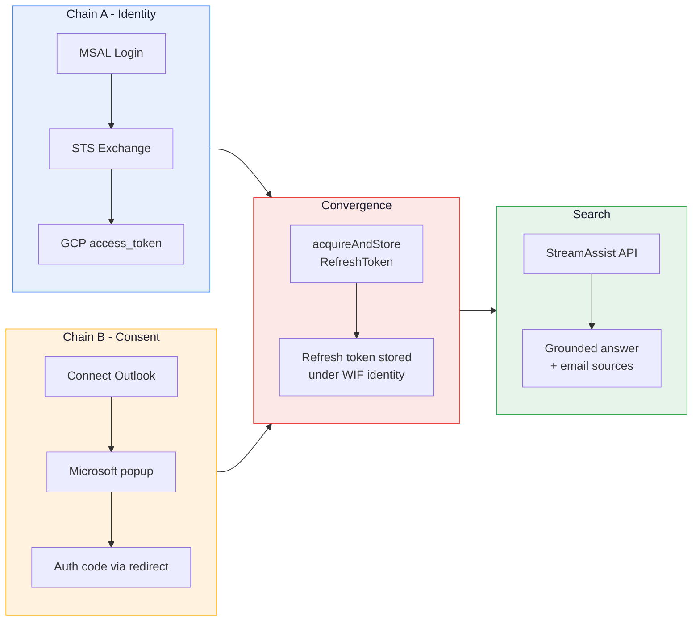
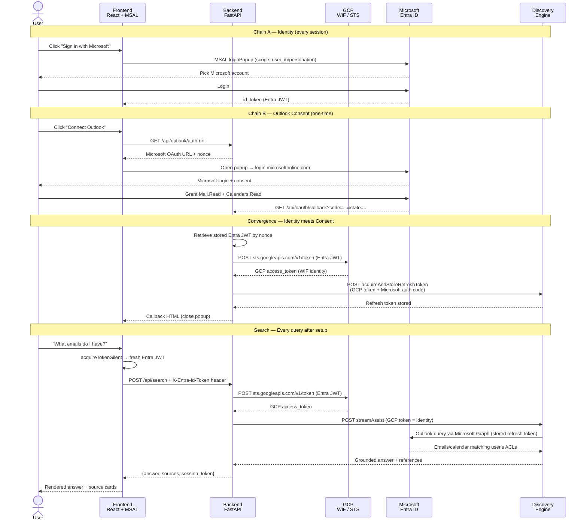

# Outlook StreamAssist OAuth Flow

> *Custom Outlook Portal — Gemini Enterprise StreamAssist with per-user OAuth, zero credential storage.*


---

## Overview

Search your Outlook emails and calendar from a custom React UI, powered by Gemini Enterprise StreamAssist with per-user federated search. Users sign in with Microsoft (MSAL), and the app exchanges their Entra JWT for a GCP identity via Workforce Identity Federation. No credentials are stored in the app — Discovery Engine holds the Outlook refresh token mapped to each user's WIF identity.

### vs `streamassist-oauth-flow` (SharePoint variant)

| | **This project (Outlook)** | streamassist-oauth-flow (SharePoint) |
|---|---|---|
| Data source | Outlook (Mail, Calendar, Contacts) | SharePoint (Files, Pages, Events) |
| OAuth scopes | `Mail.Read`, `Calendars.Read` | `AllSites.Read`, `Sites.Search.All` |
| Entity types | mail, mail-attachment, calendar, contact | file, page, comment, event, attachment |
| Ports | Backend `8005`, Frontend `5175` | Backend `8003`, Frontend `5174` |
| Identity | Same — Entra JWT → WIF → GCP token | Same |

---

## The Flow

### High-Level Phases



### Sequence Diagram



---

## Quick Reference

```
outlook-streamassist-oauth-flow/
├── backend/
│   ├── main.py              # All endpoints — OAuth + WIF + StreamAssist (~360 lines)
│   ├── auth_outlook.py      # One-shot Playwright-based OAuth (CLI tool)
│   ├── .env                 # Required env vars
│   └── pyproject.toml
├── frontend/
│   ├── src/
│   │   ├── App.tsx          # Chat UI + MSAL auth + debug sidebar
│   │   ├── authConfig.ts    # MSAL configuration + scopes
│   │   ├── main.tsx         # React entry point with MsalProvider
│   │   └── index.css        # Dark theme + sidebar styles
│   ├── .env
│   └── package.json
└── README.md
```

---

## Setup

### Run

```bash
# Backend
cd backend
uv sync
uv run python main.py    # port 8005

# Frontend (separate terminal)
cd frontend
npm install
npm run dev              # port 5175
```

### Environment Variables

**Backend** (`backend/.env`):

| Variable | Description |
|----------|-------------|
| `PROJECT_NUMBER` | GCP project number (e.g., `545964020693`) |
| `ENGINE_ID` | Gemini Enterprise engine ID |
| `CONNECTOR_ID` | Outlook connector ID (auto-generated, e.g., `outlook-def-connector_1776355361624`) |
| `WIF_POOL_ID` | Workforce Identity Federation pool ID |
| `WIF_PROVIDER_ID` | WIF OIDC provider ID |
| `CONNECTOR_CLIENT_ID` | Entra Connector App client ID |
| `TENANT_ID` | Entra tenant ID |
| `REDIRECT_URI` | Must be `https://vertexaisearch.cloud.google.com/oauth-redirect` |
| `CONNECTOR_CLIENT_SECRET` | Entra Connector App client secret |

**Frontend** (`frontend/.env`):

| Variable | Description |
|----------|-------------|
| `VITE_CLIENT_ID` | Entra Portal App client ID |
| `VITE_TENANT_ID` | Entra tenant ID |

---

## Prerequisites

> Four things need to be configured before running: two Entra app registrations, a WIF pool/provider, and a Gemini Enterprise app with an Outlook connector.

---

### 1. Microsoft Entra ID — Portal App (MSAL login)

The Portal App handles user sign-in via MSAL.js. Its `id_token` is exchanged for a GCP token through WIF.

> **NOTE:** Standard Gemini Enterprise with WIF does **not** require any Microsoft Graph API permissions on the WIF app — Google's built-in auth handles identity federation natively. The permissions below are required **only because this project uses a custom React UI with MSAL.js** for authentication instead of the standard Gemini Enterprise interface.

#### Create App Registration

```
Entra Admin Center → App registrations → New registration
→ Name: "Outlook-Portal" (or reuse an existing Portal App)
→ Supported account types: Single tenant
→ Redirect URI: Single-page application → http://localhost:5175
```

#### Expose an API

```
App registration → Expose an API → Add a scope
→ Application ID URI: api://{client-id} (accept default)
→ Scope name: user_impersonation
→ Who can consent: Admins and users
```

This creates the `api://{client-id}/user_impersonation` scope that sets the `aud` claim WIF validates.

#### Edit Manifest

```
App registration → Manifest → Find and set:
"oauth2AllowIdTokenImplicitFlow": true
```

> **IMPORTANT:** Without this flag, WIF silently rejects the `id_token`. The STS exchange returns a generic error with no indication that this setting is the problem.

#### Add API Permissions (custom UI only)

These permissions are needed by MSAL.js in the custom React frontend. They are **not required** if using standard Gemini Enterprise authentication.

```
App registration → API permissions → Add a permission
→ Microsoft Graph → Delegated permissions:
  ✓ openid             (Sign users in — MSAL needs this to obtain an id_token)
  ✓ profile            (View users' basic profile — for user display name)
  ✓ email              (View users' email address — required for WIF attribute mapping: google.subject=assertion.email)
  ✓ offline_access     (Maintain access — enables MSAL acquireTokenSilent for silent token renewal)
  ✓ User.Read          (Sign in and read user profile — standard MSAL sign-in scope)
```

#### Token Configuration

```
App registration → Token configuration → Add optional claim
→ Token type: ID
→ Claims: email, groups (optional)
```

**Note down:**
- **Application (client) ID** → `VITE_CLIENT_ID`
- **Directory (tenant) ID** → `VITE_TENANT_ID` and `TENANT_ID`

---

### 2. Microsoft Entra ID — Connector App (Outlook OAuth)

The Connector App handles Outlook consent. Discovery Engine uses it to access Outlook (via Microsoft Graph) on behalf of users.

#### Create App Registration

```
Entra Admin Center → App registrations → New registration
→ Name: "Outlook-Connector"
→ Supported account types: Single tenant
→ Redirect URI (Web): https://vertexaisearch.cloud.google.com/oauth-redirect
```

Add a second redirect URI:
```
→ https://vertexaisearch.cloud.google.com/console/oauth/sharepoint_oauth.html
```

> **IMPORTANT:** The first redirect URI **must** be exactly `https://vertexaisearch.cloud.google.com/oauth-redirect`. This is what `acquireAndStoreRefreshToken` expects internally.

#### Add API Permissions

```
App registration → API permissions → Add a permission
→ Microsoft Graph → Delegated permissions:
  ✓ Calendars.Read    (Read user calendars)
  ✓ Mail.Read         (Read user mail)
  ✓ User.Read         (Sign in and read user profile)
```

> **NOTE:** `offline_access` and `openid` are not added as app permissions — they are requested at runtime in the OAuth scope string. Admin consent is optional; users consent individually during the popup flow.

#### Create Client Secret

```
App registration → Certificates & secrets → New client secret
→ Description: "Outlook connector"
→ Expires: 24 months (recommended)
→ Copy the Value (not the Secret ID)
```

**Note down:**
- **Application (client) ID** → `CONNECTOR_CLIENT_ID`
- **Client secret Value** → `CONNECTOR_CLIENT_SECRET`

---

### 3. Google Cloud — Workforce Identity Federation

WIF maps Entra ID tokens to GCP identities. Users sign in with Microsoft, and WIF translates that into a GCP identity that Discovery Engine recognizes.

#### Create Workforce Pool

```bash
gcloud iam workforce-pools create sp-wif-pool \
  --location=global \
  --organization=ORGANIZATION_ID \
  --session-duration=3600s
```

#### Create OIDC Provider

```bash
gcloud iam workforce-pools providers create-oidc ge-login-provider \
  --workforce-pool=sp-wif-pool \
  --location=global \
  --issuer-uri="https://login.microsoftonline.com/TENANT_ID/v2.0" \
  --client-id="api://PORTAL_APP_CLIENT_ID" \
  --attribute-mapping="google.subject=assertion.sub"
```

> **IMPORTANT:** The `--client-id` (audience) must be `api://{portal-app-client-id}` — matching the Portal App's "Expose an API" URI. This is what the `aud` claim in the Entra JWT is set to.

#### Grant IAM Permissions

```bash
gcloud projects add-iam-policy-binding PROJECT_ID \
  --member="principalSet://iam.googleapis.com/locations/global/workforcePools/sp-wif-pool/*" \
  --role="roles/discoveryengine.editor"
```

**Note down:**
- Pool ID → `WIF_POOL_ID`
- Provider ID → `WIF_PROVIDER_ID`

---

### 4. Gemini Enterprise — Search App + Outlook Connector

#### Create a Search App (or reuse existing)

```
Cloud Console → Agent Builder → Apps → Create App
→ Type: Search
→ Enterprise features: ON (required for StreamAssist)
→ App name: e.g., "gemini-enterprise"
→ Region: global
```

Note down the **Engine ID** from the app URL → `ENGINE_ID`.

#### Add Microsoft Outlook Connector

```
Agent Builder → Data Stores → Create Data Store
→ Source: Microsoft Outlook
→ Tenant ID: your Entra tenant ID
→ Client ID: Connector App client ID (from step 2)
→ Client Secret: Connector App secret (from step 2)
→ Entity types: Select all (mail, mail-attachment, calendar, contact)
→ EEEU: Enabled
→ Sync mode: Federated (no data copied)
```

Note down the **Connector ID** (auto-generated, e.g., `outlook-def-connector_1776355361624`) → `CONNECTOR_ID`.

#### Connect the Data Stores to Your App

```
Agent Builder → Apps → your app → Data Stores
→ Add all 4 Outlook data stores (mail, mail-attachment, calendar, contact)
```

> **TIP:** The connector creates 4 sub-data-stores automatically: `{CONNECTOR_ID}_mail`, `_mail-attachment`, `_calendar`, `_contact`. The backend fetches these dynamically at startup from the connector API — no hardcoding needed.

#### How Federated Search Works

Unlike indexed connectors that crawl and store documents, the Outlook **federated connector** queries Microsoft Graph in real-time at search time:

```
User query → StreamAssist → Discovery Engine → Microsoft Graph API (live) → Results
```

- No email data is copied into Google Cloud
- Per-user ACLs are enforced via the stored refresh token
- Results are always current (no sync delay)
- The `acquireAndStoreRefreshToken` API maps each user's Outlook credentials to their WIF identity

---

## Key Implementation Details

### Dynamic DataStore Discovery

The backend fetches `dataStoreSpecs` from the connector API at startup instead of hardcoding entity types:

```python
# backend/main.py — called once at startup
def _fetch_datastore_specs() -> list[dict]:
    resp = requests.get(f"{CONNECTOR_URL}/dataConnector", headers=headers)
    return [{"dataStore": e["dataStore"]} for e in resp.json()["entities"] if e.get("dataStore")]
```

If you add or remove entities from the connector in GCP Console, restart the backend to pick up changes.

### StreamAssist Payload — `toolsSpec` vs `dataStoreSpecs`

StreamAssist requires `toolsSpec.vertexAiSearchSpec.dataStoreSpecs` (not top-level `dataStoreSpecs`) to reliably search federated connectors:

```python
# Correct — works reliably
payload = {
    "query": {"text": query},
    "toolsSpec": {
        "vertexAiSearchSpec": {
            "dataStoreSpecs": [{"dataStore": "projects/.../dataStores/..."}]
        }
    }
}

# Unreliable for newer connectors
payload = {
    "query": {"text": query},
    "dataStoreSpecs": [{"dataStore": "..."}]  # may be ignored
}
```

### Two-Chain OAuth Architecture

**Chain A (Identity):** MSAL login → Entra JWT → STS exchange → GCP WIF token. This happens on every session.

**Chain B (Consent):** One-time OAuth popup → Microsoft consent for Mail.Read/Calendars.Read → auth code → `acquireAndStoreRefreshToken` stores refresh token under the WIF identity.

After the one-time consent, every search just needs Chain A — the stored refresh token is automatically used by Discovery Engine for federated search.

---

## Gotchas

| # | Issue | Detail |
|---|-------|--------|
| 1 | **WIF token, not ADC** | `acquireAndStoreRefreshToken` must use a WIF token. ADC stores the token under the service account identity → `acquireAccessToken` returns 404 for WIF users. |
| 2 | **`oauth2AllowIdTokenImplicitFlow`** | Must be `true` in the Portal App's Entra manifest. Without it, WIF silently rejects the id_token. |
| 3 | **COOP blocks postMessage** | `vertexaisearch.cloud.google.com` sets Cross-Origin-Opener-Policy. Frontend uses popup-closed polling as fallback. |
| 4 | **redirect_uri is hardcoded** | `acquireAndStoreRefreshToken` always uses `vertexaisearch.cloud.google.com/oauth-redirect` internally. Your Connector App must register this exact URI. |
| 5 | **`state` must be base64** | The redirect page at `vertexaisearch.cloud.google.com` expects base64-encoded state. Raw JSON throws `Illegal base64 character`. |
| 6 | **Natural language only** | Keyword queries return `NON_ASSIST_SEEKING_QUERY_IGNORED`. Always phrase as questions. |
| 7 | **`session` not `assistToken`** | StreamAssist returns `assistToken` but rejects it as input. Use `sessionInfo.session` for follow-ups. |
| 8 | **Use `toolsSpec` format** | Top-level `dataStoreSpecs` may not trigger federated search for newer connectors. Use `toolsSpec.vertexAiSearchSpec.dataStoreSpecs` instead. |
