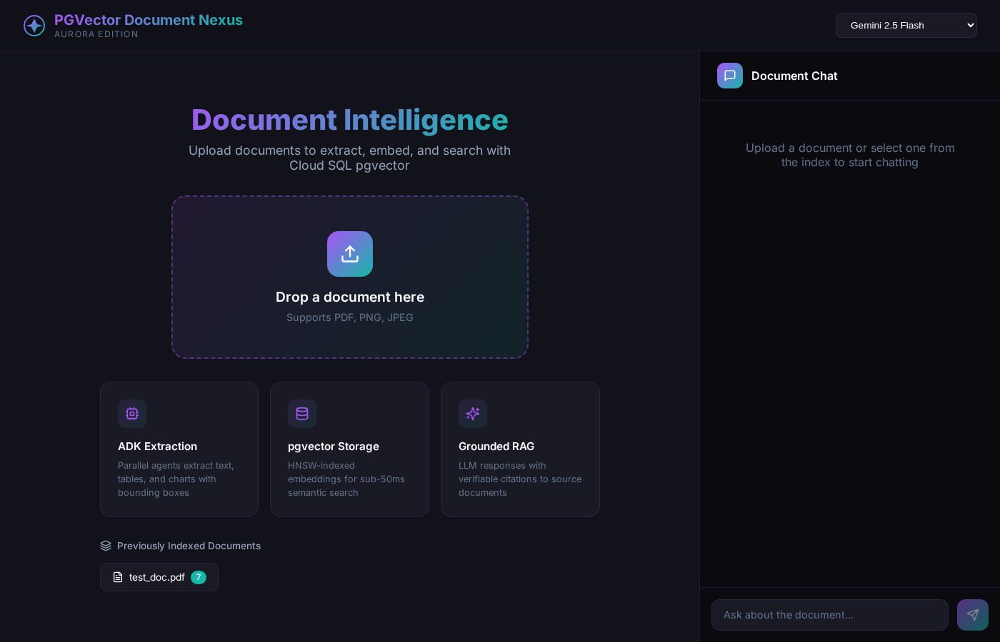
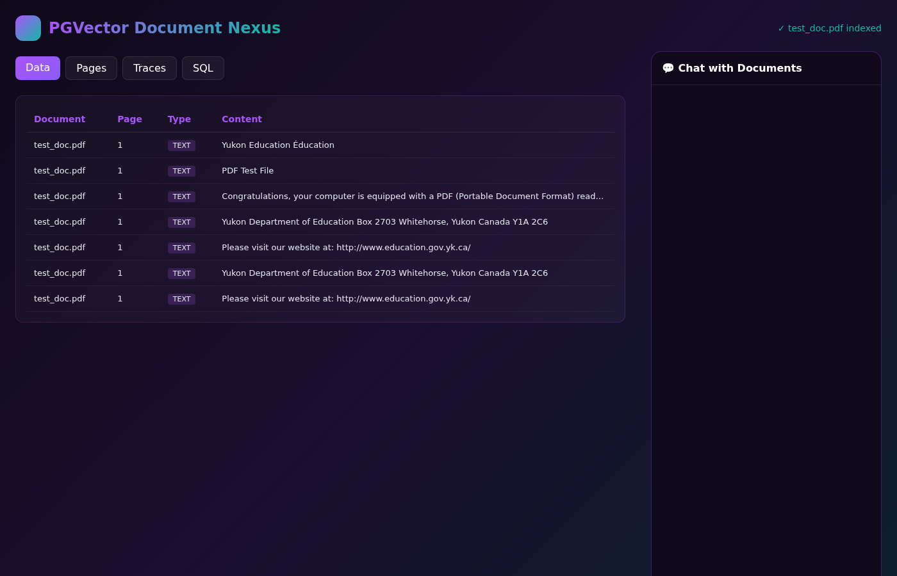
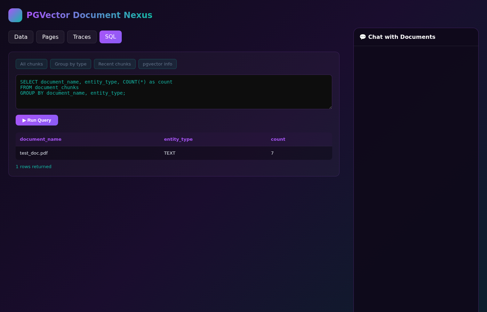
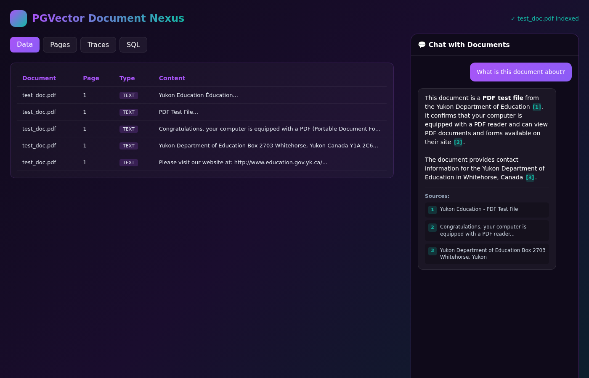
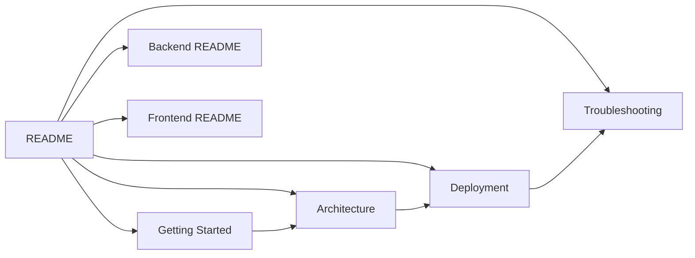

# PGVector Document Nexus

> **Multimodal document intelligence platform using Cloud SQL with pgvector for semantic search and grounded chat.**

A production-ready document processing system that extracts entities from PDFs (text, tables, charts), generates embeddings via Vertex AI, and stores them in Cloud SQL with pgvector for fast semantic retrieval. Features a modern "Aurora" UI theme with purple/teal gradients.

## What This Project Does

```
+------------------------------------------------------------------+
|                  USER UPLOADS: document.pdf                       |
+------------------------------------------------------------------+
                               |
                               v
+------------------------------------------------------------------+
|  ADK PARALLEL EXTRACTION                                          |
|  - Split PDF into pages                                           |
|  - Gemini 2.5 Flash extracts text, tables, charts with bounding   |
|    boxes from each page concurrently                              |
+------------------------------------------------------------------+
                               |
                               v
+------------------------------------------------------------------+
|  VERTEX AI EMBEDDINGS                                             |
|  - text-embedding-004 generates 768-dim vectors                   |
|  - Batch processing with rate limiting                            |
+------------------------------------------------------------------+
                               |
                               v
+------------------------------------------------------------------+
|  CLOUD SQL PGVECTOR                                               |
|  - Store chunks with embeddings in PostgreSQL                     |
|  - HNSW index for fast approximate nearest neighbor search        |
+------------------------------------------------------------------+
                               |
                               v
+------------------------------------------------------------------+
|  GROUNDED CHAT + SQL EXPLORER                                     |
|  - User query embedded and searched via pgvector                  |
|  - Top-k chunks injected as context                               |
|  - Gemini generates response with citations [1], [2]              |
|  - Interactive SQL tab for direct database queries                |
+------------------------------------------------------------------+
```

## Demo

### Upload View


### Dashboard - Data Tab


### SQL Query Explorer


### Chat with Citations


## Key Features

| Feature | Description | Status |
|---------|-------------|--------|
| **Multimodal Extraction** | Extract text, tables, and charts with spatial bounding boxes | Done |
| **pgvector Storage** | Cloud SQL PostgreSQL with vector extension | Done |
| **HNSW Indexing** | Fast approximate nearest neighbor search (~10-50ms) | Done |
| **Grounded RAG Chat** | LLM responses with document citations | Done |
| **SQL Query Tab** | Interactive SQL explorer for database inspection | Done |
| **Aurora UI Theme** | Modern glassmorphic design with purple/teal gradients | Done |

## Quick Start

### Prerequisites

- Python 3.12+
- Node.js 20+
- Google Cloud SDK authenticated (`gcloud auth login`)

### One-Script Setup (Cloud SQL + App)

```bash
# Set your variables
export PROJECT_ID=your-project-id
export REGION=us-central1
export INSTANCE_NAME=pgvector-nexus
export DB_PASSWORD=your-secure-password

# 1. Create Cloud SQL with pgvector (takes 5-10 min)
gcloud config set project $PROJECT_ID
gcloud sql instances create $INSTANCE_NAME \
  --database-version=POSTGRES_15 \
  --cpu=2 \
  --memory=8GB \
  --region=$REGION \
  --root-password=$DB_PASSWORD \
  --database-flags=cloudsql.enable_pgvector=on

# 2. Create database and user
gcloud sql databases create pgvector_doc_nexus --instance=$INSTANCE_NAME
gcloud sql users create emb-admin --instance=$INSTANCE_NAME --password=$DB_PASSWORD

# 3. Authorize your IP
MY_IP=$(curl -s ifconfig.me)
gcloud sql instances patch $INSTANCE_NAME --authorized-networks=$MY_IP/32 --quiet

# 4. Get Cloud SQL IP
DB_HOST=$(gcloud sql instances describe $INSTANCE_NAME --format="value(ipAddresses[0].ipAddress)")
echo "Cloud SQL IP: $DB_HOST"

# 5. Navigate to project
cd semiautonomous-agents/pgvector_document_nexus

# 6. Create .env file
cat > .env << EOF
PROJECT_ID=$PROJECT_ID
LOCATION=$REGION
DB_HOST=$DB_HOST
DB_PORT=5432
DB_NAME=pgvector_doc_nexus
DB_USER=emb-admin
DB_PASSWORD=$DB_PASSWORD
EOF

# 7. Install uv (if needed)
curl -LsSf https://astral.sh/uv/install.sh | sh
export PATH="$HOME/.local/bin:$PATH"

# 8. Setup backend
cd backend && uv sync && uv run python init_db.py

# 9. Start backend (background)
uv run uvicorn main:app --host 0.0.0.0 --port 8002 &

# 10. Setup and start frontend
cd ../frontend && npm install && npm run dev
```

### If You Already Have Cloud SQL

```bash
cd semiautonomous-agents/pgvector_document_nexus

# Create .env with your existing Cloud SQL details
cat > .env << 'EOF'
PROJECT_ID=your-project
LOCATION=us-central1
DB_HOST=your-cloud-sql-ip
DB_PORT=5432
DB_NAME=pgvector_doc_nexus
DB_USER=emb-admin
DB_PASSWORD=your-password
EOF

# Backend
cd backend && uv sync && uv run python main.py

# Frontend (new terminal)
cd frontend && npm install && npm run dev
```

### Access

| Service | URL |
|---------|-----|
| **Frontend** | http://localhost:5173 |
| **Backend API** | http://localhost:8002 |
| **Health Check** | http://localhost:8002/api/health |

---

## Documentation



### Start Here

| Document | Description |
|----------|-------------|
| [Getting Started](docs/getting-started.md) | Complete setup guide from scratch |
| [Architecture](docs/architecture.md) | E2E system diagram and component overview |

### Setup & Deployment

| Document | Description |
|----------|-------------|
| [Deployment](docs/deployment.md) | Cloud SQL setup and production deployment |
| [Troubleshooting](docs/troubleshooting.md) | Common issues and solutions |

### Component Documentation

| Component | Description |
|-----------|-------------|
| [Backend](backend/README.md) | FastAPI server with pgvector integration |
| [Frontend](frontend/README.md) | React 19 Aurora-themed UI |

---

## API Endpoints

| Method | Endpoint | Description |
|--------|----------|-------------|
| `POST` | `/api/chat` | Upload documents or send chat messages |
| `POST` | `/api/sql` | Execute read-only SQL queries |
| `GET` | `/api/documents` | List indexed documents |
| `GET` | `/api/documents/{name}/data` | Get document chunks |
| `DELETE` | `/api/documents/{name}` | Delete document |
| `GET` | `/api/health` | Health check |

---

## Architecture Comparison

| Aspect | BigQuery Version | pgvector Version |
|--------|------------------|------------------|
| **Vector Store** | BigQuery VECTOR_SEARCH | Cloud SQL pgvector |
| **Index Type** | IVF (built-in) | HNSW (configurable) |
| **Query Latency** | ~200-500ms | ~10-50ms |
| **Scaling** | Serverless | Instance-based |
| **Cost Model** | Per-query | Per-instance |

---

## Project Structure

```
pgvector_document_nexus/
├── README.md                      # This file
├── .env                           # Environment config (gitignored)
├── .gitignore
├── docs/
│   ├── getting-started.md         # Complete setup guide
│   ├── architecture.md            # System design
│   ├── deployment.md              # Production deployment
│   └── troubleshooting.md         # Debug guide
├── backend/
│   ├── README.md                  # Backend documentation
│   ├── main.py                    # FastAPI server
│   ├── pipeline.py                # ADK extraction + pgvector
│   ├── init_db.py                 # Database initializer
│   └── pyproject.toml
└── frontend/
    ├── README.md                  # Frontend documentation
    ├── src/
    │   ├── App.tsx                # Main React component
    │   └── index.css              # Aurora theme styles
    └── package.json
```

---

*Built with Google ADK, Vertex AI, and Cloud SQL pgvector*
