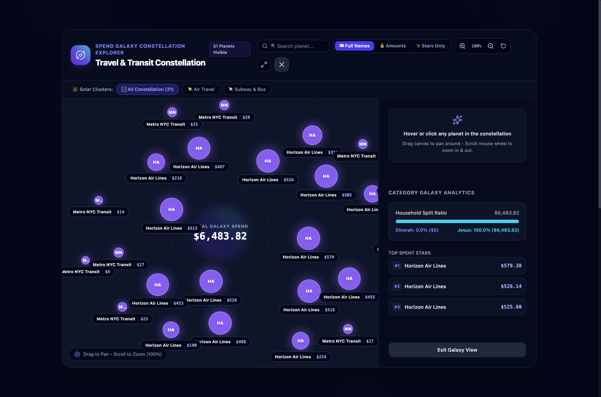
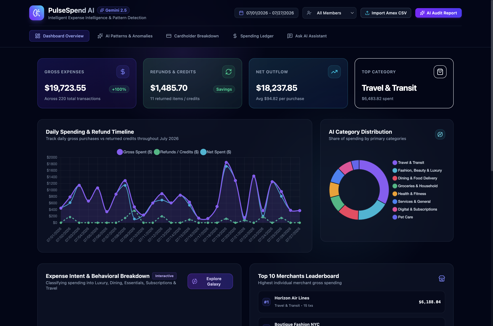

# 🌌 PulseSpend AI: Expense Intelligence & Spend Galaxy Constellations

An intelligent financial analytics platform powered by **Gemini 2.5 Flash** on Vertex AI. PulseSpend AI ingests raw credit card statements (e.g. Amex CSV exports), enriches transactions with clean merchant brands, behavioral intent labels, necessity scores, micro-tags, and renders expenses as an interactive **Cosmic Spend Galaxy Constellation** with Pan, Zoom, Subcategory Solar System Clusters, and live AI Chat Q&A.





---

## 🌟 Key Features

- **🌌 Interactive Spend Galaxy Constellation**:
  - **Floating Star Orbs**: Purchases orbit as scaled cosmic star nodes proportional to dollar amount magnitude.
  - **Always-On Brand Badges**: Clean floating merchant name pills + exact dollar values attached to every star.
  - **🖐️ Drag-to-Pan & 🔍 Scroll-to-Zoom**: Smooth pan and zoom navigation from 40% to 300% magnification.
  - **☀️ Subcategory Solar Clusters**: Filter and isolate stellar clusters by subcategory (*Supermarket*, *Apparel*, *Utilities*, *Dining*).
  - **🔎 Live Planet Search**: Type any merchant to locate and illuminate matching star nodes instantly.
  - **🖥️ Fullscreen Mode**: Expand the galaxy map to fill widescreen monitor space.

- **🤖 Gemini 2.5 Flash AI Engine**:
  - **Clean Merchant Normalization**: Strips statement junk (`AplPay`, `TST*`, `SP*`) to clean brand names (*Sephora*, *Grubhub*, *Delta*, *Whole Foods*, *Nordstrom*).
  - **Behavioral Intent Classification**: Categories into *Essential*, *Lifestyle & Luxury*, *Food & Dining*, *Subscriptions*, *Travel & Transit*, *Healthcare*, and *Pet Care*.
  - **Necessity Rating Scale (1-5 Stars)**: AI evaluates expense necessity (1 = impulse luxury, 5 = essential grocery/medical).
  - **Narrative AI Spending Audit**: Executive financial summaries, anomaly highlights, and actionable savings recommendations.
  - **Ask AI Financial Q&A Assistant**: Natural language Q&A endpoint for inquiring about household spending.

- **💳 Household Cardholder Split Analytics**:
  - Compares spending across cardholders (*Alex Morgan* vs. *Jordan Taylor*).
  - Visual ratio bars for household net outflow and category shares.

- **📥 One-Click Dynamic Amex CSV Importer**:
  - Upload any standard Amex credit card CSV export statement (`activity.csv`, `activity (1).csv`) via the top navigation bar to enrich and refresh the dashboard live.

---

## 🚀 Quick Replication & Launch

You can setup and run the entire full-stack application (FastAPI backend + Vite React frontend) with a single command:

```bash
# Clone repository
git clone https://github.com/GoogleCloudPlatform/vertex-ai-samples.git
cd vertex-ai-samples/semiautonomous-agents/pulse-spend-ai-galaxy-dashboard

# Run the replication script
./start.sh
```

The script will automatically:
1. Initialize a Python virtual environment (`.venv`) and install backend dependencies.
2. Install frontend `npm` packages.
3. Start the **FastAPI Backend Daemon** on `http://127.0.0.1:8001`.
4. Start the **Vite React Dev Server** on `http://localhost:5173`.

---

## 🛠️ Reproduction Skill & Blueprint Instructions

This repository contains a dedicated **AI Agent Skill** specifying the complete design system, physics engine, classification taxonomy, and component wireframes required to reproduce the UI/UX from scratch without copying raw source files.

### Skill Location
```
skills/pulse-spend-ai-dashboard/SKILL.md
```

### How to Use the Skill with an AI Assistant
1. **Instruct your AI Agent**:
   > *"Read `skills/pulse-spend-ai-dashboard/SKILL.md` in this repository and implement the PulseSpend AI Spending Analytics Platform and Spend Galaxy Physics Engine following the exact visual tokens, physics formulas, and API endpoints specified."*

2. **Manual Development Reference**:
   Consult `skills/pulse-spend-ai-dashboard/SKILL.md` for:
   - Golden Ratio spiral coordinate formulas ($r = 70 + \sqrt{i+1} \cdot 62$)
   - Node scale formulas ($D = \max(20, \min(56, \sqrt{|\text{amt}|} \cdot 1.9 + 14))$)
   - Amex CSV cleaning regex patterns
   - Tailwind slate cosmic color tokens & glassmorphism utilities

---

## 🏗️ Architecture & Project Structure

```
pulse-spend-ai-galaxy-dashboard/
├── backend/
│   ├── main.py                     # FastAPI API entrypoint & endpoints
│   ├── requirements.txt            # Python dependencies (fastapi, google-genai, pandas)
│   └── services/
│       ├── ai_service.py           # Gemini 2.5 Flash Vertex AI client integration
│       ├── analytics_service.py    # Statistical KPI & category aggregation service
│       └── enrichment_service.py   # Amex CSV cleaning & AI labeling engine
├── frontend/
│   ├── package.json
│   ├── vite.config.js              # Vite server & API proxy (/api -> 127.0.0.1:8001)
│   └── src/
│       ├── App.jsx                 # Dashboard orchestrator & tab state manager
│       ├── components/
│       │   ├── Navbar.jsx          # Top navigation bar with Amex CSV Importer
│       │   ├── SpendGalaxyModal.jsx# Interactive Pan/Zoom Spend Galaxy Universe modal
│       │   ├── AIAuditDrawer.jsx   # Gemini executive narrative audit report
│       │   ├── CardholderComparison.jsx # Side-by-side card member analytics
│       │   ├── CategoryBreakdownChart.jsx # Interactive category doughnut chart
│       │   ├── ExpenseTypeChart.jsx# Behavioral expense intent bar chart
│       │   ├── SpendTimelineChart.jsx # Daily spending & refund line timeline
│       │   └── TransactionsTable.jsx # Filterable spending ledger with AI tags
├── data/
│   ├── enriched_dataset.json       # Anonymized sample enriched dataset
│   └── sample_amex_activity.csv    # Anonymized sample Amex CSV statement
├── skills/
│   └── pulse-spend-ai-dashboard/
│       └── SKILL.md                # Detailed blueprint skill to reproduce UI/UX
├── screenshots/                    # Dashboard & Spend Galaxy UI screenshots
├── start.sh                        # One-command quickstart script
└── README.md
```

---

## 🔌 API Endpoints Reference

| Method | Endpoint | Description |
| :--- | :--- | :--- |
| `GET` | `/api/health` | Health check & loaded dataset status |
| `POST` | `/api/upload-csv` | Upload and AI-enrich new Amex CSV statement file |
| `GET` | `/api/kpis` | Summary KPIs (Gross, Net, Refunds, Averages) |
| `GET` | `/api/analytics/categories` | AI primary category spending distribution |
| `GET` | `/api/analytics/expense-types` | Behavioral intent breakdown (Luxury, Essential, Travel, etc.) |
| `GET` | `/api/analytics/cardholders` | Cardholder comparison & net outflow splits |
| `GET` | `/api/analytics/merchants` | Top merchant leaderboard ranking |
| `GET` | `/api/analytics/timeline` | Daily spending vs refund timeline data |
| `GET` | `/api/analytics/tags` | Intelligent micro-tag cloud frequency & totals |
| `GET` | `/api/transactions` | Filterable enriched transaction ledger |
| `GET` | `/api/ai/audit-report` | Gemini 2.5 Flash executive spending audit report |
| `POST` | `/api/ai/chat` | Ask AI natural language Q&A query endpoint |

---

## 🔒 Security & Privacy Protocol

This project strictly adheres to Zero-Leak protocols:
- No hardcoded API keys, passwords, or personal credentials in code.
- Credentials and environment variables are loaded exclusively from `.env` (gitignored) or GCP Vertex AI default credentials.
- Sample dataset contains sanitized, anonymized cardholder identifiers (`Alex Morgan` & `Jordan Taylor`).
