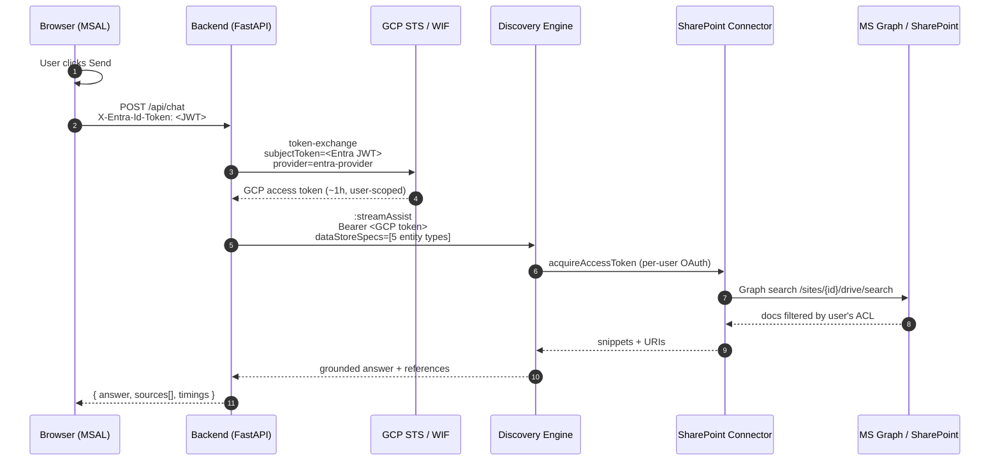
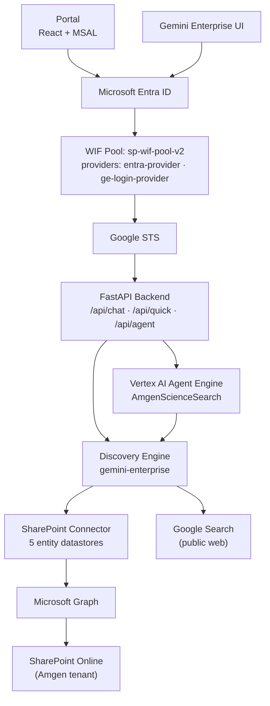

# Amgen Science Search Portal

[](docs/SECURITY_FLOW.md)
[](docs/SECURITY_FLOW.md)
[](docs/SECURITY_FLOW.md)
[](pyproject.toml)
[](frontend/package.json)
[](docs/SECURITY_FLOW.md)

> Amgen-themed rebrand of `sharepoint_wif_portal`. **Zero credential storage. Per-user SharePoint ACLs enforced at query time.** The agent's Discovery Engine call is hardened to ignore the GE chat-UI SharePoint toggle.

> Demo GIF coming — capture pending. The current files in `assets/` (`portal-overview-light.png`, `portal-demo.gif`, etc.) are from the source `sharepoint_wif_portal` and have not been re-captured for the Amgen rebrand. See [`docs/DEMO_SCRIPT.md`](docs/DEMO_SCRIPT.md) for the script the recording will follow.

---

## How auth actually works (read this first)

When you click **Send**, three things happen back-to-back:

1. Your browser gets an **Entra ID JWT** from the Amgen Microsoft tenant (MSAL popup).
2. The backend hands that JWT to **Google STS / Workload Identity Federation**, which mints a short-lived GCP access token bound to *you* — no service account key, no shared secret.
3. **Discovery Engine** uses that token to call **Microsoft Graph** *as you*, so SharePoint's per-document ACLs do the actual filtering. Every grounded citation came back with your name on it.



**Agent path:** Vertex AI **Agent Engine** wraps the same chain — the Entra JWT rides in `session.state` into the deployed `AmgenScienceSearch` ADK agent, whose tool runs the *same* WIF exchange + `streamAssist` shown above. Full agent-path diagram in [`docs/SECURITY_FLOW.md`](docs/SECURITY_FLOW.md).

<details>
<summary><b>Phase-by-phase narrative + security guarantees</b></summary>

**Phase A — Browser ↔ Entra ID (MSAL).** User authenticates against the Amgen Microsoft tenant; MFA happens here if configured. MSAL receives an OIDC ID token, audience = `api://<Portal-App-client-id>`. JWT lives in browser memory only.

🔒 *Google never sees Microsoft credentials.*

**Phase B — Backend ↔ GCP STS (WIF exchange).** Backend POSTs the JWT to `sts.googleapis.com/v1/token` against the WIF provider. GCP IAM validates the JWT signature against Entra's public keys + the audience claim, then issues a short-lived GCP access token *as the user* (a `principalSet://` identity). No service-account key, no shared impersonation token.

🔒 *Token bound to this user, this hour.*

**Phase C — Backend ↔ Discovery Engine `streamAssist`.** Backend POSTs to the engine with the WIF-derived token in `Authorization: Bearer …`. Body uses the **widget shape** (`query.parts[]`, `assistSkippingMode: REQUEST_ASSIST`, explicit `dataStoreSpecs[5]`) — the simpler `{"query":{"text":...}}` form silently returns zero grounding refs.

🔒 *DE knows the caller is the same human who logged in at Phase A.*

**Phase D — DE ↔ SharePoint Connector ↔ Graph.** DE calls its internal `dataConnector:acquireAccessToken` keyed by the WIF identity to retrieve the user's previously-stored SharePoint OAuth refresh token (consented once via `acquireAndStoreRefreshToken`). The refresh token is exchanged with Entra for a fresh Microsoft access token (`Sites.Read.All`, `Files.Read.All`, `Sites.Search.All`). DE hits **Microsoft Graph** scoped to the connector's `admin_filter.Site` allow-list.

🔒 *Request to SharePoint is made as the user — ACL filtering kicks in naturally.*

**Phase E — Graph ↔ SharePoint.** Items the user lacks `Read` on are simply not returned. Snippets + document URLs flow back to DE.

**Phase F — DE composes the grounded answer.** Snippets fed to Gemini under the engine's system instruction (the "STRICT GROUNDING RULES" block on `default_assistant`) — no fabrication, verbatim grounding, "No matching documents were found" when retrieval is empty. Answer + `textGroundingMetadata.references[]` returned to backend → JSON to frontend.

🔒 *End-to-end: every grounded byte was retrieved live from SharePoint as that user. Nothing in the chain ran as "admin".*

Full text and the agent-path variant: [`docs/SECURITY_FLOW.md`](docs/SECURITY_FLOW.md) §2–§3.

</details>

<details>
<summary><b>Common failure modes</b></summary>

| Symptom | Root cause |
|---|---|
| streamAssist returns answer with **zero grounding refs** | Wrong request body shape — using `{"query":{"text":...}}` instead of `{"query":{"parts":[{"text":...}]}}` + `assistSkippingMode: REQUEST_ASSIST`. Model still answers from training data; SharePoint never queried. |
| `acquireAccessToken` returns **404 NOT_FOUND** | No SharePoint OAuth refresh token bound to this WIF identity. User must complete the OAuth consent flow once (`acquireAndStoreRefreshToken`). |
| STS exchange returns **`invalid_grant: ID Token … is stale`** | Entra JWT too old. Re-authenticate in the portal to get a new one. |
| `aiplatform.reasoningEngines.get` returns **403** | Caller's identity (often ADC) lacks the role on the agent's project. Set `quota_project_id` on credentials or use the right principal. Don't mutate global ADC. |
| Federated query returns docs from `/sites/Foo` but not `/sites/Bar` | `/sites/Bar` is not in the connector's `admin_filter.Site` allow-list. PATCH to add. |
| `audience does not match` on STS | Wrong WIF provider. Portal/agent path = `entra-provider` (audience `api://<client-id>`); GE login = `ge-login-provider` (bare client-id). |

</details>

> Full deep-dive (sequence diagrams for both paths, anticipated Q&A, identifier reference): **[`docs/SECURITY_FLOW.md`](docs/SECURITY_FLOW.md)**.

---

## Quick start

```bash
# 1. Configure environment (reuses existing GCP + Entra infra)
cp .env.example .env                       # fill in values from docs/SECURITY_FLOW.md §7
cp frontend/.env.example frontend/.env     # VITE_CLIENT_ID, VITE_TENANT_ID

# 2. Backend
cd backend && uv sync && uv run uvicorn main:app --reload --port 8001

# 3. Frontend (new terminal)
cd frontend && npm install && npm run dev  # → http://localhost:5173
```

One-time on a fresh machine: `gcloud auth application-default login`.

Bring-up details (env vars, agent deploy, Cloud Run): **[`docs/SETUP.md`](docs/SETUP.md)**. Live-demo script: **[`docs/DEMO_SCRIPT.md`](docs/DEMO_SCRIPT.md)**.

---

## What changed vs. `sharepoint_wif_portal`

1. **Visual rebrand to Amgen** — Open Sans typeface, Amgen blue (`#0063C3`) primary, Amgen wordmark in the sidebar.
2. **Agent toggle-independence** — `agent/discovery_engine.py:_get_dynamic_datastores()` returns a hardcoded list of the five SharePoint federated entity-typed datastores (`file/page/comment/event/attachment`) instead of fetching from `widgetConfigs`. The GE chat-UI SharePoint toggle is purely client-side; relying on widget config silently dropped SharePoint when the toggle was off. Pattern lifted from `cortex-retriever/agent/discovery_engine.py`.
3. **Agent identity** — `AmgenScienceSearch` (was `InsightComparator`); system instruction recast for Amgen science / R&D context (prescribing info, medication guides, IFUs).

The Discovery Engine, SharePoint connector, WIF pool/provider, and Entra tenant are **all reused** from the source project — no new GCP infra needed for this demo.

---

<details>
<summary><b>Architecture overview</b></summary>



Two parallel WIF flows cover the two consumer surfaces:

| Flow | Token audience | WIF provider | Purpose |
|---|---|---|---|
| Custom Portal | `api://{client-id}` | `entra-provider` | Backend STS exchange → `streamAssist` |
| Gemini Enterprise UI | `{client-id}` (no prefix) | `ge-login-provider` | GE user authentication |

</details>

<details>
<summary><b>Project structure</b></summary>

```
science-search-portal/
├── frontend/              # React + MSAL UI (port 5173)
│   └── src/App.tsx        # main chat + auth
├── backend/               # FastAPI (port 8001)
│   ├── main.py            # WIF exchange + streamAssist + /api/agent proxy
│   └── agent_client.py    # Agent Engine SDK client
├── agent/                 # ADK AmgenScienceSearch agent
│   ├── agent.py           # root_agent + compare_insights tool
│   └── discovery_engine.py  # WIF + streamAssist (hardcoded 5 datastores)
├── deploy/                # nginx + Cloud Run config
├── scripts/               # register_auth.sh / register_agent.sh
├── docs/
│   ├── SECURITY_FLOW.md   # auth deep-dive (start here)
│   ├── DEMO_SCRIPT.md     # live-demo presenter script
│   ├── SETUP.md           # bring-up on a new machine
│   └── ...                # GROUNDING_TEST_QUESTIONS, TESTING
├── deploy.py              # one-shot Agent Engine deploy
├── test_local.py          # local agent smoke test
├── test_remote.py         # post-deploy agent smoke test
└── Dockerfile             # Cloud Run image
```

</details>

<details>
<summary><b>Backend API</b></summary>

| Endpoint | Method | Description |
|---|---|---|
| `/health` | GET | Liveness probe |
| `/api/config` | GET | Non-sensitive config dump |
| `/api/chat` | POST | Main search — `streamAssist` + WIF |
| `/api/quick` | POST | `/btw` quick search via Gemini + Google Search |
| `/api/sessions` | GET / POST | Conversation management |
| `/api/agent` | POST | Proxy to Agent Engine `stream_query` |
| `/api/agent/info` | GET | Reasoning Engine metadata |

</details>

<details>
<summary><b>Environment reference</b></summary>

Pulled from `.env.example`. Filled values for the running demo are in [`SECURITY_FLOW.md` §7](docs/SECURITY_FLOW.md#7-reference-the-actual-identifiers).

| Group | Var | Notes |
|---|---|---|
| GCP | `PROJECT_ID`, `PROJECT_NUMBER`, `LOCATION`, `STAGING_BUCKET` | Demo uses `sharepoint-wif-agent` / `545964020693` / `us-central1` |
| Discovery Engine | `ENGINE_ID`, `DATA_STORE_ID` | `gemini-enterprise` + `sharepoint-data-def-connector_*` (5 entity types) |
| WIF | `WIF_POOL_ID`, `WIF_PROVIDER_ID` | `sp-wif-pool-v2` / `entra-provider` (agent + portal path) |
| Entra | `TENANT_ID`, `OAUTH_CLIENT_ID`, `OAUTH_CLIENT_SECRET` | Portal App `7868d053-…` |
| Agentspace | `AS_APP` | for `register_*.sh` |
| Agent Engine | `REASONING_ENGINE_RES` | set after `python deploy.py` |
| ADK | `GOOGLE_GENAI_USE_VERTEXAI=True`, `GOOGLE_CLOUD_PROJECT`, `GOOGLE_CLOUD_LOCATION` | required by `google-adk` |

</details>

<details>
<summary><b>Built &amp; tested with</b></summary>

Pinned in `pyproject.toml` / `frontend/package.json`. Use `uv sync` and `npm ci` to reproduce.

| Stack | Library | Version |
|---|---|---|
| Backend | `fastapi` | 0.135.3 |
| Backend | `google-cloud-aiplatform` | 1.145.0 |
| Backend | `google-auth` | 2.49.1 |
| Backend | `pydantic` | 2.12.5 |
| Backend | `uvicorn` | 0.43.0 |
| Backend | `sse-starlette` | 3.3.4 |
| Agent | `google-cloud-aiplatform[adk,agent_engines]` | 1.145.0 |
| Agent | `google-adk` | 1.28.1 |
| Agent | `google-cloud-discoveryengine` | 0.13.12 |
| Agent | `httpx` | 0.28.1 |
| Frontend | `react` | 19.2.4 |
| Frontend | `@azure/msal-browser` | 4.30.0 |
| Frontend | `@azure/msal-react` | 3.0.29 |
| Frontend | `vite` | 8.0.3 |
| Frontend | `typescript` | 5.9.3 |

</details>

---

## Documentation

| Doc | Purpose |
|---|---|
| **[`docs/SECURITY_FLOW.md`](docs/SECURITY_FLOW.md)** | Auth/authz deep-dive — both sequence diagrams, Q&A, identifier reference |
| **[`docs/DEMO_SCRIPT.md`](docs/DEMO_SCRIPT.md)** | 12–18 min live-demo presenter script |
| **[`docs/SETUP.md`](docs/SETUP.md)** | Bring-up on a new machine (env vars, run, deploy) |
| [`docs/GROUNDING_TEST_QUESTIONS.md`](docs/GROUNDING_TEST_QUESTIONS.md) | Curated query set to validate grounding |
| [`docs/TESTING.md`](docs/TESTING.md) | End-to-end testing workflow |

> **From-scratch infra build** (new GCP project, new Entra app, new WIF pool, new connector): use the original phased setup at [`../sharepoint_wif_portal/docs/`](../sharepoint_wif_portal/docs/) — `01-SETUP-GCP.md` through `10-CLOUD-DEPLOYMENT.md`. The Amgen rebrand reuses that infra, so those docs are intentionally **not** duplicated here.

---

## Roadmap

- [x] Amgen visual rebrand (Open Sans, `#0063C3`, wordmark)
- [x] Hardcoded `dataStoreSpecs` in `agent/discovery_engine.py` (toggle-independent)
- [x] `AmgenScienceSearch` ADK agent deployed to Vertex AI Agent Engine
- [ ] Re-record `assets/portal-demo.gif` against the Amgen UI
- [ ] Cloud Run + GLB + IAP deployment for the Amgen subdomain
- [ ] Add `/sites/AmgenScience` to the connector's `admin_filter.Site` once the SP site is provisioned
