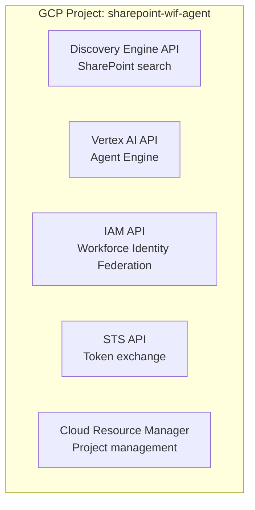

# 01 - GCP Project Setup

> **Version**: 1.2.0 | **Last Updated**: 2026-04-05

**Navigation**: [Index](00-INDEX.md) | **01-GCP** | [02-Entra](02-SETUP-ENTRA.md) | [03-WIF](03-SETUP-WIF.md) | [04-Discovery](04-SETUP-DISCOVERY.md) | [08-Agent](08-ADK-AGENT.md)

---

## Prerequisites

None - this is the first step.

---

## Outputs (used by later docs)

| Variable | Example | Used In |
|----------|---------|---------|
| `PROJECT_ID` | `sharepoint-wif-agent` | All docs |
| `PROJECT_NUMBER` | `${PROJECT_NUMBER}` | 03-WIF, 04-Discovery, 08-Agent |
| `STAGING_BUCKET` | `gs://sharepoint-wif-agent-staging` | 08-Agent |

---

## Overview

Provisions the five GCP APIs that WIF token exchange and Discovery Engine depend on — nothing else in this guide works without this foundation.



---

## Step 1: Create Project

1. Go to [Google Cloud Console](https://console.cloud.google.com)
2. Click **Select Project** → **New Project**
3. Enter project name (e.g., `sharepoint-wif-agent`)
4. Click **Create**

**Save these values:**

| Setting | Value |
|---------|-------|
| Project ID | `sharepoint-wif-agent` |
| Project Number | `${PROJECT_NUMBER}` |

---

## Step 2: Enable APIs

Run in Cloud Shell or terminal:

```bash
gcloud config set project sharepoint-wif-agent

gcloud services enable \
  aiplatform.googleapis.com \
  discoveryengine.googleapis.com \
  iam.googleapis.com \
  sts.googleapis.com \
  cloudresourcemanager.googleapis.com
```

**Verify:**

```bash
gcloud services list --enabled --filter="NAME:(aiplatform OR discoveryengine OR iam OR sts)"
```

---

## Step 3: Create Staging Bucket (Optional)

Required only if deploying to Agent Engine:

```bash
export PROJECT_ID=sharepoint-wif-agent
export LOCATION=us-central1

gcloud storage buckets create gs://${PROJECT_ID}-staging \
  --location=${LOCATION} \
  --uniform-bucket-level-access
```

---

## Verification Checklist

| Item | Command | Expected |
|------|---------|----------|
| Project set | `gcloud config get project` | `sharepoint-wif-agent` |
| APIs enabled | `gcloud services list --enabled` | 5 APIs listed |
| Bucket created | `gcloud storage ls` | `gs://sharepoint-wif-agent-staging/` |

---

## Next Step

→ [02-SETUP-ENTRA.md](02-SETUP-ENTRA.md) - Configure Microsoft Entra ID
