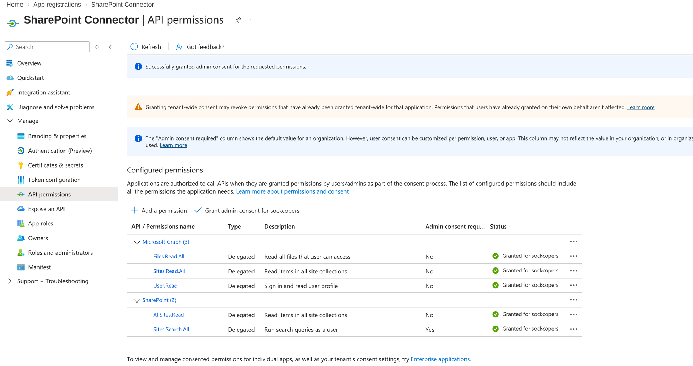
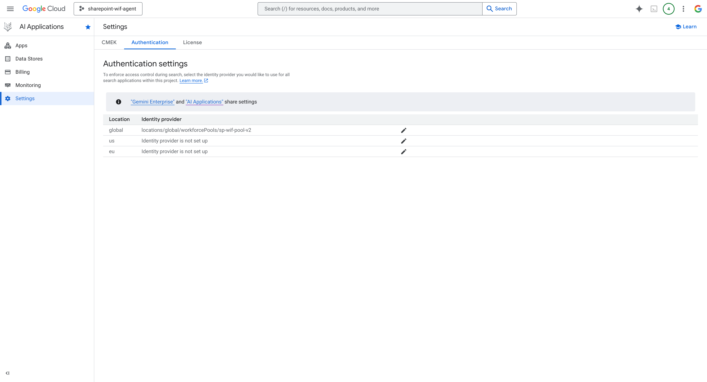
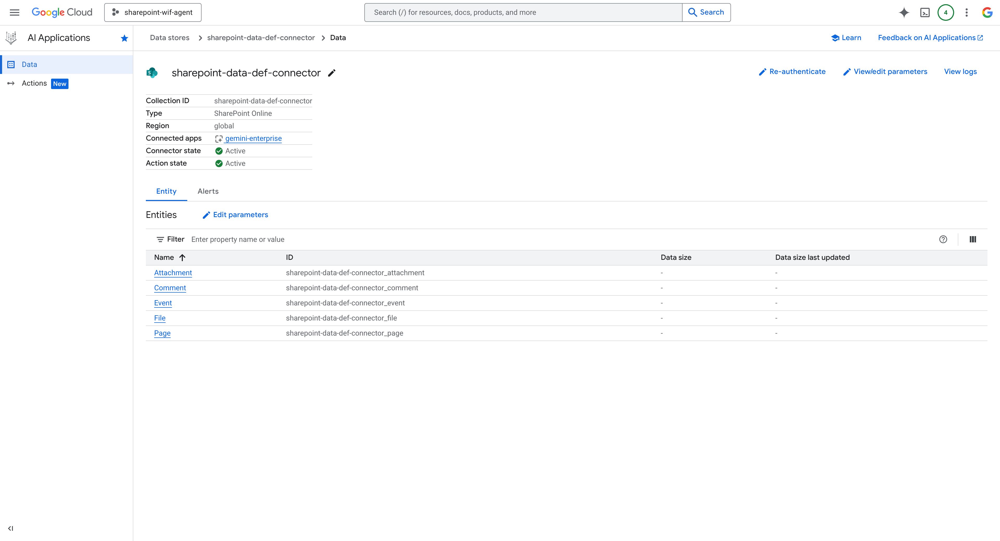

# 04 - Discovery Engine Setup

> **Version**: 1.3.0 | **Last Updated**: 2026-04-06

**Navigation**: [Index](00-INDEX.md) | [01-GCP](01-SETUP-GCP.md) | [02-Entra](02-SETUP-ENTRA.md) | [03-WIF](03-SETUP-WIF.md) | **04-Discovery** | [08-Agent](08-ADK-AGENT.md)

---

## Prerequisites

| From | Variable | Purpose |
|------|----------|---------|
| [01-SETUP-GCP.md](01-SETUP-GCP.md) | `PROJECT_ID` | Discovery Engine project |
| [01-SETUP-GCP.md](01-SETUP-GCP.md) | `PROJECT_NUMBER` | API calls |
| [02-SETUP-ENTRA.md](02-SETUP-ENTRA.md) | `OAUTH_CLIENT_ID` | Federated connector |
| [03-WIF-SETUP.md](03-SETUP-WIF.md) | `WIF_POOL_ID` | User identity mapping |

---

## Outputs (used by later docs)

| Variable | Example | Used In |
|----------|---------|---------|
| `ENGINE_ID` | `gemini-enterprise` | 08-Agent |
| `DATA_STORE_ID` | `sharepoint-data-def-connector_file` | 08-Agent |

---

## Overview

Connects Discovery Engine to SharePoint via a federated connector that syncs documents while preserving ACLs — this is what makes per-user access enforcement possible at query time rather than in your application code.

> **Naming note**: Discovery Engine is the underlying GCP API that powers **Gemini Enterprise** (GE). When GCP documentation says "Discovery Engine" and the console shows "AI Applications" or "Gemini Enterprise", they are the same product. The `streamAssist` endpoint is the programmatic interface to the same search capabilities you see in the Gemini Enterprise UI.

---

## Step 1: Create SharePoint Connector App (Entra ID)

> **Note**: This is a SEPARATE app registration from the WIF Portal app. Discovery Engine needs its own credentials to access SharePoint.

> **CRITICAL**: For federated search to work, you MUST add **SharePoint API permissions** (not just Microsoft Graph). This is the most common cause of "search returns no results" issues.

1. Go to [Azure Portal](https://portal.azure.com) → **Microsoft Entra ID** → **App registrations**
2. Click **New registration**:
   - **Name**: `SharePoint Connector`
   - **Supported account types**: Single tenant
3. Click **Register**

### Add Redirect URIs

1. Go to **Authentication** → **Add a platform** → **Web**
2. Add BOTH redirect URIs:
   - `https://vertexaisearch.cloud.google.com/console/oauth/sharepoint_oauth.html` ← For connector wizard
   - `https://vertexaisearch.cloud.google.com/oauth-redirect` ← For Gemini Enterprise SharePoint auth
3. Click **Configure**


*SharePoint Connector with both redirect URIs configured*

### Add API Permissions (COMPLETE LIST)

> **Note**: All permissions below are required. Missing any causes search failures.

1. Go to **API permissions** → **Add a permission**

**Microsoft Graph** → **Delegated permissions**:

| Permission | Purpose |
|------------|---------|
| `User.Read` | Sign in and read user profile |
| `Files.Read.All` | Read all files user can access |
| `Files.ReadWrite.All` | Full file access (for actions) |
| `Sites.Read.All` | Read SharePoint sites |
| `Sites.ReadWrite.All` | Edit sites (for actions) |
| `Sites.Manage.All` | Manage sites (for actions) |
| `offline_access` | Refresh tokens |

**SharePoint** → **Delegated permissions** (REQUIRED for federated search):

| Permission | Purpose |
|------------|---------|
| `Sites.Search.All` | Run search queries as user (required) |
| `AllSites.Read` | Read all site collections (required) |
| `AllSites.Write` | Write access (for actions) |

2. Click **Add permissions**
3. Click **Grant admin consent for [tenant]** ← **REQUIRED**



*SharePoint Connector with Microsoft Graph AND SharePoint permissions - ALL must show "Granted"*

### Create Client Secret

1. Go to **Certificates & secrets** → **New client secret**
2. Description: `Discovery Engine`
3. Click **Add** → **Copy the value immediately**

**Save these values:**

| Setting | Your Value |
|---------|------------|
| Client ID | `_________________________` |
| Client Secret | `_________________________` |

---

## Step 2: Configure Project Authentication

Before creating apps or data stores, configure the project-level identity provider.

1. Go to [AI Applications](https://console.cloud.google.com/gen-app-builder) → **Settings** → **Authentication**
2. Click the **pencil icon** on the **global** row
3. Select **3rd Party Identity**
4. Enter: `locations/global/workforcePools/sharepoint-wif-pool`
5. Click **Save**



*Project-level authentication settings*

---

## Step 3: Create Gemini Enterprise App (Engine)

1. Go to **AI Applications** → **Apps** → **Create App**
2. Select **Gemini Enterprise** (or Search)
3. Configure:
   - **App name**: `gemini-enterprise-app`
   - **Engine ID**: `gemini-enterprise-app`
   - **Location**: `global (Global)`
4. Click **Create**

### 3.1 Configure Workforce Identity for the App

1. Click **Set up identity** on the dashboard (or go to **Integration**)
2. Select **Use a third-party identity provider**
3. Configure:
   - **Workforce pool ID**: `locations/global/workforcePools/sharepoint-wif-pool`
   - **Workforce provider ID**: `entra-login-provider`
4. Click **Confirm Workforce Identity**



*Gemini Enterprise connector selector — SharePoint and Google Search both enabled for this app*

---

## Step 4: Create Data Store with SharePoint Connector

Now, create the data store and link it to your app.

1. Inside your App, go to **Data Stores** in the left sidebar
2. Click **+ New data store**
3. Select **Third-party sources** → **SharePoint Online**

### 4.1 Authentication Settings

Configure OAuth credentials using values from Step 1:
- **Instance URI**: `https://your-tenant.sharepoint.com`
- **Tenant ID**: Your Entra tenant ID
- **Client ID**: From Step 1
- **Client Secret**: From Step 1

> **IMPORTANT**: Always use an **incognito browser** for authorization to avoid credential caching.

Click **Authorize** → Sign in with admin account → **Accept consent**


*Successfully logged in with associated identity*

### 4.2 Destinations & Entities

- **Host 1**: Your SharePoint site URL (e.g., `https://your-tenant.sharepoint.com/sites/Documents`)
- **Entities to Search**: Select **File** (most important), Page, etc.

### 4.3 Configure Federated Access Control

1. Click **Configure access control**
2. Click the **pencil icon** on the **global** row
3. Select **3rd Party Identity**
4. Enter workforce pool: `locations/global/workforcePools/sharepoint-wif-pool`
5. Click **Save**

### 4.4 Finalize Data Connector

- **Location**: `global (Global)`
- **Data connector name**: `sharepoint-docs-connector`

Click **Continue** → **Create**


*Data connector with entity sub-stores created*

**Save:**

| Setting | Your Value |
|---------|------------|
| Data Store ID | `_________________________` |

---

## Step 5: Verify Data Sync

1. Go to **Data Stores** → Select your store
2. Check **Activity** tab for sync status. Since this is **Federated Search**, you won't see "indexing" logs like traditional ingestion, but you should see the connector status as "Active".

---

## Step 6: Test Search API (WIF Flow)

> For a full explanation of the authentication chain, see [00-AUTH-CHAIN.md](00-AUTH-CHAIN.md).

Calling `streamAssist` requires a Google Cloud access token. Exchange an Entra JWT for a Google STS token:

### 6.1 Exchange Entra JWT for Google STS Token

```bash
export SUBJECT_TOKEN="<ENTRA_ID_TOKEN_OR_ACCESS_TOKEN>"
export POOL_ID="sharepoint-wif-pool"
export PROVIDER_ID="entra-agent-provider" # Provider with api:// prefix

curl -X POST https://sts.googleapis.com/v1/token \
    --header "Content-Type: application/json" \
    --data '{
        "audience": "//iam.googleapis.com/locations/global/workforcePools/'${POOL_ID}'/providers/'${PROVIDER_ID}'",
        "grantType": "urn:ietf:params:oauth:grant-type:token-exchange",
        "requestedTokenType": "urn:ietf:params:oauth:token-type:access_token",
        "scope": "https://www.googleapis.com/auth/cloud-platform",
        "subjectToken": "'${SUBJECT_TOKEN}'",
        "subjectTokenType": "urn:ietf:params:oauth:token-type:jwt"
    }'
```

The response will contain an `access_token`. Save it as `STS_TOKEN`.

### 6.2 Call streamAssist API

The `dataStoreSpecs` is **REQUIRED** in the payload to specify the SharePoint data store. Use the **Project Number** (not ID) in the resource path.

```bash
export PROJECT_NUMBER="<your-project-number>"
export ENGINE_ID="<your-engine-id>"
export DATA_STORE_ID="<your-datastore-id>"
export STS_TOKEN="<TOKEN_FROM_STEP_6_1>"

curl -X POST \
  "https://discoveryengine.googleapis.com/v1alpha/projects/${PROJECT_NUMBER}/locations/global/collections/default_collection/engines/${ENGINE_ID}/assistants/default_assistant:streamAssist" \
  -H "Authorization: Bearer ${STS_TOKEN}" \
  -H "Content-Type: application/json" \
  -H "X-Goog-User-Project: ${PROJECT_NUMBER}" \
  -d '{
    "query": {"text": "What documents mention financial audit?"},
    "toolsSpec": {
      "vertexAiSearchSpec": {
        "dataStoreSpecs": [
          {
            "dataStore": "projects/'${PROJECT_NUMBER}'/locations/global/collections/default_collection/dataStores/'${DATA_STORE_ID}'"
          }
        ]
      }
    }
  }'
```

---

## Configuration Summary

```env
# Discovery Engine
ENGINE_ID=gemini-enterprise-app
DATA_STORE_ID=sharepoint-docs-connector_file
```

---

## Troubleshooting

| Error | Cause | Solution |
|-------|-------|----------|
| `PERMISSION_DENIED` | Missing IAM on Workforce Pool | Ensure `discoveryengine.user` is granted to the principalSet |
| `INVALID_ARGUMENT` | Using Project ID instead of Number | Use `${PROJECT_NUMBER}` in the dataStore path |
| No results found | Missing SharePoint Search permissions | Verify `Sites.Search.All` is granted and consented in Entra ID |
| `FAILED_PRECONDITION` | Workforce Pool not configured on Data Store | Check Step 4.3 |

---

## Next Step

→ [08-ADK-AGENT.md](08-ADK-AGENT.md) - Build the reasoning agent with SharePoint grounding
