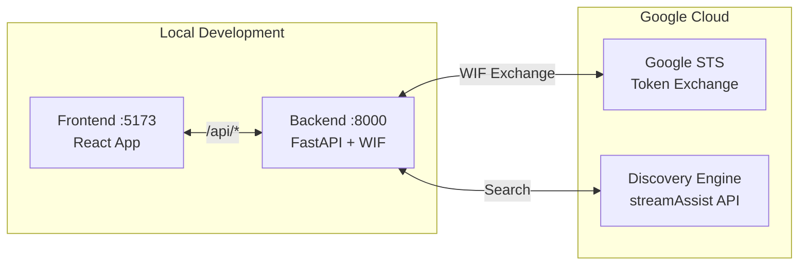

# Local Development

> **Version**: 1.4.0 | **Last Updated**: 2026-04-05

**Navigation**: [Index](00-INDEX.md) | [04-Discovery](04-SETUP-DISCOVERY.md) | **05-Local Dev** | [06-Agent Engine](06-AGENT-ENGINE.md) | [10-Deploy](10-CLOUD-DEPLOYMENT.md)

> **This doc runs the full [Authentication Chain](00-AUTH-CHAIN.md) end-to-end locally** — MSAL login → STS exchange → `dataStoreSpecs` → `streamAssist` against SharePoint. If the chain isn't working, the [failure mode table](00-AUTH-CHAIN.md#failure-mode-reference) is your first stop.

---

## Quick Setup

Get the portal running locally in 4 steps.

### Prerequisites

- Node.js 18+ (for frontend)
- Python 3.12+ (for backend)
- [uv](https://github.com/astral-sh/uv) (Python package manager)
- GCP project with Discovery Engine configured (see [04-SETUP-DISCOVERY.md](04-SETUP-DISCOVERY.md))
- All previous setup steps completed (Entra ID, WIF, Discovery)

---

### Step 1: Configure Environment

```bash
cd semiautonomous-agents/sharepoint_wif_portal
cp .env.example .env
```

Edit `.env` with your values:

```env
# GCP
PROJECT_NUMBER=${PROJECT_NUMBER}
LOCATION=global

# Discovery Engine
ENGINE_ID=gemini-enterprise

# WIF (for user-level ACLs)
WIF_POOL_ID=sharepoint-wif-pool
WIF_PROVIDER_ID=entra-agent-provider

# Ports
BACKEND_PORT=8000
FRONTEND_PORT=5173
```

Create `frontend/.env`:

```env
VITE_CLIENT_ID=your-entra-client-id
VITE_TENANT_ID=your-entra-tenant-id
```

---

### Step 2: Start Backend

> **Code:**
> - [`backend/main.py#L44`](https://github.com/jchavezar/vertex-ai-samples/blob/main/semiautonomous-agents/sharepoint_wif_portal/backend/main.py#L44) — `exchange_token()` Entra JWT → GCP token via STS
> - [`backend/main.py#L297`](https://github.com/jchavezar/vertex-ai-samples/blob/main/semiautonomous-agents/sharepoint_wif_portal/backend/main.py#L297) — `/api/chat` endpoint (main search + WIF)
> - [`backend/main.py#L355`](https://github.com/jchavezar/vertex-ai-samples/blob/main/semiautonomous-agents/sharepoint_wif_portal/backend/main.py#L355) — `/api/quick` endpoint (Gemini + Google Search)

```bash
cd backend
uv sync
uv run uvicorn main:app --reload --port 8000
```

**Verify:**

```bash
curl http://localhost:8000/health
# {"status":"healthy","service":"sharepoint-wif-portal"}

curl http://localhost:8000/api/config
# {"project_number":"${PROJECT_NUMBER}","engine_id":"gemini-enterprise",...}
```

One-time GCP credential setup (local only):

```bash
gcloud auth application-default login
```

---

### Step 3: Start Frontend

```bash
cd frontend
npm install
npm run dev
```

Open http://localhost:5173 — you should see the Enterprise Search Portal.

---

### Step 4: Test Search

1. Sign in with your Microsoft account (MSAL popup)
2. Enter a query: `"What documents do I have access to?"`
3. Verify the response cites SharePoint sources

**Expected backend logs:**

```
INFO - [Search] Using 5 datastore(s)
INFO - [Search] Calling StreamAssist API: https://discoveryengine.googleapis.com/v1alpha/...
INFO - [Search] Found 3 source(s)
```

If you see `Found 0 source(s)` or no citations, go to the [failure mode table](00-AUTH-CHAIN.md#failure-mode-reference).

---

### Development Commands

```bash
# Backend
cd backend
uv sync                                          # Install dependencies
uv run uvicorn main:app --reload --port 8000     # Start with hot reload
uv run pytest                                    # Run tests

# Frontend
cd frontend
npm install                                      # Install dependencies
npm run dev                                      # Start dev server (:5173)
npm run build                                    # Production build
npm run preview                                  # Preview production build
```

---

## API Endpoints

| Endpoint | Method | Description |
|----------|--------|-------------|
| `/health` | GET | Health check |
| `/api/config` | GET | Current configuration (non-sensitive) |
| `/api/chat` | POST | Main search via StreamAssist + WIF |
| `/api/quick` | POST | Quick `/btw` search via Gemini |
| `/api/agent` | POST | Agent panel proxy to Agent Engine |

**Example:**

```bash
curl -X POST http://localhost:8000/api/chat \
  -H "Content-Type: application/json" \
  -d '{"query": "financial reports", "accessToken": "<entra-jwt>"}'
```

---

## Troubleshooting

| Issue | Cause | Solution |
|-------|-------|----------|
| CORS error | Backend not running | Start backend on :8000 |
| 403 Forbidden | Missing IAM roles | Add `discoveryengine` roles to WIF pool |
| WIF exchange fails | Wrong provider | Use `entra-agent-provider` (with `api://` prefix) |
| Generic LLM response (no sources) | Missing `dataStoreSpecs` | See [Requirement 3](00-AUTH-CHAIN.md#requirement-3-datastoresspecs-is-required) |
| `dataStoreSpecs` empty | Missing `discoveryengine.viewer` | See [Requirement 4](00-AUTH-CHAIN.md#requirement-4-iam-permissions-to-list-datastore-ids) |
| `FAILED_PRECONDITION` on STS | `oauth2AllowIdTokenImplicitFlow` false | See [Requirement 1](00-AUTH-CHAIN.md#requirement-1-entra-id-must-issue-id-tokens) |
| `audience does not match` | Provider missing `api://` | See [Requirement 2](00-AUTH-CHAIN.md#requirement-2-two-wif-providers--not-one) |

**Debug mode:**

```bash
LOG_LEVEL=DEBUG uv run uvicorn main:app --reload
# Look for "[Search] Using X datastore(s)" and "[Search] Response (first 500 chars)"
```

---

## Architecture Reference

> The quick setup above is all you need to get running. This section explains how the pieces connect.

### Environment-Agnostic Architecture

**One codebase. Two environments. Zero code changes.**



The frontend always uses **relative API URLs** — never hardcoded hosts:

```typescript
fetch('/api/chat', { ... })    // Same code in both environments
```

| Layer | Local | Cloud Run |
|-------|-------|-----------|
| `/api/*` routing | Vite proxy → `localhost:8000` | nginx proxy → `127.0.0.1:8000` |
| GCP auth | `gcloud auth application-default login` | Service account (auto-injected) |
| Config | `backend/.env` | `--set-env-vars` |

> **Code:** [`frontend/vite.config.ts#L8`](https://github.com/jchavezar/vertex-ai-samples/blob/main/semiautonomous-agents/sharepoint_wif_portal/frontend/vite.config.ts#L8) — Vite proxy  |  [`deploy/nginx.conf`](https://github.com/jchavezar/vertex-ai-samples/blob/main/semiautonomous-agents/sharepoint_wif_portal/deploy/nginx.conf) — nginx proxy

Proxy configuration — same pattern, different tool:

```typescript
// frontend/vite.config.ts — local
server: { proxy: { '/api': { target: 'http://localhost:8000' } } }
```

```nginx
# deploy/nginx.conf — production
location /api/ { proxy_pass http://127.0.0.1:8000; }
```

---

### Authentication Flow

> The full authentication chain (Entra JWT → STS exchange → `dataStoreSpecs`) is documented in **[00-AUTH-CHAIN.md](00-AUTH-CHAIN.md)** — it covers configuration that is not yet publicly documented by the product team.

The local setup above exercises the complete chain. When you log in via MSAL and run a search, the sequence is:

```
User → MSAL login → Entra JWT
                  → POST sts.googleapis.com/v1/token  (backend/main.py#L44)
                  → GCP access token
                  → streamAssist with dataStoreSpecs   (discovery_engine.py#L254)
                  → SharePoint results under user ACLs
```

If any step fails, check the [failure mode table](00-AUTH-CHAIN.md#failure-mode-reference) — every symptom maps to a specific requirement.

---

### StreamAssist: Direct vs Agent Engine

This implementation calls `streamAssist` directly from FastAPI without routing through Agent Engine:

| Aspect | Direct StreamAssist | Via Agent Engine |
|--------|---------------------|------------------|
| Latency | Lower (1 hop) | Higher (2 hops) |
| Complexity | Simpler | More features |
| Cost | Base API cost | + Agent Engine cost |
| Best for | Simple search UI | Complex orchestration |

The backend API table for this flow:

| GCP Service | API Endpoint |
|-------------|--------------|
| Discovery Engine | `discoveryengine.googleapis.com` |
| Google STS (WIF) | `sts.googleapis.com` |
| Agent Engine | `aiplatform.googleapis.com` |

---

### Project Structure

```
sharepoint_wif_portal/
├── frontend/
│   ├── package.json          # Dependencies
│   ├── vite.config.ts        # Vite config with /api proxy
│   ├── tsconfig.json         # TypeScript config
│   ├── index.html            # Entry HTML
│   └── src/
│       ├── main.tsx          # React entry point
│       ├── App.tsx           # Main component (chat UI, MSAL, WIF)
│       ├── authConfig.ts     # MSAL configuration
│       ├── AgentPanel.tsx    # Agent panel sidebar
│       └── index.css         # Dark theme styles
│
├── backend/
│   ├── pyproject.toml        # Python dependencies (pinned)
│   └── main.py               # FastAPI server (WIF exchange + streamAssist)
│
├── agent/                    # ADK InsightComparator agent
│   ├── agent.py              # Agent definition
│   ├── discovery_engine.py   # WIF + streamAssist client
│   └── pyproject.toml        # Agent dependencies (pinned)
│
├── deploy/
│   └── nginx.conf            # Production proxy config
│
├── docs/                     # Setup documentation
├── assets/                   # Screenshots for docs
├── .env.example              # Environment template
└── Dockerfile                # Cloud Run container
```

---

## Next Step

→ [06-AGENT-ENGINE.md](06-AGENT-ENGINE.md) — Optional: Deploy the InsightComparator agent to Gemini Enterprise / Agentspace

→ [10-CLOUD-DEPLOYMENT.md](10-CLOUD-DEPLOYMENT.md) — Deploy the custom portal to Cloud Run

---

## Related Documentation

- [00-AUTH-CHAIN.md](00-AUTH-CHAIN.md) — The complete authentication chain (read this when things break)
- [03-SETUP-WIF.md](03-SETUP-WIF.md) — WIF pool setup and IAM requirements
- [07-FRONTEND-FEATURES.md](07-FRONTEND-FEATURES.md) — Chat UI, `/btw` quick search, session management
- [10-CLOUD-DEPLOYMENT.md](10-CLOUD-DEPLOYMENT.md) — Cloud Run + GLB + IAP deployment
