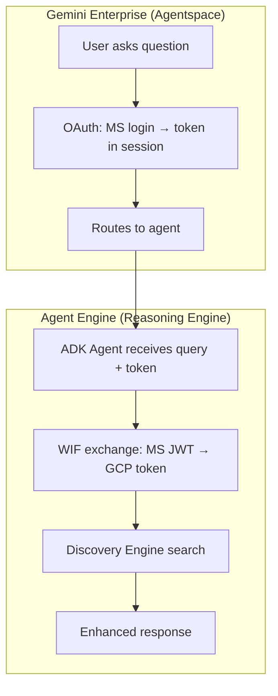
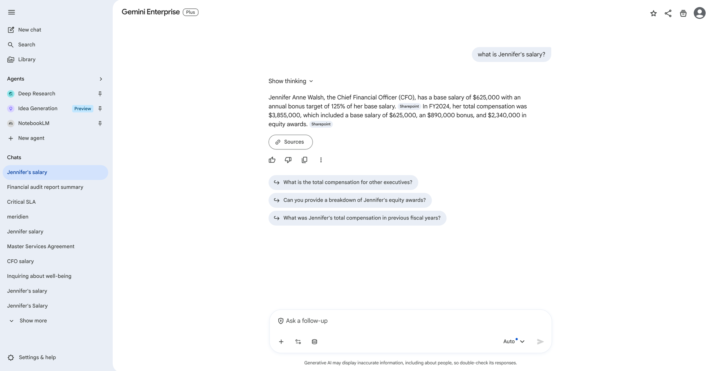

# 06 - Agent Engine: Agentspace Registration (Optional)

> **Version**: 1.2.0 | **Last Updated**: 2026-04-05

**Navigation**: [Index](00-INDEX.md) | [05-Local Dev](05-LOCAL-DEV.md) | **06-Agent Engine** | [07-Frontend](07-FRONTEND-FEATURES.md) | [08-Agent](08-ADK-AGENT.md)

> **Two ways to add an agent**: This doc covers **registering any agent in Gemini Enterprise / Agentspace** via API. For building and deploying the full **InsightComparator ADK agent** (concurrent SharePoint + Google Search), go to [08-ADK-AGENT.md](08-ADK-AGENT.md). Both docs can be read independently.

---

## Overview

Registers a pre-deployed Agent Engine reasoning engine into Gemini Enterprise (Agentspace), making it available in the GE UI with OAuth token passthrough to SharePoint.



---

## Agent Features

Beyond basic search, the agent provides:

| Feature | Description |
|---------|-------------|
| **Smart Summaries** | TL;DR at the top of each response |
| **Entity Extraction** | Key people, dates, amounts highlighted |
| **Follow-up Suggestions** | Related questions to explore |
| **Source Ranking** | Most relevant sources first |



*Gemini Enterprise answering "what is Jennifer's salary?" — answer grounded in SharePoint with ACL citation badges, follow-up suggestions generated automatically*

---

## Step 1: Deploy Agent

```bash
cd agent
uv sync
uv run python deploy.py
```

**Save the output:**

| Setting | Your Value |
|---------|------------|
| Reasoning Engine Resource | `projects/.../reasoningEngines/...` |

---

## Step 2: Grant Permissions

```bash
export PROJECT_NUMBER=${PROJECT_NUMBER}
export PROJECT_ID=sharepoint-wif-agent

# Grant Discovery Engine access to Agent Engine SA
gcloud projects add-iam-policy-binding $PROJECT_ID \
  --member="serviceAccount:service-${PROJECT_NUMBER}@gcp-sa-aiplatform-re.iam.gserviceaccount.com" \
  --role="roles/discoveryengine.admin"
```

---

## Step 3: Register Authorization in Agentspace

```bash
export PROJECT_NUMBER=${PROJECT_NUMBER}
export AUTH_ID=sharepoint-auth
export CLIENT_ID=your-client-id
export CLIENT_SECRET=your-client-secret
export TENANT_ID=your-tenant-id

export TOKEN_URI="https://login.microsoftonline.com/${TENANT_ID}/oauth2/v2.0/token"
export AUTH_URI="https://login.microsoftonline.com/${TENANT_ID}/oauth2/v2.0/authorize?response_type=code&client_id=${CLIENT_ID}&redirect_uri=https%3A%2F%2Fvertexaisearch.cloud.google.com%2Foauth-redirect&scope=openid%20profile%20email%20offline_access%20api%3A%2F%2F${CLIENT_ID}%2Fuser_impersonation&prompt=consent"

curl -X POST \
  -H "Authorization: Bearer $(gcloud auth print-access-token)" \
  -H "Content-Type: application/json" \
  -H "X-Goog-User-Project: ${PROJECT_NUMBER}" \
  "https://discoveryengine.googleapis.com/v1alpha/projects/${PROJECT_NUMBER}/locations/global/authorizations?authorizationId=${AUTH_ID}" \
  -d '{
    "serverSideOauth2": {
      "clientId": "'"${CLIENT_ID}"'",
      "clientSecret": "'"${CLIENT_SECRET}"'",
      "authorizationUri": "'"${AUTH_URI}"'",
      "tokenUri": "'"${TOKEN_URI}"'"
    }
  }'
```

---

## Step 4: Register Agent in Agentspace

```bash
export AS_APP=your-agentspace-app
export REASONING_ENGINE_RES=projects/.../reasoningEngines/...

curl -X POST \
  -H "Authorization: Bearer $(gcloud auth print-access-token)" \
  -H "Content-Type: application/json" \
  -H "X-Goog-User-Project: ${PROJECT_ID}" \
  "https://discoveryengine.googleapis.com/v1alpha/projects/${PROJECT_NUMBER}/locations/global/collections/default_collection/engines/${AS_APP}/assistants/default_assistant/agents" \
  -d '{
    "displayName": "SharePoint Assistant",
    "description": "Search enterprise SharePoint documents with your permissions",
    "adk_agent_definition": {
      "tool_settings": {
        "tool_description": "Search SharePoint documents"
      },
      "provisioned_reasoning_engine": {
        "reasoning_engine": "'"${REASONING_ENGINE_RES}"'"
      }
    },
    "authorization_config": {
      "tool_authorizations": [
        "projects/'"${PROJECT_NUMBER}"'/locations/global/authorizations/'"${AUTH_ID}"'"
      ]
    }
  }'
```

---

## Step 5: Share Agent

```bash
export AGENT_ID=your-agent-id

curl -X PATCH \
  -H "Authorization: Bearer $(gcloud auth print-access-token)" \
  -H "Content-Type: application/json" \
  -H "X-Goog-User-Project: ${PROJECT_ID}" \
  "https://discoveryengine.googleapis.com/v1alpha/projects/${PROJECT_NUMBER}/locations/global/collections/default_collection/engines/${AS_APP}/assistants/default_assistant/agents/${AGENT_ID}?updateMask=sharingConfig" \
  -d '{"sharingConfig": {"scope": "ALL_USERS"}}'
```

---

## Token Detection (No Hardcoded AUTH_ID)

The agent auto-detects authorization tokens using pattern matching:

```python
# Agent finds OAuth token by pattern, not hardcoded key
def find_oauth_token(state: dict) -> str | None:
    for key, value in state.items():
        # Match temp:* keys with JWT-like values
        if key.startswith("temp:") and isinstance(value, str):
            if value.startswith("eyJ") and len(value) > 500:
                return value
    return None
```

---

## Verification

Test in Gemini Enterprise:
1. Go to your Agentspace app
2. Select the SharePoint Assistant
3. Complete Microsoft OAuth
4. Ask a question about your documents

---

## Troubleshooting

| Issue | Solution |
|-------|----------|
| Agent not visible | Run share command with ALL_USERS |
| OAuth fails | Check AUTH_ID matches authorization |
| No results | Verify dataStoreSpecs in agent |

---

## Next Steps

- [07-FRONTEND-FEATURES.md](07-FRONTEND-FEATURES.md) - Frontend UI features
- [08-ADK-AGENT.md](08-ADK-AGENT.md) - Deploy InsightComparator agent
