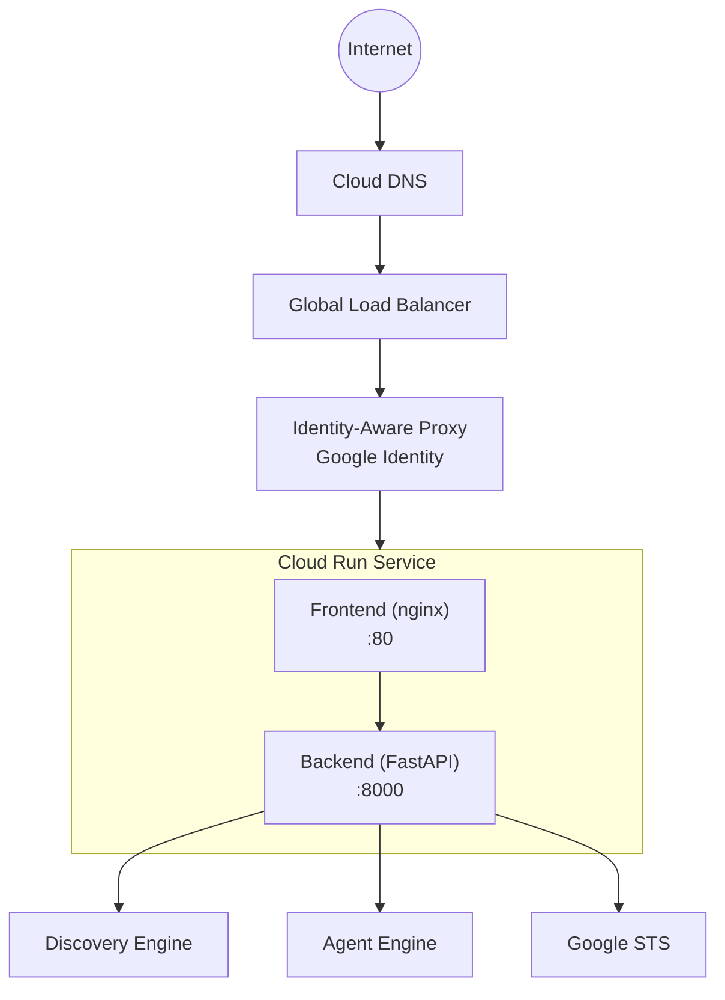
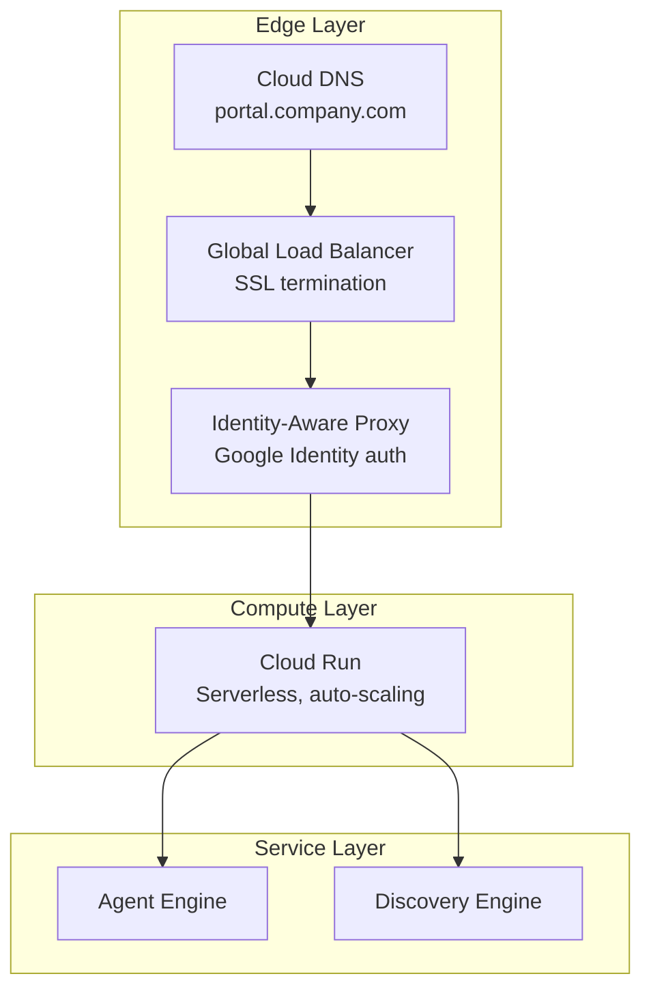

# 10 - Cloud Deployment: Cloud Run + Load Balancer + IAP

**Version:** 1.1.0  
**Last Updated:** 2026-04-05  
**Status:** Production

**Navigation**: [Index](00-INDEX.md) | [09-Panel](09-AGENT-PANEL.md) | **10-Deploy** | [Testing](TESTING.md)

---

## Prerequisites

| Requirement | From |
|-------------|------|
| All previous phases complete | Steps 01-09 |
| Working local deployment | [05-LOCAL-DEV.md](05-LOCAL-DEV.md) |
| Custom domain (optional) | DNS access |

---

## Overview

Packages the React + FastAPI stack into a single Cloud Run container fronted by a Global Load Balancer and IAP — same codebase as local, only environment variables change.

> **Same Code, Different Environment**: The Custom UI uses an [environment-agnostic architecture](05-LOCAL-DEV.md#environment-agnostic-architecture) - the same source code works in both local development and Cloud Run. Only environment variables change.



---

## Step 1: Prepare Dockerfiles

### Backend Dockerfile

Create `backend/Dockerfile`:

```dockerfile
FROM python:3.12-slim

WORKDIR /app

# Install uv
RUN pip install uv

# Copy dependency files
COPY pyproject.toml uv.lock ./

# Install dependencies
RUN uv sync --frozen --no-dev

# Copy application
COPY . .

# Expose port
EXPOSE 8000

# Run with uvicorn
CMD ["uv", "run", "uvicorn", "main:app", "--host", "0.0.0.0", "--port", "8000"]
```

### Frontend Dockerfile

Create `frontend/Dockerfile`:

```dockerfile
FROM node:20-alpine AS builder

WORKDIR /app

# Copy package files
COPY package*.json ./

# Install dependencies
RUN npm ci

# Copy source
COPY . .

# Build
RUN npm run build

# Production image
FROM nginx:alpine

# Copy built files
COPY --from=builder /app/dist /usr/share/nginx/html

# Copy nginx config
COPY nginx.conf /etc/nginx/conf.d/default.conf

EXPOSE 80

CMD ["nginx", "-g", "daemon off;"]
```

### Frontend nginx.conf

Create `frontend/nginx.conf`:

```nginx
server {
    listen 80;
    server_name _;
    
    root /usr/share/nginx/html;
    index index.html;
    
    # SPA routing
    location / {
        try_files $uri $uri/ /index.html;
    }
    
    # API proxy to backend
    location /api/ {
        proxy_pass http://localhost:8000;
        proxy_http_version 1.1;
        proxy_set_header Host $host;
        proxy_set_header X-Real-IP $remote_addr;
        proxy_set_header X-Forwarded-For $proxy_add_x_forwarded_for;
        proxy_set_header X-Forwarded-Proto $scheme;
    }
}
```

---

## Step 2: Combined Service Dockerfile

For simpler deployment, use a combined image:

Create `Dockerfile` (root):

```dockerfile
FROM python:3.12-slim AS backend-builder

WORKDIR /app/backend
RUN pip install uv
COPY backend/pyproject.toml backend/uv.lock ./
RUN uv sync --frozen --no-dev
COPY backend/ .

FROM node:20-alpine AS frontend-builder

WORKDIR /app/frontend
COPY frontend/package*.json ./
RUN npm ci
COPY frontend/ .
RUN npm run build

FROM python:3.12-slim

# Install nginx and supervisor
RUN apt-get update && apt-get install -y nginx supervisor && rm -rf /var/lib/apt/lists/*

# Copy backend
WORKDIR /app/backend
COPY --from=backend-builder /app/backend /app/backend

# Copy frontend build
COPY --from=frontend-builder /app/frontend/dist /usr/share/nginx/html

# Copy nginx config
COPY deploy/nginx.conf /etc/nginx/sites-available/default

# Copy supervisor config
COPY deploy/supervisord.conf /etc/supervisor/conf.d/app.conf

# Install uv in final image
RUN pip install uv

EXPOSE 8080

CMD ["supervisord", "-n"]
```

---

## Step 3: Create Deploy Configs

### deploy/nginx.conf

```nginx
server {
    listen 8080;
    server_name _;
    
    root /usr/share/nginx/html;
    index index.html;
    
    location / {
        try_files $uri $uri/ /index.html;
    }
    
    location /api/ {
        proxy_pass http://127.0.0.1:8000;
        proxy_http_version 1.1;
        proxy_set_header Host $host;
        proxy_set_header X-Real-IP $remote_addr;
        proxy_set_header X-Forwarded-For $proxy_add_x_forwarded_for;
        proxy_set_header X-Forwarded-Proto $scheme;
        proxy_set_header X-Forwarded-Host $host;
        proxy_connect_timeout 60s;
        proxy_read_timeout 90s;
    }
}
```

### deploy/supervisord.conf

```ini
[supervisord]
nodaemon=true
user=root

[program:nginx]
command=/usr/sbin/nginx -g "daemon off;"
autostart=true
autorestart=true
stdout_logfile=/dev/stdout
stdout_logfile_maxbytes=0
stderr_logfile=/dev/stderr
stderr_logfile_maxbytes=0

[program:backend]
command=uv run uvicorn main:app --host 127.0.0.1 --port 8000
directory=/app/backend
autostart=true
autorestart=true
stdout_logfile=/dev/stdout
stdout_logfile_maxbytes=0
stderr_logfile=/dev/stderr
stderr_logfile_maxbytes=0
```

---

## Step 4: Build and Push Image

```bash
# Set variables
export PROJECT_ID=sharepoint-wif-agent
export REGION=us-central1
export IMAGE_NAME=sharepoint-portal

# Configure Docker for Artifact Registry
gcloud auth configure-docker ${REGION}-docker.pkg.dev

# Create Artifact Registry repository (if not exists)
gcloud artifacts repositories create cloud-run-images \
  --repository-format=docker \
  --location=${REGION} \
  --project=${PROJECT_ID}

# Build image
docker build -t ${REGION}-docker.pkg.dev/${PROJECT_ID}/cloud-run-images/${IMAGE_NAME}:latest .

# Push image
docker push ${REGION}-docker.pkg.dev/${PROJECT_ID}/cloud-run-images/${IMAGE_NAME}:latest
```

---

## Step 5: Deploy to Cloud Run

```bash
# Deploy Cloud Run service
gcloud run deploy sharepoint-portal \
  --image=${REGION}-docker.pkg.dev/${PROJECT_ID}/cloud-run-images/${IMAGE_NAME}:latest \
  --platform=managed \
  --region=${REGION} \
  --project=${PROJECT_ID} \
  --allow-unauthenticated \
  --port=8080 \
  --memory=1Gi \
  --cpu=1 \
  --min-instances=0 \
  --max-instances=10 \
  --set-env-vars="PROJECT_NUMBER=${PROJECT_NUMBER}" \
  --set-env-vars="ENGINE_ID=gemini-enterprise" \
  --set-env-vars="DATA_STORE_ID=sharepoint-data-def-connector_file" \
  --set-env-vars="WIF_POOL_ID=sp-wif-pool-v2" \
  --set-env-vars="WIF_PROVIDER_ID=entra-provider" \
  --set-env-vars="REASONING_ENGINE_RES=projects/${PROJECT_NUMBER}/locations/us-central1/reasoningEngines/1988251824309665792"
```

**Note:** For IAP, change `--allow-unauthenticated` to `--no-allow-unauthenticated` after configuring the load balancer.

---

## Step 6: Grant Agent Engine IAM

Cloud Run service account needs `roles/aiplatform.user` to call Agent Engine.

### 6a: Project-Level IAM

```bash
# Grant to default compute service account
gcloud projects add-iam-policy-binding ${PROJECT_ID} \
  --member="serviceAccount:${PROJECT_NUMBER}-compute@developer.gserviceaccount.com" \
  --role="roles/aiplatform.user"
```

### 6b: Resource-Level IAM (Required for query permission)

```bash
# Get your Reasoning Engine resource name
REASONING_ENGINE_RES=projects/${PROJECT_NUMBER}/locations/${REGION}/reasoningEngines/YOUR_ENGINE_ID

# Set IAM on the Reasoning Engine resource itself
curl -X POST \
  -H "Authorization: Bearer $(gcloud auth print-access-token)" \
  -H "Content-Type: application/json" \
  "https://${REGION}-aiplatform.googleapis.com/v1beta1/${REASONING_ENGINE_RES}:setIamPolicy" \
  -d '{
    "policy": {
      "bindings": [{
        "role": "roles/aiplatform.user",
        "members": [
          "serviceAccount:'${PROJECT_NUMBER}'-compute@developer.gserviceaccount.com"
        ]
      }]
    }
  }'
```

**Wait ~60 seconds** for IAM propagation before testing.

---

## Step 7: Create Serverless NEG

```bash
# Create Network Endpoint Group for Cloud Run
gcloud compute network-endpoint-groups create sharepoint-portal-neg \
  --region=${REGION} \
  --network-endpoint-type=serverless \
  --cloud-run-service=sharepoint-portal \
  --project=${PROJECT_ID}
```

---

## Step 8: Create Backend Service

```bash
# Create backend service
gcloud compute backend-services create sharepoint-portal-backend \
  --global \
  --load-balancing-scheme=EXTERNAL_MANAGED \
  --project=${PROJECT_ID}

# Add NEG to backend service
gcloud compute backend-services add-backend sharepoint-portal-backend \
  --global \
  --network-endpoint-group=sharepoint-portal-neg \
  --network-endpoint-group-region=${REGION} \
  --project=${PROJECT_ID}
```

---

## Step 9: Create URL Map and Target Proxy

```bash
# Create URL map
gcloud compute url-maps create sharepoint-portal-urlmap \
  --default-service=sharepoint-portal-backend \
  --global \
  --project=${PROJECT_ID}

# Create target HTTPS proxy (requires SSL cert)
gcloud compute target-https-proxies create sharepoint-portal-https-proxy \
  --url-map=sharepoint-portal-urlmap \
  --ssl-certificates=sharepoint-portal-cert \
  --global \
  --project=${PROJECT_ID}
```

---

## Step 10: Create SSL Certificate

### Option A: Google-Managed Certificate (Recommended)

```bash
# Create managed certificate (requires domain)
# Use subdomain with HYPHENS (not underscores)
gcloud compute ssl-certificates create sharepoint-portal-cert-v2 \
  --domains=sharepoint-wif-portal.example.com \
  --global \
  --project=${PROJECT_ID}
```

### Option B: Self-Managed Certificate

```bash
# Upload existing certificate
gcloud compute ssl-certificates create sharepoint-portal-cert \
  --certificate=path/to/cert.pem \
  --private-key=path/to/key.pem \
  --global \
  --project=${PROJECT_ID}
```

---

## Step 11: Create Global Forwarding Rule

```bash
# Reserve static IP
gcloud compute addresses create sharepoint-portal-ip \
  --global \
  --project=${PROJECT_ID}

# Get IP address
gcloud compute addresses describe sharepoint-portal-ip \
  --global \
  --format="get(address)" \
  --project=${PROJECT_ID}

# Create forwarding rule
gcloud compute forwarding-rules create sharepoint-portal-https-rule \
  --load-balancing-scheme=EXTERNAL_MANAGED \
  --network-tier=PREMIUM \
  --address=sharepoint-portal-ip \
  --target-https-proxy=sharepoint-portal-https-proxy \
  --global \
  --ports=443 \
  --project=${PROJECT_ID}
```

---

## Step 12: Configure IAP

### Enable IAP API

```bash
gcloud services enable iap.googleapis.com --project=${PROJECT_ID}
```

### Provision IAP Service Account

Create the IAP service account before configuring IAP:

```bash
# Create the IAP service agent (required for Cloud Run invocation)
gcloud beta services identity create --service=iap.googleapis.com --project=${PROJECT_ID}
```

This creates: `service-${PROJECT_NUMBER}@gcp-sa-iap.iam.gserviceaccount.com`

### Configure OAuth Consent Screen (Console)

1. Go to: `https://console.cloud.google.com/apis/credentials/consent?project=${PROJECT_ID}`
2. Configure:
   - User type: **Internal** (for Workspace users only)
   - App name: `SharePoint WIF Portal`
   - Support email: your-email@domain.com
   - Click **Save and Continue** through all steps

### Create OAuth Client for IAP (Console)

1. Go to: `https://console.cloud.google.com/apis/credentials?project=${PROJECT_ID}`
2. Click **Create Credentials** > **OAuth client ID**
3. Configure:
   - Application type: **Web application**
   - Name: `IAP-SharePoint-Portal`
   - Leave Authorized redirect URIs empty (IAP adds automatically)
4. Click **Create** and **copy the Client ID and Secret**

### Enable IAP on Backend Service

```bash
# Enable IAP with OAuth credentials
gcloud iap web enable \
  --resource-type=backend-services \
  --service=sharepoint-portal-backend \
  --oauth2-client-id=YOUR_CLIENT_ID \
  --oauth2-client-secret=YOUR_CLIENT_SECRET \
  --project=${PROJECT_ID}
```

### Grant IAP Access

```bash
# Grant access to users
gcloud iap web add-iam-policy-binding \
  --resource-type=backend-services \
  --service=sharepoint-portal-backend \
  --member="user:user@domain.com" \
  --role="roles/iap.httpsResourceAccessor" \
  --project=${PROJECT_ID}

# Or grant to a group
gcloud iap web add-iam-policy-binding \
  --resource-type=backend-services \
  --service=sharepoint-portal-backend \
  --member="group:portal-users@domain.com" \
  --role="roles/iap.httpsResourceAccessor" \
  --project=${PROJECT_ID}
```

---

## Step 13: Configure Cloud Run for IAP

Cloud Run must be configured to work with IAP behind the load balancer:

### Restrict Ingress to Load Balancer Only

```bash
# Only allow traffic from the load balancer (not direct Cloud Run URL)
gcloud run services update sharepoint-portal \
  --region=${REGION} \
  --ingress=internal-and-cloud-load-balancing \
  --project=${PROJECT_ID}
```

### Grant IAP Service Account Permission to Invoke

```bash
# The IAP service account needs invoker permission (required)
gcloud run services add-iam-policy-binding sharepoint-portal \
  --region=${REGION} \
  --project=${PROJECT_ID} \
  --member="serviceAccount:service-${PROJECT_NUMBER}@gcp-sa-iap.iam.gserviceaccount.com" \
  --role="roles/run.invoker"

# Also grant serverless NEG service account (belt and suspenders)
gcloud run services add-iam-policy-binding sharepoint-portal \
  --region=${REGION} \
  --project=${PROJECT_ID} \
  --member="serviceAccount:service-${PROJECT_NUMBER}@serverless-robot-prod.iam.gserviceaccount.com" \
  --role="roles/run.invoker"
```

**Note:** This pattern uses:
- **IAP** for authentication at the load balancer level
- **IAP service account** to invoke Cloud Run after authentication
- **Ingress restriction** to block direct Cloud Run access

---

## Step 14: Configure DNS

Point your domain to the load balancer IP:

```bash
# Get the IP
gcloud compute addresses describe sharepoint-portal-ip \
  --global \
  --format="get(address)" \
  --project=${PROJECT_ID}
```

### Cloudflare Configuration

| Type | Name | Content | Proxy Status | TTL |
|------|------|---------|--------------|-----|
| **A** | `sharepoint-wif-portal` | `<LOAD_BALANCER_IP>` | **DNS Only** (gray cloud) | Auto |

**Note:** Use hyphens (`-`) not underscores (`_`) in subdomain names.

**Important - Keep Proxy OFF during SSL provisioning:**
- Google-managed SSL requires direct access for domain validation
- Cert stays `PROVISIONING` if Cloudflare proxy is enabled
- After cert shows `ACTIVE` (~15-30 min), you can enable proxy

### Verify SSL Certificate Status

```bash
gcloud compute ssl-certificates describe sharepoint-portal-cert \
  --global --project=${PROJECT_ID} \
  --format="table(name,managed.status,managed.domainStatus)"
```

---

## Deployment Checklist

After completing all steps, verify these resources exist:

| Resource | Expected State |
|----------|---------------|
| **Domain** | Points to load balancer IP via DNS |
| **SSL Certificate** | `ACTIVE` (Google-managed) |
| **Cloud Run** | Running, ingress = `internal-and-cloud-load-balancing` |
| **IAP** | Enabled with OAuth client |
| **Load Balancer** | Forwarding HTTPS → Cloud Run via NEG |

---

## Deployment Script

Create `deploy/deploy.sh`:

```bash
#!/bin/bash
set -e

# Configuration
export PROJECT_ID=${PROJECT_ID:-"sharepoint-wif-agent"}
export REGION=${REGION:-"us-central1"}
export IMAGE_NAME="sharepoint-portal"
export SERVICE_NAME="sharepoint-portal"

echo "=========================================="
echo "Deploying SharePoint Portal"
echo "Project: ${PROJECT_ID}"
echo "Region: ${REGION}"
echo "=========================================="

# Build and push
echo "[1/3] Building Docker image..."
docker build -t ${REGION}-docker.pkg.dev/${PROJECT_ID}/cloud-run-images/${IMAGE_NAME}:latest .

echo "[2/3] Pushing to Artifact Registry..."
docker push ${REGION}-docker.pkg.dev/${PROJECT_ID}/cloud-run-images/${IMAGE_NAME}:latest

echo "[3/3] Deploying to Cloud Run..."
gcloud run deploy ${SERVICE_NAME} \
  --image=${REGION}-docker.pkg.dev/${PROJECT_ID}/cloud-run-images/${IMAGE_NAME}:latest \
  --platform=managed \
  --region=${REGION} \
  --project=${PROJECT_ID} \
  --port=8080 \
  --memory=1Gi \
  --cpu=1 \
  --min-instances=0 \
  --max-instances=10 \
  --set-env-vars="PROJECT_NUMBER=${PROJECT_NUMBER},ENGINE_ID=gemini-enterprise,WIF_POOL_ID=sp-wif-pool-v2,WIF_PROVIDER_ID=entra-provider"

echo "=========================================="
echo "Deployment Complete!"
echo "=========================================="
```

---

## Final Architecture



---

## Troubleshooting

| Issue | Cause | Solution |
|-------|-------|----------|
| 502 Bad Gateway | Backend not ready | Wait for Cloud Run cold start |
| 403 Forbidden (IAP) | IAP not authorized | Add user to IAP policy |
| 403 `aiplatform.reasoningEngines.*` | Missing Agent IAM | Apply Step 6 (project + resource-level IAM) |
| SSL error | Cert not provisioned | Wait ~15 min for managed cert |
| CORS errors | Missing headers | Check nginx proxy config |
| Agent timeout | Cold start | Increase min-instances to 1 |

---

## Cost Optimization

| Setting | Dev | Production |
|---------|-----|------------|
| min-instances | 0 | 1 |
| max-instances | 3 | 10 |
| memory | 512Mi | 1Gi |
| CPU | 1 | 2 |
| Concurrency | 80 | 100 |

---

## Security Checklist

- [x] IAP enabled on backend service with OAuth credentials
- [x] Cloud Run ingress set to `internal-and-cloud-load-balancing`
- [x] Serverless NEG service account granted `roles/run.invoker`
- [x] SSL certificate active (Google-managed)
- [x] IAP access granted to authorized users
- [ ] No secrets in environment variables (use Secret Manager)
- [ ] Service account has minimal required roles
- [ ] VPC connector if accessing private resources

---

## Related Documentation

- [Google Cloud Run](https://cloud.google.com/run/docs)
- [Global Load Balancer](https://cloud.google.com/load-balancing/docs/https)
- [Identity-Aware Proxy](https://cloud.google.com/iap/docs)
- [Cloud DNS](https://cloud.google.com/dns/docs)
