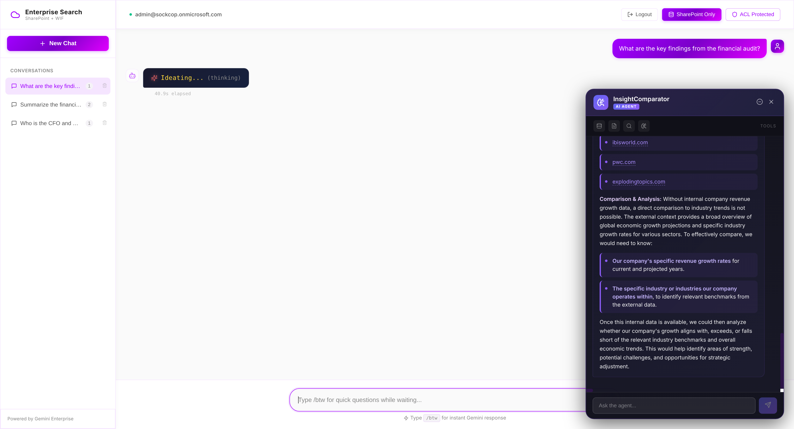

# Grounding Test Questions

Test questions for validating SharePoint document grounding via Discovery Engine StreamAssist API.

**Source Documents**:
1. Master Services Agreement (MSA-2024-0847) - Apex Financial Services
2. PWC Governance & Risk Advisory Report FY2024
3. Financial Audit Report FY2024
4. IT Security Assessment 2024
5. M&A Due Diligence - Project Starlight



---

## Document Summary

| Document | Type | Key Topics |
|----------|------|------------|
| 03_Client_Contract_Apex_Financial.pdf | Contract | MSA terms, SLAs, payment schedules |
| Governance_Risk_Advisory_Report_FY2024.docx | Advisory | Financial integrity, M&A, cybersecurity |
| 01_Financial_Audit_Report_FY2024.pdf | Audit | FY2024 revenue, internal controls |
| 04_IT_Security_Assessment_2024.pdf | Security | Vulnerabilities, access controls |
| 05_MA_Due_Diligence_Project_Starlight.pdf | M&A | Acquisition valuation, synergies |

---

## Questions and Expected Answers

### Section 1: Apex Financial MSA (Document: 03_Client_Contract_Apex_Financial.pdf)

#### Contract Basics

| # | Question | Expected Answer |
|---|----------|-----------------|
| 1 | What is the total annual contract value of the Master Services Agreement? | $4,850,000 |
| 2 | Who is the client in the Master Services Agreement MSA-2024-0847? | Apex Financial Services, Inc. |
| 3 | Who is the provider in the Master Services Agreement? | Meridian Technologies Corporation |
| 4 | What is the contract reference number? | MSA-2024-0847 |
| 5 | What is the effective date of the Master Services Agreement? | January 1, 2025 |

#### Contacts

| # | Question | Expected Answer |
|---|----------|-----------------|
| 6 | Who is the primary contact at the Provider? | Jennifer Walsh |
| 7 | What is Jennifer Walsh's role? | CFO (Chief Financial Officer) |
| 8 | Who is the primary contact at Apex Financial Services? | Richard Blackstone |
| 9 | What is Richard Blackstone's title? | CIO (Chief Information Officer) |

#### Financial Terms

| # | Question | Expected Answer |
|---|----------|-----------------|
| 10 | What is the Q1 payment amount? | $1,212,500 |
| 11 | What are the payment terms? | Net 30 days from invoice date |
| 12 | What is the late payment fee? | 1.5% per month on overdue balances |
| 13 | What bank is used for wire transfers? | JPMorgan Chase |
| 14 | What is the base discount percentage? | 15% off list price |

#### Platform Specifications

| # | Question | Expected Answer |
|---|----------|-----------------|
| 15 | How much storage is allocated? | 50 TB primary, 100 TB backup |
| 16 | What is the API request limit? | 50,000 requests per minute |
| 17 | How many global data centers? | 12 |
| 18 | What database is used? | PostgreSQL Enterprise |

#### Professional Services

| # | Question | Expected Answer |
|---|----------|-----------------|
| 19 | How many implementation hours are included? | 2,400 hours |
| 20 | What is the Technical Architect rate? | $350/hour |
| 21 | How many training hours are included? | 400 hours |

#### Service Level Agreement (SLA)

| # | Question | Expected Answer |
|---|----------|-----------------|
| 22 | What is the Critical (P1) availability SLA? | 99.99% |
| 23 | What is the P1 response time? | 15 minutes |
| 24 | What is the 24/7 support hotline number? | (888) 555-MTEC (6832) |

#### Term and Termination

| # | Question | Expected Answer |
|---|----------|-----------------|
| 25 | What is the initial term of the agreement? | 3 years (Jan 1, 2025 - Dec 31, 2027) |
| 26 | What is the renewal notice period? | 90 days |
| 27 | What is the Year 1 termination fee? | $2,425,000 (50% of annual value) |

#### Data Protection

| # | Question | Expected Answer |
|---|----------|-----------------|
| 28 | What encryption is used for data at rest? | AES-256 |
| 29 | Where is the primary data residency? | US-East (Virginia) |

#### Leadership

| # | Question | Expected Answer |
|---|----------|-----------------|
| 30 | Who is the CEO of Meridian Technologies? | Michael Thornton |

---

### Section 2: Financial Performance (Document: Governance_Risk_Advisory_Report_FY2024.docx)

#### Revenue & Growth

| # | Question | Expected Answer |
|---|----------|-----------------|
| 31 | What was the total revenue for FY2024? | $840M - $850M |
| 32 | What was the revenue increase percentage for FY2024? | 18% - 20% |
| 33 | What report synthesizes the FY2024 findings? | PWC Governance & Risk Advisory Report |
| 34 | When was the PWC Governance report prepared? | May 2024 |

#### Material Weaknesses

| # | Question | Expected Answer |
|---|----------|-----------------|
| 35 | What material weakness was identified in revenue recognition? | Issues with standalone selling price (SSP) determination for enterprise contracts |
| 36 | What IT general control weakness was found? | Over-privileged access in the ERP system |
| 37 | What inventory valuation issue was identified? | Insufficient reserves for obsolescence based on historical write-off trends |
| 38 | How many material weaknesses were identified in the financial audit? | 3 (Revenue Recognition, IT General Controls, Inventory Valuation) |

---

### Section 3: M&A Project Starlight (Document: Governance_Risk_Advisory_Report_FY2024.docx)

#### Acquisition Valuation

| # | Question | Expected Answer |
|---|----------|-----------------|
| 39 | What is the proposed acquisition price for Project Starlight? | $280M - $290M |
| 40 | What is the recommended offer range for the acquisition? | $265M - $275M |
| 41 | What is the private company discount percentage? | 25% - 30% |
| 42 | What is the code name for the M&A acquisition? | Project Starlight |
| 43 | What entity is being acquired in Project Starlight? | The Target Entity (Company B) |

#### Customer Concentration

| # | Question | Expected Answer |
|---|----------|-----------------|
| 44 | What percentage of ARR do the top 3 clients account for? | 35% - 40% |
| 45 | What customer concentration risk was identified? | Top 3 clients account for nearly 35% - 40% of ARR |

#### Synergies

| # | Question | Expected Answer |
|---|----------|-----------------|
| 46 | What are the identified annual synergies by Year 3? | $18M - $24M |
| 47 | What type of synergies were identified? | Cost and revenue synergies |
| 48 | By what year should synergies be fully realized? | Year 3 |

#### Risk Contingency

| # | Question | Expected Answer |
|---|----------|-----------------|
| 49 | What is the estimated patent litigation settlement range? | $1M - $3M |
| 50 | What legal risk was identified in the due diligence? | Patent litigation settlement |

---

### Section 4: Cybersecurity Assessment (Document: Governance_Risk_Advisory_Report_FY2024.docx)

#### Overall Assessment

| # | Question | Expected Answer |
|---|----------|-----------------|
| 51 | What is the overall cybersecurity risk rating? | Medium-High |
| 52 | How many critical vulnerabilities were identified? | 4 |

#### Critical Vulnerabilities

| # | Question | Expected Answer |
|---|----------|-----------------|
| 53 | What type of vulnerability was found in the Customer API? | SQL injection vulnerability |
| 54 | How many customer records are exposed by the SQL injection vulnerability? | Over 2.5 million |
| 55 | What access control issue was identified? | Exposed administrative portal with active default credentials |
| 56 | What secrets management issue was found? | Hardcoded production database and cloud provider keys in source code |
| 57 | How much customer data is in publicly accessible S3 buckets? | 2.5TB - 3.5TB |
| 58 | What type of data is in the exposed S3 buckets? | Customer data backups |

---

### Section 5: Strategic Recommendations (Document: Governance_Risk_Advisory_Report_FY2024.docx)

#### Control Environment

| # | Question | Expected Answer |
|---|----------|-----------------|
| 59 | What should be implemented for SSP determination? | A centralized SSP committee |
| 60 | By when should the user access review be completed? | Q2 2025 |
| 61 | What systems require the comprehensive user access review? | All financial systems |

#### Security Remediation

| # | Question | Expected Answer |
|---|----------|-----------------|
| 62 | What API should be patched immediately? | The customer API |
| 63 | What secrets management solution is recommended? | HashiCorp Vault |
| 64 | What is the priority for patching the SQL injection? | Immediate |

#### M&A Integration

| # | Question | Expected Answer |
|---|----------|-----------------|
| 65 | What integration approach is recommended? | A phased integration plan |
| 66 | How long is the recommended operational autonomy period? | 24 months |
| 67 | What is the goal of the autonomy period? | Ensure synergy capture and retention of key personnel |

---

## Cross-Document Questions

These questions test the ability to correlate information across multiple documents.

| # | Question | Expected Answer |
|---|----------|-----------------|
| 68 | How does the Apex Financial MSA value compare to the identified M&A synergies? | MSA is $4.85M annually; synergies are $18M-$24M by Year 3 |
| 69 | What are the two types of access control issues identified across all reports? | Over-privileged ERP access, exposed admin portal with default credentials |
| 70 | What encryption standard is used for Apex Financial data? | AES-256 |
| 71 | Which report discusses the SQL injection vulnerability? | PWC Governance & Risk Advisory Report |
| 72 | What is the relationship between customer API security and the 2.5M exposed records? | The SQL injection vulnerability in the customer API exposes over 2.5 million records |

---

## Test Results Summary

| Metric | Result |
|--------|--------|
| **Total Questions** | 72 |
| **Contract Questions (1-30)** | 30 |
| **Financial Questions (31-38)** | 8 |
| **M&A Questions (39-50)** | 12 |
| **Security Questions (51-58)** | 8 |
| **Recommendations (59-67)** | 9 |
| **Cross-Document (68-72)** | 5 |

---

## Known Issues

### Session Context Pollution

When using Discovery Engine Sessions for multi-turn conversation:
- **First query**: Properly grounded with SharePoint sources
- **Follow-up queries**: May use session cache instead of re-searching, leading to:
  - Missing source citations
  - Hallucinated answers
  - Mixing data from different documents

**Workaround**: Start a new chat for each independent question, or be very specific (e.g., "What is the contract value for **Apex Financial Services**?")

### Multiple Similar Documents

If SharePoint contains multiple MSA documents (e.g., Apex Financial + InnovateForward), ambiguous questions like "What is the MSA value?" may return data from the wrong contract.

**Workaround**: Include specific identifiers in questions:
- Bad: "What is the MSA contract value?"
- Good: "What is the contract value for Apex Financial Services in MSA-2024-0847?"

### Range Values

Several documents contain value ranges (e.g., "$840M - $850M"). The grounding system may:
- Return the lower bound only
- Return the upper bound only
- Return a midpoint
- Return the full range

**Best Practice**: Accept any value within the stated range as correct.

---

## Running the Automated Test

```bash
cd backend
source .venv/bin/activate
python test_grounding.py
```

Results saved to `/tmp/grounding_results.json`

---

## Document Source Mapping

| Question Range | Source File |
|----------------|-------------|
| 1-30 | 03_Client_Contract_Apex_Financial.pdf |
| 31-38 | Governance_Risk_Advisory_Report_FY2024.docx |
| 39-50 | Governance_Risk_Advisory_Report_FY2024.docx |
| 51-58 | Governance_Risk_Advisory_Report_FY2024.docx |
| 59-67 | Governance_Risk_Advisory_Report_FY2024.docx |
| 68-72 | Multiple documents |
