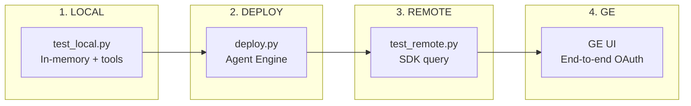

# Testing Guide

**Version:** 2.1.0  
**Last Updated:** 2026-04-05

**Navigation**: [Index](00-INDEX.md) | [09-Panel](09-AGENT-PANEL.md) | [10-Deploy](10-CLOUD-DEPLOYMENT.md) | **Testing**

---

## Testing Workflow



---

## Phase 1: Local Testing

Test agent **before** deploying to Agent Engine.

### Run

```bash
uv run python test_local.py                  # Default query
uv run python test_local.py "custom query"   # Custom query
uv run python test_local.py --with-token     # With real JWT
```

### What It Tests

| Check | Description |
|-------|-------------|
| Tool execution | `compare_insights` works |
| Discovery Engine | Connection via service account |
| Agent behavior | Instructions produce expected output |

### Expected Output

```
============================================================
           LOCAL TESTING - InsightComparator Agent
============================================================

This tests the agent BEFORE deploying to Agent Engine.

============================================================
         Phase 1: Direct Tool Testing
============================================================
Project Number: ${PROJECT_NUMBER}
Engine ID:      gemini-enterprise
Data Store ID:  sharepoint-data-def-connector_file
WIF Pool ID:    sp-wif-pool-v2
WIF Provider:   entra-provider

[Test] Calling Discovery Engine with service account...
[OK] Answer: Based on the available documents...
[OK] Sources: 3

============================================================
         Phase 2: Agent Conversation Testing
============================================================
Agent:  InsightComparator
Model:  gemini-2.5-flash-lite
Tools:  ['compare_insights']

[Query] What are best practices for cloud security?
------------------------------------------------------------
## Internal Findings (SharePoint)
[Summary of internal documents]

## External Findings (Web)
[Summary of public web sources]

## Synthesis
[Comparison and recommendations]
------------------------------------------------------------
[Response Length] 1847 chars

============================================================
             LOCAL TESTING COMPLETE
============================================================
```

---

## Phase 2: Deploy

```bash
# First deployment
uv run python deploy.py

# Update existing
uv run python deploy.py update
```

### Output

```
=====================================
Deploying Insight Comparator Agent
=====================================
Project:  sharepoint-wif-agent
Location: us-central1
Staging:  gs://sharepoint-wif-agent-staging
=====================================
Creating Agent Engine deployment...
=====================================
Deployment Complete!
=====================================
Resource Name: projects/${PROJECT_NUMBER}/locations/us-central1/reasoningEngines/1452886418605998080
=====================================
```

Save to `.env`:
```bash
REASONING_ENGINE_RES=projects/${PROJECT_NUMBER}/locations/us-central1/reasoningEngines/1452886418605998080
```

---

## Phase 3: Remote Testing

Test agent **after** deploying to Agent Engine.

### Run

```bash
uv run python test_remote.py                  # Default query
uv run python test_remote.py "custom query"   # Custom query
uv run python test_remote.py --list           # List deployed agents
```

### What It Tests

| Check | Description |
|-------|-------------|
| Deployment | Agent accessible on Agent Engine |
| Environment | Env vars correctly passed |
| Cloud execution | Tools work in cloud |
| Streaming | Response streams correctly |

### Expected Output

```
============================================================
           REMOTE TESTING - Agent Engine
============================================================

Project:  sharepoint-wif-agent
Location: us-central1
Engine:   projects/.../reasoningEngines/1452886418605998080

[Loading] Agent from Agent Engine...
[OK] Agent loaded: InsightComparator

[Query] What are cloud security best practices?
------------------------------------------------------------
## Internal Findings (SharePoint)
...

## External Findings (Web)
...

## Synthesis
...
------------------------------------------------------------
[OK] Remote test complete!
```

---

## Phase 4: Register to Gemini Enterprise

### Register OAuth

```bash
./scripts/register_auth.sh
```

**Critical:** Authorization must include `user_impersonation` scope:
```bash
"scopes": ["api://${OAUTH_CLIENT_ID}/user_impersonation"]
```

### Register Agent

```bash
./scripts/register_agent.sh
```

---

## Phase 5: Gemini Enterprise Testing

1. Open Gemini Enterprise UI
2. Find "Insight Comparator" in agent list
3. Click "Authorize" when prompted
4. Test query: "Compare our internal security policies with best practices"

### Expected Response

```markdown
## Internal Findings (SharePoint)
- Summary of internal documents
- Sources: [Document titles with links]

## External Findings (Web)
- Summary of public sources
- Sources: [Website titles with links]

## Synthesis
- What aligns between internal and external
- What's unique to internal documents
- Recommendations
```

---

## Token Testing UI (Optional)

For testing with real SharePoint ACL access:

```bash
cd test_ui
uv sync
uv run python server.py
# Open http://localhost:8080
```

1. Click **Login with Microsoft**
2. Enter query and click **Send Query**
3. Token saved to `/tmp/entra_token.txt` for CLI testing

**Requires:** Add `http://localhost:8080` to Entra app SPA redirect URIs.

---

## Troubleshooting

### Local Testing

| Issue | Solution |
|-------|----------|
| No credentials | `gcloud auth application-default login` |
| Discovery Engine error | Verify ENGINE_ID in .env |
| WIF not configured | Check WIF_POOL_ID and WIF_PROVIDER_ID |

### Remote Testing

| Issue | Solution |
|-------|----------|
| Agent not found | Check REASONING_ENGINE_RES in .env |
| Permission denied | Add `aiplatform.user` role |
| Tool error | Check Cloud Logging |

### Gemini Enterprise

| Issue | Solution |
|-------|----------|
| Agent not visible | Set `sharingConfig.scope = "ALL_USERS"` |
| Authorization loop | Add `user_impersonation` scope |
| SharePoint 403 | Change `WIF_PROVIDER_ID=entra-provider` |

### View Logs

```bash
# Agent Engine logs
gcloud logging read \
  "resource.type=aiplatform.googleapis.com/ReasoningEngine" \
  --project=sharepoint-wif-agent \
  --limit=20

# Filter for errors
gcloud logging read \
  "resource.type=aiplatform.googleapis.com/ReasoningEngine AND severity>=ERROR" \
  --project=sharepoint-wif-agent \
  --limit=10
```

---

## Quick Reference

| Step | Command |
|------|---------|
| Install deps | `uv sync` |
| Test local | `uv run python test_local.py` |
| Deploy | `uv run python deploy.py` |
| Test remote | `uv run python test_remote.py` |
| Register OAuth | `./scripts/register_auth.sh` |
| Register agent | `./scripts/register_agent.sh` |
| Test UI | `cd test_ui && uv run python server.py` |

---

## API Limitations

### Discovery Engine A2A Protocol

The A2A endpoint (`/agents/{id}/a2a/v1/message:stream`) can invoke registered agents but **does not support passing session state**. OAuth token injection is handled server-side by Gemini Enterprise when users click "Authorize".

For programmatic testing with SharePoint ACL, use:
1. **test_ui/** - Login and get real JWT
2. **test_local.py --with-token** - Inject saved token

See `scripts/test_a2a_discovery.py` for A2A protocol details.
