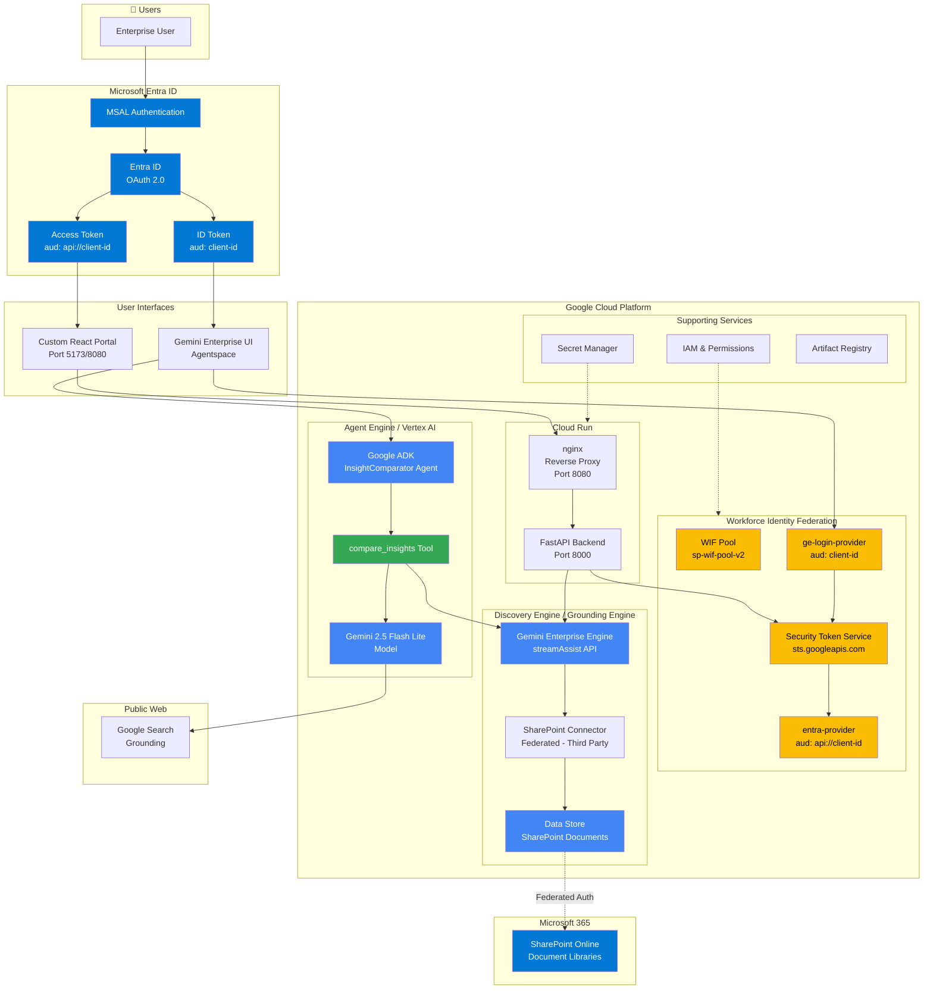
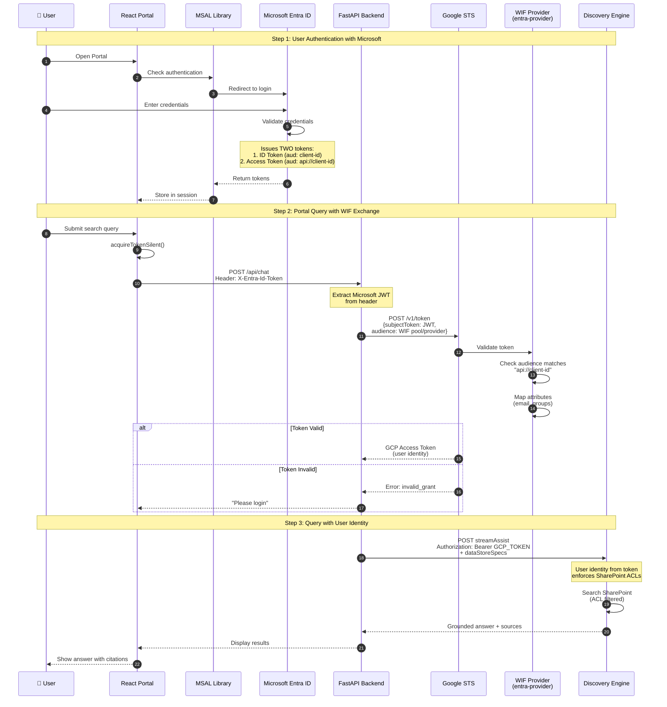
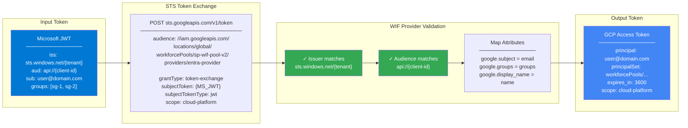
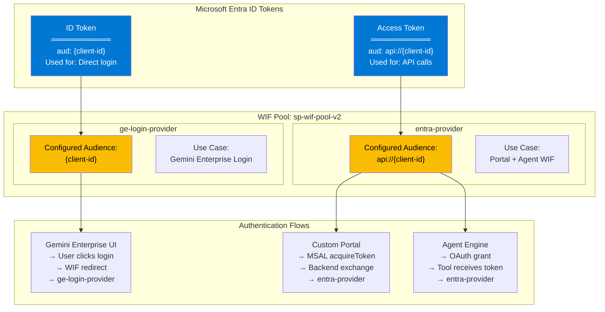
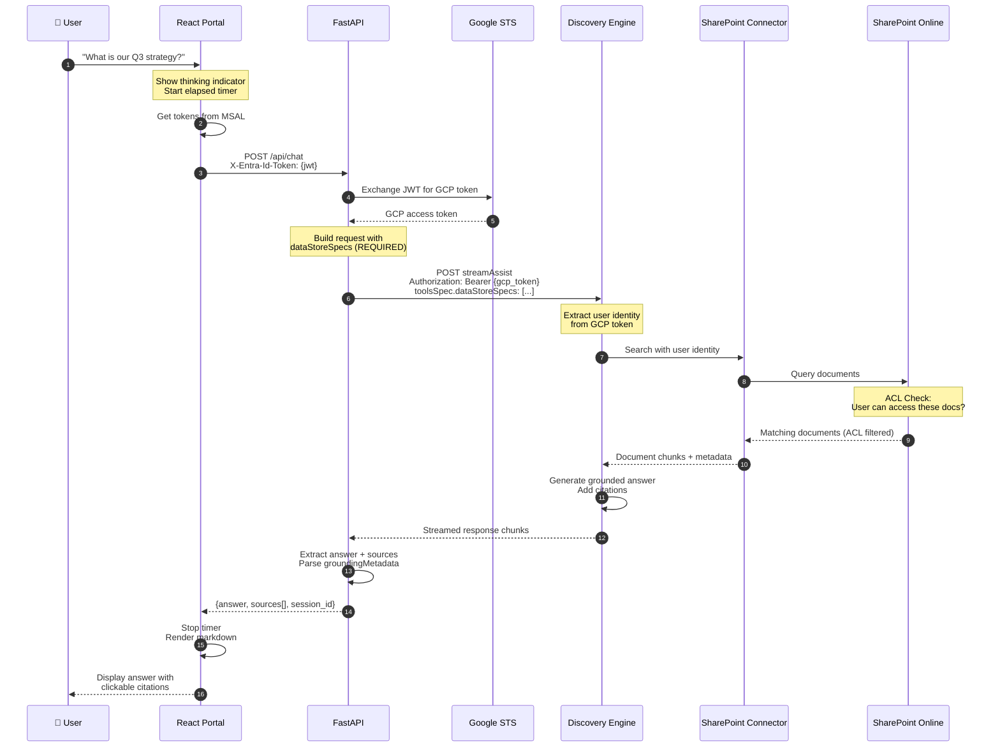
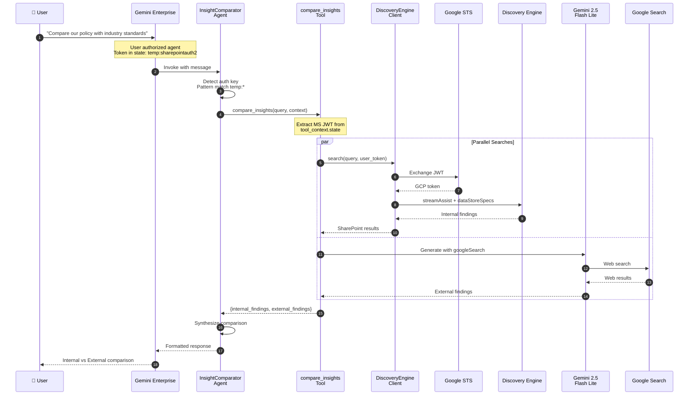
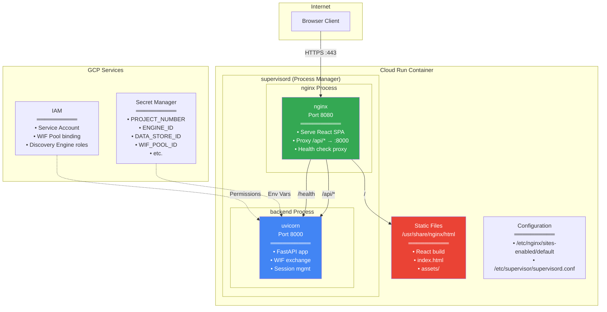
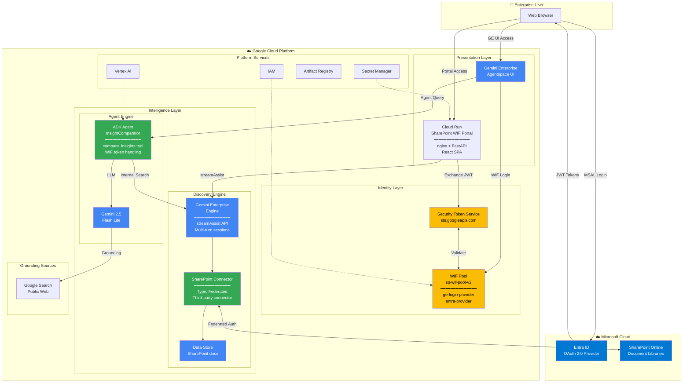
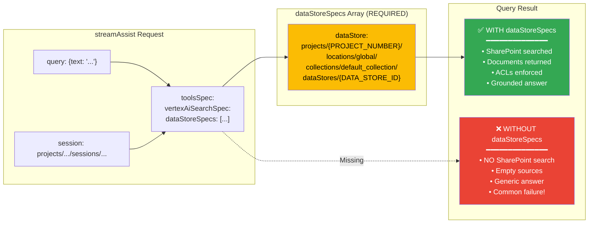
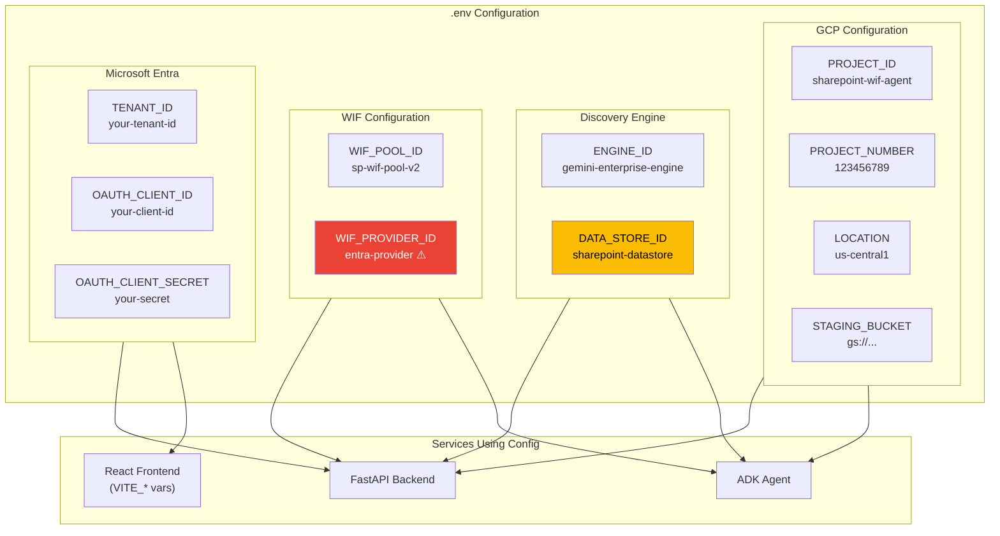

# SharePoint WIF Portal - Architecture Diagrams

Comprehensive architecture diagrams for the SharePoint WIF Portal solution, showing Google Cloud components, authentication flows, and data paths.

---

## 1. High-Level Architecture Overview

---

## 2. Authentication Flow - JWT to GCP Token

---

## 3. Detailed WIF Token Exchange

---

## 4. Two WIF Providers - Why Both Are Required

---

## 5. Data Flow - Query to Answer

---

## 6. Agent Engine - Compare Insights Flow

---

## 7. Cloud Run Deployment Architecture

---

## 8. Complete System - All Components

---

## 9. dataStoreSpecs - Critical Configuration

---

## 10. Environment Variables Map

---

## Quick Reference

| Component | Technology | Port | Purpose |
|-----------|------------|------|---------|
| **Frontend** | React + Vite | 5173 (local) / 8080 (cloud) | User interface |
| **Backend** | FastAPI + uvicorn | 8000 | API, WIF exchange |
| **Proxy** | nginx | 8080 | Reverse proxy, static files |
| **Auth** | MSAL + WIF | - | Microsoft → GCP identity |
| **Search** | Discovery Engine | - | SharePoint grounded search |
| **Agent** | ADK + Agent Engine | - | Internal/external comparison |
| **Model** | Gemini 2.5 Flash Lite | - | LLM inference |

### Critical Success Factors

1. **Two WIF Providers** - ge-login-provider for GE UI, entra-provider for Portal/Agent
2. **dataStoreSpecs REQUIRED** - Without it, no SharePoint results
3. **Correct Audience** - api://client-id for access tokens
4. **oauth2AllowIdTokenImplicitFlow** - Must be true in Entra manifest
5. **IAM Roles** - discoveryengine.viewer + user on WIF principal
