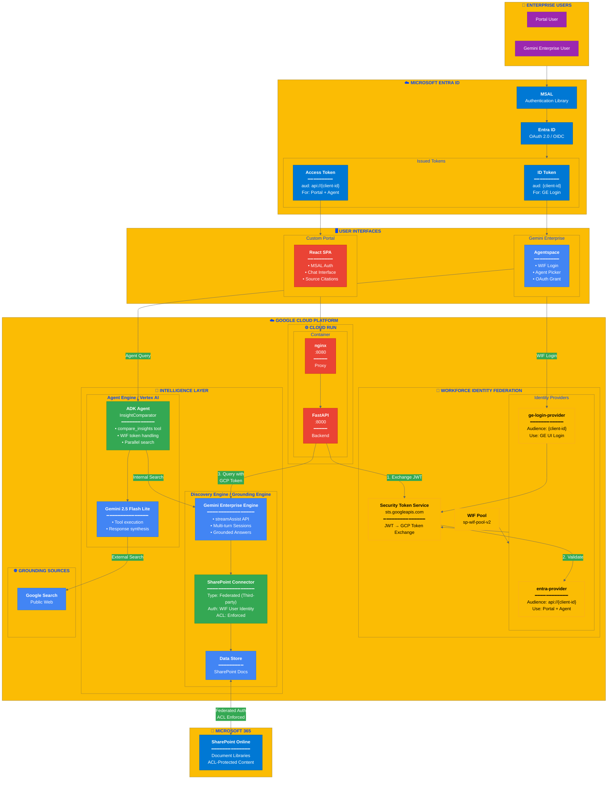
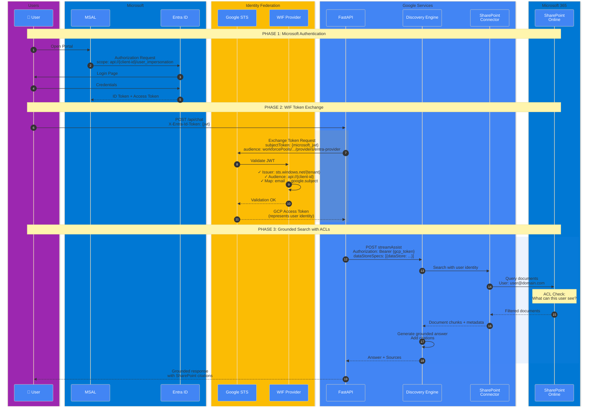

# SharePoint WIF Portal - Architecture Poster

## Complete Solution Architecture



---

## Authentication Sequence - The Complete Flow



---

## Component Details

### Discovery Engine Configuration

| Setting | Value | Purpose |
|---------|-------|---------|
| **Engine Type** | Gemini Enterprise | Generative search with grounding |
| **Location** | global | Multi-region availability |
| **Collection** | default_collection | Standard container |
| **API** | streamAssist | Streaming grounded answers |
| **Sessions** | Multi-turn | Conversation context |

### WIF Provider Configuration

| Provider | Audience | Use Case |
|----------|----------|----------|
| **ge-login-provider** | `{client-id}` | Gemini Enterprise UI login via WIF redirect |
| **entra-provider** | `api://{client-id}` | Portal backend + Agent Engine WIF exchange |

### Agent Engine (ADK)

| Setting | Value |
|---------|-------|
| **Agent Name** | InsightComparator |
| **Model** | gemini-2.5-flash-lite |
| **Tool** | compare_insights |
| **Deployment** | Vertex AI Reasoning Engines |
| **Auth Handling** | Auto-detect temp:* keys in state |

### Critical Environment Variables

```
# MUST SET (deployments fail silently without these)
PROJECT_NUMBER=123456789          # For Discovery Engine URLs
ENGINE_ID=your-engine-id          # Discovery Engine
DATA_STORE_ID=your-datastore-id   # SharePoint data store (CRITICAL!)
WIF_POOL_ID=sp-wif-pool-v2        # WIF pool
WIF_PROVIDER_ID=entra-provider    # MUST be "entra-provider" for api:// audience
```
