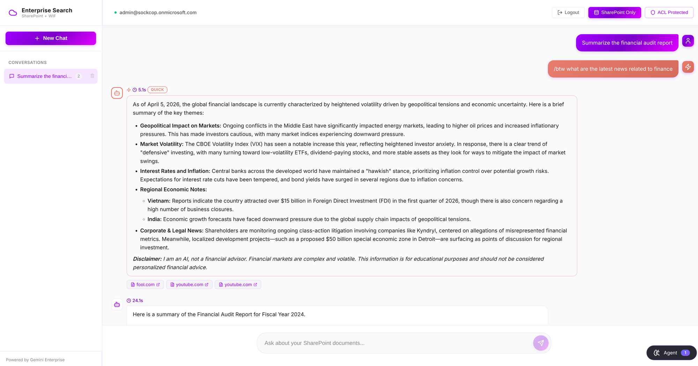
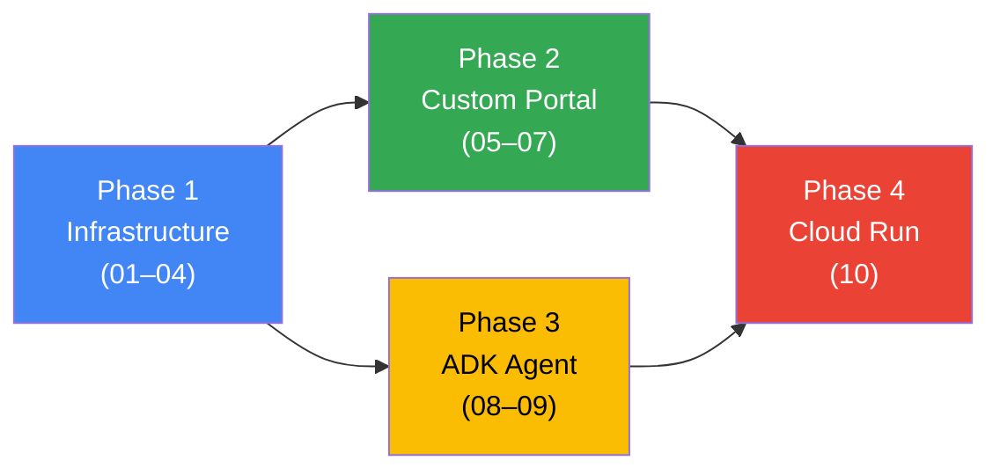

# SharePoint WIF Portal




*Custom portal — authenticated user, dual-mode search active, ACL enforcement confirmed*

> [!WARNING]
> **Read [`docs/00-AUTH-CHAIN.md`](docs/00-AUTH-CHAIN.md) before starting setup.**
> The authentication chain (Entra JWT → WIF/STS → `dataStoreSpecs` → SharePoint) is not documented by the product team and took significant effort to reverse-engineer. Skipping it causes silent failures with no clear error messages — Gemini returns HTTP 200 with plausible-looking answers sourced from its training data, not your SharePoint.

---

## What You're Building

A full-stack enterprise search portal that bridges Microsoft Entra ID identities to Google Cloud — no credential storage, no service account impersonation, per-user SharePoint ACL enforcement at query time.

By the end of this guide you will have:

- **React + FastAPI custom portal** — MSAL login acquires an Entra JWT; the backend exchanges it for a scoped GCP access token via Workforce Identity Federation (WIF); Gemini Enterprise (Discovery Engine API) runs each query under the user's own identity
- **Per-user SharePoint ACL enforcement** — users only see documents they're already permitted to access in SharePoint, enforced by Gemini Enterprise, not by your application logic
- **InsightComparator ADK agent on Agent Engine** — a single `compare_insights` tool that concurrently searches SharePoint (internal, ACL-aware) and Google Search (public web), then synthesizes a comparison
- **Production Cloud Run deployment** — single container with nginx + FastAPI + built React, behind a Global Load Balancer with IAP — same codebase as local, only environment variables change

---

## Quick Start

> Full setup requires completing the infrastructure docs first (Entra ID, WIF, Discovery Engine). These commands assume that's done — see [Choose Your Path](#choose-your-path) below.

```bash
# 1. Configure environment
cp .env.example .env          # fill in GCP + Entra values
cp frontend/.env.example frontend/.env   # fill in VITE_CLIENT_ID + VITE_TENANT_ID

# 2. Start backend
cd backend && uv sync && uv run uvicorn main:app --reload

# 3. Start frontend (new terminal)
cd frontend && npm install && npm run dev
# → http://localhost:5173
```

---

## Choose Your Path

Not every deployment needs all four phases. Pick the track that matches your goal.



| Goal | Phases needed |
|------|--------------|
| Custom React portal querying SharePoint via WIF | 1 → 2 → 4 |
| ADK agent available in Gemini Enterprise UI | 1 → 3 |
| Both portal and agent, production-ready | 1 → 2 → 3 → 4 |

---

## Prerequisites

| Requirement | Notes |
|-------------|-------|
| **GCP project** with billing enabled | Owner or Editor role |
| **Microsoft Azure subscription** | With permissions to register Entra apps |
| **SharePoint Online tenant** | Sites you want to make searchable |
| **Python 3.12+** | [Download](https://python.org) |
| **uv** (Python package manager) | `curl -LsSf https://astral.sh/uv/install.sh \| sh` |
| **Node 18+** | For building the frontend |

---

## Built & Tested With

> All library versions are pinned exactly in `pyproject.toml` and `package.json`. Use `uv sync` and `npm ci` to reproduce the exact environment.

**Backend (Python)**

| Library | Version |
|---------|---------|
| `fastapi` | 0.135.3 |
| `google-cloud-aiplatform` | 1.145.0 |
| `google-auth` | 2.49.1 |
| `pydantic` | 2.12.5 |
| `uvicorn` | 0.43.0 |
| `sse-starlette` | 3.3.4 |

**Agent (Python)**

| Library | Version |
|---------|---------|
| `google-cloud-aiplatform[adk,agent_engines]` | 1.145.0 |
| `google-adk` | 1.28.1 |
| `google-cloud-discoveryengine` | 0.13.12 |
| `google-auth` | 2.49.1 |
| `httpx` | 0.28.1 |

**Frontend (Node)**

| Library | Version |
|---------|---------|
| `react` | 19.2.4 |
| `@azure/msal-browser` | 4.30.0 |
| `@azure/msal-react` | 3.0.29 |
| `react-markdown` | 10.1.0 |
| `vite` | 8.0.3 |
| `typescript` | 5.9.3 |

---

## Architecture

<details>
<summary>Show full architecture diagram</summary>

```
+================================================================================================+
|                              SHAREPOINT WIF PORTAL - FULL ARCHITECTURE                          |
|                                                                                                 |
|   +-------------------------------------------------------------------------------------------+ |
|   |                                    USER INTERFACES                                         | |
|   |                                                                                            | |
|   |    +-------------------+              +-------------------+              +---------------+ | |
|   |    |   Custom Portal   |              | Gemini Enterprise |              |   Test UI     | | |
|   |    |   (React + Vite)  |              |       (GE)        |              | (localhost)   | | |
|   |    |   Port 5173       |              |                   |              | Port 8080     | | |
|   |    +--------+----------+              +--------+----------+              +-------+-------+ | |
|   |             |                                  |                                 |         | |
|   +-------------|----------------------------------|-------------------------------- |--------- + |
|                 |                                  |                                 |           |
|   +-------------v----------------------------------v---------------------------------v---------+ |
|   |                              AUTHENTICATION LAYER                                          | |
|   |                                                                                            | |
|   |    +-----------------------------------------------------------------------------------+   | |
|   |    |                           Microsoft Entra ID                                      |   | |
|   |    |                                                                                   |   | |
|   |    |    App Registration: sharepoint-wif-portal                                        |   | |
|   |    |    +-----------------------------+    +-----------------------------+             |   | |
|   |    |    | ID Token                    |    | Access Token                |             |   | |
|   |    |    | aud: {client-id}            |    | aud: api://{client-id}      |             |   | |
|   |    |    | For: GE Login               |    | For: Agent WIF Exchange     |             |   | |
|   |    |    +-----------------------------+    +-----------------------------+             |   | |
|   |    +-----------------------------------------------------------------------------------+   | |
|   |                            |                              |                                | |
|   +----------------------------|------------------------------|------------------------------ + |
|                                |                              |                                  |
|   +----------------------------v------------------------------v------------------------------+ |
|   |                           WORKFORCE IDENTITY FEDERATION (WIF)                             | |
|   |                                                                                            | |
|   |    Pool: sp-wif-pool-v2                                                                   | |
|   |    +-------------------------------------+    +-------------------------------------+      | |
|   |    | Provider: ge-login-provider         |    | Provider: entra-provider            |      | |
|   |    | Audience: {client-id} (no prefix)   |    | Audience: api://{client-id}         |      | |
|   |    | Purpose: GE user authentication     |    | Purpose: Agent token exchange       |      | |
|   |    | Grants: discoveryengine.viewer      |    | Grants: discoveryengine.viewer      |      | |
|   |    +-------------------------------------+    +-------------------------------------+      | |
|   |                            |                              |                                | |
|   |                            +-------> STS Exchange <-------+                                | |
|   |                                          |                                                 | |
|   |                                          v                                                 | |
|   |                                   GCP Access Token                                         | |
|   |                                   (User Identity)                                          | |
|   +----------------------------|--------------------------------------------------------------+ |
|                                |                                                                 |
|   +----------------------------v--------------------------------------------------------------+ |
|   |                                    BACKEND SERVICES                                        | |
|   |                                                                                            | |
|   |    +------------------------------------------+    +----------------------------------+    | |
|   |    |            FastAPI Backend               |    |      Agent Engine (ADK)          |    | |
|   |    |            Port 8000                     |    |                                  |    | |
|   |    |                                          |    |    +-------------------------+   |    | |
|   |    |    /api/chat   - streamAssist + WIF      |    |    | InsightComparator Agent |   |    | |
|   |    |    /api/quick  - Gemini + Google Search  |    |    | compare_insights tool   |   |    | |
|   |    |    /api/sessions - Conversation mgmt     |    |    +-------------------------+   |    | |
|   |    +------------------------------------------+    +----------------------------------+    | |
|   |                   |                                              |                         | |
|   +-----------------  |  ------------------------------------------- | ----------------------- + |
|                       |                                              |                           |
|   +-------------------v----------------------------------------------v-------------------------+ |
|   |                              DISCOVERY ENGINE                                              | |
|   |                                                                                            | |
|   |    Engine: gemini-enterprise                                                              | |
|   |    +------------------------------------------+    +----------------------------------+    | |
|   |    |         streamAssist API                 |    |      Agentspace                  |    | |
|   |    |                                          |    |                                  |    | |
|   |    |    - Query with user identity (WIF)      |    |    Registered Agents:            |    | |
|   |    |    - SharePoint ACL enforcement          |    |    - InsightComparator           |    | |
|   |    |    - Grounding with sources              |    |    - OAuth: sharepointauth2      |    | |
|   |    +------------------------------------------+    +----------------------------------+    | |
|   |                                                                                            | |
|   +--------------------------------------------------------------------------------------------+ |
|                                              |                                                   |
|   +------------------------------------------v-------------------------------------------------+ |
|   |                                    DATA SOURCES                                            | |
|   |                                                                                            | |
|   |    +------------------------------------------+    +----------------------------------+    | |
|   |    |         SharePoint Online                |    |       Google Search              |    | |
|   |    |                                          |    |                                  |    | |
|   |    |    Data Store: sharepoint-data-*         |    |    Gemini Grounding Tool         |    | |
|   |    |    Connector: Federated (Third-party)    |    |    Public web results            |    | |
|   |    |    ACL: User-level via WIF identity      |    |                                  |    | |
|   |    +------------------------------------------+    +----------------------------------+    | |
|   |                                                                                            | |
|   +--------------------------------------------------------------------------------------------+ |
|                                                                                                  |
+==================================================================================================+
```

</details>

---

## Documentation

Follow this order. Each phase builds on the previous.

<details>
<summary>Show documentation flow diagram</summary>

```
+===========================================================================+
|                         DOCUMENTATION FLOW                                 |
|                                                                            |
|   PHASE 1: INFRASTRUCTURE                                                  |
|   +-----------+     +-----------+     +-----------+     +-----------+     |
|   |  01-GCP   | --> |  02-ENTRA | --> |  03-WIF   | --> |  04-DISCO |     |
|   +-----------+     +-----------+     +-----------+     +-----------+     |
|                                                                            |
|   PHASE 2: CUSTOM UI (Direct API - No Agent Required)                     |
|   +-----------+     +-----------+     +-----------+                       |
|   |  05-DEV   | --> |  06-ENGINE| --> |  07-FRONT |                       |
|   +-----------+     +-----------+     +-----------+                       |
|                                                                            |
|   PHASE 3: AGENT INTEGRATION                                              |
|   +-----------+     +-----------+                                          |
|   | 08-AGENT  | --> | 09-PANEL  |                                          |
|   +-----------+     +-----------+                                          |
|                                                                            |
|   PHASE 4: PRODUCTION DEPLOYMENT                                          |
|   +-----------+     +-----------+                                          |
|   | 10-DEPLOY | --> |  TESTING  |                                          |
|   +-----------+     +-----------+                                          |
|                                                                            |
+===========================================================================+
```

</details>

| # | Document | Depends On | What It Sets Up |
|---|----------|------------|-----------------|
| ⚠️ | [**00-AUTH-CHAIN.md**](docs/00-AUTH-CHAIN.md) | — | **Read first — the undocumented auth chain** |
| 01 | [01-SETUP-GCP.md](docs/01-SETUP-GCP.md) | — | GCP project, APIs, IAM |
| 02 | [02-SETUP-ENTRA.md](docs/02-SETUP-ENTRA.md) | 01 | Microsoft Entra ID app registration |
| 03 | [03-SETUP-WIF.md](docs/03-SETUP-WIF.md) | 01, 02 | WIF pool + two providers |
| 04 | [04-SETUP-DISCOVERY.md](docs/04-SETUP-DISCOVERY.md) | 01–03 | Discovery Engine + SharePoint connector |
| 05 | [05-LOCAL-DEV.md](docs/05-LOCAL-DEV.md) | 01–04 | Backend + frontend running locally |
| 06 | [06-AGENT-ENGINE.md](docs/06-AGENT-ENGINE.md) | 05 | Agent Engine basics |
| 07 | [07-FRONTEND-FEATURES.md](docs/07-FRONTEND-FEATURES.md) | 05–06 | Chat, `/btw`, sessions |
| 08 | [08-ADK-AGENT.md](docs/08-ADK-AGENT.md) | 01–04 | Deploy InsightComparator agent |
| 09 | [09-AGENT-PANEL.md](docs/09-AGENT-PANEL.md) | 05, 08 | Agent Panel in custom UI |
| 10 | [10-CLOUD-DEPLOYMENT.md](docs/10-CLOUD-DEPLOYMENT.md) | 01–09 | Cloud Run + GLB + IAP |
| — | [TESTING.md](docs/TESTING.md) | 10 | Full testing workflow |

---

## Token Flow

<details>
<summary>Show token flow diagram</summary>

```
                    CUSTOM PORTAL                              GEMINI ENTERPRISE
                    ============                               =================

User Login          User Login
     |                   |
     v                   v
+----------+        +----------+
| Entra ID |        | Entra ID |
| (MSAL)   |        | (via GE) |
+----------+        +----------+
     |                   |
     | ID Token          | Access Token
     | aud:{client-id}   | aud:api://{client-id}
     |                   |
     v                   v
+----------+        +-------------------+
| Frontend |        | ge-login-provider |
+----------+        +-------------------+
     |                   |
     | X-Entra-Id-Token  | ID Token
     |                   |
     v                   v
+----------+        +-------------------+
| Backend  |        | Agentspace        |
| (FastAPI)|        +-------------------+
+----------+              |
     |                    | temp:sharepointauth2
     | STS Exchange       |
     |                    v
     v              +-------------------+
+----------+        | ADK Agent         |
| STS      |        | (Agent Engine)    |
+----------+        +-------------------+
     |                    |
     | GCP Token          | STS Exchange via
     | (WIF identity)     | entra-provider
     |                    |
     v                    v
+------------------+  +------------------+
| Discovery Engine |  | Discovery Engine |
| streamAssist     |  | streamAssist     |
| (ACL enforced)   |  | (ACL enforced)   |
+------------------+  +------------------+
```

</details>

> For the full step-by-step sequence diagrams see:
> - [07-FRONTEND-FEATURES.md](docs/07-FRONTEND-FEATURES.md) — JWT → STS exchange → Discovery Engine → SharePoint (main query) and `/btw` web search flow
> - [09-AGENT-PANEL.md](docs/09-AGENT-PANEL.md) — JWT passthrough → Agent Engine → parallel SharePoint + Google Search

---

## Project Structure

```
sharepoint_wif_portal/
├── frontend/                  # React UI (port 5173)
│   ├── src/App.tsx            # Main app with MSAL auth
│   └── ...
├── backend/                   # FastAPI (port 8000)
│   ├── main.py                # streamAssist + WIF exchange
│   └── pyproject.toml
├── agent/                     # ADK Agent for Agent Engine
│   ├── agent.py               # InsightComparator agent
│   ├── discovery_engine.py    # WIF client
│   └── __init__.py
├── scripts/                   # Registration & testing scripts
│   ├── register_auth.sh       # Register OAuth to Agentspace
│   └── register_agent.sh      # Register agent to Agentspace
├── docs/                      # Step-by-step setup guides
└── test_ui/                   # Token capture UI for testing
```

---

## Backend API

| Endpoint | Method | Description |
|----------|--------|-------------|
| `/api/chat` | POST | streamAssist + WIF (main chat) |
| `/api/quick` | POST | Gemini + Google Search |
| `/api/sessions` | GET/POST | Conversation management |
| `/api/agent` | POST | Agent Engine SDK query |
| `/api/agent/info` | GET | Agent information |

---

## Key Configuration

### Environment Variables

| Variable | Purpose | Source |
|----------|---------|--------|
| `PROJECT_ID` | GCP project ID | GCP Console |
| `PROJECT_NUMBER` | GCP project number | GCP Console |
| `ENGINE_ID` | Discovery Engine ID | Discovery Engine |
| `DATA_STORE_ID` | SharePoint datastore | Discovery Engine |
| `WIF_POOL_ID` | Workforce pool ID | WIF Console |
| `WIF_PROVIDER_ID` | `entra-provider` for agent | WIF Console |
| `OAUTH_CLIENT_ID` | Entra app client ID | Azure Portal |
| `TENANT_ID` | Entra tenant ID | Azure Portal |

### WIF Providers

Two providers are required because Entra issues tokens with different audiences depending on the flow.

| Provider | Audience | Used By |
|----------|----------|---------|
| `ge-login-provider` | `{client-id}` | GE user login (ID token) |
| `entra-provider` | `api://{client-id}` | Agent WIF exchange (access token) |

---

## Testing Workflow

<details>
<summary>Show testing workflow diagram</summary>

```
+---------------------------------------------------------------------+
|                        TESTING WORKFLOW                              |
|                                                                      |
|   1. LOCAL TEST          2. DEPLOY           3. REMOTE TEST         |
|   +-------------+        +-------------+     +-------------+        |
|   | test_local  |  --->  | deploy.py   | --> | test_remote |        |
|   | .py         |        |             |     | .py         |        |
|   +-------------+        +-------------+     +-------------+        |
|        |                       |                   |                 |
|        v                       v                   v                 |
|   In-memory ADK          Agent Engine         Query via SDK         |
|   + Discovery Engine     Deployment           Stream response       |
|                                                                      |
|   4. REGISTER            5. GE UI TEST                              |
|   +-------------+        +------------------+                       |
|   | scripts/    |  --->  | Gemini Enterprise|                       |
|   | register_*  |        | Manual Testing   |                       |
|   +-------------+        +------------------+                       |
|        |                       |                                     |
|        v                       v                                     |
|   OAuth + Agent            User clicks                               |
|   in Agentspace            "Authorize"                               |
+---------------------------------------------------------------------+
```

</details>

| Step | Command | Purpose |
|------|---------|---------|
| 1 | `uv run python test_local.py` | Test before deployment |
| 2 | `uv run python deploy.py` | Deploy to Agent Engine |
| 3 | `uv run python test_remote.py` | Test after deployment |
| 4a | `./scripts/register_auth.sh` | Register OAuth |
| 4b | `./scripts/register_agent.sh` | Register agent |
| 5 | Gemini Enterprise UI | End-to-end test |

---

## Troubleshooting

| Issue | Solution |
|-------|----------|
| `audience does not match` | Use correct WIF provider for token type — see WIF Providers table above |
| SharePoint 403 | Check `WIF_PROVIDER_ID=entra-provider` for agent |
| Agent not visible in GE | Set `sharingConfig.scope = ALL_USERS` |
| Authorization loop | Add `user_impersonation` scope |
| No sources returned | Check `dataStoreSpecs` in request — see [00-AUTH-CHAIN.md](docs/00-AUTH-CHAIN.md) |
