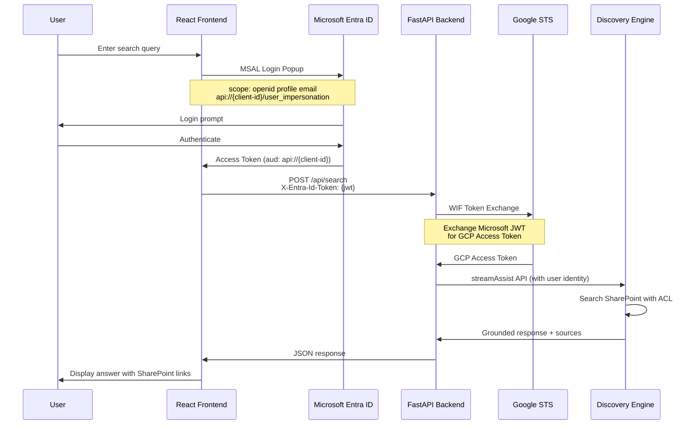
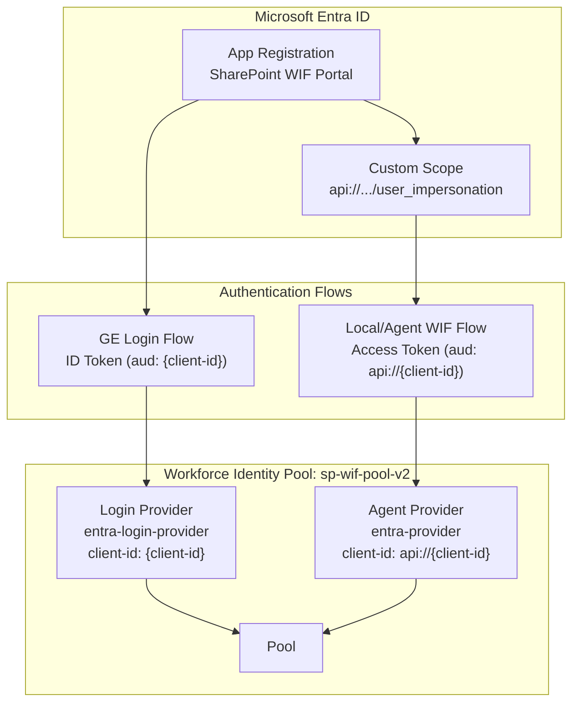

# SharePoint WIF Portal

Local frontend for **Gemini Enterprise** SharePoint search via Discovery Engine with **Workforce Identity Federation (WIF)** authentication. Calls StreamAssist API directly without Agent Engine.


---

## Architecture Overview

```
┌─────────────────────────────────────────────────────────────────────────────┐
│                           LOCAL FRONTEND                                     │
│  ┌─────────────┐    ┌──────────────────┐    ┌─────────────────────────────┐ │
│  │    User     │───>│  MSAL Login      │───>│  Microsoft Entra ID         │ │
│  │   Browser   │<───│  (Popup Auth)    │<───│  (Returns Access Token)     │ │
│  └─────────────┘    └──────────────────┘    └─────────────────────────────┘ │
│         │                                                                    │
│         v                                                                    │
│  ┌─────────────────────────────────────────────────────────────────────────┐│
│  │                      REACT FRONTEND (:5173)                              ││
│  │  Sends token via: X-Entra-Id-Token header                               ││
│  └─────────────────────────────────────────────────────────────────────────┘│
└─────────────────────────────────────────────────────────────────────────────┘
                                    │
                                    v
┌─────────────────────────────────────────────────────────────────────────────┐
│                           FASTAPI BACKEND (:8000)                            │
│  ┌─────────────────────────────────────────────────────────────────────────┐│
│  │                      STREAM ASSIST CLIENT                                ││
│  │                                                                          ││
│  │  1. Extract token from X-Entra-Id-Token header                          ││
│  │                          │                                               ││
│  │                          v                                               ││
│  │  2. WIF Exchange: Microsoft JWT ──────> GCP Access Token                ││
│  │                    (STS API)                                             ││
│  │                          │                                               ││
│  │                          v                                               ││
│  │  3. Call Discovery Engine streamAssist API                              ││
│  │                          │                                               ││
│  │                          v                                               ││
│  │  4. Return grounded response with SharePoint sources                    ││
│  └─────────────────────────────────────────────────────────────────────────┘│
└─────────────────────────────────────────────────────────────────────────────┘
                                    │
                                    v
┌─────────────────────────────────────────────────────────────────────────────┐
│                        DISCOVERY ENGINE                                      │
│  ┌─────────────────────────────────────────────────────────────────────────┐│
│  │  SharePoint Federated Connector                                          ││
│  │  - ACL-aware search (respects user permissions)                         ││
│  │  - Returns grounded answers with source documents                       ││
│  └─────────────────────────────────────────────────────────────────────────┘│
└─────────────────────────────────────────────────────────────────────────────┘
```

---

## Token Flow (Mermaid)



---

## WIF Provider Architecture



**Why Two Providers?**
- GE Login sends ID tokens with audience `{client-id}` (no prefix)
- Local/Agent WIF uses access tokens with audience `api://{client-id}` (with prefix)
- Single provider can only match one audience format

---

## Quick Start

```bash
# 1. Clone and navigate
cd semiautonomous-agents/sharepoint_wif_portal

# 2. Configure environment
cp .env.example .env
# Edit .env with your values

# 3. Start backend
cd backend
uv sync
uv run python main.py

# 4. Start frontend (new terminal)
cd frontend
npm install
npm run dev

# 5. Open http://localhost:5173
# 6. Click "Login with Microsoft"
# 7. Search SharePoint documents!
```

---

## Documentation

| Document | Description |
|----------|-------------|
| **[README.md](README.md)** | This file - overview and architecture |
| **[docs/01-SETUP-GCP.md](docs/01-SETUP-GCP.md)** | GCP project and API configuration |
| **[docs/02-SETUP-ENTRA.md](docs/02-SETUP-ENTRA.md)** | Microsoft Entra ID app configuration |
| **[docs/03-SETUP-WIF.md](docs/03-SETUP-WIF.md)** | Workforce Identity Federation (two providers) |
| **[docs/04-SETUP-DISCOVERY.md](docs/04-SETUP-DISCOVERY.md)** | Discovery Engine + SharePoint connector |
| **[docs/05-LOCAL-DEV.md](docs/05-LOCAL-DEV.md)** | Local development and testing |
| **[docs/06-AGENT-ENGINE.md](docs/06-AGENT-ENGINE.md)** | Optional: Deploy ADK agent |

---

## Key Configuration

### Microsoft Entra ID

| Setting | Value |
|---------|-------|
| Custom API Scope | `api://{client-id}/user_impersonation` |
| Web Redirect URIs | `https://vertexaisearch.cloud.google.com/oauth-redirect`<br/>`https://auth.cloud.google/signin-callback/...` |
| SPA Redirect URI | `http://localhost:5173` |
| Required Manifest | `oauth2AllowIdTokenImplicitFlow: true`<br/>`groupMembershipClaims: "SecurityGroup"` |

### WIF Providers

| Provider | Client ID | Purpose |
|----------|-----------|---------|
| `entra-login-provider` | `{client-id}` | GE Login (no prefix) |
| `entra-provider` | `api://{client-id}` | Local/Agent WIF (with prefix) |

Both use issuer: `https://sts.windows.net/{tenant-id}/` (v1.0)

### SharePoint Connector

| Permission | Type | Purpose |
|------------|------|---------|
| `Sites.Search.All` | SharePoint Delegated | Federated search |
| `AllSites.Read` | SharePoint Delegated | Site access |
| `Files.Read.All` | Graph Delegated | File access |

---

## Project Structure

```
sharepoint_wif_portal/
├── frontend/                     # React + Vite + TypeScript
│   ├── src/
│   │   ├── App.tsx               # Main UI with MSAL login
│   │   ├── authConfig.ts         # MSAL configuration
│   │   └── index.css             # Light theme styling
│   └── package.json
├── backend/                      # FastAPI + Python
│   ├── main.py                   # API endpoints (/api/search)
│   └── tools/
│       └── stream_assist.py      # StreamAssist + WIF exchange
├── docs/                         # Step-by-step setup guides
├── assets/                       # Screenshots
├── .env.example                  # Environment template
└── README.md
```

---

## Key Code References

| File | Lines | Description |
|------|-------|-------------|
| [backend/tools/stream_assist.py](backend/tools/stream_assist.py#L73-L117) | WIF Exchange | STS token exchange |
| [backend/tools/stream_assist.py](backend/tools/stream_assist.py#L242-L376) | Search | StreamAssist API call |
| [frontend/src/authConfig.ts](frontend/src/authConfig.ts) | MSAL Config | Custom scope |
| [frontend/src/App.tsx](frontend/src/App.tsx#L35-L70) | Token Handling | Acquire + send token |

---

## Troubleshooting

| Issue | Solution |
|-------|----------|
| `issuer does not match` | WIF issuer must be `sts.windows.net` (v1.0) |
| `audience does not match` | Use agent provider with `api://` prefix |
| MSAL popup blocked | Allow popups for localhost |
| No sources returned | Check SharePoint connector has `Sites.Search.All` |
| Search fails with 403 | Missing `roles/aiplatform.user` IAM binding |
| Token not sent | Check browser console for MSAL errors |

---

## vs Agent Engine Approach

This project calls StreamAssist **directly** from the frontend/backend, without Agent Engine.

| Aspect | Direct StreamAssist (this project) | Via Agent Engine |
|--------|-----------------------------------|------------------|
| Latency | Lower (1 hop) | Higher (2 hops) |
| Setup | Simpler | More infrastructure |
| Cost | Base API cost | + Agent Engine cost |
| Orchestration | Manual | ADK tools/workflows |
| Best for | Simple search UI | Complex multi-tool agents |

For Agent Engine approach, see [ge_adk_sharepoint_wif](../ge_adk_sharepoint_wif).

---

## Related Documentation

- [ge_adk_sharepoint_wif](../ge_adk_sharepoint_wif) - ADK agent version
- [Discovery Engine Docs](https://cloud.google.com/generative-ai-app-builder/docs)
- [WIF Setup Guide](https://cloud.google.com/iam/docs/workforce-identity-federation)
- [MSAL React](https://github.com/AzureAD/microsoft-authentication-library-for-js)
