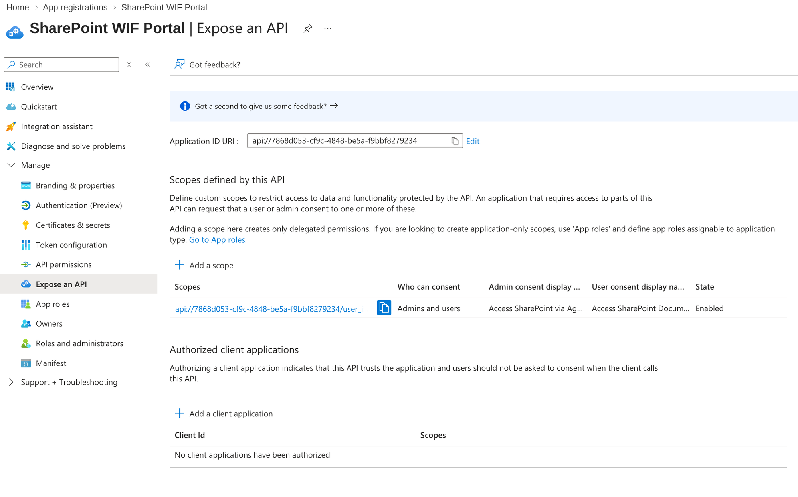
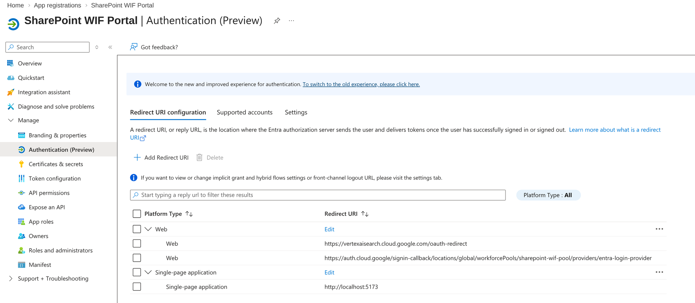
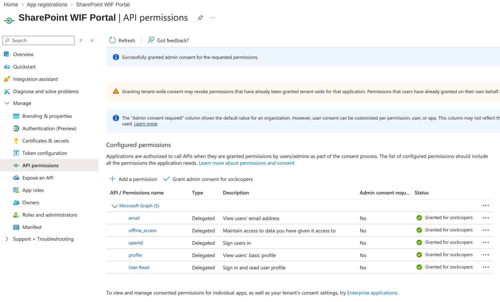

# Microsoft Entra ID Setup

> **Version**: 1.0.0 | **Last Updated**: 2026-04-03

**Navigation**: [README](../README.md) | [GCP Setup](01-SETUP-GCP.md) | **Entra ID** | [WIF](03-SETUP-WIF.md) | [Discovery](04-SETUP-DISCOVERY.md) | [Local Dev](05-LOCAL-DEV.md) | [Agent Engine](06-AGENT-ENGINE.md)

---

## Overview

Configure Microsoft Entra ID (formerly Azure AD) for OAuth authentication with custom API scope for WIF compatibility.

```
┌─────────────────────────────────────────────────────────────────────────────┐
│                    ENTRA ID CONFIGURATION SUMMARY                           │
├─────────────────────────────────────────────────────────────────────────────┤
│                                                                             │
│   App Registration                                                          │
│   ├── Application ID URI: api://{client-id}     ← CRITICAL for WIF         │
│   ├── Custom Scope: user_impersonation                                      │
│   ├── Web Platform: vertexaisearch redirect                                 │
│   ├── SPA Platform: localhost for testing                                   │
│   └── Client Secret: for token exchange                                     │
│                                                                             │
│   Why api:// prefix matters:                                                │
│   ┌─────────────────────────────────────────────────────────────────────┐   │
│   │ Token audience MUST match WIF provider client-id                    │   │
│   │ Custom scope → token.aud = "api://client-id" → WIF validates ✓     │   │
│   │ Graph scope  → token.aud = "graph.microsoft.com" → WIF fails ✗     │   │
│   └─────────────────────────────────────────────────────────────────────┘   │
│                                                                             │
└─────────────────────────────────────────────────────────────────────────────┘
```

---

## Step 1: Create App Registration

1. Go to [Azure Portal](https://portal.azure.com) → **Microsoft Entra ID**
2. Click **App registrations** → **New registration**
3. Configure:
   - **Name**: `SharePoint WIF Portal` (or your choice)
   - **Supported account types**: Single tenant
4. Click **Register**

**Save these values:**

| Setting | Your Value |
|---------|------------|
| Application (client) ID | `_________________________` |
| Directory (tenant) ID | `_________________________` |

---

## Step 2: Expose an API (CRITICAL)

This creates the custom scope that sets the correct token audience for WIF.

1. Go to **Expose an API**
2. Click **Add** next to "Application ID URI"
3. Accept default: `api://{your-client-id}`
4. Click **Save**
5. Click **Add a scope**:

| Field | Value |
|-------|-------|
| Scope name | `user_impersonation` |
| Who can consent | Admins and users |
| Admin consent display name | `Access SharePoint Documents` |
| Admin consent description | `Allow the app to access SharePoint on your behalf` |
| State | Enabled |

**Result**: Your scope is `api://{client-id}/user_impersonation`



*Application ID URI with `api://` prefix and `user_impersonation` scope configured*

---

## Step 3: Configure Token Settings (CRITICAL)

> **This step is REQUIRED for WIF to work.** Missing these settings causes `FAILED_PRECONDITION` errors.

1. Go to **Authentication** → scroll to **Implicit grant and hybrid flows**
2. Check: ✓ **ID tokens (used for implicit and hybrid flows)**
3. Click **Save**

### Configure via Manifest (Alternative)

1. Go to **Manifest** tab
2. Find and set these values:

```json
{
  "oauth2AllowIdTokenImplicitFlow": true,
  "groupMembershipClaims": "SecurityGroup",
  "optionalClaims": {
    "idToken": [{"name": "groups", "essential": false}],
    "accessToken": [{"name": "groups", "essential": false}],
    "saml2Token": [{"name": "groups", "essential": false}]
  }
}
```

3. Click **Save**

| Setting | Required Value | Why |
|---------|---------------|-----|
| `oauth2AllowIdTokenImplicitFlow` | `true` | WIF needs ID tokens |
| `groupMembershipClaims` | `"SecurityGroup"` | ACL-aware access |
| `optionalClaims.idToken.groups` | Present | Group info in tokens |

---

## Step 4: Configure Authentication Platforms

### Web Platform (for Production/Gemini Enterprise)

1. Go to **Authentication** → **Add a platform** → **Web**
2. Add these Redirect URIs:
   - `https://vertexaisearch.cloud.google.com/oauth-redirect`
   - `https://auth.cloud.google/signin-callback/locations/global/workforcePools/{pool-id}/providers/{provider-id}` ← **Required for Gemini Enterprise WIF login**

> **Example**: For pool `sharepoint-wif-pool` and provider `entra-login-provider`:
> `https://auth.cloud.google.com/signin-callback/locations/global/workforcePools/sharepoint-wif-pool/providers/entra-login-provider`

3. Click **Configure**

### SPA Platform (for Local Testing)

1. **Authentication** → **Add a platform** → **Single-page application**
2. Redirect URIs:
   - `http://localhost:5173`
   - `http://localhost:5177`
3. Click **Configure**

**Final configuration:**

```
Platforms:
├── Web
│   ├── https://vertexaisearch.cloud.google.com/oauth-redirect
│   └── https://auth.cloud.google.com/signin-callback/.../entra-login-provider
└── Single-page application
    └── http://localhost:5173
```



*Web platform with WIF callback URI + SPA platform for local testing*

---

## Step 5: Create Client Secret

1. Go to **Certificates & secrets** → **Client secrets** → **New client secret**
2. Description: `WIF Portal`
3. Expiration: 24 months (or your policy)
4. Click **Add**
5. **COPY THE VALUE IMMEDIATELY** (shown only once)

| Setting | Your Value |
|---------|------------|
| Client Secret | `_________________________` |

---

## Step 6: Configure API Permissions

### 5.1 Basic OAuth Permissions
1. Go to **API permissions** → **Add a permission**
2. **Microsoft Graph** → **Delegated permissions**:
   - ✓ `openid`
   - ✓ `profile`
   - ✓ `email`
   - ✓ `offline_access` (required for refresh tokens)

### 5.2 SharePoint Connector Permissions
Required for Discovery Engine federated connector:

1. **Add a permission** → **Microsoft Graph** → **Delegated permissions**:
   - ✓ `Sites.Read.All` - Read SharePoint sites
   - ✓ `Files.Read.All` - Read files user can access

2. Click **Add permissions**
3. Click **Grant admin consent for [tenant]**



*All Microsoft Graph permissions granted with admin consent*

---

## Configuration Summary

Save these values for later steps:

```env
# Microsoft Entra ID
TENANT_ID=your-tenant-id
CLIENT_ID=your-client-id
CLIENT_SECRET=your-client-secret
```

---

## Verification Checklist

| Item | Status |
|------|--------|
| App registration created | ☐ |
| Application ID URI set to `api://client-id` | ☐ |
| Custom scope `user_impersonation` created | ☐ |
| **ID tokens enabled** (`oauth2AllowIdTokenImplicitFlow: true`) | ☐ |
| **Group membership claims** (`groupMembershipClaims: "SecurityGroup"`) | ☐ |
| **Optional claims** (groups in idToken/accessToken) | ☐ |
| Web platform with GCP redirect URIs | ☐ |
| WIF callback URI added (`auth.cloud.google/signin-callback/...`) | ☐ |
| SPA platform with localhost URIs | ☐ |
| Client secret created and saved | ☐ |
| API permissions granted with admin consent | ☐ |

---

## Next Step

→ [03-SETUP-WIF.md](03-SETUP-WIF.md) - Configure Workforce Identity Federation
