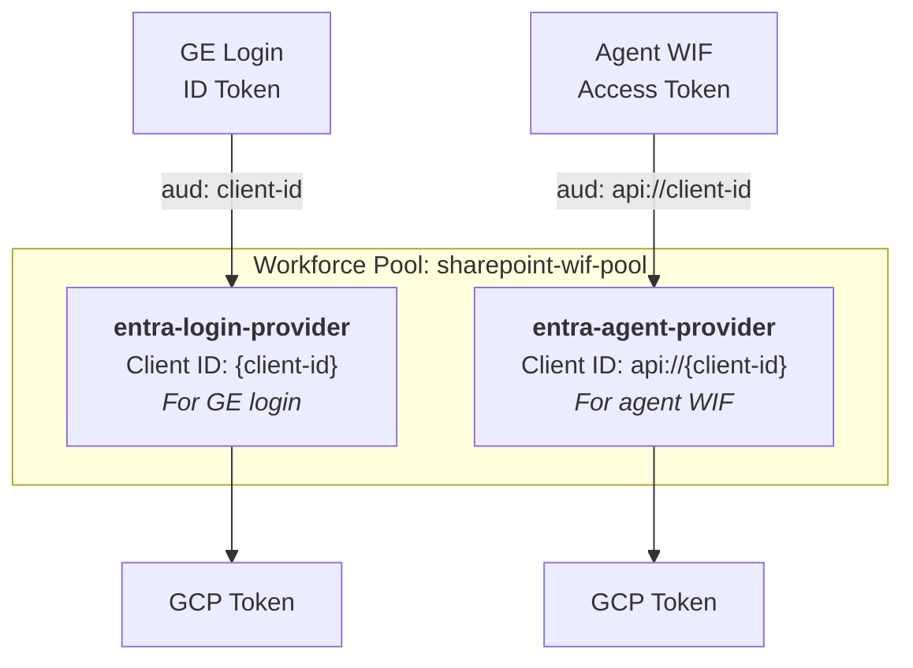

# 03 - Workforce Identity Federation Setup

> **Version**: 1.2.0 | **Last Updated**: 2026-04-05

**Navigation**: [Index](00-INDEX.md) | [01-GCP](01-SETUP-GCP.md) | [02-Entra](02-SETUP-ENTRA.md) | **03-WIF** | [04-Discovery](04-SETUP-DISCOVERY.md) | [08-Agent](08-ADK-AGENT.md)

> **This doc implements [Auth Chain Requirements 2 & 4](00-AUTH-CHAIN.md#requirement-2-two-wif-providers--not-one)** — the two WIF providers with different audiences, and the IAM roles that allow the exchanged token to list datastores and call streamAssist.

---

## Prerequisites

| From | Variable | Purpose |
|------|----------|---------|
| [01-SETUP-GCP.md](01-SETUP-GCP.md) | `PROJECT_NUMBER` | Pool creation |
| [02-SETUP-ENTRA.md](02-SETUP-ENTRA.md) | `TENANT_ID` | Issuer URL |
| [02-SETUP-ENTRA.md](02-SETUP-ENTRA.md) | `OAUTH_CLIENT_ID` | Provider audience |

---

## Outputs (used by later docs)

| Variable | Example | Used In |
|----------|---------|---------|
| `WIF_POOL_ID` | `sp-wif-pool-v2` | 04-Discovery, 08-Agent |
| `ge-login-provider` | Provider name | GE login (no api://) |
| `entra-provider` | Provider name | 08-Agent (WITH api://) |

---

## Overview

Configures two WIF providers — one for GE user login (ID token, no `api://` prefix) and one for agent token exchange (access token, `api://` prefix). Both are required; a single provider cannot handle both token audiences.



**Why two providers?** GE login and agent WIF use different token audiences. Single provider = one flow breaks.


*Workforce pool with two OIDC providers - one for login, one for agent WIF*


*Agent provider showing `api://` prefix in Client ID - critical for WIF exchange*

---

## Step 1: Create Workforce Identity Pool

```bash
export ORG_ID=your-org-id
export POOL_ID=sharepoint-wif-pool

gcloud iam workforce-pools create $POOL_ID \
  --location=global \
  --organization=$ORG_ID \
  --display-name="SharePoint WIF Pool" \
  --description="Workforce pool for SharePoint document access"
```

---

## Step 2: Create Login Provider (No api:// prefix)

For Gemini Enterprise login flow:

```bash
export POOL_ID=sharepoint-wif-pool
export TENANT_ID=your-tenant-id
export CLIENT_ID=your-client-id          # NO api:// prefix
export CLIENT_SECRET=your-client-secret

gcloud iam workforce-pools providers create-oidc entra-login-provider \
  --workforce-pool=$POOL_ID \
  --location=global \
  --issuer-uri="https://sts.windows.net/${TENANT_ID}/" \
  --client-id="$CLIENT_ID" \
  --client-secret-value="$CLIENT_SECRET" \
  --attribute-mapping="google.subject=assertion.email.lowerAscii(),google.groups=assertion.groups,google.display_name=assertion.given_name" \
  --display-name="Entra Login Provider" \
  --web-sso-response-type="CODE" \
  --web-sso-assertion-claims-behavior="MERGE_USER_INFO_OVER_ID_TOKEN_CLAIMS"
```

**Note**: Issuer must be `https://sts.windows.net/{tenant}/` (v1.0 format), NOT `login.microsoftonline.com` (v2.0).

---

## Step 3: Create Agent Provider (WITH api:// prefix)

For ADK agent WIF token exchange:

```bash
export POOL_ID=sharepoint-wif-pool
export TENANT_ID=your-tenant-id
export CLIENT_ID_API="api://your-client-id"  # WITH api:// prefix
export CLIENT_SECRET=your-client-secret

gcloud iam workforce-pools providers create-oidc entra-agent-provider \
  --workforce-pool=$POOL_ID \
  --location=global \
  --issuer-uri="https://sts.windows.net/${TENANT_ID}/" \
  --client-id="$CLIENT_ID_API" \
  --client-secret-value="$CLIENT_SECRET" \
  --attribute-mapping="google.subject=assertion.email.lowerAscii(),google.groups=assertion.groups,google.display_name=assertion.given_name" \
  --display-name="Entra Agent Provider" \
  --description="WIF provider for agent token exchange with api:// audience" \
  --web-sso-response-type="CODE" \
  --web-sso-assertion-claims-behavior="MERGE_USER_INFO_OVER_ID_TOKEN_CLAIMS"
```

---

## Step 4: Grant IAM Permissions (ALL REQUIRED)

> **Critical**: Missing IAM bindings cause `FAILED_PRECONDITION` errors. Grant ALL roles below.

```bash
export PROJECT_ID=sharepoint-wif-agent
export POOL_ID=sharepoint-wif-pool
export MEMBER="principalSet://iam.googleapis.com/locations/global/workforcePools/$POOL_ID/*"

# All required roles for Gemini Enterprise + SharePoint
for role in \
  roles/aiplatform.user \
  roles/discoveryengine.admin \
  roles/discoveryengine.editor \
  roles/discoveryengine.user \
  roles/discoveryengine.viewer \
  roles/discoveryengine.notebookLmUser; do
  echo "Adding $role..."
  gcloud projects add-iam-policy-binding $PROJECT_ID \
    --member="$MEMBER" \
    --role="$role" --quiet
done
```

| Role | Purpose |
|------|---------|
| `roles/aiplatform.user` | Required for AI/assistant functionality |
| `roles/discoveryengine.admin` | Full Discovery Engine access |
| `roles/discoveryengine.editor` | Edit data stores and engines |
| `roles/discoveryengine.user` | Use search and assist APIs |
| `roles/discoveryengine.viewer` | Read-only access |
| `roles/discoveryengine.notebookLmUser` | NotebookLM features |

---

## Verification

### List Providers

```bash
gcloud iam workforce-pools providers list \
  --workforce-pool=sharepoint-wif-pool \
  --location=global
```

**Expected output:**

```
NAME                    DISPLAY_NAME           STATE
entra-login-provider    Entra Login Provider   ACTIVE
entra-agent-provider    Entra Agent Provider   ACTIVE
```

### Describe Provider Details

```bash
gcloud iam workforce-pools providers describe entra-agent-provider \
  --workforce-pool=sharepoint-wif-pool \
  --location=global
```

---

## Configuration Summary

```env
# WIF Configuration
WIF_POOL_ID=sharepoint-wif-pool
WIF_PROVIDER_ID=entra-agent-provider  # Use agent provider (with api:// client-id)
```

---

## Troubleshooting

| Error | Cause | Solution |
|-------|-------|----------|
| `issuer does not match` | Provider has v2.0 URL | Use `sts.windows.net` not `login.microsoftonline.com` |
| `audience does not match` (agent) | Provider missing `api://` | Use agent provider with api:// prefix |
| `audience does not match` (login) | Provider has `api://` | Use login provider without prefix |
| `PERMISSION_DENIED` | Missing IAM binding | Grant discoveryengine roles to pool |

---

## Next Step

→ [04-SETUP-DISCOVERY.md](04-SETUP-DISCOVERY.md) - Configure Discovery Engine with SharePoint
