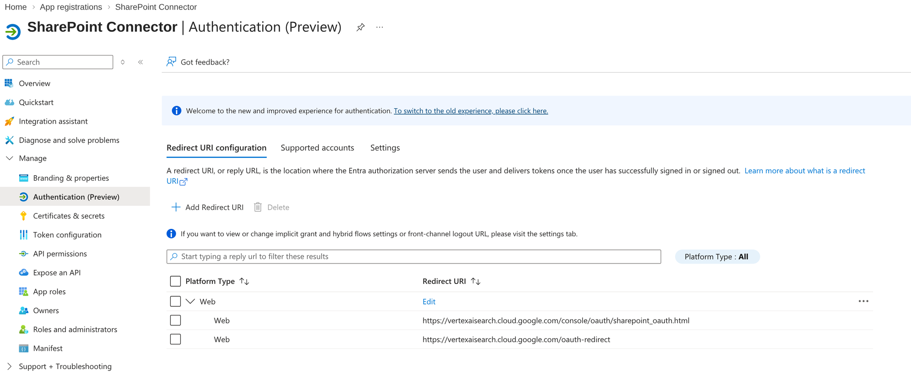
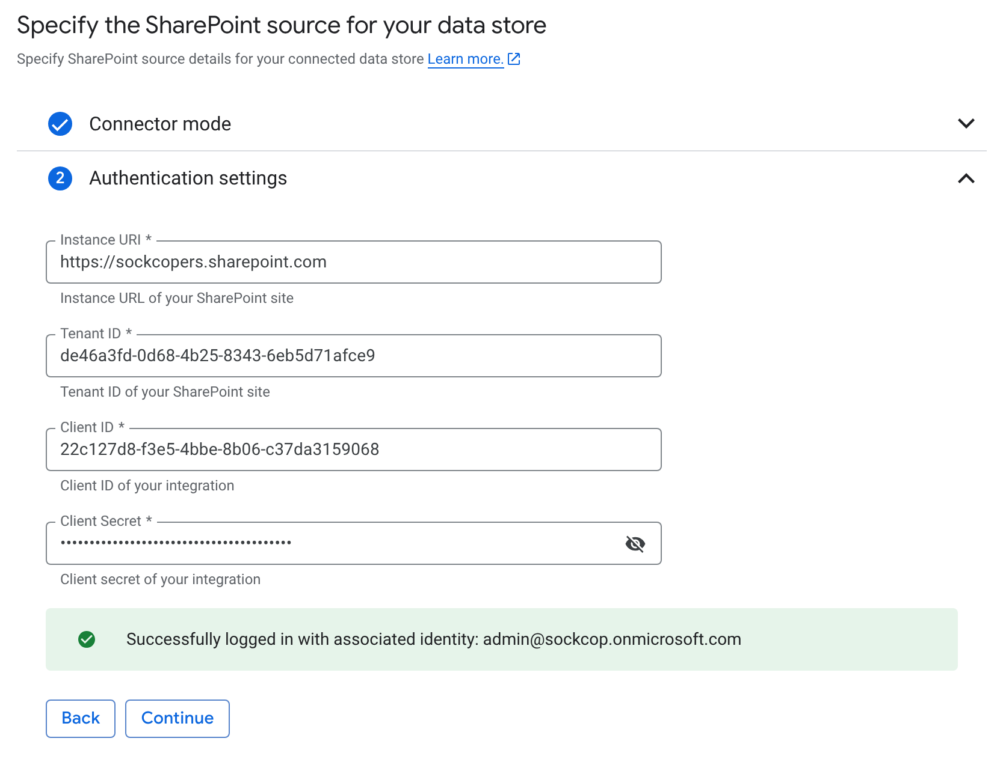
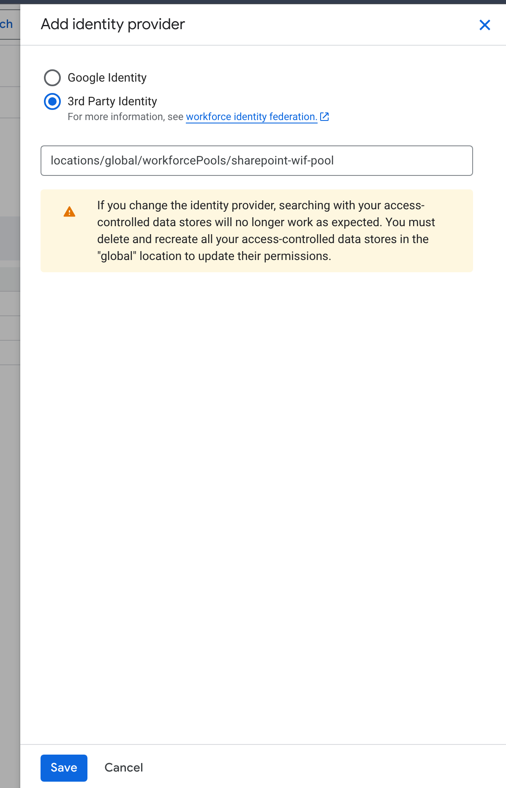
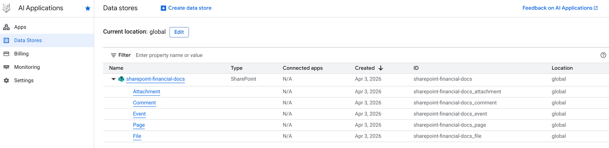

# Discovery Engine Setup

> **Version**: 1.0.0 | **Last Updated**: 2026-04-03

**Navigation**: [README](../README.md) | [GCP Setup](01-SETUP-GCP.md) | [Entra ID](02-SETUP-ENTRA.md) | [WIF](03-SETUP-WIF.md) | **Discovery** | [Local Dev](05-LOCAL-DEV.md) | [Agent Engine](06-AGENT-ENGINE.md)

---

## Overview

Discovery Engine provides the search infrastructure. The SharePoint federated connector syncs documents while preserving ACLs.

```
┌─────────────────────────────────────────────────────────────────────────────┐
│                    DISCOVERY ENGINE COMPONENTS                              │
├─────────────────────────────────────────────────────────────────────────────┤
│                                                                             │
│   App (Agentspace)                                                          │
│   └── Engine (Search App)                                                   │
│       └── Data Store                                                        │
│           └── SharePoint Federated Connector                                │
│               ├── Sites: sharepoint.com/sites/...                           │
│               ├── Sync: Periodic or on-demand                               │
│               └── ACLs: Preserved from SharePoint                           │
│                                                                             │
│   API: streamAssist                                                         │
│   ├── Input: Query + dataStoreSpecs (REQUIRED)                              │
│   ├── Auth: User token via WIF                                              │
│   └── Output: Grounded answer + sources                                     │
│                                                                             │
└─────────────────────────────────────────────────────────────────────────────┘
```

---

## Step 1: Create SharePoint Connector App (Entra ID)

> **Note**: This is a SEPARATE app registration from the WIF Portal app. Discovery Engine needs its own credentials to access SharePoint.

> **CRITICAL**: For federated search to work, you MUST add **SharePoint API permissions** (not just Microsoft Graph). This is the most common cause of "search returns no results" issues.

1. Go to [Azure Portal](https://portal.azure.com) → **Microsoft Entra ID** → **App registrations**
2. Click **New registration**:
   - **Name**: `SharePoint Connector`
   - **Supported account types**: Single tenant
3. Click **Register**

### Add Redirect URIs

1. Go to **Authentication** → **Add a platform** → **Web**
2. Add BOTH redirect URIs:
   - `https://vertexaisearch.cloud.google.com/console/oauth/sharepoint_oauth.html` ← For connector wizard
   - `https://vertexaisearch.cloud.google.com/oauth-redirect` ← For Gemini Enterprise SharePoint auth
3. Click **Configure**



*SharePoint Connector with both redirect URIs configured*

### Add API Permissions (COMPLETE LIST)

> **Critical**: ALL permissions below are required. Missing any causes search failures.

1. Go to **API permissions** → **Add a permission**

**Microsoft Graph** → **Delegated permissions**:

| Permission | Purpose |
|------------|---------|
| `User.Read` | Sign in and read user profile |
| `Files.Read.All` | Read all files user can access |
| `Files.ReadWrite.All` | Full file access (for actions) |
| `Sites.Read.All` | Read SharePoint sites |
| `Sites.ReadWrite.All` | Edit sites (for actions) |
| `Sites.Manage.All` | Manage sites (for actions) |
| `offline_access` | Refresh tokens |

**SharePoint** → **Delegated permissions** (REQUIRED for federated search):

| Permission | Purpose |
|------------|---------|
| `Sites.Search.All` | **CRITICAL** - Run search queries as user |
| `AllSites.Read` | **CRITICAL** - Read all site collections |
| `AllSites.Write` | Write access (for actions) |

> **Why SharePoint permissions?** Microsoft Graph permissions alone are NOT sufficient for federated search. The SharePoint API permissions (`Sites.Search.All`, `AllSites.Read`) enable real-time search queries against SharePoint content.

2. Click **Add permissions**
3. Click **Grant admin consent for [tenant]** ← **REQUIRED**


*SharePoint Connector with Microsoft Graph AND SharePoint permissions - ALL must show "Granted"*

> **After adding permissions**: If you've already authorized SharePoint in Gemini Enterprise, you must **re-authorize** to pick up the new permissions.

### Create Client Secret

1. Go to **Certificates & secrets** → **New client secret**
2. Description: `Discovery Engine`
3. Click **Add** → **Copy the value immediately**

**Save these values:**

| Setting | Your Value |
|---------|------------|
| Client ID | `_________________________` |
| Client Secret | `_________________________` |

---

## Step 2: Configure Project Authentication

Before creating data stores, configure the project-level identity provider.

1. Go to [AI Applications](https://console.cloud.google.com/gen-app-builder) → **Settings** → **Authentication**
2. Click the **pencil icon** on the **global** row
3. Select **3rd Party Identity**
4. Enter: `locations/global/workforcePools/sharepoint-wif-pool`
5. Click **Save**


*Project-level authentication settings*

---

## Step 3: Create Data Store with SharePoint Connector

1. In AI Applications, go to **Data Stores** → **Create Data Store**
2. Select **Third-party sources** → **SharePoint Online**

### 3.1 Authentication Settings

Configure OAuth credentials:
- **Instance URI**: `https://your-tenant.sharepoint.com`
- **Tenant ID**: Your Entra tenant ID
- **Client ID**: From Step 1 (SharePoint Connector app)
- **Client Secret**: From Step 1

> **IMPORTANT: Use Incognito Browser**
> 
> MSAL caches tokens and may auto-complete OAuth without proper consent.
> Always use an **incognito/private window** when authorizing to ensure:
> 1. You see the Microsoft login page
> 2. You enter credentials
> 3. You see and accept the consent screen
>
> If the popup closes immediately without login, cached tokens prevented proper authorization.

Click **Authorize** → Sign in with admin account → **Accept consent**



*Successfully logged in with associated identity*

### 3.2 Destinations

- **Host 1**: Your SharePoint site URL (e.g., `https://your-tenant.sharepoint.com/sites/Documents`)
- **Port 1**: Leave empty (uses HTTPS 443)

### 3.3 Entities to Search

Select entity types to index:
- ✓ Attachment
- ✓ Comment
- ✓ Event
- ✓ Page
- ✓ File (most important for documents)

### 3.4 Configure Access Control

1. Click **Configure access control**
2. Click the **pencil icon** on the **global** row
3. Select **3rd Party Identity**
4. Enter workforce pool: `locations/global/workforcePools/sharepoint-wif-pool`
5. Click **Save**



*WIF pool configured for access control*

### 3.5 Create Data Connector

- **Location**: `global (Global)`
- **Data connector name**: `sharepoint-financial-docs`

Click **Continue** → **Create**



*Data connector with entity sub-stores created*

**Save:**

| Setting | Your Value |
|---------|------------|
| Data Store ID | `_________________________` |

---

## Step 4: Create Gemini Enterprise App

1. Go to **AI Applications** → **Apps** → **Create App**
2. Select **Search** or **Gemini Enterprise**
3. Configure:
   - **App name**: `gemini-enterprise-app` (generic name for multi-connector use)
   - **Engine ID**: `gemini-enterprise-app`
   - **Location**: `global (Global)`
4. Click **Create**

### 4.1 Connect Data Stores

1. Go to **Connected data stores** in the left sidebar
2. Click **+ New data store** or verify your SharePoint stores are connected
3. The connector should auto-connect with all entity sub-stores (File, Page, etc.)

### 4.2 Configure Workforce Identity

1. Click **Set up identity** on the dashboard (or go to **Integration**)
2. Select **Use a third-party identity provider**
3. Configure:
   - **Workforce pool ID**: `locations/global/workforcePools/sharepoint-wif-pool`
   - **Workforce provider ID**: `entra-login-provider` (for Gemini Enterprise login)
4. Click **Confirm Workforce Identity**

> **Note**: Use `entra-login-provider` (without api:// prefix) for Gemini Enterprise login. The `entra-agent-provider` (with api:// prefix) is for programmatic WIF token exchange.

**Save:**

| Setting | Your Value |
|---------|------------|
| Engine ID | `_________________________` |

---

## Step 5: Verify Data Sync

1. Go to **Data Stores** → Select your store
2. Check **Activity** tab for sync status
3. Verify document count matches expected

---

## Step 6: Test Search API

Test with service account (admin access):

```bash
export PROJECT_NUMBER=REDACTED_PROJECT_NUMBER
export ENGINE_ID=your-engine-id

curl -X POST \
  "https://discoveryengine.googleapis.com/v1alpha/projects/${PROJECT_NUMBER}/locations/global/collections/default_collection/engines/${ENGINE_ID}/assistants/default_assistant:streamAssist" \
  -H "Authorization: Bearer $(gcloud auth print-access-token)" \
  -H "Content-Type: application/json" \
  -H "X-Goog-User-Project: ${PROJECT_NUMBER}" \
  -d '{
    "query": {"text": "test query"},
    "toolsSpec": {
      "vertexAiSearchSpec": {
        "dataStoreSpecs": [
          {"dataStore": "projects/'${PROJECT_NUMBER}'/locations/global/collections/default_collection/dataStores/YOUR_DATASTORE_ID"}
        ]
      }
    }
  }'
```

**Important**: `dataStoreSpecs` is REQUIRED for grounded responses from SharePoint.

---

## Configuration Summary

```env
# Discovery Engine
ENGINE_ID=sharepoint-search
DATA_STORE_ID=sharepoint-docs
```

---

## API Reference

### streamAssist Endpoint

```
POST /v1alpha/projects/{project}/locations/global/collections/default_collection/engines/{engine}/assistants/default_assistant:streamAssist
```

### Required Headers

| Header | Value |
|--------|-------|
| Authorization | `Bearer {token}` |
| Content-Type | `application/json` |
| X-Goog-User-Project | `{project_number}` |

### Request Body

```json
{
  "query": {"text": "your search query"},
  "toolsSpec": {
    "vertexAiSearchSpec": {
      "dataStoreSpecs": [
        {"dataStore": "projects/{project}/locations/global/collections/default_collection/dataStores/{datastore}"}
      ]
    }
  }
}
```

---

## Federated Search Behavior

> **Understanding how Federated Search works**

Federated Search queries SharePoint's search index in real-time. This differs from Data Ingestion mode:

| Aspect | Federated Search | Data Ingestion |
|--------|-----------------|----------------|
| Index location | SharePoint | Google Cloud |
| Query execution | Real-time to SharePoint | Against local index |
| Document content | Depends on SharePoint indexing | Fully extracted |
| Best for | Finding documents | Searching within documents |

**Query Tips for Federated Search:**

| Query Type | Works Well | May Not Work |
|------------|------------|--------------|
| Document discovery | "What documents do I have access to?" | "What is the CFO salary?" |
| Title/metadata search | "Find the Financial Audit Report" | Specific content queries |
| Content search | "Documents about executive compensation" | Exact phrase in PDF |

**Example queries that work well:**
- "Show me all financial documents"
- "Find the FY2024 audit report"
- "What documents mention Jennifer Walsh?"

**If content search doesn't return expected results:**
1. Check if SharePoint has indexed the document content
2. Try searching by document title or metadata
3. Use broader search terms
4. Consider Data Ingestion mode for deep content search

---

## Troubleshooting

| Error | Cause | Solution |
|-------|-------|----------|
| `token: "-"` in requests | OAuth flow not completed | Re-authorize in incognito browser |
| `FAILED_PRECONDITION` | Missing IAM roles | Add all 6 required IAM bindings |
| Search returns no results | Missing SharePoint API permissions | Add `Sites.Search.All` + `AllSites.Read` |
| Generic responses (no grounding) | SharePoint toggle off | Enable SharePoint toggle in chat |
| OAuth popup closes immediately | MSAL cache | Use incognito browser |

---

## Next Step

→ [05-LOCAL-DEV.md](05-LOCAL-DEV.md) - Set up local development environment
