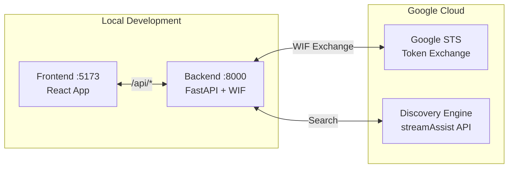
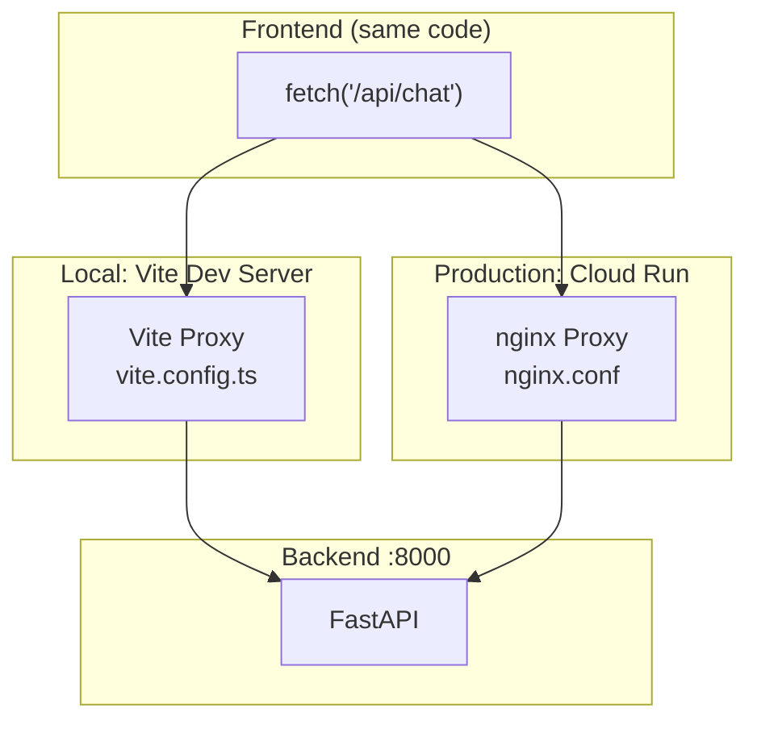
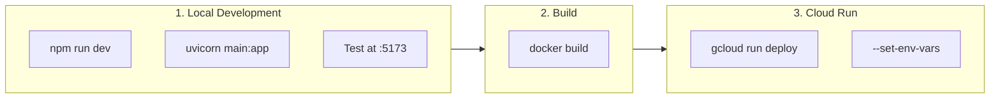
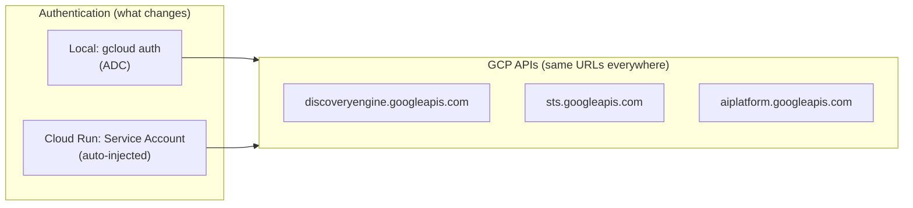

# Local Development

> **Version**: 1.3.0 | **Last Updated**: 2026-04-05

**Navigation**: [Index](00-INDEX.md) | [04-Discovery](04-SETUP-DISCOVERY.md) | **05-Local Dev** | [06-Agent Engine](06-AGENT-ENGINE.md) | [10-Deploy](10-CLOUD-DEPLOYMENT.md)

---

## Overview

Runs the full authentication chain locally — MSAL login → Entra JWT → WIF exchange → Discovery Engine query — so you can verify token flow and ACL enforcement before deploying to Cloud Run.

> **IMPORTANT: Discovery Engine IS the Gemini Enterprise API**
> 
> When you see "Discovery Engine" in GCP documentation, this is the **underlying API that powers Gemini Enterprise** (formerly Vertex AI Search). The `streamAssist` endpoint is how you programmatically access the same search capabilities available in the Gemini Enterprise UI.



---

## Environment-Agnostic Architecture

**One codebase. Two environments. Zero code changes.**

The Custom UI is designed to work identically in local development and Cloud Run production. This is achieved through three key patterns:

### Pattern 1: Relative API URLs

Frontend always uses **relative URLs** - never hardcoded hosts:

```typescript
// App.tsx - ALL API calls use relative paths
fetch('/api/chat', { ... })    // Main search
fetch('/api/quick', { ... })   // /btw quick search  
fetch('/api/agent', { ... })   // Agent panel
```

This works because:
- **Local**: Vite proxy intercepts `/api/*` → forwards to `localhost:8000`
- **Production**: nginx proxy intercepts `/api/*` → forwards to `127.0.0.1:8000`

### Pattern 2: Proxy Layer Abstraction



**Local** (`vite.config.ts`):
```typescript
server: {
  proxy: {
    '/api': { target: 'http://localhost:8000' }
  }
}
```

**Production** (`deploy/nginx.conf`):
```nginx
location /api/ {
    proxy_pass http://127.0.0.1:8000;
}
```

### Pattern 3: Environment Variables

Backend configuration via `.env` files - same code reads different values:

| Variable | Local (`backend/.env`) | Cloud Run (`--set-env-vars`) |
|----------|------------------------|------------------------------|
| `REASONING_ENGINE_RES` | `projects/.../1988...` | Same value |
| `WIF_POOL_ID` | `sp-wif-pool-v2` | Same value |
| `WIF_PROVIDER_ID` | `entra-provider` | Same value |

Frontend uses `VITE_*` variables baked into the build:

| Variable | Set In | Used For |
|----------|--------|----------|
| `VITE_CLIENT_ID` | `frontend/.env` | MSAL auth |
| `VITE_TENANT_ID` | `frontend/.env` | MSAL auth |

### Development → Production Workflow



```bash
# Local development
cd frontend && npm run dev &          # :5173
cd backend && uv run uvicorn main:app --reload &  # :8000
# Test at http://localhost:5173

# Production deployment  
docker build -t sharepoint-portal .
gcloud run deploy sharepoint-portal \
  --set-env-vars="REASONING_ENGINE_RES=..." \
  --set-env-vars="WIF_POOL_ID=..."
# Test at https://your-domain.com
```

### Pattern 4: GCP Services Are Public APIs

The backend doesn't call Cloud Run URLs - it calls **public GCP APIs** that work from anywhere:



| GCP Service | API Endpoint | Works From |
|-------------|--------------|------------|
| Discovery Engine | `discoveryengine.googleapis.com` | Anywhere |
| Google STS (WIF) | `sts.googleapis.com` | Anywhere |
| Agent Engine | `aiplatform.googleapis.com` | Anywhere |

**Local Setup for GCP Authentication:**

```bash
# One-time: Login with your Google account
gcloud auth application-default login

# Verify credentials work
gcloud auth application-default print-access-token
```

This gives local code the same access as Cloud Run's service account.

### Why This Works

| Concern | Solution | Benefit |
|---------|----------|---------|
| API routing | Relative URLs + proxy | No URL changes between envs |
| Configuration | Environment variables | Same code, different config |
| Auth (frontend) | MSAL uses `window.location.origin` | Redirect URI auto-adapts |
| Auth (backend) | ADC (local) vs SA (Cloud Run) | Same API calls, different creds |
| CORS | Same-origin (proxy) | No CORS config needed |
| GCP services | Public APIs | No Cloud Run dependency |

### Edge Case: What If You Need Callbacks/Webhooks?

If a future feature requires an external service to call back to your app (webhooks, OAuth callbacks from non-Microsoft providers, etc.), use this pattern:

```bash
# frontend/.env
VITE_API_BASE_URL=   # Empty for relative URLs (default)

# For webhook testing, use ngrok or similar:
# VITE_API_BASE_URL=https://abc123.ngrok.io
```

```typescript
// Use environment variable with fallback to relative URL
const API_BASE = import.meta.env.VITE_API_BASE_URL || '';
fetch(`${API_BASE}/api/webhook`, { ... });
```

Currently, this project doesn't need this because:
- MSAL callbacks use `window.location.origin` (auto-adapts)
- GCP services are called outbound, not inbound
- All API calls are frontend → backend (same origin)

---

## Flow: Direct StreamAssist (No Agent Engine)

> **Token Travel Diagram**: For a detailed sequence diagram showing the complete token flow from User → Frontend → Backend → STS → Discovery Engine → SharePoint, see **[07-FRONTEND-FEATURES.md](07-FRONTEND-FEATURES.md)** which contains the most comprehensive mermaid diagram.

```
┌─────────────────────────────────────────────────────────────────────────────┐
│                    STREAMASSIST DIRECT FLOW                                 │
├─────────────────────────────────────────────────────────────────────────────┤
│                                                                             │
│   1. User Query                                                             │
│      Browser → POST /api/search { query: "..." }                            │
│                                                                             │
│   2. Backend Processing                                                     │
│      ├── Get access token (service account or WIF exchange)                 │
│      ├── Fetch datastores dynamically from widget config                    │
│      └── Build streamAssist payload with dataStoreSpecs                     │
│                                                                             │
│   3. StreamAssist API Call                                                  │
│      POST discoveryengine.googleapis.com/.../streamAssist                   │
│      {                                                                      │
│        "query": {"text": "user query"},                                     │
│        "toolsSpec": {                                                       │
│          "vertexAiSearchSpec": {                                            │
│            "dataStoreSpecs": [...]  ← REQUIRED for SharePoint grounding     │
│          }                                                                  │
│        }                                                                    │
│      }                                                                      │
│                                                                             │
│   4. Response Processing                                                    │
│      ├── Extract answer text (skip thought/thinking parts)                  │
│      ├── Extract grounding sources (textGroundingMetadata.references)       │
│      └── Return formatted response with citations                           │
│                                                                             │
└─────────────────────────────────────────────────────────────────────────────┘
```

---

## CRITICAL: StreamAssist Token Flow & Requirements

> **This is the most important section for understanding how StreamAssist works with federated connectors like SharePoint.**

```
┌─────────────────────────────────────────────────────────────────────────────┐
│              ⚠️  STREAMASSIST AUTHENTICATION CHAIN                          │
├─────────────────────────────────────────────────────────────────────────────┤
│                                                                             │
│   STEP 1: Get Microsoft JWT (Entra ID)                                      │
│   ┌─────────────────────────────────────────────────────────────────────┐   │
│   │  User logs in via MSAL → ID Token with custom scope                 │   │
│   │  Scope: api://{client-id}/user_impersonation                        │   │
│   │  Audience: api://{client-id}  ← MUST match WIF provider             │   │
│   └─────────────────────────────────────────────────────────────────────┘   │
│                                       │                                     │
│                                       ▼                                     │
│   STEP 2: Exchange JWT for GCP Token via STS                                │
│   ┌─────────────────────────────────────────────────────────────────────┐   │
│   │  POST https://sts.googleapis.com/v1/token                           │   │
│   │  {                                                                  │   │
│   │    "audience": "//iam.googleapis.com/.../workforcePools/pool/...",  │   │
│   │    "grantType": "urn:ietf:params:oauth:grant-type:token-exchange",  │   │
│   │    "subjectToken": "<microsoft-jwt>",                               │   │
│   │    "subjectTokenType": "urn:ietf:params:oauth:token-type:jwt"       │   │
│   │  }                                                                  │   │
│   │  Returns: GCP Access Token (preserves user identity for ACLs)       │   │
│   └─────────────────────────────────────────────────────────────────────┘   │
│                                       │                                     │
│                                       ▼                                     │
│   STEP 3: Call Discovery Engine with dataStoreSpecs                         │
│   ┌─────────────────────────────────────────────────────────────────────┐   │
│   │  ⚠️ CRITICAL: dataStoreSpecs is REQUIRED for federated connectors  │   │
│   │                                                                     │   │
│   │  Without dataStoreSpecs → Generic LLM response (NO SharePoint!)     │   │
│   │  With dataStoreSpecs    → Grounded response from SharePoint docs    │   │
│   │                                                                     │   │
│   │  The dataStore ID can be retrieved via Discovery Engine API:        │   │
│   │  GET /v1alpha/projects/{proj}/locations/global/dataStores           │   │
│   │  ⚠️ This API call REQUIRES IAM permissions (see below)              │   │
│   └─────────────────────────────────────────────────────────────────────┘   │
│                                                                             │
└─────────────────────────────────────────────────────────────────────────────┘
```

### IAM Roles Required for DataStore Operations

> **Why IAM matters**: To dynamically fetch datastore specs (names, IDs), your service account or WIF principal MUST have Discovery Engine IAM roles.

```bash
# Required IAM roles for dataStore operations
export PROJECT_ID=your-project
export MEMBER="principalSet://iam.googleapis.com/locations/global/workforcePools/{pool}/*"

# Grant these roles to list/read dataStores programmatically
gcloud projects add-iam-policy-binding $PROJECT_ID \
  --member="$MEMBER" \
  --role="roles/discoveryengine.viewer"  # Read dataStores

gcloud projects add-iam-policy-binding $PROJECT_ID \
  --member="$MEMBER" \
  --role="roles/discoveryengine.user"    # Use search APIs
```

| Role | Purpose | Required For |
|------|---------|--------------|
| `roles/discoveryengine.viewer` | List and read dataStores | Getting dataStore IDs programmatically |
| `roles/discoveryengine.user` | Call search/assist APIs | Making streamAssist calls |
| `roles/discoveryengine.admin` | Full control | Creating/modifying dataStores |

### Getting DataStore IDs Programmatically

```python
# Example: Fetch dataStore IDs from Discovery Engine
import requests

def get_datastores(project_number: str, gcp_token: str) -> list:
    """Get dataStore IDs for building dataStoreSpecs."""
    url = f"https://discoveryengine.googleapis.com/v1alpha/projects/{project_number}/locations/global/collections/default_collection/dataStores"
    
    resp = requests.get(
        url,
        headers={"Authorization": f"Bearer {gcp_token}"},
        timeout=10
    )
    
    if resp.ok:
        return [ds["name"] for ds in resp.json().get("dataStores", [])]
    return []

# Result: ["projects/.../dataStores/sharepoint-docs_file", ...]
```

---

## Prerequisites

- Node.js 18+ (for frontend)
- Python 3.12+ (for backend)
- [uv](https://github.com/astral-sh/uv) (Python package manager)
- GCP project with Discovery Engine configured
- All previous setup steps completed (Entra ID, WIF, Discovery)

---

## Step 1: Configure Environment

```bash
cd semiautonomous-agents/sharepoint_wif_portal
cp .env.example .env
```

Edit `.env` with your values:

```env
# GCP
PROJECT_NUMBER=REDACTED_PROJECT_NUMBER
LOCATION=global

# Discovery Engine
ENGINE_ID=gemini-enterprise

# WIF (optional - for user-level ACLs)
WIF_POOL_ID=sp-wif-pool-v2
WIF_PROVIDER_ID=entra-provider

# Ports
BACKEND_PORT=8000
FRONTEND_PORT=5173
```

---

## Step 2: Start Backend

```bash
cd backend

# Install dependencies with uv
uv sync

# Start FastAPI server
uv run python main.py

# Or with hot reload for development
uv run uvicorn main:app --reload --port 8000
```

**Verify:**

```bash
curl http://localhost:8000/health
# {"status":"healthy","service":"sharepoint-wif-portal"}

curl http://localhost:8000/api/config
# {"project_number":"REDACTED_PROJECT_NUMBER","engine_id":"gemini-enterprise",...}
```

---

## Step 3: Start Frontend

```bash
cd frontend

# Install dependencies
npm install

# Start Vite dev server
npm run dev
```

**Verify:** Open http://localhost:5173 - you should see the Enterprise Search Portal UI.

---

## Step 4: Test Search

1. Open http://localhost:5173
2. Enter a query: "What documents do I have access to?"
3. Check the response includes SharePoint sources

**Expected backend logs:**

```
INFO - [Search] Using 5 datastore(s)
INFO - [Search] Calling StreamAssist API: https://discoveryengine.googleapis.com/v1alpha/...
INFO - [Search] Found 3 source(s)
```

---

## Project Structure

```
sharepoint_wif_portal/
├── frontend/
│   ├── package.json          # Dependencies
│   ├── vite.config.ts        # Vite config with /api proxy
│   ├── tsconfig.json         # TypeScript config
│   ├── index.html            # Entry HTML
│   ├── public/
│   │   └── favicon.svg       # App icon
│   └── src/
│       ├── main.tsx          # React entry
│       ├── App.tsx           # Main component with chat UI
│       └── index.css         # Styling (dark theme)
│
├── backend/
│   ├── pyproject.toml        # Python dependencies
│   ├── main.py               # FastAPI server
│   └── tools/
│       ├── __init__.py
│       └── stream_assist.py  # StreamAssist client with WIF
│
├── docs/                     # Setup documentation
├── assets/                   # Screenshots for docs
├── .env.example              # Environment template
└── .secrets.md               # Credentials (git-ignored)
```

---

## API Endpoints

| Endpoint | Method | Description |
|----------|--------|-------------|
| `/health` | GET | Health check |
| `/api/config` | GET | Current configuration (non-sensitive) |
| `/api/search` | POST | Search via StreamAssist |

### Search Request

```bash
curl -X POST http://localhost:8000/api/search \
  -H "Content-Type: application/json" \
  -d '{"query": "financial reports"}'
```

### Search Response

```json
{
  "answer": "Based on SharePoint documents...\n\n---\n**Sources:**\n1. **[Financial Report Q4](https://sharepoint.com/...)**\n",
  "sources": [
    {
      "title": "Financial Report Q4",
      "url": "https://sharepoint.com/...",
      "snippet": "Quarterly financial summary..."
    }
  ]
}
```

---

## Development Commands

```bash
# Backend
cd backend
uv sync                           # Install dependencies
uv run python main.py             # Start server
uv run pytest                     # Run tests

# Frontend
cd frontend
npm install                       # Install dependencies
npm run dev                       # Start dev server
npm run build                     # Production build
npm run preview                   # Preview production build
```

---

## Troubleshooting

| Issue | Cause | Solution |
|-------|-------|----------|
| CORS error | Backend not running | Start backend on :8000 |
| "No dataStoreSpecs" warning | Engine not configured | Check ENGINE_ID in .env |
| Empty response | SharePoint not indexed | Wait for sync or check connector |
| 403 Forbidden | Missing IAM roles | Add discoveryengine roles to service account |
| WIF exchange fails | Wrong provider | Use agent provider with api:// prefix |
| Generic LLM response (no sources) | Missing dataStoreSpecs | Add dataStoreSpecs to toolsSpec |
| Cannot list dataStores | Missing viewer role | Add `discoveryengine.viewer` IAM role |
| STS returns null token | Audience mismatch | Verify WIF provider has `api://` prefix |

### Common IAM Errors

```bash
# Error: PERMISSION_DENIED when listing dataStores
# Fix: Add discoveryengine.viewer role
gcloud projects add-iam-policy-binding PROJECT_ID \
  --member="serviceAccount:SA@project.iam.gserviceaccount.com" \
  --role="roles/discoveryengine.viewer"

# Error: FAILED_PRECONDITION on streamAssist
# Fix: Add ALL required IAM roles (see 03-SETUP-WIF.md)
```

### Debug Mode

```bash
# Backend verbose logging
LOG_LEVEL=DEBUG uv run python main.py

# Check Discovery Engine response
# Look for "[Search] Response (first 500 chars):" in logs

# Verify dataStoreSpecs is being sent
# Look for "Using X datastore(s)" in logs
```

---

## Architecture Notes

### Discovery Engine = Gemini Enterprise API

> **Key Insight**: Discovery Engine is the **backend API** that powers Gemini Enterprise. When you access Gemini Enterprise through the GCP Console, you're using Discovery Engine under the hood.

| Product Name | API | Use Case |
|--------------|-----|----------|
| **Gemini Enterprise** | Discovery Engine | GCP Console UI, federated search |
| **Vertex AI Search** | Discovery Engine | Programmatic access, custom UIs |
| **streamAssist** | Discovery Engine endpoint | Conversational search with grounding |

### Why Direct StreamAssist?

This implementation calls StreamAssist directly without Agent Engine:

| Aspect | Direct StreamAssist | Via Agent Engine |
|--------|---------------------|------------------|
| Latency | Lower (1 hop) | Higher (2 hops) |
| Complexity | Simpler | More features |
| Cost | Base API cost | + Agent Engine cost |
| Best for | Simple search | Complex workflows |

### ⚠️ dataStoreSpecs is ABSOLUTELY REQUIRED

> **This is the #1 cause of "why isn't my SharePoint data showing up?" issues.**

The `dataStoreSpecs` field tells Discovery Engine which federated connector to query. Without it, you get a generic LLM response with NO grounding from your data sources.

```python
# ❌ WITHOUT dataStoreSpecs - Generic LLM response (no SharePoint!)
payload = {"query": {"text": query}}
# Result: Gemini responds from its training data only

# ✅ WITH dataStoreSpecs - Grounded response from SharePoint
payload = {
    "query": {"text": query},
    "toolsSpec": {
        "vertexAiSearchSpec": {
            "dataStoreSpecs": [
                {"dataStore": "projects/{PROJECT_NUMBER}/locations/global/collections/default_collection/dataStores/{DATA_STORE_ID}"}
            ]
        }
    }
}
# Result: Gemini searches SharePoint and cites documents
```

**How to get your DATA_STORE_ID:**

1. **GCP Console**: Go to AI Applications → Data Stores → Copy the ID
2. **Programmatically**: Call `GET /dataStores` API (requires `discoveryengine.viewer` role)
3. **Widget Config**: Use the Discovery Engine widget API to fetch connected stores

---

## Next Step

→ [06-AGENT-ENGINE.md](06-AGENT-ENGINE.md) - Optional: Deploy to Vertex AI Agent Engine for advanced orchestration

---

## Related Documentation

- [README.md](../README.md) - Project overview and quick start
- [02-SETUP-ENTRA.md](02-SETUP-ENTRA.md) - Entra ID configuration for OAuth
- [03-SETUP-WIF.md](03-SETUP-WIF.md) - WIF pool setup and IAM requirements
- [04-SETUP-DISCOVERY.md](04-SETUP-DISCOVERY.md) - SharePoint connector and federated search
- [backend/main.py](../backend/main.py) - FastAPI server implementation (includes StreamAssist client with WIF)
- [frontend/src/App.tsx](../frontend/src/App.tsx) - React UI component

### Token Flow Diagrams

For visual understanding of the complete authentication flow:

| Document | Diagram Type | Shows |
|----------|--------------|-------|
| **[07-FRONTEND-FEATURES.md](07-FRONTEND-FEATURES.md)** | Mermaid sequenceDiagram | **Best diagram** - Full flow: User → Frontend → Backend → STS → Discovery Engine → SharePoint |
| [09-AGENT-PANEL.md](09-AGENT-PANEL.md) | ASCII + Mermaid | JWT passthrough flow for Agent Engine |
| [03-SETUP-WIF.md](03-SETUP-WIF.md) | ASCII | Two-provider architecture (login vs agent)
