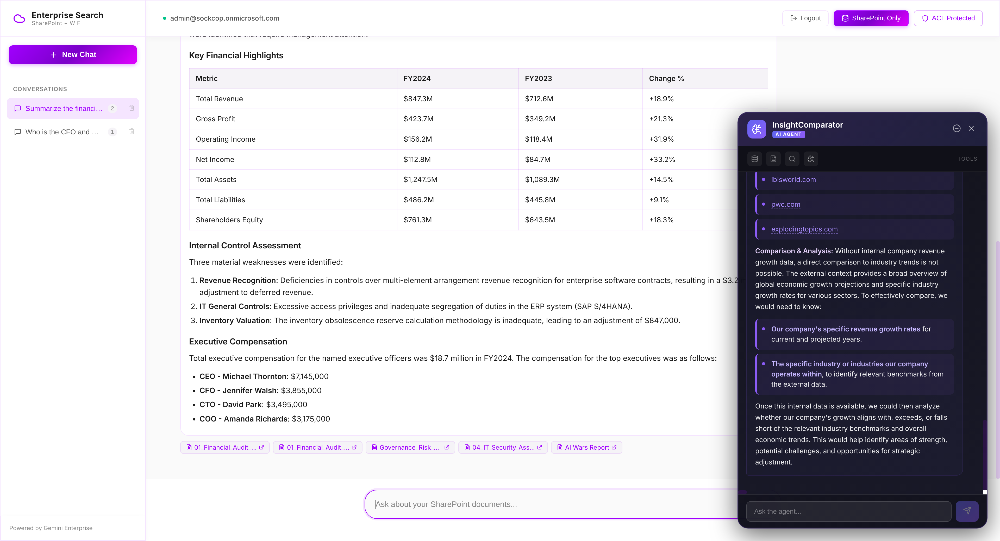
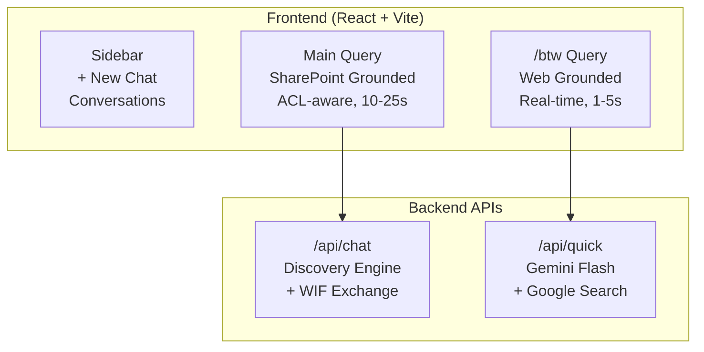
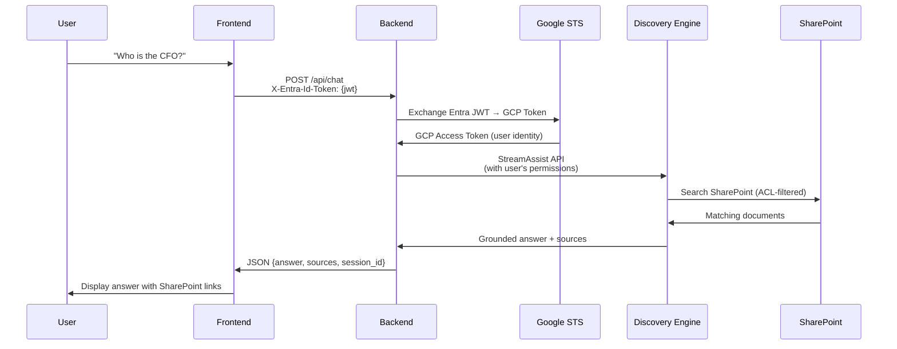
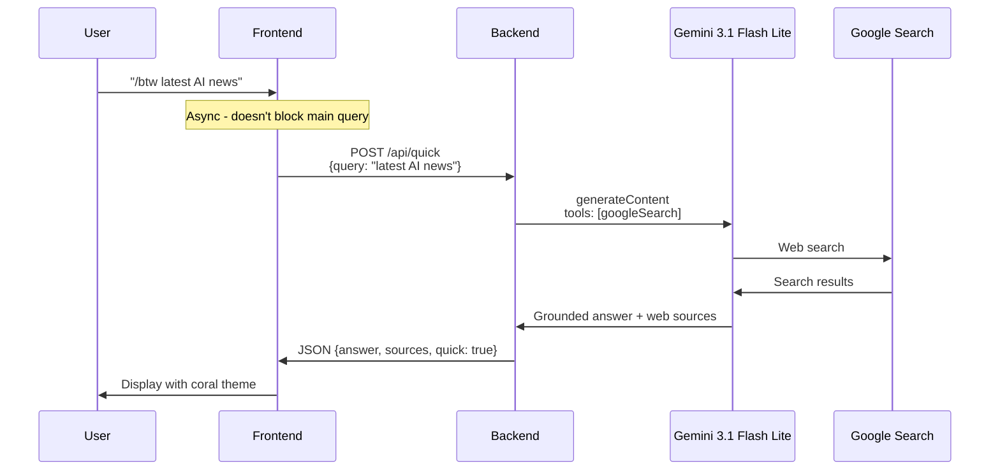
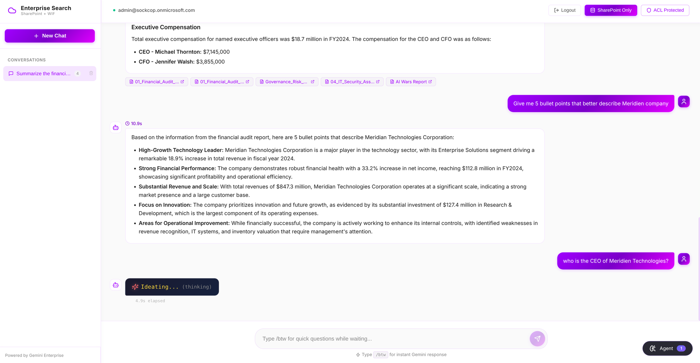

# 07 - Frontend Features & UI Guide

**Version:** 1.1.0  
**Last Updated:** 2026-04-05

**Navigation**: [Index](00-INDEX.md) | [05-Local Dev](05-LOCAL-DEV.md) | [06-Agent Engine](06-AGENT-ENGINE.md) | **07-Frontend** | [08-Agent](08-ADK-AGENT.md)

---

Enterprise Search Portal with dual-mode search: **SharePoint grounding** (Discovery Engine) and **Web grounding** (`/btw` quick search).



---

## Architecture Overview



---

## Dual Search Modes


*Both modes active simultaneously — `/btw` quick search (5.1s, web grounded, coral theme) and main SharePoint query (24.1s, ACL enforced). User identity shown top-left, ACL Protected badge top-right.*

### 1. Main Query (SharePoint Grounded)

For enterprise document search with ACL enforcement.



**Key Features:**
- **ACL-Aware**: Only returns documents the user can access
- **Multi-turn**: Maintains conversation context via sessions
- **Grounded**: All answers cite SharePoint sources
- **Latency**: 10-25 seconds (complex reasoning)

> **Code:**
> - [`frontend/src/App.tsx#L317`](https://github.com/jchavezar/vertex-ai-samples/blob/main/semiautonomous-agents/sharepoint_wif_portal/frontend/src/App.tsx#L317) — `fetch('/api/chat')` with `X-Entra-Id-Token` header
> - [`backend/main.py#L297`](https://github.com/jchavezar/vertex-ai-samples/blob/main/semiautonomous-agents/sharepoint_wif_portal/backend/main.py#L297) — `/api/chat` endpoint
> - [`backend/main.py#L44`](https://github.com/jchavezar/vertex-ai-samples/blob/main/semiautonomous-agents/sharepoint_wif_portal/backend/main.py#L44) — `exchange_token()` Entra JWT → GCP token via STS
> - [`backend/main.py#L226`](https://github.com/jchavezar/vertex-ai-samples/blob/main/semiautonomous-agents/sharepoint_wif_portal/backend/main.py#L226) — `_do_chat_sync()` streamAssist call
> - [`agent/discovery_engine.py#L254`](https://github.com/jchavezar/vertex-ai-samples/blob/main/semiautonomous-agents/sharepoint_wif_portal/agent/discovery_engine.py#L254) — `streamAssist` API request

### 2. `/btw` Quick Query (Web Grounded)

For instant web search while main query processes.



**Key Features:**
- **Instant**: 1-5 second response
- **Web Grounded**: Real-time Google Search
- **Async**: Runs in parallel with main queries
- **No Auth Required**: Uses service account

> **Code:**
> - [`frontend/src/App.tsx#L222`](https://github.com/jchavezar/vertex-ai-samples/blob/main/semiautonomous-agents/sharepoint_wif_portal/frontend/src/App.tsx#L222) — async `fetch('/api/quick')` (does not block main query)
> - [`backend/main.py#L355`](https://github.com/jchavezar/vertex-ai-samples/blob/main/semiautonomous-agents/sharepoint_wif_portal/backend/main.py#L355) — `/api/quick` endpoint

---

## UI Components

### Authentication Overlay

> **Code:**
> - [`frontend/src/authConfig.ts#L16`](https://github.com/jchavezar/vertex-ai-samples/blob/main/semiautonomous-agents/sharepoint_wif_portal/frontend/src/authConfig.ts#L16) — `msalConfig` (clientId, authority)
> - [`frontend/src/authConfig.ts#L31`](https://github.com/jchavezar/vertex-ai-samples/blob/main/semiautonomous-agents/sharepoint_wif_portal/frontend/src/authConfig.ts#L31) — `loginRequest` scopes (`user_impersonation`)
> - [`frontend/src/App.tsx#L128`](https://github.com/jchavezar/vertex-ai-samples/blob/main/semiautonomous-agents/sharepoint_wif_portal/frontend/src/App.tsx#L128) — `acquireTokenSilent` → token refresh
> - [`frontend/src/App.tsx#L175`](https://github.com/jchavezar/vertex-ai-samples/blob/main/semiautonomous-agents/sharepoint_wif_portal/frontend/src/App.tsx#L175) — `loginPopup` fallback

When not authenticated, the UI displays a full-screen overlay with blurred background prompting users to sign in:

```
+-------------------------------------------------------+
|                                                       |
|           🛡️ Authentication Required                  |
|                                                       |
|   Sign in with your Microsoft account to access      |
|   Enterprise Search                                   |
|                                                       |
|          [ Sign in with Microsoft ]                   |
|                                                       |
+-------------------------------------------------------+
```

The overlay prevents interaction with the main UI until login is complete. Implemented in:
- `App.tsx`: Conditional rendering based on `isAuthenticated` from MSAL
- `index.css`: `.auth-overlay` and `.auth-modal` styles

### Loading Animations



*Multi-turn conversation in progress — previous answer grounded in SharePoint sources, new query in "Ideating... (thinking)" state. The `/btw` hint is visible in the input placeholder.*

#### Main Query (Purple Theme)
```
✳ Grounding... (thinking)
12.3s elapsed
```

Morphing asterisk characters: `✳ ✻ ❋ ✽ ※ ✷ ✸`

#### Quick Query (Coral Theme)
```
✳ Answering...
```

Claude Code style animation with color sweep text.

### Message Types

| Type | Avatar | Theme | Sources |
|------|--------|-------|---------|
| Main Query (User) | 👤 | Purple | - |
| Main Response | 🤖 | Default | SharePoint docs |
| Quick Query (User) | ⚡ | Coral | - |
| Quick Response | 🤖 | Coral border | Web links |

---

## API Reference

### POST /api/chat

Main SharePoint search with WIF authentication.

**Request:**
```json
{
  "query": "Who is the CFO and what is their salary?",
  "sharepoint_only": true,
  "session_id": null
}
```

**Headers:**
```
X-Entra-Id-Token: eyJhbGciOiJSUzI1NiIs...
Content-Type: application/json
```

**Response:**
```json
{
  "answer": "The CFO is Jennifer Walsh. Her compensation includes...",
  "sources": [
    {
      "title": "01_Financial_Audit_Report.pdf",
      "url": "https://sharepoint.com/...",
      "snippet": "FY2024 Executive Compensation..."
    }
  ],
  "session_id": "projects/.../sessions/abc123"
}
```

### POST /api/quick

Quick web search (no authentication required).

**Request:**
```json
{
  "query": "latest AI news today",
  "context": ""
}
```

**Response:**
```json
{
  "answer": "Here are the latest AI headlines...",
  "sources": [
    {"title": "techcrunch.com", "url": "https://..."},
    {"title": "reuters.com", "url": "https://..."}
  ],
  "quick": true
}
```

---

## Discovery Engine Integration

### StreamAssist API Call

```python
# backend/main.py

BASE_URL = f"https://discoveryengine.googleapis.com/v1alpha/projects/{PROJECT_NUMBER}/locations/global/collections/default_collection/engines/{ENGINE_ID}"

# Build payload with SharePoint datastore restriction
payload = {
    "query": {"text": query},
    "session": session_id,  # For multi-turn
    "toolsSpec": {
        "vertexAiSearchSpec": {
            "dataStoreSpecs": [{
                "dataStore": f"projects/{PROJECT_NUMBER}/locations/global/collections/default_collection/dataStores/{DATA_STORE_ID}"
            }]
        }
    }
}

# Call StreamAssist
resp = requests.post(
    f"{BASE_URL}/assistants/default_assistant:streamAssist",
    headers={"Authorization": f"Bearer {gcp_token}"},
    json=payload,
    timeout=90
)
```

### WIF Token Exchange

```python
def exchange_token(jwt: str) -> str:
    """Exchange Entra JWT for GCP token via STS."""
    resp = requests.post("https://sts.googleapis.com/v1/token", json={
        "audience": f"//iam.googleapis.com/locations/global/workforcePools/{WIF_POOL_ID}/providers/{WIF_PROVIDER_ID}",
        "grantType": "urn:ietf:params:oauth:grant-type:token-exchange",
        "requestedTokenType": "urn:ietf:params:oauth:token-type:access_token",
        "scope": "https://www.googleapis.com/auth/cloud-platform",
        "subjectToken": jwt,
        "subjectTokenType": "urn:ietf:params:oauth:token-type:jwt"
    })
    return resp.json().get("access_token")
```

### Source Extraction

```python
def extract_sources(data) -> List[dict]:
    """Extract grounding sources from StreamAssist response."""
    sources = []
    
    # Pattern 1: textGroundingMetadata (first query)
    for ref in obj.get("textGroundingMetadata", {}).get("references", []):
        doc = ref.get("documentMetadata", {})
        sources.append({
            "title": doc.get("title"),
            "url": doc.get("uri"),
            "snippet": ref.get("content", "")[:200]
        })
    
    # Pattern 2: groundingMetadata (follow-up queries)
    for chunk in obj.get("groundingMetadata", {}).get("groundingChunks", []):
        ctx = chunk.get("retrievedContext", {})
        sources.append({
            "title": ctx.get("title"),
            "url": ctx.get("uri"),
            "snippet": ctx.get("text", "")[:200]
        })
    
    return sources[:5]
```

---

## Quick Search (Gemini + Google Search)

### API Configuration

```python
# Gemini 3.1 Flash Lite with Google Search grounding
url = f"https://aiplatform.googleapis.com/v1/projects/{PROJECT_NUMBER}/locations/global/publishers/google/models/gemini-3.1-flash-lite-preview:generateContent"

payload = {
    "contents": [{"role": "user", "parts": [{"text": prompt}]}],
    "tools": [{"googleSearch": {}}],
    "generationConfig": {
        "maxOutputTokens": 500,
        "temperature": 1,
        "topP": 0.95
    }
}

# Async HTTP client (non-blocking)
async with httpx.AsyncClient(timeout=20) as client:
    resp = await client.post(url, headers=headers, json=payload)
```

### Source Extraction (Web)

```python
# Extract Google Search grounding sources
grounding = candidate.get("groundingMetadata", {})
for chunk in grounding.get("groundingChunks", []):
    web = chunk.get("web", {})
    if web.get("uri") and web.get("title"):
        sources.append({
            "title": web.get("title"),
            "url": web.get("uri"),
            "snippet": ""
        })
```

---

## Session Management

### Creating Sessions

```python
# Create new conversation session
resp = requests.post(
    f"{BASE_URL}/sessions",
    headers={"Authorization": f"Bearer {gcp_token}"},
    json={"displayName": "New Chat"}
)
session_id = resp.json().get("name")
# Returns: projects/{proj}/locations/global/collections/.../sessions/{id}
```

### Multi-turn Conversations

```python
# Include session for follow-up queries
payload = {
    "query": {"text": "What about their bonus?"},
    "session": session_id  # Links to previous context
}
```

**Note:** Follow-up queries may use cached context and skip re-grounding. For fresh results, start a new chat.

---

## Configuration

### Environment Variables

```bash
# Backend (.env)
PROJECT_NUMBER=REDACTED_PROJECT_NUMBER
ENGINE_ID=gemini-enterprise
DATA_STORE_ID=sharepoint-datastore-id
WIF_POOL_ID=sp-wif-pool-v2
WIF_PROVIDER_ID=entra-provider

# Frontend (src/authConfig.ts)
VITE_CLIENT_ID=your-entra-client-id
VITE_TENANT_ID=your-entra-tenant-id
```

### MSAL Scopes

```typescript
// frontend/src/authConfig.ts
export const loginRequest = {
  scopes: [
    "openid",
    "profile", 
    "email",
    "api://{client-id}/user_impersonation"  // Custom scope for WIF
  ]
};
```

---

## Troubleshooting

| Issue | Solution |
|-------|----------|
| `/btw` not responding | Check backend has 4+ workers (async) |
| No SharePoint sources | Verify dataStoreSpecs in toolsSpec |
| Session context stale | Start new chat for fresh grounding |
| Quick search slow | Backend may be blocking - check async |
| Missing permissions | Check WIF IAM bindings |

---

## Related Documentation

- [04-SETUP-DISCOVERY.md](04-SETUP-DISCOVERY.md) - Discovery Engine setup
- [03-SETUP-WIF.md](03-SETUP-WIF.md) - WIF configuration
- [GROUNDING_TEST_QUESTIONS.md](GROUNDING_TEST_QUESTIONS.md) - Test questions
