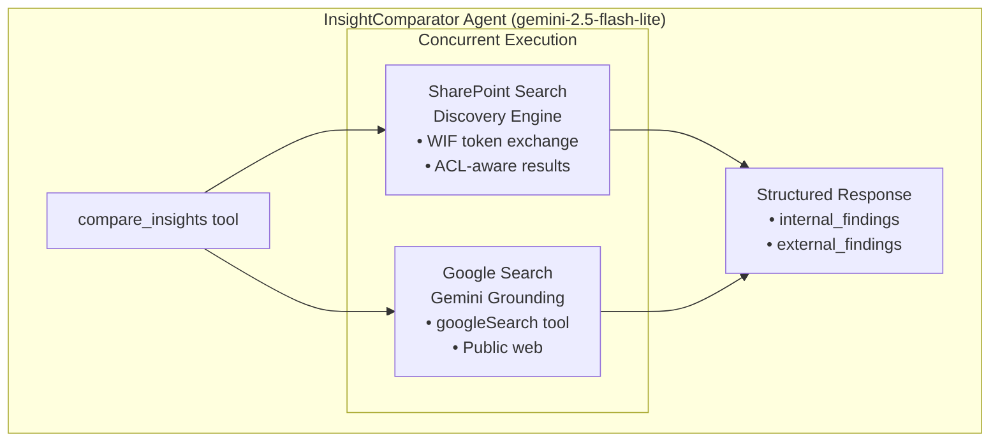
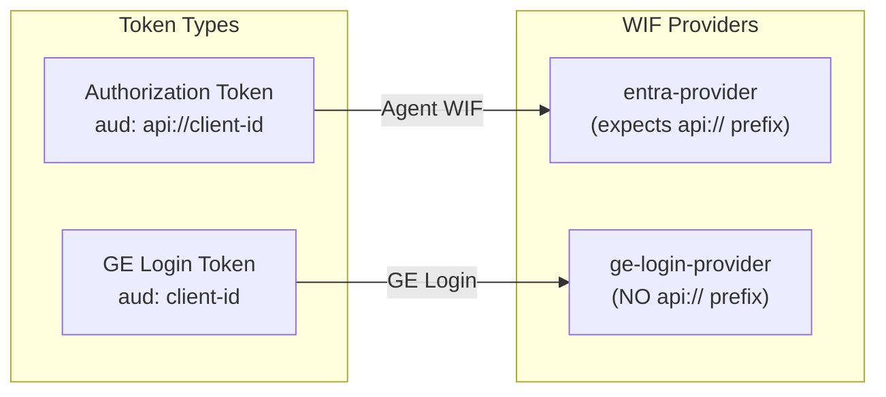
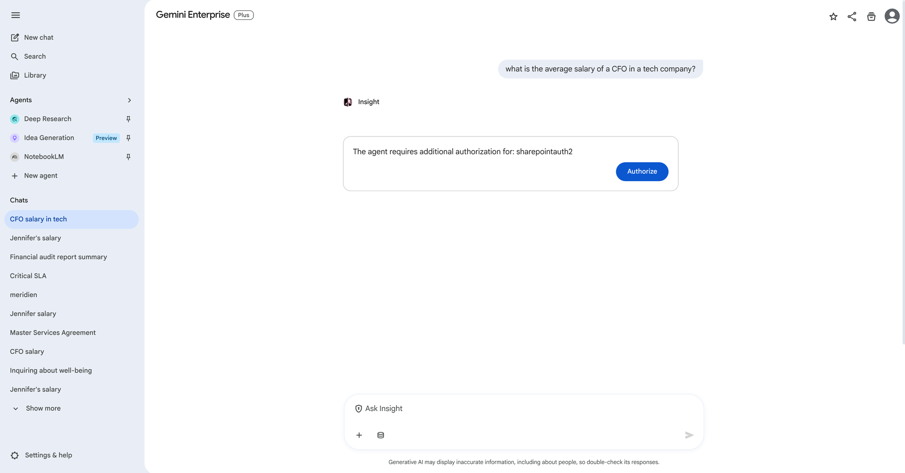
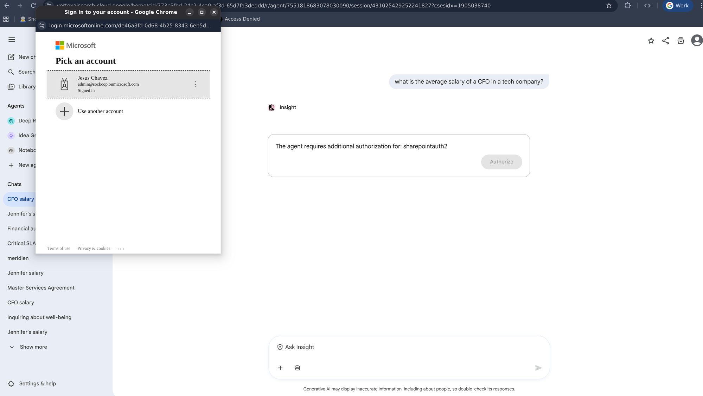
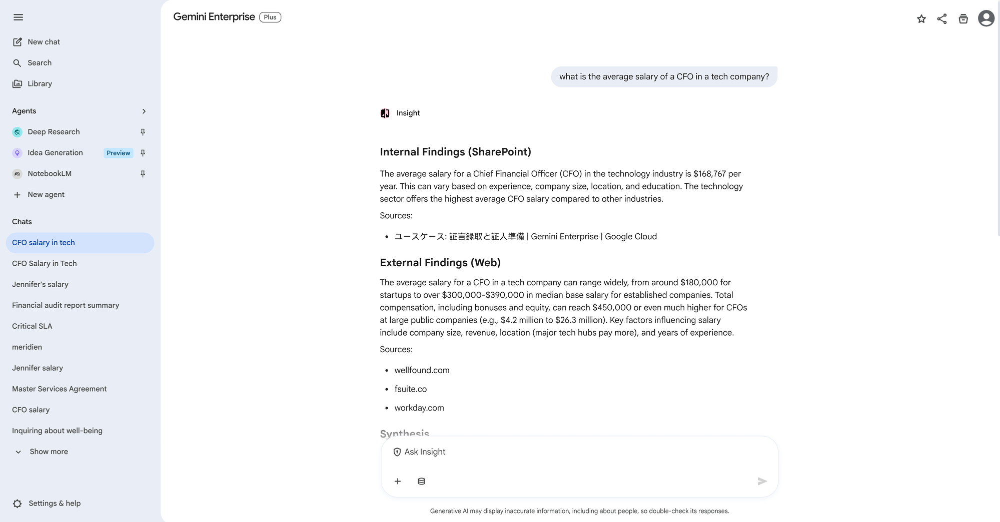

# 08 - ADK Agent: InsightComparator

**Version:** 1.2.0  
**Last Updated:** 2026-04-05  
**Status:** Production

**Navigation**: [Index](00-INDEX.md) | [04-Discovery](04-SETUP-DISCOVERY.md) | **08-Agent** | [09-Panel](09-AGENT-PANEL.md) | [10-Deploy](10-CLOUD-DEPLOYMENT.md)

---

## Prerequisites

| From | Variable | Purpose |
|------|----------|---------|
| [01-SETUP-GCP.md](01-SETUP-GCP.md) | `PROJECT_ID`, `PROJECT_NUMBER` | Agent deployment |
| [01-SETUP-GCP.md](01-SETUP-GCP.md) | `STAGING_BUCKET` | Agent Engine staging |
| [02-SETUP-ENTRA.md](02-SETUP-ENTRA.md) | `TENANT_ID`, `OAUTH_CLIENT_ID` | Authorization |
| [02-SETUP-ENTRA.md](02-SETUP-ENTRA.md) | `OAUTH_CLIENT_SECRET` | Token exchange |
| [03-SETUP-WIF.md](03-SETUP-WIF.md) | `WIF_POOL_ID` | Token exchange |
| [03-SETUP-WIF.md](03-SETUP-WIF.md) | `entra-provider` | **MUST use this provider** |
| [04-SETUP-DISCOVERY.md](04-SETUP-DISCOVERY.md) | `ENGINE_ID`, `DATA_STORE_ID` | SharePoint search |

---

## Outputs

| Variable | Example | Used In |
|----------|---------|---------|
| `REASONING_ENGINE_RES` | `projects/.../reasoningEngines/...` | [09-AGENT-PANEL](09-AGENT-PANEL.md), [10-CLOUD-DEPLOYMENT](10-CLOUD-DEPLOYMENT.md) |
| `AUTH_ID` | `sharepointauth2` | Agent registration |

---

## Overview

Deploys InsightComparator to Agent Engine — a single `compare_insights` tool that runs SharePoint (ACL-aware, via WIF) and Google Search concurrently, then synthesizes both into a structured comparison.

> **Code:**
> - [`agent/agent.py#L141`](https://github.com/jchavezar/vertex-ai-samples/blob/main/semiautonomous-agents/sharepoint_wif_portal/agent/agent.py#L141) — `compare_insights()` tool definition
> - [`agent/agent.py#L44`](https://github.com/jchavezar/vertex-ai-samples/blob/main/semiautonomous-agents/sharepoint_wif_portal/agent/agent.py#L44) — `_detect_auth_id()` JWT extraction from `tool_context.state`
> - [`agent/agent.py#L212`](https://github.com/jchavezar/vertex-ai-samples/blob/main/semiautonomous-agents/sharepoint_wif_portal/agent/agent.py#L212) — `root_agent` definition (model, tools, instructions)
> - [`agent/discovery_engine.py#L103`](https://github.com/jchavezar/vertex-ai-samples/blob/main/semiautonomous-agents/sharepoint_wif_portal/agent/discovery_engine.py#L103) — WIF/STS token exchange inside agent
> - [`agent/discovery_engine.py#L254`](https://github.com/jchavezar/vertex-ai-samples/blob/main/semiautonomous-agents/sharepoint_wif_portal/agent/discovery_engine.py#L254) — `streamAssist` API call with user identity



---

## WIF Provider Configuration

**Critical:** The agent MUST use `entra-provider` (with `api://` audience) for WIF token exchange.



---

## Step 1: Configure Environment

```bash
cd sharepoint_wif_portal
cp .env.example .env
```

Edit `.env`:

```bash
# GCP
PROJECT_ID=sharepoint-wif-agent
PROJECT_NUMBER=REDACTED_PROJECT_NUMBER
LOCATION=us-central1
STAGING_BUCKET=gs://sharepoint-wif-agent-staging

# Discovery Engine
ENGINE_ID=gemini-enterprise
DATA_STORE_ID=sharepoint-data-def-connector_file

# WIF (Critical: entra-provider)
WIF_POOL_ID=sp-wif-pool-v2
WIF_PROVIDER_ID=entra-provider    # <-- MUST be entra-provider

# Authorization
AUTH_ID=sharepointauth2

# Entra ID
TENANT_ID=your-tenant-id
OAUTH_CLIENT_ID=your-client-id
OAUTH_CLIENT_SECRET=your-secret

# Agentspace
AS_APP=gemini-enterprise

# ADK
GOOGLE_GENAI_USE_VERTEXAI=True
GOOGLE_CLOUD_PROJECT=sharepoint-wif-agent
GOOGLE_CLOUD_LOCATION=us-central1
```

---

## Step 2: Install Dependencies

```bash
# Requires uv (https://github.com/astral-sh/uv)
uv sync
```

Dependencies:
- `google-cloud-aiplatform[adk,agent_engines]>=1.88.0`
- `google-cloud-discoveryengine>=0.13.0`
- `httpx>=0.28.0`
- `python-dotenv>=1.0.0`

---

## Step 3: Test Locally

```bash
uv run python test_local.py
```

Expected output:

```
============================================================
           LOCAL TESTING - InsightComparator Agent
============================================================

Phase 1: Direct Tool Testing
------------------------------------------------------------
[OK] Answer: Based on the documents...
[OK] Sources: 3

Phase 2: Agent Conversation Testing
------------------------------------------------------------
Agent:  InsightComparator
Model:  gemini-2.5-flash-lite
Tools:  ['compare_insights']

[Query] What are best practices for cloud security?
------------------------------------------------------------
## Internal Findings (SharePoint)
...
## External Findings (Web)
...
```

---

## Step 4: Deploy to Agent Engine

```bash
uv run python deploy.py
```

Output:

```
=====================================
Deploying Insight Comparator Agent
=====================================
Project:  sharepoint-wif-agent
Location: us-central1
Staging:  gs://sharepoint-wif-agent-staging
=====================================
Deployment Complete!
=====================================
Resource Name: projects/REDACTED_PROJECT_NUMBER/locations/us-central1/reasoningEngines/1988251824309665792
=====================================
```

**Save the Resource Name** - add to `.env` and `backend/.env`:

```bash
REASONING_ENGINE_RES=projects/REDACTED_PROJECT_NUMBER/locations/us-central1/reasoningEngines/1988251824309665792
```

---

## Step 5: Grant IAM Permissions

**Critical:** Grant `roles/aiplatform.user` at BOTH project AND resource level.

### 5a: Project-Level IAM

```bash
# For local development (your user account)
gcloud projects add-iam-policy-binding ${PROJECT_ID} \
  --member="user:YOUR_EMAIL@example.com" \
  --role="roles/aiplatform.user"

# For Cloud Run (production) - uses default compute SA
gcloud projects add-iam-policy-binding ${PROJECT_ID} \
  --member="serviceAccount:${PROJECT_NUMBER}-compute@developer.gserviceaccount.com" \
  --role="roles/aiplatform.user"
```

### 5b: Resource-Level IAM (Required for query permission)

```bash
# Extract engine ID from REASONING_ENGINE_RES
ENGINE_ID=$(echo $REASONING_ENGINE_RES | grep -oP 'reasoningEngines/\K[0-9]+')

# Set IAM on the Reasoning Engine resource
curl -X POST \
  -H "Authorization: Bearer $(gcloud auth print-access-token)" \
  -H "Content-Type: application/json" \
  "https://${LOCATION}-aiplatform.googleapis.com/v1beta1/${REASONING_ENGINE_RES}:setIamPolicy" \
  -d '{
    "policy": {
      "bindings": [{
        "role": "roles/aiplatform.user",
        "members": [
          "user:YOUR_EMAIL@example.com",
          "serviceAccount:'${PROJECT_NUMBER}'-compute@developer.gserviceaccount.com"
        ]
      }]
    }
  }'
```

**Wait ~60 seconds** for IAM propagation.

---

## Step 6: Test Remote Deployment

```bash
uv run python test_remote.py
```

If you get 403 errors, verify IAM was applied correctly (see Troubleshooting).

---

## Step 7: Register Authorization (Optional - for Agentspace)

```bash
chmod +x scripts/register_auth.sh
./scripts/register_auth.sh
```

**Critical scope:**

```bash
"scopes": ["api://${OAUTH_CLIENT_ID}/user_impersonation"]
```

---

## Step 8: Register Agent to Agentspace (Optional)

```bash
chmod +x scripts/register_agent.sh
./scripts/register_agent.sh
```

Agent appears in Gemini Enterprise UI.

**First-time user experience — OAuth authorization prompt:**



*On first use, Gemini Enterprise prompts the user to authorize the agent to access SharePoint on their behalf*



*Microsoft "Pick an account" login — user selects their Entra identity to complete the WIF token exchange*

**After authorization — InsightComparator output:**



*InsightComparator response showing Internal Findings (SharePoint, ACL-enforced) and External Findings (web) in separate labeled sections with sources*

---

## Files Reference

| File | Purpose |
|------|---------|
| `agent/agent.py` | Agent + compare_insights tool |
| `agent/discovery_engine.py` | WIF token exchange + DE client |
| `deploy.py` | Deploy to Agent Engine |
| `test_local.py` | Pre-deployment testing |
| `test_remote.py` | Post-deployment testing |
| `scripts/register_auth.sh` | OAuth authorization |
| `scripts/register_agent.sh` | Agentspace registration |

---

## Troubleshooting

### Permission Denied: reasoningEngines.get or reasoningEngines.query

**Error:**
```
403 Permission 'aiplatform.reasoningEngines.get' denied...
```
or
```
403 Permission 'aiplatform.reasoningEngines.query' denied...
```

**Cause:** Missing IAM at project or resource level.

**Solution:**

1. Verify project-level IAM:
```bash
gcloud projects get-iam-policy ${PROJECT_ID} --format=json | \
  python3 -c "import sys,json; [print(m) for b in json.load(sys.stdin)['bindings'] if 'aiplatform.user' in b['role'] for m in b['members']]"
```

2. Apply resource-level IAM (Step 5b above).

3. Wait 60 seconds for propagation.

---

### WIF Audience Mismatch (403 on SharePoint)

**Error:**
```
WIF STS error: {"error":"invalid_grant","error_description":"The audience in ID Token does not match..."}
```

**Solution:**
```bash
# Ensure WIF_PROVIDER_ID=entra-provider in .env
WIF_PROVIDER_ID=entra-provider

# Redeploy
uv run python deploy.py update
```

---

### Authorization Loop in Agentspace

**Error:** "The agent requires additional authorization for: sharepointauth2"

**Solution:** Add `user_impersonation` scope in `register_auth.sh`:

```bash
"scopes": ["api://${OAUTH_CLIENT_ID}/user_impersonation"]
```

---

### Agent Not Visible in Gemini Enterprise

**Solution:** Verify `sharingConfig.scope = "ALL_USERS"` in agent registration.

---

## Update Workflow

```bash
# Edit agent code
vim agent/agent.py

# Test locally
uv run python test_local.py

# Deploy update
uv run python deploy.py update

# Test remotely
uv run python test_remote.py
```

---

## Next Steps

- [09-AGENT-PANEL.md](09-AGENT-PANEL.md) - Add Agent Panel to custom UI
- [10-CLOUD-DEPLOYMENT.md](10-CLOUD-DEPLOYMENT.md) - Deploy to Cloud Run
