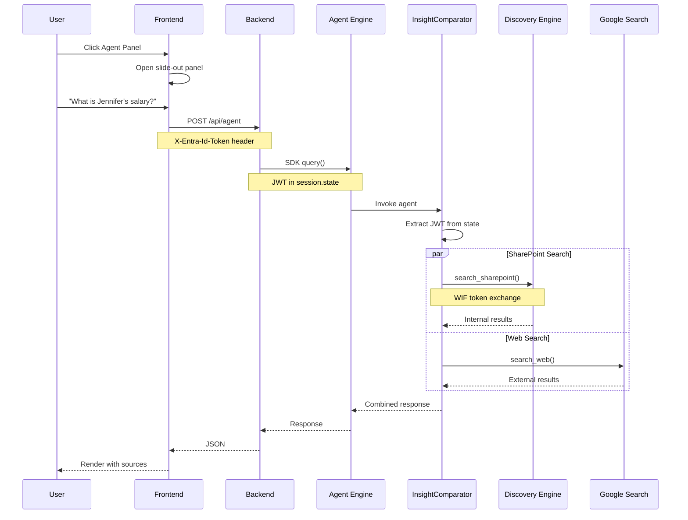

# 09 - Agent Panel Integration

**Version:** 1.0.0  
**Last Updated:** 2026-04-04  
**Status:** Production

**Navigation**: [Index](00-INDEX.md) | [08-Agent](08-ADK-AGENT.md) | **09-Panel** | [Testing](TESTING.md)

---

## Prerequisites

| Requirement | From |
|-------------|------|
| ADK Agent deployed | [08-ADK-AGENT.md](08-ADK-AGENT.md) |
| `REASONING_ENGINE_RES` | Step 08 output |
| Custom UI running | [05-LOCAL-DEV.md](05-LOCAL-DEV.md) |

---

## Overview

Adds an Agent Panel to the custom UI, enabling users to interact with the InsightComparator agent alongside the main chat.

```
+===========================================================================+
|                         CUSTOM UI ARCHITECTURE                             |
|                                                                            |
|   +---------------------------+     +---------------------------+          |
|   |       MAIN CHAT           |     |      AGENT PANEL          |          |
|   |       (Direct API)        |     |      (Agent Engine)       |          |
|   |                           |     |                           |          |
|   |   /api/chat               |     |   /api/agent              |          |
|   |      |                    |     |      |                    |          |
|   |      v                    |     |      v                    |          |
|   |   Discovery Engine        |     |   Agent Engine SDK        |          |
|   |   streamAssist API        |     |      |                    |          |
|   |                           |     |      v                    |          |
|   |   Features:               |     |   InsightComparator       |          |
|   |   - SharePoint search     |     |      |                    |          |
|   |   - /btw quick answers    |     |      +------+------+      |          |
|   |   - Session management    |     |      |             |      |          |
|   |                           |     |      v             v      |          |
|   +---------------------------+     |   SharePoint    Google    |          |
|                                     |   (WIF)         Search    |          |
|                                     +---------------------------+          |
|                                                                            |
+===========================================================================+
```

---

## Architecture Flow



---

## Components

### Backend: `/api/agent` Endpoint

**File:** `backend/main.py`

```python
@app.post("/api/agent")
async def agent_query(request: Request, body: AgentRequest):
    """Query InsightComparator via Agent Engine SDK."""
    microsoft_jwt = request.headers.get("X-Entra-Id-Token")
    
    client = get_agent_client()
    # Pass JWT to agent via session state
    response = await asyncio.to_thread(
        client.query, body.query, user_id, microsoft_jwt
    )
    return {"answer": response, "agent": True}
```

### Backend: Agent Client

**File:** `backend/agent_client.py`

```python
class AgentClient:
    def query(self, message: str, user_id: str, microsoft_jwt: str = None):
        # Pass JWT in session state for WIF exchange
        session_state = {"sharepointauth2": microsoft_jwt} if microsoft_jwt else None
        session = agent.create_session(user_id=user_id, state=session_state)
        
        # Stream response
        for event in agent.stream_query(...):
            # Extract text from events
```

### Frontend: Agent Panel

**File:** `frontend/src/AgentPanel.tsx`

| Feature | Description |
|---------|-------------|
| Slide-out panel | Opens from right side |
| Tool indicators | Shows SharePoint + Web icons |
| Markdown rendering | Formats agent responses |
| Source links | Clickable document links |
| Loading states | Thinking animation |

---

## Token Flow

```
+-----------------------------------------------------------------------+
|                    JWT PASSTHROUGH FLOW                                |
|                                                                        |
|   Frontend                Backend                 Agent                |
|   --------                -------                 -----                |
|                                                                        |
|   X-Entra-Id-Token  --->  microsoft_jwt  --->  session.state           |
|   (header)                (extract)             ["sharepointauth2"]    |
|                                                                        |
|                                                      |                 |
|                                                      v                 |
|                                              tool_context.state        |
|                                              or                        |
|                                              invocation_context        |
|                                              .session.state            |
|                                                      |                 |
|                                                      v                 |
|                                              WIF Exchange (STS)        |
|                                                      |                 |
|                                                      v                 |
|                                              GCP Access Token          |
|                                                      |                 |
|                                                      v                 |
|                                              Discovery Engine          |
|                                              (ACL-aware search)        |
|                                                                        |
+-----------------------------------------------------------------------+
```

---

## Step 1: Add Agent Client

Create `backend/agent_client.py`:

```bash
cd sharepoint_wif_portal/backend
```

Key implementation points:
- Uses `vertexai.agent_engines.get()` to load deployed agent
- Creates session with JWT in state
- Streams response events

---

## Step 2: Add API Endpoint

Update `backend/main.py`:

```python
from agent_client import get_agent_client

@app.post("/api/agent")
async def agent_query(request: Request, body: AgentRequest):
    microsoft_jwt = request.headers.get("X-Entra-Id-Token")
    client = get_agent_client()
    response = await asyncio.to_thread(client.query, body.query, "user", microsoft_jwt)
    return {"answer": response, "agent": True}
```

---

## Step 3: Add Frontend Panel

Create `frontend/src/AgentPanel.tsx`:

| Component | Purpose |
|-----------|---------|
| Panel container | Slide-out from right |
| Header | Agent name + close button |
| Messages | User + agent messages |
| Input | Query input + send button |
| Tools bar | Visual tool indicators |

---

## Step 4: Integrate Panel

Update `frontend/src/App.tsx`:

```tsx
import AgentPanel from './AgentPanel';

// Add state
const [agentOpen, setAgentOpen] = useState(false);

// Add FAB button
<button onClick={() => setAgentOpen(true)}>
  Agent
</button>

// Add panel
<AgentPanel 
  isOpen={agentOpen} 
  onClose={() => setAgentOpen(false)}
  token={token}
/>
```

---

## Step 5: Configure Environment

Add to `backend/.env`:

```bash
# Agent Engine (from step 08)
REASONING_ENGINE_RES=projects/REDACTED_PROJECT_NUMBER/locations/us-central1/reasoningEngines/1988251824309665792
```

---

## Agent Tools

The InsightComparator agent has two tools:

| Tool | Source | Authentication |
|------|--------|----------------|
| `search_sharepoint` | Discovery Engine | WIF (user ACL) |
| `search_web` | Gemini + Google Search | Service account |

### Response Format

```markdown
## Internal Insights (SharePoint)
[Summary from company documents]
- Key findings
- Sources: [Document links]

## External Context (Web)
[Summary from public web]
- Key findings  
- Sources: [Website links]

## Comparison
- Alignment between sources
- Unique internal insights
- External context value
```

---

## Troubleshooting

| Issue | Cause | Solution |
|-------|-------|----------|
| Agent panel empty | Backend not restarted | Restart with new .env |
| "Agent unavailable" | Wrong REASONING_ENGINE_RES | Check step 08 output |
| SharePoint 403 | WIF provider mismatch | Use `entra-provider` |
| No web results | Model not available | Check Gemini API enabled |
| Slow response | Cold start | First query takes longer |

---

## Files Reference

| File | Purpose |
|------|---------|
| `backend/agent_client.py` | Agent Engine SDK wrapper |
| `backend/main.py` | `/api/agent` endpoint |
| `frontend/src/AgentPanel.tsx` | React panel component |
| `frontend/src/App.tsx` | Panel integration |
| `frontend/src/index.css` | Panel styling |

---

## Next Steps

- [TESTING.md](TESTING.md) - Full testing workflow
