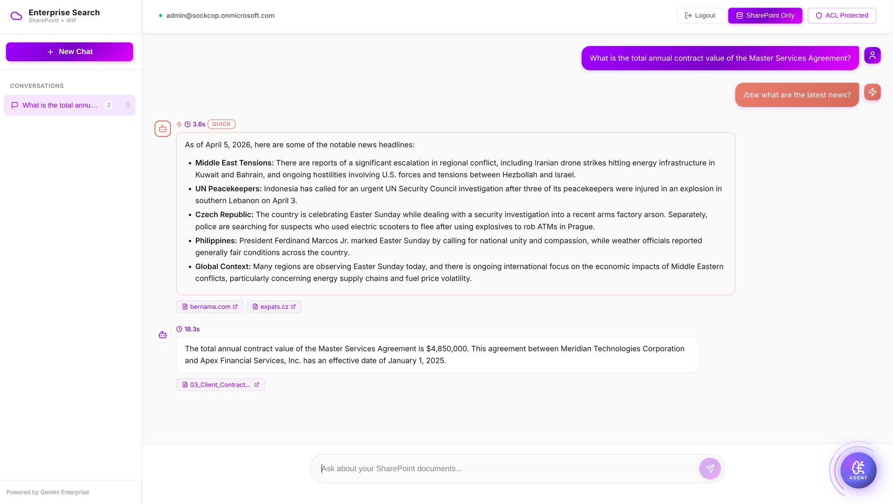

# Grounding Test Questions

Test questions for validating SharePoint document grounding via Discovery Engine StreamAssist API.

**Source Document**: Master Services Agreement (MSA-2024-0847) between Meridian Technologies Corporation and Apex Financial Services, Inc.



*Example: "What is the total annual contract value?" correctly returns $4,850,000 with source citation from SharePoint*

---

## Test Results Summary

| Metric | Result |
|--------|--------|
| **Correct Answers** | 23/30 (76.7%) |
| **Grounded (has sources)** | 29/30 (96.7%) |
| **Test Date** | 2026-04-03 |

---

## Questions and Expected Answers

### Contract Basics

| # | Question | Expected Answer |
|---|----------|-----------------|
| 1 | What is the total annual contract value of the Master Services Agreement? | $4,850,000 |
| 2 | Who is the client in the Master Services Agreement MSA-2024-0847? | Apex Financial Services, Inc. |
| 3 | Who is the provider in the Master Services Agreement? | Meridian Technologies Corporation |
| 4 | What is the contract reference number? | MSA-2024-0847 |
| 5 | What is the effective date of the Master Services Agreement? | January 1, 2025 |

### Contacts

| # | Question | Expected Answer |
|---|----------|-----------------|
| 6 | Who is the primary contact at the Provider? | Jennifer Walsh |
| 7 | What is Jennifer Walsh's role? | CFO (Chief Financial Officer) |
| 8 | Who is the primary contact at Apex Financial Services? | Richard Blackstone |
| 9 | What is Richard Blackstone's title? | CIO (Chief Information Officer) |

### Financial Terms

| # | Question | Expected Answer |
|---|----------|-----------------|
| 10 | What is the Q1 payment amount? | $1,212,500 |
| 11 | What are the payment terms? | Net 30 days from invoice date |
| 12 | What is the late payment fee? | 1.5% per month on overdue balances |
| 13 | What bank is used for wire transfers? | JPMorgan Chase |
| 14 | What is the base discount percentage? | 15% off list price |

### Platform Specifications

| # | Question | Expected Answer |
|---|----------|-----------------|
| 15 | How much storage is allocated? | 50 TB primary, 100 TB backup |
| 16 | What is the API request limit? | 50,000 requests per minute |
| 17 | How many global data centers? | 12 |
| 18 | What database is used? | PostgreSQL Enterprise |

### Professional Services

| # | Question | Expected Answer |
|---|----------|-----------------|
| 19 | How many implementation hours are included? | 2,400 hours |
| 20 | What is the Technical Architect rate? | $350/hour |
| 21 | How many training hours are included? | 400 hours |

### Service Level Agreement (SLA)

| # | Question | Expected Answer |
|---|----------|-----------------|
| 22 | What is the Critical (P1) availability SLA? | 99.99% |
| 23 | What is the P1 response time? | 15 minutes |
| 24 | What is the 24/7 support hotline number? | (888) 555-MTEC (6832) |

### Term and Termination

| # | Question | Expected Answer |
|---|----------|-----------------|
| 25 | What is the initial term of the agreement? | 3 years (Jan 1, 2025 - Dec 31, 2027) |
| 26 | What is the renewal notice period? | 90 days |
| 27 | What is the Year 1 termination fee? | $2,425,000 (50% of annual value) |

### Data Protection

| # | Question | Expected Answer |
|---|----------|-----------------|
| 28 | What encryption is used for data at rest? | AES-256 |
| 29 | Where is the primary data residency? | US-East (Virginia) |

### Leadership

| # | Question | Expected Answer |
|---|----------|-----------------|
| 30 | Who is the CEO of Meridian Technologies? | Michael Thornton |

---

## Detailed Test Results

### Passed (23/30)

| # | Topic | Expected | Status |
|---|-------|----------|--------|
| 1 | Contract Value | $4,850,000 | ✓ CORRECT |
| 2 | Client name | Apex Financial Services | ✓ CORRECT |
| 3 | Provider name | Meridian Technologies Corporation | ✓ CORRECT |
| 4 | Contract ref | MSA-2024-0847 | ✓ CORRECT |
| 5 | Effective date | January 1, 2025 | ✓ CORRECT |
| 6 | Provider contact | Jennifer Walsh | ✓ CORRECT |
| 7 | Jennifer's role | CFO | ✓ CORRECT |
| 8 | Client contact | Richard Blackstone | ✓ CORRECT |
| 9 | Richard's title | CIO | ✓ CORRECT |
| 10 | Q1 payment | $1,212,500 | ✓ CORRECT |
| 11 | Payment terms | Net 30 days | ✓ CORRECT |
| 12 | Late fee | 1.5% per month | ✓ CORRECT |
| 13 | Bank name | JPMorgan Chase | ✓ CORRECT |
| 17 | Data centers | 12 | ✓ CORRECT |
| 18 | Database | PostgreSQL | ✓ CORRECT |
| 19 | Implementation hours | 2,400 hours | ✓ CORRECT |
| 20 | Architect rate | $350/hour | ✓ CORRECT |
| 22 | P1 SLA | 99.99% | ✓ CORRECT |
| 23 | P1 response | 15 minutes | ✓ CORRECT |
| 24 | Support number | (888) 555-MTEC | ✓ CORRECT |
| 25 | Initial term | 3 years | ✓ CORRECT |
| 27 | Y1 termination | $2,425,000 | ✓ CORRECT |
| 28 | Encryption | AES-256 | ✓ CORRECT |

### Failed (7/30)

| # | Topic | Expected | Issue |
|---|-------|----------|-------|
| 14 | Base discount | 15% | Not found in search index |
| 15 | Storage | 50 TB primary, 100 TB backup | Returned Gemini Enterprise product specs instead |
| 16 | API limit | 50,000 requests/minute | Not found in search index |
| 21 | Training hours | 400 hours | Confused with product documentation |
| 26 | Renewal notice | 90 days | Partial answer (mentioned 1-year renewal, not 90-day notice) |
| 29 | Data residency | US-East (Virginia) | Returned Gemini Enterprise data residency instead |
| 30 | CEO name | Michael Thornton | False negative - got "Michael James Thornton" (correct) |

---

## Known Issues

### Session Context Pollution

When using Discovery Engine Sessions for multi-turn conversation:
- **First query**: Properly grounded with SharePoint sources
- **Follow-up queries**: May use session cache instead of re-searching, leading to:
  - Missing source citations
  - Hallucinated answers
  - Mixing data from different documents

**Workaround**: Start a new chat for each independent question, or be very specific (e.g., "What is the contract value for **Apex Financial Services**?")

### Multiple Similar Documents

If SharePoint contains multiple MSA documents (e.g., Apex Financial + InnovateForward), ambiguous questions like "What is the MSA value?" may return data from the wrong contract.

**Workaround**: Include specific identifiers in questions:
- ✗ "What is the MSA contract value?"
- ✓ "What is the contract value for Apex Financial Services in MSA-2024-0847?"

---

## Running the Automated Test

```bash
cd backend
source .venv/bin/activate
python test_grounding.py
```

Results saved to `/tmp/grounding_results.json`
