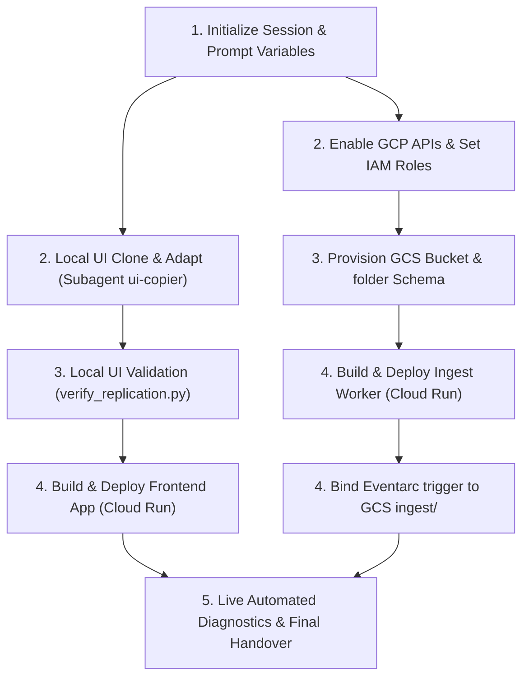

# Antigravity Programmatic Orchestration Workflow

This document defines the structured, step-by-step sequential and parallel deployment pipeline for the **Shutter Vibe Engine** using the Antigravity agentic AI. 

When launching a pair-programming session tomorrow, the customer can instruct the Antigravity agent:
> *"Load and execute the programmatic deployment workflow defined in `./antigravity/WORKFLOW.md`."*

---

## 📌 Workflow Orchestration Architecture



---

## 🚀 Execution Phases

### Phase 1: Workspace Bootstrapping (Self-Copy)
Before gathering environment variables or executing cloud commands, the Antigravity agent **MUST** populate the empty target workspace with the application reference files. Execute this step immediately to structure the repository:
```bash
mkdir -p multimodal-search/app/templates multimodal-search/app/static multimodal-search/pipeline demos multimodal-search/backends
cp -r antigravity/src/app/* multimodal-search/app/
cp -r antigravity/src/templates/* multimodal-search/app/templates/
cp -r antigravity/src/static/* multimodal-search/app/static/
cp -r antigravity/src/pipeline/* multimodal-search/pipeline/
cp -r antigravity/src/demos/* demos/
cp -r antigravity/src/backends/* multimodal-search/backends/
```
Confirm that all source folders are populated and match the standard directory layout.

---

### Phase 2: Interactive Environment Prompting (Sequential)
The Antigravity agent **MUST** explicitly prompt the user for the following workspace variables in the chat and wait for confirmation before executing any commands:

*   **GCP Project ID**: *"What is your target Google Cloud Project ID?"* (Agent should query the active `gcloud` project as a recommendation).
*   **GCP Deployment Region**: *"What region do you want to deploy services to?"* (Default: `us-central1`).
*   **GCS Bucket Name**: *"What is the name of your Cloud Storage bucket?"* (Default recommendation: `{PROJECT}-vibe-engine-data`).
*   **Service Account Name**: *"What name should we assign to the deployed runner Service Account?"* (Default: `envato-vibe-runner`).
*   **Search Backend**: *"What search backend database should be configured?"* (Options: `vector-search` or `bigquery`, Default: `vector-search`).

Once collected, write these values to a local `.env` file in the root:
```ini
GOOGLE_CLOUD_PROJECT=your-project-id
GOOGLE_CLOUD_LOCATION=us-central1
ENVATO_GCS_BUCKET=your-bucket-name
SEARCH_BACKEND=vector-search
ENVATO_SA_NAME=envato-vibe-runner
```

---

### Phase 3: Local UI Replication & API Enablement (Parallel)

To minimize wait times, the agent must run the following tasks in parallel or overlapping asynchronous execution:

#### Branch A: UI Replication (Local)
1. Launch the `ui-copier` subagent (using `/antigravity/subagents/ui_copier.md`).
2. Clone templates (`index_v2.html`), styles (`styles_v2.css`), and the 6 JavaScript panels into the target folders.
3. Perform dynamic variable sweeps (replacing demo bucket strings with the user's `.env` bucket name, setting dynamic self-healing WebSockets).
4. Run the validation script:
   ```bash
   python antigravity/verify_replication.py
   ```

#### Branch B: GCP Environment Enablement (Cloud)
1. Verify active `gcloud` credentials.
2. Set active project: `gcloud config set project <PROJECT_ID>`
3. Enable the required GCP APIs in parallel:
   - `run.googleapis.com` (Cloud Run)
   - `eventarc.googleapis.com` (Eventarc trigger router)
   - `firestore.googleapis.com` (Cloud Firestore)
   - `aiplatform.googleapis.com` (Vertex AI Vector Search & Embeddings)
   - `cloudbuild.googleapis.com` (Cloud Build container building)

---

### Phase 4: GCP Resources Provisioning & Security (Sequential)

1. **Service Account Setup**:
   * Create service account `<SA_NAME>@<PROJECT>.iam.gserviceaccount.com`.
   * Bind the required Roles:
     - `roles/aiplatform.user` (Vertex AI API access)
     - `roles/storage.objectAdmin` (GCS reads & writes)
     - `roles/datastore.user` (Firestore query/insert rights)
     - `roles/run.invoker` (Eventarc invoke invocation permissions)
     - `roles/pubsub.publisher` (Publish ingestion tasks)
     - `roles/eventarc.eventReceiver` (Receive finalized object triggers)
2. **GCS Agent Authorization**:
   * Bind `roles/pubsub.publisher` to the Google Cloud Storage system service account to allow Eventarc finalized-object notifications to fire.
3. **Bucket Schemas**:
   * Create the GCS bucket if not exists: `gs://<BUCKET_NAME>`
   * Initialize folders: Create empty placeholder files to write folders `ingest/`, `originals/`, `thumbnails/`, and `segments/` inside the bucket.

---

### Phase 5: Container Build & Service Deploy (Parallel)

Compile and build both Docker images simultaneously via Google Cloud Build, then deploy them to Cloud Run.

#### Deploy Service A: Main Frontend Web App
1. Load `antigravity/deploy/Dockerfile.app` and `antigravity/deploy/.gcloudignore.app`.
2. Build the image via Cloud Build:
   ```bash
   gcloud builds submit . --project="<PROJECT>" --config="<APP_CLOUD_BUILD_YAML>"
   ```
3. Deploy to Cloud Run:
   ```bash
   gcloud run deploy envato-vibe-app \
     --image="gcr.io/<PROJECT>/envato-vibe-app:latest" \
     --region="<REGION>" \
     --project="<PROJECT>" \
     --service-account="<SA_NAME>@<PROJECT>.iam.gserviceaccount.com" \
     --memory="2Gi" --cpu="2" --timeout="600" \
     --allow-unauthenticated \
     --set-env-vars="GOOGLE_GENAI_USE_VERTEXAI=True,GOOGLE_CLOUD_PROJECT=<PROJECT>,GOOGLE_CLOUD_LOCATION=<REGION>,ENVATO_GCS_BUCKET=<BUCKET>,SEARCH_BACKEND=<BACKEND>"
   ```

#### Deploy Service B: Auto-Ingestion Worker & Event Trigger
1. Load `antigravity/deploy/Dockerfile.ingest` and `antigravity/deploy/.gcloudignore.ingest`.
2. Build the image via Cloud Build:
   ```bash
   gcloud builds submit . --project="<PROJECT>" --config="<INGEST_CLOUD_BUILD_YAML>"
   ```
3. Deploy to Cloud Run:
   ```bash
   gcloud run deploy envato-vibe-ingest \
     --image="gcr.io/<PROJECT>/envato-vibe-ingest:latest" \
     --region="<REGION>" \
     --project="<PROJECT>" \
     --service-account="<SA_NAME>@<PROJECT>.iam.gserviceaccount.com" \
     --memory="2Gi" --cpu="2" --timeout="600" \
     --no-allow-unauthenticated \
     --set-env-vars="GOOGLE_CLOUD_PROJECT=<PROJECT>,GOOGLE_CLOUD_LOCATION=<REGION>,ENVATO_GCS_BUCKET=<BUCKET>,GOOGLE_GENAI_USE_VERTEXAI=True"
4. Wire Eventarc GCS Trigger:
   ```bash
   gcloud eventarc triggers create envato-vibe-ingest-trigger \
     --location="<REGION>" --project="<PROJECT>" \
     --destination-run-service="envato-vibe-ingest" \
     --destination-run-region="<REGION>" \
     --event-filters="type=google.cloud.storage.object.v1.finalized" \
     --event-filters="bucket=<BUCKET>" \
     --service-account="<SA_NAME>@<PROJECT>.iam.gserviceaccount.com"
   ```

---

### Phase 6: Automated Verification & Handover (Sequential)

1. Fetch and print the deployed URL:
   ```bash
   gcloud run services describe envato-vibe-app --region="<REGION>" --project="<PROJECT>" --format="value(status.url)"
   ```
2. Guide the user through a GCS live ingestion upload test (e.g., dropping a sample asset into the `ingest/` folder) and print instructions on how to view ingestion logs.
3. Deliver the final success handshake.

---

## 🛠️ One-Click Executer (Python Runner)
We have encapsulated this entire declarative guide into a physical Python automation script for the developer's convenience. Instead of executing each gcloud command manually, you can tell the Antigravity agent or run yourself:
```bash
python antigravity/run_workflow.py
```
This script will collect variables, activate the API services, provision GCS, build and deploy the containers, and report progress in real-time.
