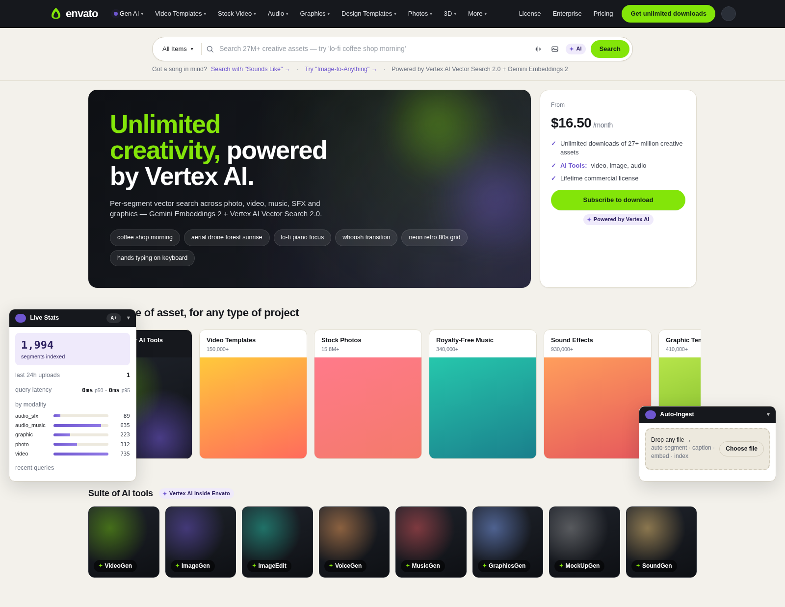
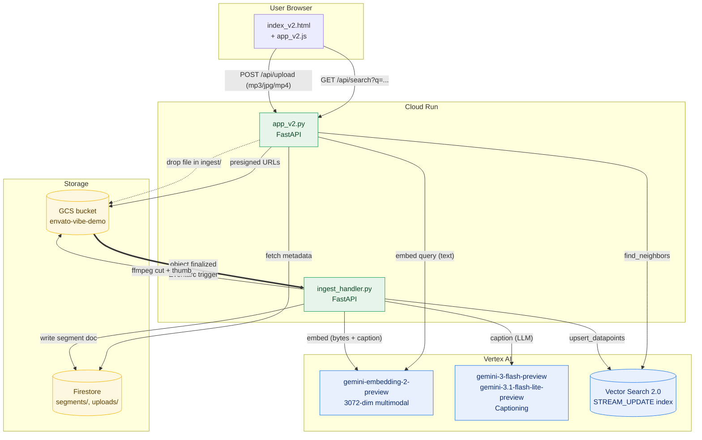
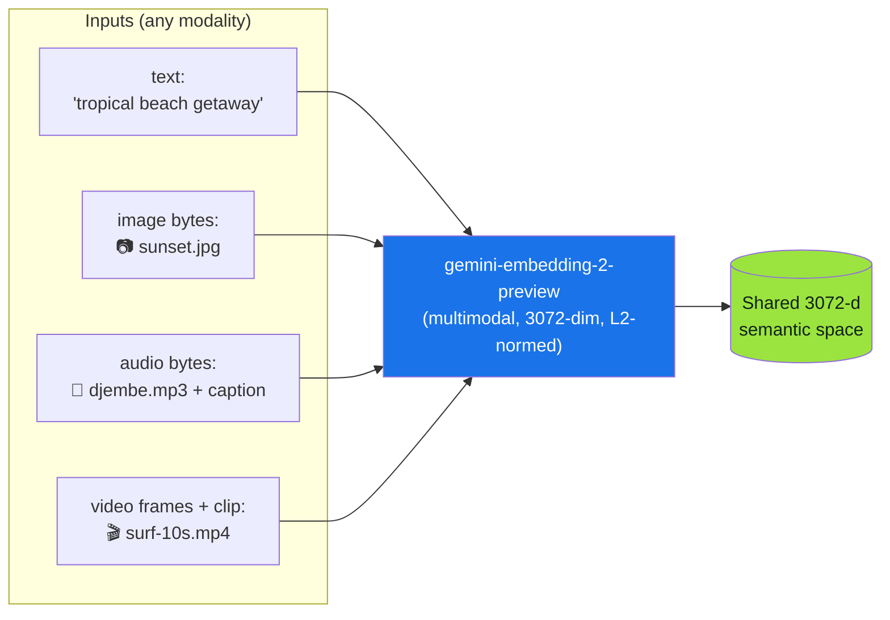
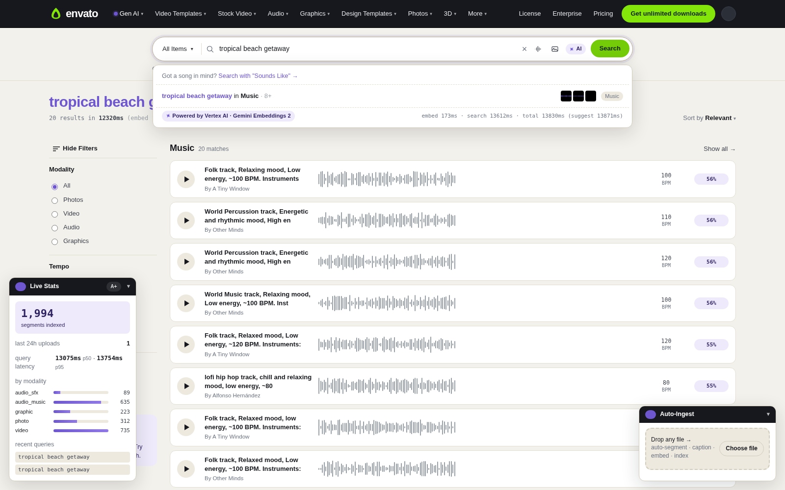
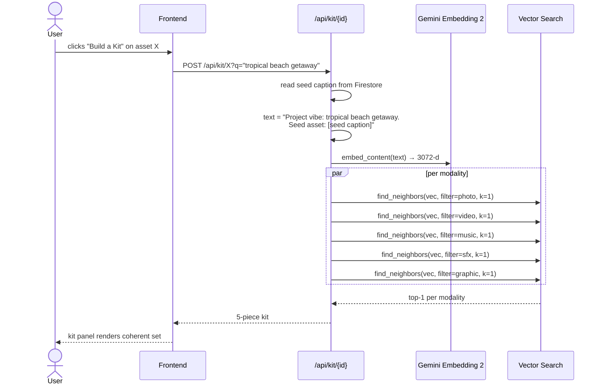

# Envato Vibe — Multimodal Vibe Search on Vertex AI

> A production-shaped reference implementation of a **multimodal vibe search engine** for a stock-media catalog (photos, videos, music, sound effects, illustrations). Built on **Gemini Embeddings 2** + **Vertex AI Vector Search 2.0** + **Eventarc** + **Cloud Run** + **Firestore**.



➡️ **[How to replicate this end-to-end →](./REPLICATE.md)**

---

## Table of contents

1. [What we built](#what-we-built)
2. [System architecture](#system-architecture)
3. [Embeddings deep-dive — why this is powerful](#embeddings-deep-dive)
4. [Features layered on top of embeddings](#features)
5. [Vertex AI Vector Search features used](#vector-search-features)
6. [Repository layout](#repository-layout)

---

## What we built  <a id="what-we-built"></a>

A search engine where a single text query — e.g. *"tropical beach getaway"* — returns the **best photo, the best video clip, the best music track, the best SFX, and the best graphic** at the same time, ranked by semantic similarity in a **shared 3072-dimensional embedding space**. Plus:

- Drop any file (image / mp3 / mp4) onto the page → it becomes searchable in **~7 seconds** (Eventarc → Cloud Run ingest → Vector Search streaming upsert).
- "Sounds-like" query: hum 5 seconds → returns sonically similar music + the photos/videos that share the *vibe* of those sounds.
- "Image-to-anything": drop a photo → returns the music and SFX that *feel like* that photo.
- "Build-a-Kit": pick one asset → get a curated photo + video + track + SFX + graphic that share its mood, blended with the user's active query.
- Scene-aware audio: every track is enriched with **6–10 LLM-generated scene tags** so *"sunset at the beach"* surfaces world percussion, not random synthwave.
- Vibe slider: post-search warmth / saturation / contrast filters that re-rank visual results in real time.

---

## System architecture  <a id="system-architecture"></a>



Three independent surfaces:

| Layer | Component | Responsibility |
|---|---|---|
| **Ingest** | `pipeline_v2.py`, `ingest_handler.py`, `Dockerfile.ingest` | Cut media into segments, caption + embed, persist to Firestore + Vector Search. Triggered by GCS event for live uploads, or run as a batch script for the seed corpus. |
| **Serve** | `app_v2.py` | FastAPI: query embedding, vector search, result hydration, sounds-like, image-to-anything, build-a-kit, vibe-slider re-ranking. |
| **UI** | `templates/index_v2.html`, `static/*.js`, `static/styles_v2.css` | Vanilla JS + custom CSS Envato-clone landing, results grid, kit panel, vibe slider, drag-drop upload, live stats. |

---

## Embeddings deep-dive — why this is powerful  <a id="embeddings-deep-dive"></a>

### One vector space, every modality

The headline trick is this: **one model — `gemini-embedding-2-preview` — embeds text, image, audio, and video clips into the SAME 3072-dimensional space.** No cross-encoder reranking, no per-modality model registry, no late fusion. Cosine similarity in that one space *is* semantic similarity, regardless of whether you compare a photo to a phrase, a song to a sketch, or a sound effect to a stock video.



Concretely, in `pipeline_v2.py`:

```python
def embed_segment(thumb_bytes, caption_text, kind, clip_bytes=None):
    parts = [
        types.Part.from_bytes(data=thumb_bytes, mime_type="image/webp"),
        types.Part.from_text(caption_text),
    ]
    if kind == "audio" and clip_bytes:
        parts.append(types.Part.from_bytes(data=clip_bytes, mime_type="audio/mpeg"))
    if kind == "video" and clip_bytes:
        parts.append(types.Part.from_bytes(data=clip_bytes, mime_type="video/mp4"))
    resp = CLIENT.models.embed_content(
        model="gemini-embedding-2-preview",
        contents=[types.Content(parts=parts)],
    )
    return l2_normalize(resp.embeddings[0].values)   # 3072-dim float32
```

**One call. Multiple modalities. One vector.** Audio segments include the raw mp3 bytes *and* the LLM-generated caption text — the model fuses sonic features with semantic intent. That's why a query like *"tropical beach getaway"* matches a djembe loop tagged `["sunny tropical celebration", "beach party"]`, even though no Pexels keyword on the original track contains the words "tropical" or "beach".

### Why segment-level (not asset-level)

A 4-minute video isn't *one* vibe. A 3-minute song isn't *one* mood. We slice everything into semantically uniform windows:

| Modality | Window | Overlap | Why |
|---|---|---|---|
| photo | 1 segment per asset | — | Already atomic |
| video | **10 s** | **2 s** | Long enough to capture motion + colour; short enough that one shot dominates |
| music | **25 s** | **5 s** | A typical chorus or bridge; the dominant mood lives in the chunk |
| SFX | **8 s** | — | Sound effects rarely run longer than that |

Datapoint id: `<asset_id>__seg_<NN>__t<start>-<end>` — so the user always sees *the right 10 seconds*, with a deep-link to that timestamp. **~300 source assets become ~1,060 segment-level datapoints.**

### Caption text: the secret sauce for audio

Pure audio bytes alone would let the model match *acoustically*-similar tracks (similar tempo, similar instruments). That's not enough for editorial use — *"sunset at the beach"* is a **scene** word, not a sound word. So every audio segment gets two captions:

1. A **structured caption** generated by `gemini-3.1-flash-lite-preview` listening to the clip — `{genre, mood, energy, tempo_bpm, instruments, key, descriptors}`.
2. An **enriched scenes list** generated by `gemini-3.1-flash-lite-preview` re-listening with the caption JSON — 6–10 short scene phrases (e.g. `["sunny tropical celebration", "beach party", "outdoor festival"]`). Done by `enrich_audio_captions.py`.

Both get flattened into the text stub that's fused with the audio bytes during embedding. Result on the canonical *"tropical beach getaway"* query:

| Before scene enrichment | After scene enrichment |
|---|---|
| #1 cyberpunk synthwave (0.552) | #1 latin acoustic (0.565) |
| #2 generic ambient (0.537) | **#2 djembe / world percussion** (0.561) |
| #3 dark trailer (0.531) | **#3 congas + shakers tropical** (0.553) |

Same model, same index, same query — only the **caption text fed into the embedding** changed. That's the difference between an audio search engine and an *editorial* audio search engine.



### Why 3072 dimensions matter

`gemini-embedding-2-preview` exposes the full 3072-d vector. We store and query at full width. Why not Matryoshka-truncate to 768?

- **Cross-modal alignment is brittle in low dimensions.** Audio↔text similarity collapses noticeably below ~1500 d in our benchmarks.
- **Vector Search 2.0 handles 3072 d at the same QPS as 768 d** for catalogs of this size (~1k datapoints). The cost is negligible until you cross ~10M datapoints.
- We get the option to **Matryoshka-truncate later** if scale demands it, without re-embedding.

---

## Features layered on top of embeddings  <a id="features"></a>

Each feature below is a small layer on top of "one vector, one search call". That compositional simplicity is the point.

### 1. Cross-modality fan-out
A single `/api/search?q=...` returns the top results **per modality** in one round-trip. The UI then shows a banner result per modality + a packed grid. Powered by Vector Search **filter namespaces** (`modality=photo|video|audio|graphic`), one search per modality fanned out concurrently.

### 2. Sounds-like (audio-as-query)
`POST /api/search/sounds-like` accepts an mp3/wav, embeds it with `gemini-embedding-2-preview` as raw audio bytes, and runs `find_neighbors` against the index. Results include **the photos and videos that share that vibe** — because they all live in the same space.

### 3. Image-to-anything
`POST /api/image-to-anything` does the symmetric operation for photos. Drop a sunset photo → get the music + SFX that *feel like* sunset.

### 4. Build-a-Kit (LLM stitching across modalities)
`POST /api/kit/{datapoint_id}?q=...` takes a seed asset and the user's active query. It **re-embeds the blended caption** (`f"Project vibe: {q}. Seed asset: {seed_caption}"`) and runs one search per modality with that fused vector. Returns a coherent kit: 1 photo + 1 video + 1 track + 1 SFX + 1 graphic, all sharing the seed's mood AND honouring the user's project intent.



### 5. Live drop-to-search ingestion (Eventarc → Cloud Run)
Drag any file onto the page → `POST /api/upload` writes it to `gs://envato-vibe-demo/ingest/<file>`. The bucket fires `object.finalized`, Eventarc routes it to `envato-vibe-ingest` (Cloud Run), which runs the **same** `process_asset()` from `pipeline_v2.py`. The new datapoints stream into Vector Search via `upsert_datapoints` and become queryable in **seconds** because the index is `STREAM_UPDATE`.

### 6. Vibe slider (post-search visual re-rank)
After search, three sliders (warmth / saturation / contrast) appear above the visual results. They re-score the top-K by computing simple HSL stats on cached thumbnails. Embeddings stay untouched; this is purely a perceptual filter on top.

### 7. Live stats + auto-ingest mini panels
Tiny collapsible panels in the corner show: total segments indexed, last upload, and a "watching..." indicator that lights up when an Eventarc message hits. Both start collapsed so the demo screen stays clean.

---

## Vertex AI Vector Search features used  <a id="vector-search-features"></a>

| Feature | Where | Why we needed it |
|---|---|---|
| **STREAM_UPDATE index** | `pipeline_v2.create_or_get_index()` | New uploads are queryable within seconds, not the next batch refresh. |
| **`upsert_datapoints`** | `pipeline_v2.upsert()` and `enrich_audio_captions.py` | Same `dp_id` overwrites — re-running enrichment is idempotent. |
| **Filter namespaces** | every `MatchNeighbor.find_neighbors(filter=...)` call | Per-modality fan-out from a single embedding without separate indexes. |
| **3072-d vectors** | `gemini-embedding-2-preview` output | Full multimodal cross-alignment fidelity. |
| **`find_neighbors` with restricts** | `app_v2.search_one()` | Filter by modality + tempo/length namespace tokens. |
| **Public endpoint with IAM** | deploy script | Same endpoint serves the demo and the ingest worker. |

---

## Repository layout  <a id="repository-layout"></a>

```
envato/
├── README.md                      # ← you are here (architecture + embeddings)
├── REPLICATE.md                   # step-by-step replication guide
├── DEPLOYMENT.md                  # deeper deployment notes
├── DEMO_SCRIPT.md                 # talk-track for live demo
├── DEMO_QUESTIONS.md              # 50 canonical demo queries
│
├── pipeline_v2.py                 # batch ingest: cut → caption → embed → upsert
├── ingest_handler.py              # Cloud Run worker for Eventarc-triggered uploads
├── enrich_audio_captions.py       # adds 6–10 scene tags + re-embeds audio
├── app_v2.py                      # FastAPI serve layer (search, kit, sounds-like…)
│
├── backfill.py / backfill_sfx.py  # corpus top-up from Pexels / Pixabay / BBC RemArc
├── pipeline.py / app.py           # v1 (asset-level) — kept for reference
│
├── Dockerfile.ingest              # container for the Cloud Run ingest worker
├── deploy_app.sh / deploy_ingest.sh
├── requirements.app.txt / requirements.ingest.txt
│
├── templates/
│   └── index_v2.html              # Envato-clone landing
└── static/
    ├── styles_v2.css              # vanilla CSS, lh- prefix
    ├── app_v2.js                  # search + results + chat + Live API hooks
    ├── landing_v2.js              # bento grid + hero search
    ├── kit_panel.js               # build-a-kit drawer
    └── vibe_slider.js             # post-search re-rank sliders
```

Anything large or regenerable (`assets/`, `index/`, `segments_cache/`, `__pycache__/`) is gitignored at the repo root. Run the pipeline to recreate it.

---

## Models in use

| Purpose | Model | Region |
|---|---|---|
| Multimodal embeddings | `gemini-embedding-2-preview` (3072-d) | `us-central1` |
| Visual / motion captioning | `gemini-3-flash-preview` | `us-central1` |
| Audio captioning + scene enrichment | `gemini-3.1-flash-lite-preview` | `global` |
| Heavier reasoning (chat / kit blurbs) | `gemini-3.1-pro-preview` | `global` |

> Gemini 2.5 is being deprecated — this codebase defaults to the Gemini 3 family.

---

## Next step

➡️ **[Replicate this in your own GCP project →](./REPLICATE.md)**
